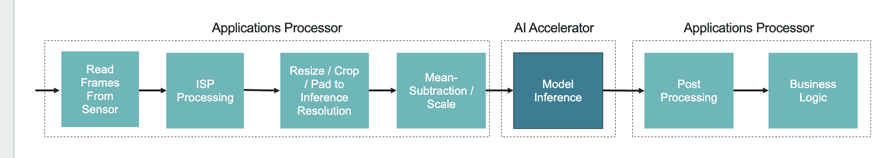
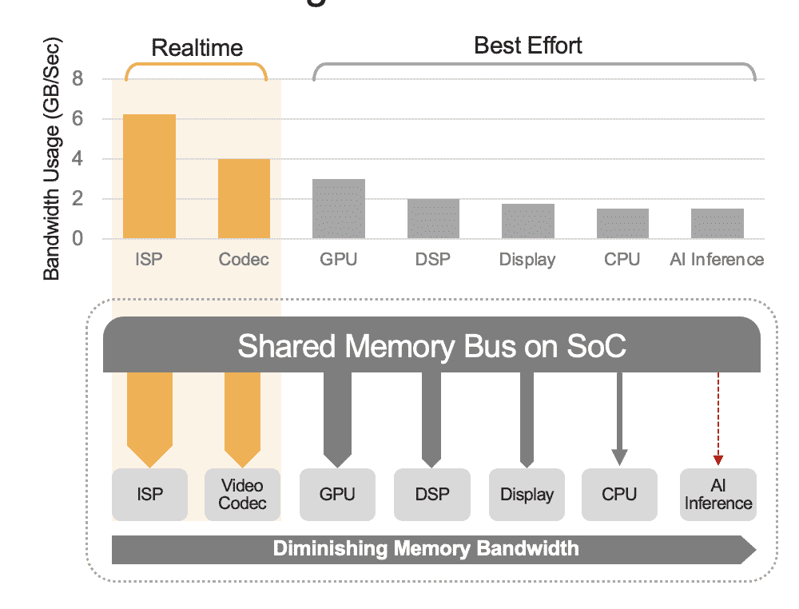
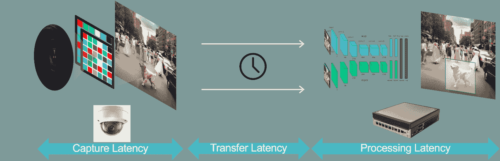

# 在边缘 AI 应用中最大化性能

> [`www.kdnuggets.com/maximize-performance-in-edge-ai-applications`](https://www.kdnuggets.com/maximize-performance-in-edge-ai-applications)

随着 AI 从云端迁移到边缘，我们看到这项技术在不断扩展的应用场景中得到使用——从异常检测到包括智能购物、监控、机器人技术和工厂自动化的应用。因此，没有一种通用的解决方案。但随着摄像头启用设备的快速增长，AI 已被广泛应用于分析实时视频数据，以自动化视频监控，提升安全性，提高操作效率，并提供更好的客户体验，最终在其行业中获得竞争优势。为了更好地支持视频分析，你必须了解优化边缘 AI 部署系统性能的策略。

# 优化 AI 系统性能的策略包括

+   选择合适大小的计算引擎，以满足或超越所需的性能水平。对于 AI 应用，这些计算引擎必须执行整个视觉管道的功能（即，视频的前处理和后处理、神经网络推理）。

可能需要一个专用的 AI 加速器，无论是独立的还是集成在 SoC 中（而不是在 CPU 或 GPU 上运行 AI 推理）。

+   理解吞吐量和延迟之间的区别；其中吞吐量是系统中数据处理的速率，而延迟则衡量数据通过系统的处理延迟，并且通常与实时响应性相关。例如，系统可以以每秒 100 帧的速度生成图像数据（吞吐量），但图像通过系统的时间是 100 毫秒（延迟）。

+   考虑未来轻松扩展 AI 性能以适应不断增长的需求、变化的要求和不断发展的技术（例如，更先进的 AI 模型以提高功能性和准确性）。你可以通过使用模块化格式的 AI 加速器或额外的 AI 加速器芯片来实现性能扩展。

# 理解可变 AI 性能要求

实际的性能要求依赖于应用。通常，可以预期对于视频分析，系统必须处理来自摄像头的数据流，速率为每秒 30-60 帧，分辨率为 1080p 或 4k。一台 AI 启用的摄像头将处理单个流；一个边缘设备将并行处理多个流。在任何情况下，边缘 AI 系统必须支持预处理功能，将摄像头的传感器数据转换为符合 AI 推理部分输入要求的格式（见图 1）。

预处理功能接收原始数据，执行如调整大小、归一化和颜色空间转换等任务，然后将输入数据提供给运行在 AI 加速器上的模型。预处理可以使用高效的图像处理库，如 OpenCV，以减少预处理时间。后处理涉及分析推理的输出。它使用如非极大值抑制（NMS 解释大多数目标检测模型的输出）和图像显示等任务生成可操作的见解，如边界框、类别标签或置信度分数。

图 1\. 对于 AI 模型推理，预处理和后处理功能通常在应用处理器上执行。

AI 模型推理可能面临额外的挑战，即每帧处理多个神经网络模型，具体取决于应用的能力。计算机视觉应用通常涉及多个 AI 任务，需要多个模型的流水线。此外，一个模型的输出通常是下一个模型的输入。换句话说，应用中的模型通常彼此依赖，并且必须按顺序执行。要执行的模型集合可能不是静态的，甚至可能在每帧之间动态变化。

运行多个模型动态的挑战需要一个外部 AI 加速器，该加速器需配备专用且足够大的内存来存储这些模型。由于 SoC 中共享内存子系统和其他资源的限制，SoC 内部集成的 AI 加速器通常无法管理多模型工作负载。

例如，基于运动预测的物体跟踪依赖于连续检测来确定一个向量，这个向量用于识别未来位置的跟踪物体。由于缺乏真正的重识别能力，这种方法的效果有限。使用运动预测时，物体的轨迹可能因错过检测、遮挡或物体暂时离开视野而丢失。一旦丢失，就无法重新关联物体的轨迹。增加重识别功能可以解决这个限制，但需要一个视觉外观嵌入（即图像指纹）。外观嵌入需要第二个网络来通过处理包含在第一个网络检测到的物体边界框内的图像来生成特征向量。这个嵌入可以用来重新识别物体，无论时间或空间如何。由于必须为视野中的每个检测到的物体生成嵌入，因此随着场景变得更加繁忙，处理要求也会增加。带有重识别的物体跟踪需要在执行高精度/高分辨率/高帧率检测和保留足够的开销以便嵌入可扩展性之间进行仔细权衡。解决处理需求的一种方法是使用专用的 AI 加速器。如前所述，SoC 的 AI 引擎可能会受到共享内存资源不足的影响。模型优化也可以用来降低处理需求，但可能会影响性能和/或精度。

# 不要让系统级开销限制 AI 性能

在智能摄像头或边缘设备中，集成的 SoC（即主处理器）获取视频帧并执行我们之前描述的预处理步骤。这些功能可以由 SoC 的 CPU 核心或 GPU（如果有的话）来执行，也可以由 SoC 中的专用硬件加速器（例如图像信号处理器）来完成。在这些预处理步骤完成后，集成在 SoC 中的 AI 加速器可以直接访问系统内存中的量化输入，或者在离散 AI 加速器的情况下，输入则通过 USB 或 PCIe 接口传递进行推理。

集成 SoC 可以包含一系列计算单元，包括 CPU、GPU、AI 加速器、视觉处理器、视频编码器/解码器、图像信号处理器（ISP）等。这些计算单元共享相同的内存总线，从而访问相同的内存。此外，CPU 和 GPU 可能还需要在推理中发挥作用，并且这些单元在部署系统中将忙于运行其他任务。这就是我们所说的系统级开销（见图 2）。

许多开发人员错误地评估了 SoC 内置 AI 加速器的性能，而没有考虑系统级开销对整体性能的影响。例如，考虑在 SoC 中运行一个 50 TOPS 的 AI 加速器上的 YOLO 基准测试，可能会得到 100 次推断/秒 (IPS) 的基准结果。但在实际部署的系统中，所有其他计算单元都在活动时，这 50 TOPS 可能会减少到约 12 TOPS，而整体性能只会得到 25 IPS，假设使用了宽松的 25% 利用率因素。系统开销始终是一个因素，特别是当平台持续处理视频流时。相反，使用离散 AI 加速器（例如，Kinara Ara-1、Hailo-8、Intel Myriad X），系统级利用率可能会超过 90%，因为一旦主 SoC 启动推断功能并传输 AI 模型的输入数据，加速器会自主运行，利用其专用内存访问模型权重和参数。

图 2\. 共享内存总线将决定系统级性能，此处显示了估计值。实际值将根据你的应用使用模型和 SoC 的计算单元配置有所不同。

# 边缘的视频分析需要低延迟

到目前为止，我们讨论了以每秒帧数和 TOPS 作为衡量标准的 AI 性能。但低延迟是提供系统实时响应的另一个重要要求。例如，在游戏中，低延迟对于无缝和响应迅速的游戏体验至关重要，尤其是在动作控制游戏和虚拟现实 (VR) 系统中。在自动驾驶系统中，低延迟对于实时物体检测、行人识别、车道检测和交通标志识别至关重要，以避免影响安全。自动驾驶系统通常要求从检测到实际动作的端到端延迟小于 150 毫秒。类似地，在制造业中，低延迟对实时缺陷检测、异常识别和机器人指导至关重要，依赖于低延迟视频分析以确保高效操作并减少生产停机时间。

一般来说，视频分析应用中的延迟有三个组成部分（图 3）：

+   数据捕获延迟是指从相机传感器捕获视频帧到帧可用于分析系统处理的时间。你可以通过选择具有快速传感器和低延迟处理器的相机、选择最佳帧率和使用高效的视频压缩格式来优化这个延迟。

+   数据传输延迟是指从相机捕获并压缩的视频数据传输到边缘设备或本地服务器的时间。这包括每个端点发生的网络处理延迟。

+   数据处理延迟是指边缘设备执行视频处理任务的时间，如帧解压和分析算法（例如，基于运动预测的物体跟踪、人脸识别）。正如前面提到的，对于需要在每个视频帧上运行多个 AI 模型的应用程序，处理延迟尤为重要。

图 3. 视频分析管道包括数据捕获、数据传输和数据处理。

数据处理延迟可以通过使用设计为最小化芯片上数据移动和计算与各种内存层次之间数据移动的 AI 加速器来优化。此外，为了提高延迟和系统级效率，架构必须支持模型之间的零（或接近零）切换时间，以更好地支持我们之前讨论的多模型应用。另一个提升性能和延迟的因素与算法灵活性有关。换句话说，一些架构仅针对特定 AI 模型优化行为，但随着 AI 环境的迅速变化，每隔一天似乎就有新的高性能和更高精度的模型出现。因此，选择一种对模型拓扑、操作符和大小没有实际限制的边缘 AI 处理器。

在边缘 AI 设备中，最大化性能需要考虑许多因素，包括性能和延迟要求以及系统开销。成功的策略应该考虑使用外部 AI 加速器，以克服 SoC 的 AI 引擎中的内存和性能限制。

**[C.H. Chee](https://www.linkedin.com/in/c-h-chee/)** 是一位成功的产品营销和管理高管，Chee 在推广半导体行业的产品和解决方案方面具有广泛经验，专注于基于视觉的 AI、连接性和视频接口，涵盖企业和消费市场。作为一名企业家，Chee 联合创办了两家视频半导体初创公司，这些公司后来被一家上市半导体公司收购。Chee 领导过产品营销团队，喜欢与专注于取得出色成果的小团队合作。

### 更多相关信息

+   [通过组织工作最大化您的数据科学家生产力](https://www.kdnuggets.com/2022/03/maximize-productivity-data-scientist-organizing.html)

+   [通过第三名最佳在线数据硕士课程最大化您的价值…](https://www.kdnuggets.com/2023/05/bay-path-maximize-value-online-masters-data-science.html)

+   [边缘上的机器学习](https://www.kdnuggets.com/2022/10/machine-learning-edge.html)

+   [Windows on Snapdragon 将混合 AI 引入边缘应用](https://www.kdnuggets.com/qualcomm-windows-on-snapdragon-brings-hybrid-ai-to-apps-at-the-edge)

+   [介绍 TPU v4：谷歌前沿超级计算机用于大型语言模型](https://www.kdnuggets.com/2023/04/introducing-tpu-v4-googles-cutting-edge-supercomputer-large-language-models.html)

+   [边缘 AI 的承诺及其有效采纳的方法](https://www.kdnuggets.com/the-promise-of-edge-ai-and-approaches-for-effective-adoption)
