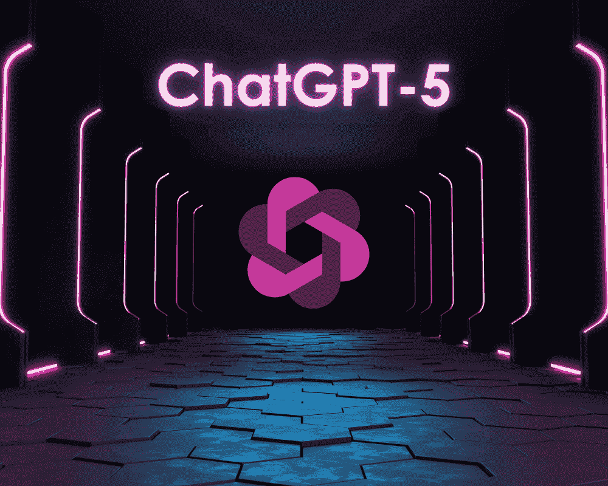
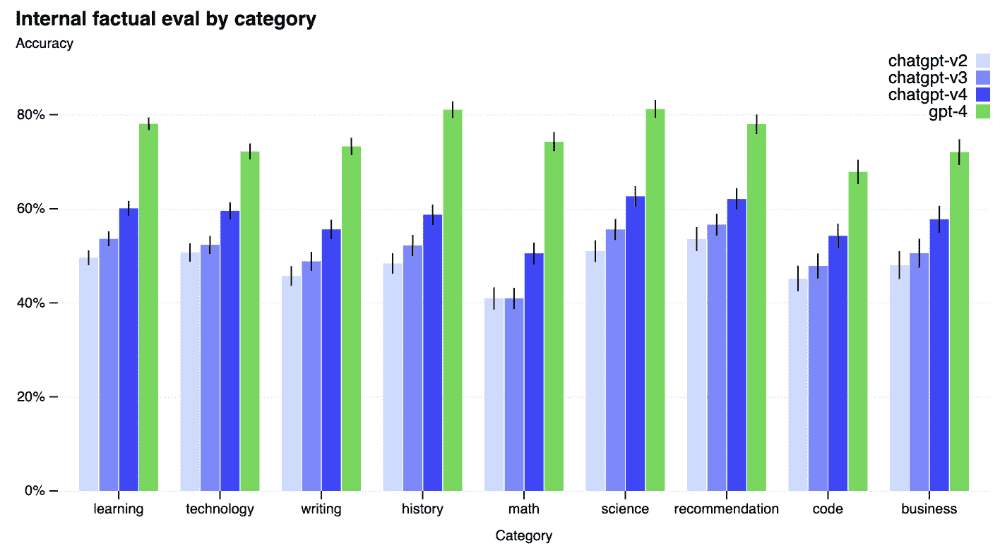

# 我们可以期待 GPT-5 带来什么？

> 原文：[`www.kdnuggets.com/2023/06/expect-gpt5.html`](https://www.kdnuggets.com/2023/06/expect-gpt5.html)

编辑提供的图片

跟上 AI 和技术的快速发展可能看起来非常困难。每周或每月，总会有新的东西出现，现在你又在这里学习新的内容！

这次是 GPT-5。

GPT-4 于 2023 年 3 月发布，自那时以来，大家一直在等待 GPT-5 的发布。Siqi Chen 在 3 月 27 日[发推](https://twitter.com/blader/status/1640217165822578688)称“GPT-5 计划在今年 12 月完成训练。”然而，OpenAI 首席执行官 Sam Altman 在 4 月的[MIT 活动](https://www.imaginationinaction.co/the-future-of-business-with-ai)上被问及 GPT-5 时澄清道，“我们不会，也不会在一段时间内发布”。

这就澄清了这一点。然而，一些专家建议 OpenAI 在 2023 年第三季度或第四季度发布 GPT-4.5，作为 GPT-4 和 GPT-5 之间的一个中间版本。当前模型总是在不断改进，这可能成为 GPT-4.5 的一个潜在发布。许多人认为 GPT-4.5 具备多模态能力，这在 2023 年 3 月的 GPT-4 开发者直播中已有展示。

尽管对 GPT-5 有很高的期望，GPT-4 仍然需要解决一些问题。例如，GPT-4 的推理时间非常长，同时运行成本也很高。还有其他挑战，比如访问 GPT-4 的 API。

尽管还有很多工作要做，但我们可以说的是，每一次 GPT 的发布都推动了 AI 技术及其能力的边界。AI 爱好者们对探索 GPT-5 的突破性特性感到兴奋。

那么我们可以期待 GPT-5 带来哪些功能呢？让我们来了解一下。

# 减少幻觉

这全关乎信任，这是大多数用户不相信 AI 模型的主要原因。例如，GPT-4 在内部事实评估中的得分比 GPT-3.5 高 40%，如下面的图片所示。这意味着 GPT-4 在回应不允许的内容方面的可能性更小，产生事实性回应的可能性比 GPT-3.5 高 40%。

随着新版本不断改进当前挑战，据说 GPT-5 将把幻觉减少到 10%以下，使大型语言模型（LLM）更值得信赖。

图片来源于[OpenAI](https://openai.com/research/gpt-4)

# 计算效率

如前所述，GPT-4 的计算成本非常高，每个 token $0.03。这与 GPT-3.5 的$0.002 成本相比差距巨大。GPT-4 在一万亿参数数据集和基础设施上训练，反映了其成本。

而谷歌的 PaLM 2 模型仅在 3400 亿参数上进行训练，并且性能高效。如果 OpenAI 计划与谷歌的 PaLM 2 竞争，他们需要寻找降低成本和缩小 GPT-4 参数规模的方法，同时保持性能。

另一个需要关注的方面是更好的推理时间，即深度学习模型预测新数据所需的时间。GPT-4 的功能和插件越多，计算效率也就越高。开发者们已经向 OpenAI 抱怨 GPT-4 的 API 经常停止响应，这迫使他们使用 GPT-3.5。

考虑到所有这些，我们可以期待 OpenAI 通过推出更小、更便宜、更高效的 GPT-5 来克服这些挑战。

# 多感官

在 GPT-4 发布之前，很多人对其多模态能力感到疯狂。尽管这尚未添加到 GPT-4 中，但这可能是 GPT-5 出现并真正成为明星的地方，使其真正实现多模态。

我们不仅可以期待它处理图像和文本，还可以处理音频、视频、温度等更多内容。萨姆·奥特曼在一次采访中表示*“我非常期待看到当我们能够处理视频时会发生什么，世界上有很多视频内容。很多事情用视频学习比用文本更容易。”*

增加可以用来使对话更具动态性和互动性的数据类型。多模态能力将是通向人工通用智能（AGI）的最快途径。

# 长期记忆

GPT-4 的最大令牌长度为 32 千个令牌，这在当时令人印象深刻。但随着世界上不断推出新模型，我们已经有如 Story Writer 这样的模型能够输出 65 千个令牌。

为了跟上当前的竞争，我们可以期待 GPT-5 引入更长的上下文长度，使用户能够拥有能够记住他们的个性和历史多年之久的 AI 朋友。

# 改进的上下文理解

作为一个大型语言模型（LLM），我们可以期待的第一件事是对上下文理解能力的提升。如果我们将其与上面提到的长期记忆结合起来，GPT-5 可能具有在长时间对话中保持上下文的潜力。作为用户，你将获得更多量身定制且符合要求的有意义的回应。

随之而来的是对语言的更高级理解，其中自然语言的主要组成部分是情感。GPT-5 在上下文理解方面的潜在能力可以使其更具同理心，并生成适当的回复以继续参与对话。

# 总结

关于 GPT-5 潜在能力还有很多未知，我们要等到发布时才能了解更多信息。本文基于 GPT-4 和 GPT-3.5 目前面临的挑战，以及 OpenAI 如何利用这些障碍克服困难，推出高性能的 GPT-5。

**[尼莎·阿利亚](https://www.linkedin.com/in/nisha-arya-ahmed/)** 是一位数据科学家、自由技术写作人以及 KDnuggets 的社区经理。她特别关注提供数据科学职业建议或教程，以及围绕数据科学的理论知识。她还希望探索人工智能在延长人类寿命方面的不同应用方式。作为一个热衷学习的人，她寻求扩展自己的技术知识和写作技能，同时帮助指导他人。

### 更多相关话题

+   [2023 年 AI 指数报告：未来我们可以预期的 AI 趋势](https://www.kdnuggets.com/2023/06/2023-ai-index-report-ai-trends-expect-future.html)

+   [作为数据科学家的职业发展预期](https://www.kdnuggets.com/2022/01/expect-career-path-data-scientist.html)

+   [2023 年人工智能质量趋势的预期](https://www.kdnuggets.com/2022/11/expect-ai-quality-trends-2023.html)

+   [数据科学家为何期望从 Google Bard 得到有缺陷的建议](https://www.kdnuggets.com/2023/02/data-scientists-expect-flawed-advice-google-bard.html)

+   [ODSC East 2022 免费访问的 15 个热门 MLOps 讲座](https://www.kdnuggets.com/2022/04/odsc-15-trending-mlops-talks-access-free-odsc-east-2022.html)

+   [人工智能如何改变数据集成](https://www.kdnuggets.com/2022/04/artificial-intelligence-transform-data-integration.html)
