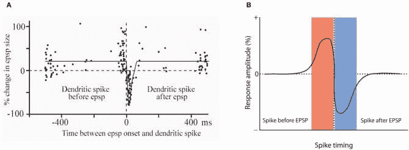

# 机器学习并不像你的大脑第六部分：精确突触权重的重要性及其快速设置的能力

> [`www.kdnuggets.com/2022/08/machine-learning-like-brain-part-6-importance-precise-synapse-weights-ability-set-quickly.html`](https://www.kdnuggets.com/2022/08/machine-learning-like-brain-part-6-importance-precise-synapse-weights-ability-set-quickly.html)

据我们所知，突触的权重只能通过连接它的两个神经元的近乎同时的发放来改变。这完全与机器学习反向传播算法的基本架构相悖。

你可以把反向传播想象成一个坐在神经网络旁边的小人，他查看网络输出，将其与期望输出进行比较，然后为网络中的突触指示新的权重。在生物系统中，没有机制可以指示任何特定突触的权重。你可以尝试通过发放连接的两个神经元来增加突触权重，但也没有办法做到这一点。你不能仅仅要求发放神经元 1000 和 1001 来增加它们之间的突触，因为没有办法在网络中发放特定的神经元。

我们确定的唯一调整突触权重的机制被称为赫布学习。它是一个常被俏皮地表述为“同时发放的神经元会连接在一起”的机制。但正如所有生物学现象一样，它并不那么简单。在“突触可塑性”的研究中，得到的曲线如图所示，表明要增强连接源神经元和目标神经元的突触，源神经元需要在目标神经元之前稍微发放。要减少突触权重，目标神经元必须在源神经元之前稍微发放。这在整体上是有意义的，因为如果一个神经元对另一个神经元的发放有贡献，那么连接这两个神经元的突触应该被加强，反之亦然。

图中还有一些需要注意的问题。首先，尽管整体概念在图 B 中进行了总结，图 A 显示了观察数据中大量的散布。这意味着，将突触设定为任何特定值的能力非常有限，这一点已通过模拟得到确认。

你还可以观察到，要对突触权重进行任何实质性的改变需要多次重复。即使在理论环境中（没有干扰的情况下），你也可以得出结论：对突触值的精确度要求越高，设定它所需的时间就越长。例如，如果你希望一个突触有 256 种不同的值之一，你可以定义每对增强性尖峰将权重增加 1/256。可能需要 256 对尖峰（到源头和目标）才能设置权重。在生物神经元的缓慢速度下，这将需要整整一秒钟。

想象一下构建一台计算机，其中单个字节的内存写入需要大约一秒钟。此外，设想需要支持电路来设置一个值 x，安排准确的 x 次脉冲到源神经元和目标神经元。这假设它从 0 的权重开始，这又是另一个问题，因为没有办法知道任何突触的当前权重。最后，想象一下网络中的任何使用如何修改突触权重，使得这样的系统无论如何都无法存储准确的值。在特定突触中存储特定值的整个概念完全不切实际。

还有另一种看法更为合理。考虑将突触视为一个二进制设备，值为 0 或 1（或者在抑制突触的情况下为-1）。现在，突触的特定权重代表了该突触的重要性以及遗忘它所代表的数据位的可能性。如果我们考虑神经元发射脉冲（可能是 5 次），那么任何超过 0.2 的权重代表 1，任何低于 0.2 的权重代表 0。这样的系统可以在一次脉冲中学习，并且对内存内容的随机变化具有免疫力。这是一个完全合理的情景，但它与现代机器学习方法完全相悖。

> 到目前为止，集中讨论了 ML 和感知机可以做到而神经元不能做到的事情，我将在本系列的第七部分扭转局面，描述一些神经元特别擅长的事情。

图 A：显示源神经元和目标神经元的相对脉冲时间如何影响突触权重。图 B：一个理想化的 Hebbian 学习在仿真中可用的表示。*摘自：Piochon, Claire & Kruskal, Peter & Maclean, Jason & Hansel, Christian. (2012). 小脑回路中的非 Hebbian 脉冲时间依赖性可塑性。神经回路前沿。6. 124. 10.3389/fncir.2012.00124.*

欲了解更多信息，请访问 [`www.youtube.com/watch?v=jdaAKy-XkA0`](https://www.youtube.com/watch?v=jdaAKy-XkA0)

**[查尔斯·西蒙](https://futureai.guru/Founder.aspx)** 是一位全国知名的企业家和软件开发者，也是 FutureAI 的首席执行官。西蒙是《计算机会反叛吗？：为人工智能的未来做准备》的作者，以及 Brain Simulator II 的开发者，这是一个 AGI 研究软件平台。欲了解更多信息，[请访问这里](https://futureai.guru/Founder.aspx)。

### 更多相关主题

+   [机器学习不像你的大脑 第四部分：神经元的……](https://www.kdnuggets.com/2022/06/machine-learning-like-brain-part-4-neuron-limited-ability-represent-precise-values.html)

+   [机器学习不像你的大脑 第一部分：神经元很慢，……](https://www.kdnuggets.com/2022/04/machine-learning-like-brain-part-one-neurons-slow-slow-slow.html)

+   [机器学习不像你的大脑 第二部分：感知器与神经元](https://www.kdnuggets.com/2022/05/machine-learning-like-brain-part-two-perceptrons-neurons.html)

+   [机器学习不像你的大脑 第三部分：基本架构](https://www.kdnuggets.com/2022/06/machine-learning-like-brain-part-3-fundamental-architecture.html)

+   [机器学习不像你的大脑 第五部分：生物神经元](https://www.kdnuggets.com/2022/07/machine-learning-like-brain-part-5-biological-neurons-cant-summation-inputs.html)

+   [机器学习不像你的大脑 第七部分：神经元的作用](https://www.kdnuggets.com/2022/08/machine-learning-like-brain-part-seven-neurons-good.html)
