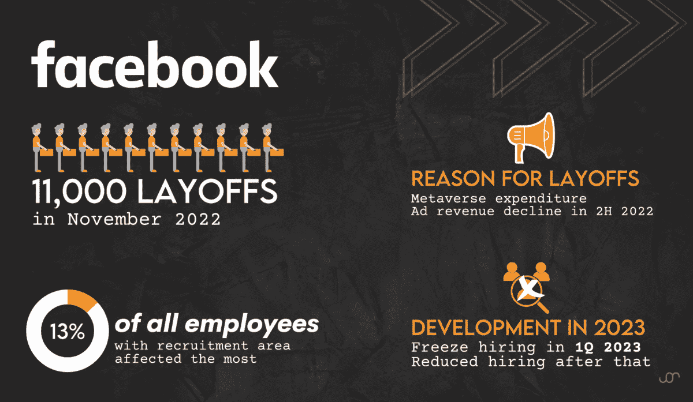
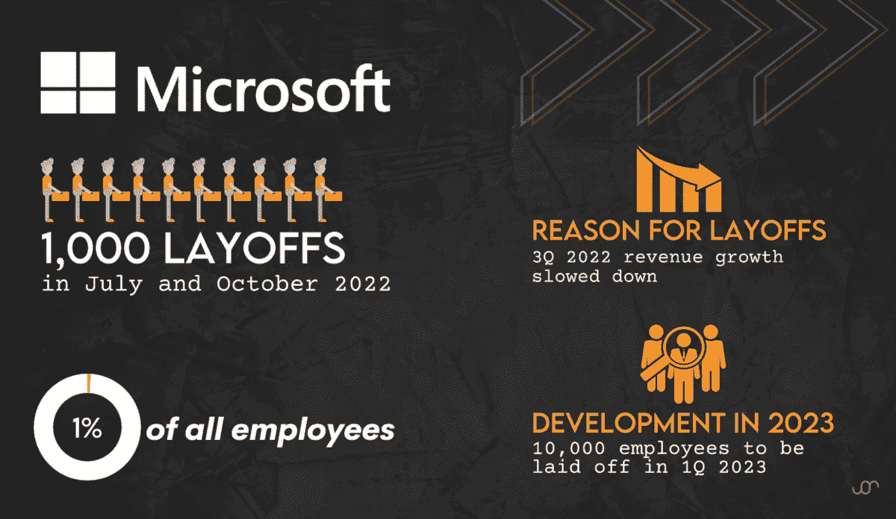
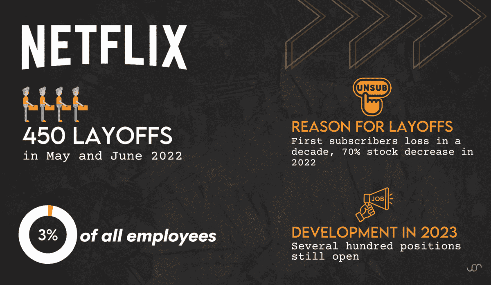
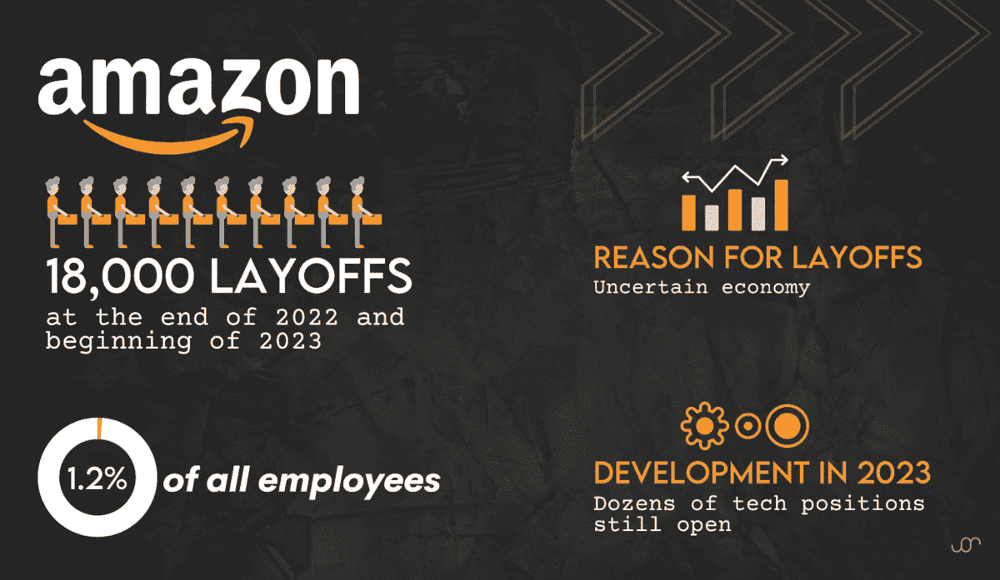
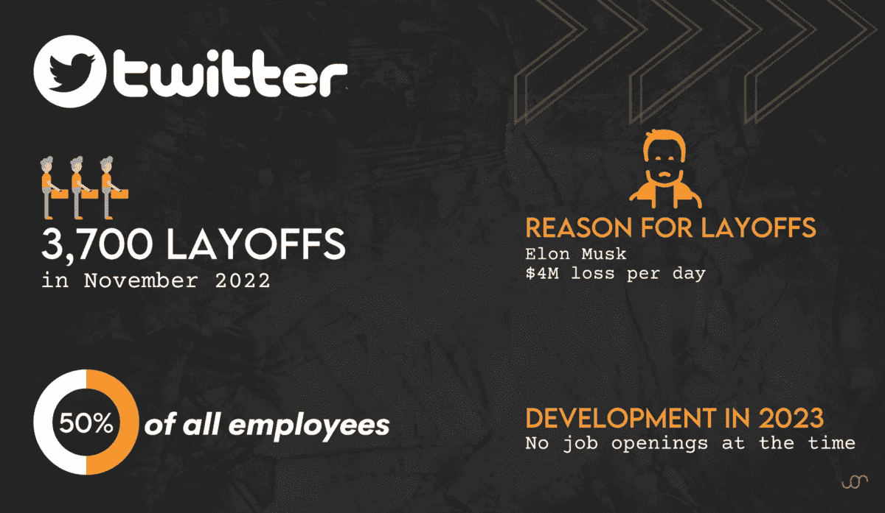
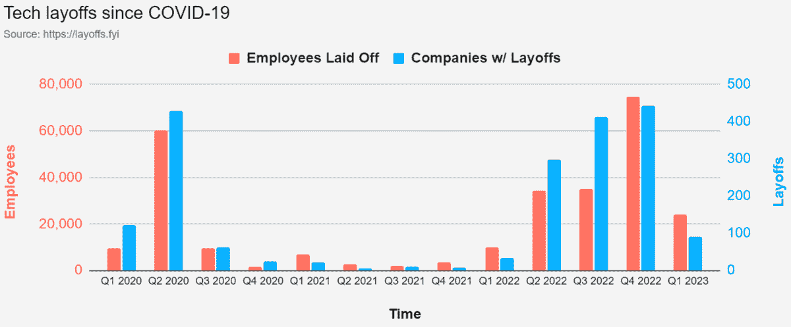
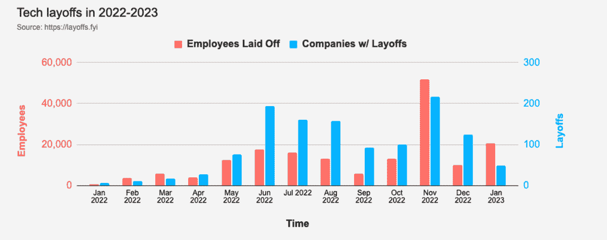

# 科技裁员的原因是什么？

> 原文：[`www.kdnuggets.com/2023/02/layoffs-tech.html`](https://www.kdnuggets.com/2023/02/layoffs-tech.html)

作者提供的图片

如果你在科技行业，你可能享受了一个辉煌的十年。数据科学是最炙手可热的工作。每位大学教授都告诉你，你的技能将让你保持就业，直到世界末日。每个[公司都需要数据科学家](https://www.stratascratch.com/blog/11-best-companies-to-work-for-as-a-data-scientist/)，这些职位暂时不会消失。

* * *

## 我们的前三个课程推荐

 1\. [Google 网络安全证书](https://www.kdnuggets.com/google-cybersecurity) - 快速进入网络安全职业之路。

 2\. [Google 数据分析专业证书](https://www.kdnuggets.com/google-data-analytics) - 提升你的数据分析能力

 3\. [Google IT 支持专业证书](https://www.kdnuggets.com/google-itsupport) - 支持你组织的 IT 需求

* * *

除非你最近打开了报纸或查看了头条新闻，否则你会知道这并不完全准确。Twitter、Meta、Netflix、Microsoft 和其他数十家科技公司最近都进行了大规模裁员。那些避免裁员的公司也实施了招聘冻结。总体来看，2022 年几乎有 9 万名科技行业的员工被裁员。

在 2023 年的前几周，另有 16,000 人被裁员，[根据](https://news.crunchbase.com/startups/tech-layoffs-2023/) Crunchbase 的数据。

突然间，最热门的就业市场变得冷却了不少。

大型科技公司发生了什么？如果你在科技行业，未来会怎样？你应该担心吗，还是考虑换个职业？

这篇文章将回答所有这些问题及更多内容。剧透：如果你在科技行业，你的技能仍然很受欢迎。

# 我们是如何到达这里的？

解释科技裁员的因素有几个，不过很难确定这些因素中有多少具体导致了裁员。

首先，科技公司前所未有的增长速度一直有些不可持续。COVID 使得许多电子商务和广告基础公司经历了快速增长，但消费者开始恢复正常后，这种增长难以维持。

在经历了十年的高估、过度招聘和风投补贴增长后，裁员的“报应”终于到来了。

其次，正如你无疑已经厌倦听到的那样，目前经济形势很奇怪。供应链问题层出不穷。通货膨胀高得离谱。地缘政治动荡。这一切导致科技行业的增长放缓——足够让科技公司开始恐慌。

第三，来自多个方面的压力。以 Twitter 为例，目前在埃隆·马斯克的不可预测和混乱的领导下。马斯克对员工数量进行了大幅削减，截至目前，Twitter 仍在运营（尽管有些故障）。这一成功让其他公司董事会质疑，为什么他们要支付如此多员工的薪水，而 Twitter 证明了在员工数量削减一半的情况下仍能运作。

还有一种社会传染的因素。斯坦福大学商学院教授杰弗里·费弗认为，模仿行为可能是导致我们现在看到的许多裁员的原因。“会有科技衰退吗？有。估值有泡沫吗？绝对有。Meta 过度招聘了吗？可能。但这就是他们裁员的原因吗？当然不是。Meta 有很多钱。这些公司都在赚钱。他们这样做是因为其他公司也在这样做，”费弗 [告诉](https://news.stanford.edu/2022/12/05/explains-recent-tech-layoffs-worried/#:~:text=It%20is%20estimated%20that%20in,and%20starts%20ups%20as%20well.) 斯坦福新闻记者梅丽莎·德·维特。

# 了解科技裁员的全貌

让我们深入了解一下多个大型科技公司就业情况究竟发生了什么。

## Meta（Facebook）

图片来源：作者

Meta [报告](https://www.cnbc.com/2022/11/09/meta-to-lay-off-more-than-11000-thousand-employees.html)称 2022 年 11 月裁员 11,000 人，影响了 13%的员工。这些裁员几乎影响了公司的每个领域，尤其是招聘，因为 Meta 还计划在 2023 年第一季度冻结招聘，并在此后减缓招聘速度。

大多数专家一致认为，这一现象的主要原因是 Meta 在其元宇宙上的巨大支出。此外，2022 年最后两个季度的广告收入下降。由于 Meta 的成本在第三季度同比增长了 19%，达到了 221 亿美元，收入无法跟上。

然而，在 Q3 财报的分析师电话会议上，马克·扎克伯格宣布“某些团队将显著增长”，以试图“将[Meta]的投资集中在少数几个高优先级的增长领域”。

那些领域可能是什么呢？

查阅 [LinkedIn](https://www.linkedin.com/jobs/search/?currentJobId=3407318955&f_C=10667&keywords=meta)、[Indeed](https://www.indeed.com/jobs?q=meta&l=&from=searchOnHP&vjk=6703eebaf3ff06cb) 和 Meta 自己的 [招聘页面](https://www.metacareers.com/jobs/?sub_teams[0]=Data%20Science)，这些成千上万的新职位大多出现在科技行业。Meta 正在招聘数据科学家、研究员、分析师和工程师。

## 微软

图片来源：作者

微软进行了非常小规模的裁员，[据报道](https://www.cnbc.com/2022/10/18/microsoft-confirms-job-cuts-after-calling-for-growth-to-slow.html) 这次裁员影响了不到 1% 的员工。

这次裁员的原因很简单：2022 年第三季度的收入增长是过去五年来最慢的。

我想稍微提一下，收入仍然 *增长*。只是增长的速度减慢了。

[LinkedIn](https://www.linkedin.com/jobs/search/?currentJobId=3431685212&f_C=1035&f_I=4&geoId=103644278&keywords=microsoft%20data%20science&location=United%20States&refresh=true&sortBy=R&start=50) 报道称微软仍在科技招聘网站上招聘数千个职位，包括研究、机器学习和数据科学领域。 [Indeed](https://www.indeed.com/jobs?q=microsoft&l=&vjk=31184bbb269d0be0) 和微软的招聘 [网站](https://careers.microsoft.com/us/en/) 也证实了这一点。

## Netflix

图片来源：作者

流媒体巨头在过去几年面临了独特的困难，科技泡沫暂且不提。在 2022 年 5 月，Netflix 报告了十年来的首次用户流失。因此，公司 [进行了](https://www.nytimes.com/2022/06/23/business/media/netflix-layoffs.html) 450 人的裁员。

尽管有这些裁员，Netflix 仍在其 [内部招聘网站](https://jobs.netflix.com/search?team=Data%20Science%20and%20Engineering) 上提供多个数据科学和工程职位。LinkedIn [显示](https://www.linkedin.com/jobs/search/?currentJobId=3434154134&f_C=165158&f_I=6&geoId=103644278&keywords=netflix&location=United%20States&refresh=true&sortBy=R) 有 200 个职位空缺，其中一些在分析师/数据科学领域， [Indeed](https://www.indeed.com/jobs?q=netflix&l=&vjk=01d1bb644bd70fde) 也显示了类似的职位。

## 亚马逊

图片来源：作者

这家电商巨头 [裁员](https://www.wsj.com/articles/amazon-to-lay-off-over-17-000-workers-more-than-first-planned-11672874304) 了 18,000 人。然而，裁员主要集中在公司员工。裁员影响了该部门大约 5% 的员工和其全部员工的 1.2%。公司将此归因于疫情期间大规模扩张带来的压力。

目前的就业前景并没有那么严峻。 [Indeed](https://www.indeed.com/jobs?q=amazon+engineer&l=&sc=0fcckey%3Acaff23281376b83d%2Cq%3Aengineer%3B&vjk=acf3bc3be40d827b)、[LinkedIn](https://www.linkedin.com/jobs/search/?currentJobId=3427079410&f_C=1586&f_I=6&geoId=103644278&keywords=data%20scientist&location=United%20States&refresh=true&sortBy=R) 和亚马逊的 [网站](https://www.amazon.jobs/en/job_categories/software-development) 显示了许多科技行业的职位机会。

## 推特

作者提供的图片

Twitter 可能是报道最多的裁员来源，原因在于 Twitter 上的记者与新管理层之间的敌意。Twitter 因新任 CEO 埃隆·马斯克的任性裁员超过了其 7,500 人的一半员工。

马斯克[报道](https://www.cnn.com/2022/11/03/tech/twitter-layoffs/index.html)Twitter 每天损失超过 400 万美元，迫使其“别无选择”只能裁员约 3,700 名员工，包括信任与安全团队、内容审核团队以及 Twitter 总部的[清洁工](https://www.nytimes.com/2022/12/29/technology/twitter-elon-musk.html)。

与名单上的其他公司不同，Twitter 的独特之处在于公司内没有任何职位空缺。Twitter 的职业[网站](https://careers.twitter.com/)上只有 24 个职位空缺，全部仅供“未来考虑”。[LinkedIn](https://www.linkedin.com/company/twitter/jobs/)和[Indeed](https://www.indeed.com/jobs?q=twitter&l=)也显示一样。

## 其他科技公司

这五个例子无疑是最大的和最知名的，但并非唯一的裁员科技公司。其他裁员的公司还包括 Snap（[20%的员工](https://www.theverge.com/2022/8/30/23329301/snap-layoffs-20-percent-employees-snapchat)）、Salesforce（[裁员 9,090 人](https://www.nytimes.com/2023/01/04/technology/salesforce-layoffs.html)）、Zillow（25%的员工）以及更多公司。

这是[layoffs.fyi 的图表](https://layoffs.fyi)，展示了 2022 年和 2023 年科技行业的裁员情况。

来源：[layoffs.fyi](https://layoffs.fyi/)

我喜欢[他们的表格](https://layoffs.fyi/)，展示了自 COVID-19 开始以来裁员的 1,910 家公司。如果你想了解得更清楚，我推荐你查看一下。

或者，更好的是，这里有可视化的数据。

来源：[layoffs.fyi](https://layoffs.fyi/)

# 该怎么做呢？

如果你仔细阅读了这篇文章，我希望你能了解到三件事：

+   **裁员已经影响了许多科技公司**。如果你*被*裁员了，这与您的技能水平或能力无关。只是现在的市场情况。

+   **裁员** ***并未*** **过分针对技术员工**。也就是说，科技公司在裁员时要么对所有员工都采取行动，要么在非工程、分析、数据科学等领域进行裁员。

+   **大多数这些公司仍在招聘技术职位**，Twitter 是一个显著的例外。

如果你在科技行业，由于科技公司在努力调整方向，你可能会被裁员，这并非完全由于你的过错。但仍然有很多机会。

那么你该怎么做呢？

确保你不会长时间失业的最佳措施就是**保持你的面试技巧敏锐**。我建议查看像我们自己的[StrataScratch](https://www.stratascratch.com/?utm_source=blog&utm_medium=click&utm_campaign=kdn+tech+layoffs)这样的平台，它会帮助你练习常见的面试问题，包括编码和非编码问题。

你也可以参加像[Kaggle](https://www.kaggle.com/competitions)或[Leetcode](https://leetcode.com/problemset/all/)这样的网站上的编码竞赛，这是提高或保持你的[数据科学技能](https://www.stratascratch.com/blog/what-skills-do-you-need-as-a-data-scientist/?utm_source=blog&utm_medium=click&utm_campaign=kdn+tech+layoffs)的好方法。Hackerrank 还提供了一个很棒的面试[准备工具包](https://www.hackerrank.com/dashboard)，如果你很久没参加技术面试了，这可能会很有用。它还提供 Python 和问题解决等有价值的数据科学技能的认证。

最后，我建议花点时间审视一下你的网络。更新你的 LinkedIn，并向你在其他公司可能有的老联系人发送信息，提议见面。很多就业机会不仅依赖于你知道什么，而更在于你认识谁。

# 最终想法

在所有关于裁员的恐慌中，我觉得[这篇文章](https://www.marketwatch.com/story/the-best-job-in-america-pays-over-120-000-a-year-offers-low-stress-healthy-work-life-balance-and-its-workers-are-in-high-demand-11673327726)来自 MarketWatch 非常有趣。你能猜到他们称为“美国最佳职位”的是什么吗？

这是一个软件工程师。

所以说，很容易被关于裁员的坏消息所困扰并担心你的未来就业。我想重申，如果你发现自己被裁员，那不是因为你的问题，而是因为市场正在降温。

与其担心是否会被裁员，不如采取行动提高从一个技术职位直接跳槽到另一个的机会。

尽管头条新闻可能会这样说，但职位板证明许多公司仍然需要熟练的技术员工。

**[Nate Rosidi](https://www.stratascratch.com)** 是一位数据科学家，专注于产品策略。他也是一名讲授分析学的兼职教授，并且是[StrataScratch](https://www.stratascratch.com/)，一个帮助数据科学家准备面试的平台注册者。可以在[Twitter: StrataScratch](https://twitter.com/StrataScratch)或[LinkedIn](https://www.linkedin.com/in/nathanrosidi/)上与他联系。

### 了解更多主题

+   [2024 年技术裁员激增：谁该负责？](https://www.kdnuggets.com/the-surge-in-tech-layoffs-2024-who-to-blame)

+   [科技行业所有领域的热门谷歌认证](https://www.kdnuggets.com/popular-google-certification-for-all-areas-in-the-tech-industry)

+   [Python 中的所有集合](https://www.kdnuggets.com/2022/09/collections-python.html)

+   [超级巴德：能够做所有事情且更出色的 AI](https://www.kdnuggets.com/2023/05/super-bard-ai-better.html)

+   [今天所有市场营销分析和数据科学专业人士需要的 5 项技能](https://www.kdnuggets.com/2023/08/mads-5-skills-marketing-analytics-data-science-pros-need-today.html)

+   [如果你想精通生成式 AI，请忽略所有（除了两个）工具](https://www.kdnuggets.com/if-you-want-to-master-generative-ai-ignore-all-but-two-tools)
