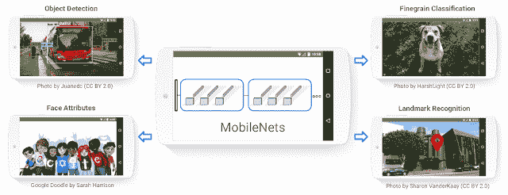
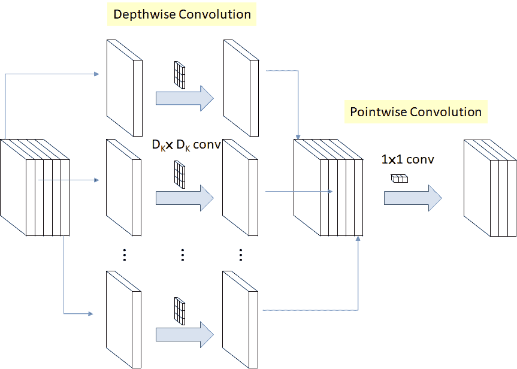
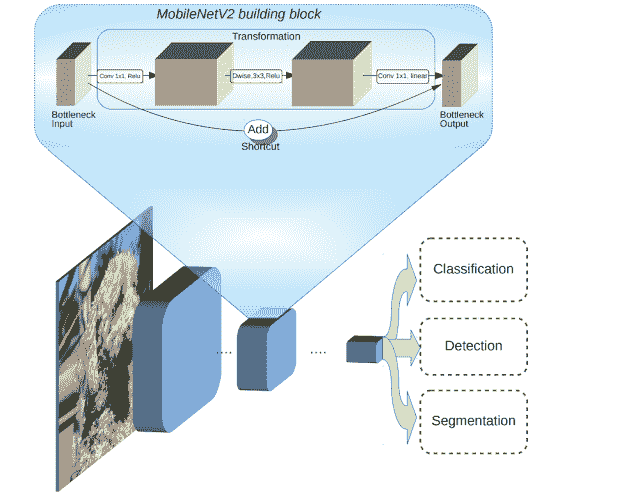
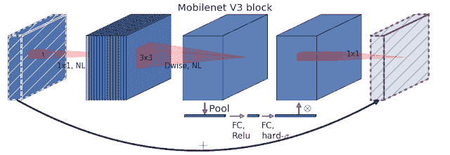
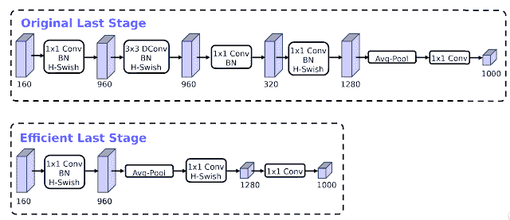
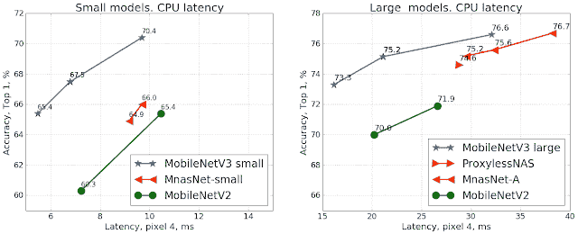

# Google 开源了 MobileNetV3，并提出了改进移动计算机视觉模型的新思路

> 译文：[`www.kdnuggets.com/2019/12/google-open-sources-mobilenetv3-improve-mobile-computer-vision-models.html`](https://www.kdnuggets.com/2019/12/google-open-sources-mobilenetv3-improve-mobile-computer-vision-models.html)

评论 

移动深度学习正成为人工智能（AI）领域中最活跃的研究领域之一。设计能够在移动运行时高效执行的深度学习模型需要重新思考许多神经网络架构范式。移动深度学习模型需要平衡复杂神经网络结构的准确性与移动运行时的性能限制。在移动深度学习的领域中，计算机视觉仍然是最具挑战性的领域之一。2017 年，[Google 介绍了 MobileNets](https://ai.googleblog.com/2017/06/mobilenets-open-source-models-for.html)，这是一个基于 TensorFlow 的计算机视觉模型系列。[MobileNets 的最新架构在几天前揭晓](https://arxiv.org/abs/1905.02244)，其中包含了一些有趣的改进移动计算机视觉模型的想法。

* * *

## 我们的前三大课程推荐

 1\. [Google 网络安全证书](https://www.kdnuggets.com/google-cybersecurity) - 快速进入网络安全职业生涯

 2\. [Google 数据分析专业证书](https://www.kdnuggets.com/google-data-analytics) - 提升你的数据分析技能

 3\. [Google IT 支持专业证书](https://www.kdnuggets.com/google-itsupport) - 支持你组织的 IT 需求

* * *

MobileNetV3 是驱动许多流行移动应用图像分析功能的架构的第三个版本。该架构也被纳入了流行的框架，如 TensorFlow Lite。MobileNets 需要仔细平衡计算机视觉和深度学习的一般进展与移动环境的限制。Google 定期发布 MobileNets 架构的更新，这些更新融入了一些深度学习领域最具创新性的想法。

### MobileNetV1

[MobileNets 的第一个版本](https://arxiv.org/abs/1704.04861) 于 2017 年春季发布。其核心思想是引入一系列基于 TensorFlow 的计算机视觉模型，这些模型在考虑到设备或嵌入式应用资源受限的情况下最大化准确性。从概念上讲，MobileNetV1 旨在实现两个基本目标，以构建以移动为优先的计算机视觉模型：

+   **更小的模型尺寸**：更少的参数数量

+   **更小的复杂性**：更少的乘法和加法

根据这些原则，MobileNetV1 是小型、低延迟、低功耗的模型，参数化以满足各种使用场景的资源限制。它们可以用于分类、检测、嵌入和分割。

MobileNetV1 的核心架构基于一个精简的架构，使用深度可分离卷积来构建轻量级深度神经网络。在神经网络架构方面，深度可分离卷积是一个深度卷积，后跟一个逐点卷积，如下图所示。在 MobileNetV1 中，深度卷积对每个输入通道应用一个滤波器。逐点卷积随后对深度卷积的输出应用 1×1 卷积进行组合。标准卷积在一步中既滤波又组合输入，深度可分离卷积则将其拆分为两个层，一个用于滤波，另一个用于组合。

第一个 MobileNetV1 实现被包含在[TensorFlow-Slim 图像分类库](https://github.com/tensorflow/models/blob/master/research/slim/README.md)中。随着基于这一新范式的新移动应用的开发，出现了改进整体架构的新想法。

### MobileNetV2

MobileNet 架构的第二个版本[在 2018 年初发布](https://arxiv.org/abs/1801.04381)。MobileNetV2 基于其前身的一些理念，并结合了新的想法，以优化架构用于分类、物体检测和语义分割等任务。从架构的角度来看，MobileNetV2 引入了两个新特性：

1.  层之间的线性瓶颈

1.  瓶颈之间的 shortcut 连接[1](https://ai.googleblog.com/2018/04/mobilenetv2-next-generation-of-on.html#1)。基本结构如下图所示。

MobileNetV2 的核心思想是瓶颈编码模型的中间输入和输出，而内层封装了模型从像素等低层次概念到图像类别等高层次描述符的转换能力。最后，与传统的残差连接一样，shortcut 连接实现了更快的训练和更好的准确性。

### MobileNetsV3

对 MobileNets 架构的最新改进总结 [在今年八月发布的一篇研究论文中](https://arxiv.org/abs/1905.02244)。MobileNetV3 的主要贡献是使用 AutoML 寻找给定问题的最佳神经网络架构。这与以前版本架构的手工设计形成对比。具体而言，MobileNetV3 利用两种 AutoML 技术： [MnasNet](https://ai.google/research/pubs/pub47217/) 和 [NetAdapt](https://arxiv.org/pdf/1804.03230)。MobileNetV3 首先使用 MnasNet 搜索粗略架构，MnasNet 使用强化学习从离散选择集中选择最佳配置。之后，模型使用 NetAdapt 进行架构微调，NetAdapt 是一种补充技术，通过小幅度减小来修剪未充分利用的激活通道。

MobileNetV3 的另一个新颖想法是将一个 [squeeze-and-excitation](https://arxiv.org/abs/1709.01507) 块融入核心架构中。squeeze-and-excitation 块的核心思想是通过显式建模卷积特征通道之间的相互依赖关系来提高网络生成表示的质量。为此，我们提出了一种机制，允许网络进行特征重新校准，从而可以学习使用全局信息来有选择地强调有用特征并抑制不太有用的特征。在 MobileNetV3 的情况下，架构扩展了 MobileNetV2，融入了 squeeze-and-excitation 块作为搜索空间的一部分，最终得到了更为强健的架构。

MobileNetV3 的一个有趣优化是重新设计了架构中一些昂贵的层。MobileNetV2 中的一些层对模型的准确性至关重要，但也引入了令人担忧的延迟水平。通过进行一些基本优化，MobileNetV3 能够在不牺牲准确性的情况下，移除前代架构中的三个昂贵层。

MobileNetV3 相比以前的架构显示出了显著的改进。例如，在目标检测任务中，MobileNetV3 的延迟减少了 25%，同时保持了与以前版本相同的准确性。分类任务中也观察到了类似的改进，如下图所示：

MobileNets 仍然是移动计算机视觉中最先进的架构之一。将 AutoML 纳入 MobileNetV3 无疑开启了许多我们之前未曾想到的有趣架构。[MobileNets 的最新版本可在 GitHub 上找到](https://github.com/tensorflow/models/tree/master/research/slim/nets/mobilenet)，MobileNetV3 的实现包括在 [Tensorflow 目标检测 API](https://github.com/tensorflow/models/tree/master/research/object_detection) 中。

[原文](https://towardsdatascience.com/google-open-sources-mobilenetv3-with-new-ideas-to-improve-mobile-computer-vision-models-bfba8967a7f1)。经许可转载。

**相关：**

+   K-Means 聚类下的图像分割简介

+   在 TensorFlow 中比较 MobileNet 模型

+   谷歌、优步和 Facebook 的开源项目，用于数据科学和 AI

### 更多相关主题

+   [DINOv2: Meta AI 的自监督计算机视觉模型](https://www.kdnuggets.com/2023/05/dinov2-selfsupervised-computer-vision-models-meta-ai.html)

+   [TensorFlow 在计算机视觉中的应用 - 迁移学习变得简单](https://www.kdnuggets.com/2022/01/tensorflow-computer-vision-transfer-learning-made-easy.html)

+   [发现计算机视觉的世界：介绍 MLM 的最新…](https://www.kdnuggets.com/2024/01/mlm-discover-the-world-of-computer-vision-ebook)

+   [计算机视觉的 5 个应用](https://www.kdnuggets.com/2022/03/5-applications-computer-vision.html)

+   [关于数据管理你需要知道的 6 件事及其重要性…](https://www.kdnuggets.com/2022/05/6-things-need-know-data-management-matters-computer-vision.html)

+   [KDnuggets 新闻 2022 年 3 月 9 日：在 5… 内构建机器学习 Web 应用](https://www.kdnuggets.com/2022/n10.html)
