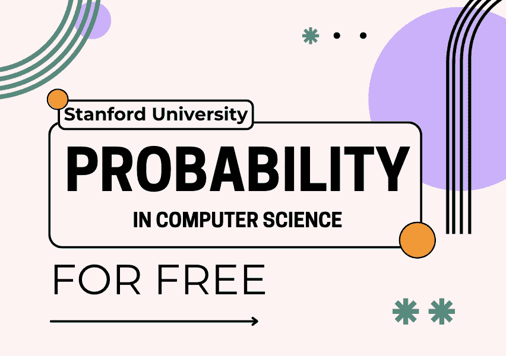

# 免费学习斯坦福大学的计算机科学中的概率学

> 译文：[`www.kdnuggets.com/learn-probability-in-computer-science-with-stanford-university-for-free`](https://www.kdnuggets.com/learn-probability-in-computer-science-with-stanford-university-for-free)

图片由作者提供

对于那些深入计算机科学领域或需要刷新概率知识的人来说，你们将会大有收获。斯坦福大学最近更新了其 [YouTube 播放列表](https://www.youtube.com/playlist?list=PLoROMvodv4rOpr_A7B9SriE_iZmkanvUg) 的 CS109 课程，增加了新内容！

* * *

## 我们的前三个课程推荐

 1\. [谷歌网络安全证书](https://www.kdnuggets.com/google-cybersecurity) - 快速进入网络安全职业

 2\. [谷歌数据分析专业证书](https://www.kdnuggets.com/google-data-analytics) - 提升你的数据分析技能

 3\. [谷歌 IT 支持专业证书](https://www.kdnuggets.com/google-itsupport) - 支持你的组织的 IT

* * *

该播放列表包含 29 节讲座，为你提供概率理论基础的黄金标准知识、概率理论中的基本概念、分析概率的数学工具，并最终结束于数据分析和机器学习。

那么让我们直接开始吧……

# 讲座 1：计数

链接: [计数](https://www.youtube.com/watch?v=2MuDZIAzBMY&list=PLoROMvodv4rOpr_A7B9SriE_iZmkanvUg&index=1)

了解概率的历史及其如何帮助我们实现现代人工智能，包括开发人工智能系统的实际例子。理解核心计数阶段，包括使用“步骤”和“或”的计数。这涵盖了诸如人工神经网络等领域，以及研究人员如何利用概率构建机器。

# 讲座 2：组合数学

链接: [组合数学](https://www.youtube.com/watch?v=ag4Ei15CG0c&list=PLoROMvodv4rOpr_A7B9SriE_iZmkanvUg&index=2)

第二讲深入探讨更严肃的计数——这称为组合数学。组合数学是计数和排列的数学。深入了解*n*个对象的计数任务，包括排序对象（排列）、选择*k*个对象（组合）和将对象放入*r*个桶中。

# 讲座 3：什么是概率？

链接: [什么是概率？](https://www.youtube.com/watch?v=EGgMCE2AgyU&list=PLoROMvodv4rOpr_A7B9SriE_iZmkanvUg&index=3)

课程在这里真正开始深入探讨概率。学习概率的核心规则，并通过各种示例了解这些规则，并稍微涉及 Python 编程语言及其在概率中的应用。

# 讲座 4：概率与贝叶斯

链接：[概率与贝叶斯](https://www.youtube.com/watch?v=NHRoXvPaZqY&list=PLoROMvodv4rOpr_A7B9SriE_iZmkanvUg&index=4)

在这节讲座中，你将深入学习如何使用条件概率、链式法则、全概率法则和贝叶斯定理。

# 讲座 5：独立性

链接：[独立性](https://www.youtube.com/watch?v=zTJDZ2wmaRU&list=PLoROMvodv4rOpr_A7B9SriE_iZmkanvUg&index=6)

在这节讲座中，你将学习概率如何在互斥和独立的情况下应用，使用 AND/OR。讲座将通过各种示例帮助你很好地掌握这些概念。

# 讲座 6：随机变量与期望

链接：[随机变量与期望](https://www.youtube.com/watch?v=8QCg2ur-3fo&list=PLoROMvodv4rOpr_A7B9SriE_iZmkanvUg&index=6)

基于之前的讲座和你对条件概率及独立性的知识，这节讲座将深入随机变量，使用并生成随机变量的概率质量函数，并能够计算期望值。

# 讲座 7：方差 伯努利 二项分布

链接：[方差 伯努利 二项分布](https://www.youtube.com/watch?v=I2UBspTNAG0&list=PLoROMvodv4rOpr_A7B9SriE_iZmkanvUg&index=7)

现在你将利用你的知识解决越来越难的问题。你在这节讲座中的目标是识别和使用二项随机变量、伯努利随机变量，并能够计算随机变量的方差。

# 讲座 8：泊松分布

链接：[泊松分布](https://www.youtube.com/watch?v=QV3IRiG6dVs&list=PLoROMvodv4rOpr_A7B9SriE_iZmkanvUg&index=8)

泊松分布在你有一个速率并且关心事件发生次数时非常有用。你将学习如何在不同方面使用它，并结合 Python 代码示例。

# 讲座 9：连续随机变量

链接：[连续随机变量](https://www.youtube.com/watch?v=OFgBn4rQkqc&list=PLoROMvodv4rOpr_A7B9SriE_iZmkanvUg&index=9)

本讲座的目标包括熟练使用新的离散随机变量，积分密度函数以获得概率，以及使用累积分布函数以获得概率。

# 讲座 10：正态分布

链接：[正态分布](https://www.youtube.com/watch?v=rpB_NNXiWlM&list=PLoROMvodv4rOpr_A7B9SriE_iZmkanvUg&index=10)

你可能之前听说过正态分布，在这节讲座中，你将了解正态分布的简要历史、它的定义、为什么它重要以及实际例子。

# 讲座 11：联合分布

链接：[联合分布](https://www.youtube.com/watch?v=8Il2M7kbQSc&list=PLoROMvodv4rOpr_A7B9SriE_iZmkanvUg&index=11)

在之前的讲座中，你最多处理了 2 个随机变量，下一步学习将是处理任意数量的随机变量。

# 讲座 12：推断

链接：[推断](https://www.youtube.com/watch?v=fvgQBAsg5Zo&list=PLoROMvodv4rOpr_A7B9SriE_iZmkanvUg&index=12)

本讲座的学习目标是如何使用多项式，理解对数概率的实用性，并能够使用贝叶斯定理与随机变量。

# 讲座 13: 推断 II

链接: [推断 II](https://www.youtube.com/watch?v=d0ImA7m4BEg&list=PLoROMvodv4rOpr_A7B9SriE_iZmkanvUg&index=13)

学习目标继续延续上节课，结合贝叶斯定理与随机变量。

# 讲座 14: 建模

链接: [建模](https://www.youtube.com/watch?v=q9lk8l8P-E4&list=PLoROMvodv4rOpr_A7B9SriE_iZmkanvUg&index=14)

在本讲座中，你将把迄今为止学到的所有知识与现实问题——概率建模结合起来。这是将一堆随机变量一起随机处理。

# 讲座 15: 一般推断

链接: [一般推断](https://www.youtube.com/watch?v=c0QGjtu9GZg&list=PLoROMvodv4rOpr_A7B9SriE_iZmkanvUg&index=15)

你将深入探讨一般推断，特别是学习一种称为拒绝采样的算法。

# 讲座 16: Beta

链接: [Beta](https://www.youtube.com/watch?v=aOhk9mFrHdU&list=PLoROMvodv4rOpr_A7B9SriE_iZmkanvUg&index=16)

本讲座将深入探讨用于解决现实世界问题的概率随机变量。Beta 是一种概率分布，其范围在 0 和 1 之间。

# 讲座 17: 添加随机变量

链接: [添加随机变量 I](https://www.youtube.com/watch?v=UEyHbI9FRtM&list=PLoROMvodv4rOpr_A7B9SriE_iZmkanvUg&index=17)

在课程的这一部分，你将学习深入理论，而随机变量的添加是如何获得概率理论结果的介绍。

# 讲座 18: 中央极限定理

链接: [中央极限定理](https://www.youtube.com/watch?v=6Q9wT6JGMMM&list=PLoROMvodv4rOpr_A7B9SriE_iZmkanvUg&index=18)

在本讲座中，你将深入中央极限定理，这是概率中的一个重要元素。你将通过实际例子来掌握这个概念。

# 讲座 19: 自助法与 P 值

链接: [自助法与 P 值 I](https://www.youtube.com/watch?v=NXJwyPT1vsc&list=PLoROMvodv4rOpr_A7B9SriE_iZmkanvUg&index=19)

你现在将进入不确定性理论、采样和自助法，这些都是受到中央极限定理启发的。你将通过实际例子进行学习。

# 讲座 20: 算法分析

链接: [算法分析](https://www.youtube.com/watch?v=Ht9yUPtppwY&list=PLoROMvodv4rOpr_A7B9SriE_iZmkanvUg&index=20)

在本讲座中，你将深入计算机科学，深入理解算法分析，即寻找算法的计算复杂度的过程。

# 讲座 21: 最大似然估计 (M.L.E.)

链接: [最大似然估计 (M.L.E.)](https://www.youtube.com/watch?v=utFEufMXHgw&list=PLoROMvodv4rOpr_A7B9SriE_iZmkanvUg&index=21)

本讲座将深入探讨参数估计，这将为你提供更多关于机器学习的知识。在这里，你将把概率的知识应用到机器学习和人工智能中。

# 讲座 22: M.A.P.

链接: [M.A.P.](https://www.youtube.com/watch?v=sL1zOr-P4xc&list=PLoROMvodv4rOpr_A7B9SriE_iZmkanvUg&index=22)

我们仍然处于探讨概率核心原理及其在机器学习中的应用阶段。在本讲座中，你将关注机器学习中涉及概率和随机变量的参数。

# 讲座 23: 朴素贝叶斯

链接: [朴素贝叶斯](https://www.youtube.com/watch?v=yqF3DvDVpvw&list=PLoROMvodv4rOpr_A7B9SriE_iZmkanvUg&index=23)

朴素贝叶斯是你将深入学习的第一个机器学习算法。你将学习关于参数估计的理论，然后将进一步探讨像朴素贝叶斯这样的核心算法如何引发像神经网络这样的概念。

# 讲座 24: 逻辑回归

链接: [逻辑回归](https://www.youtube.com/watch?v=ILqZWvDWKEc&list=PLoROMvodv4rOpr_A7B9SriE_iZmkanvUg&index=24)

在这次讲座中，你将深入了解第二个算法——逻辑回归，该算法用于分类任务，你还将进一步学习相关内容。

# 讲座 25: 深度学习

链接: [深度学习](https://www.youtube.com/watch?v=MSfI6TTgyl4&list=PLoROMvodv4rOpr_A7B9SriE_iZmkanvUg&index=25)

随着你开始深入了解机器学习，本讲座将根据你已学到的内容更详细地讲解深度学习。

# 讲座 26: 公平性

链接: [公平性](https://www.youtube.com/watch?v=cbzwbr5H_LA&list=PLoROMvodv4rOpr_A7B9SriE_iZmkanvUg&index=26)

我们生活在一个机器学习被应用于日常生活的世界中。在本讲座中，你将探讨机器学习的公平性，重点关注伦理问题。

# 讲座 27: 高级概率

链接: [高级概率](https://www.youtube.com/watch?v=BquE8Z9htws&list=PLoROMvodv4rOpr_A7B9SriE_iZmkanvUg&index=27)

你已经学习了很多关于概率的基础知识，并在不同场景中应用了它，以及它与机器学习算法的关系。下一步是对概率有更深入的了解。

# 讲座 28: 概率的未来

链接: [概率的未来](https://www.youtube.com/watch?v=SoXygq5LtiM&list=PLoROMvodv4rOpr_A7B9SriE_iZmkanvUg&index=28)

本讲座的学习目标是了解概率的应用及其能够解决的各种问题。

# 讲座 29: 最终回顾

链接: [最终回顾](https://www.youtube.com/watch?v=yyKSsjRt42o&list=PLoROMvodv4rOpr_A7B9SriE_iZmkanvUg&index=29)

最后但同样重要的是最后一讲。你将回顾所有其他 28 讲，并处理任何不确定的问题。

# 总结

寻找适合学习旅程的优质材料可能很困难。这些计算机科学课程材料非常出色，可以帮助你掌握那些你不确定或需要复习的概率概念。

****[Nisha Arya](https://www.linkedin.com/in/nisha-arya-ahmed/)**** 是一位数据科学家、自由技术作家，同时也是 KDnuggets 的编辑和社区经理。她特别关注提供数据科学职业建议或教程，以及围绕数据科学的理论知识。Nisha 涉及广泛的主题，并希望探索人工智能如何促进人类寿命的不同方式。作为一个热衷学习者，Nisha 寻求拓宽她的技术知识和写作技能，同时帮助指导他人。

### 相关话题

+   [5 门免费斯坦福大学数据科学课程](https://www.kdnuggets.com/5-free-stanford-university-courses-to-learn-data-science)

+   [5 门免费大学计算机科学课程](https://www.kdnuggets.com/5-free-university-courses-to-learn-computer-science)

+   [免费学习普林斯顿大学计算机科学课程！](https://www.kdnuggets.com/learn-computer-science-with-princeton-university-for-free)

+   [KDnuggets 新闻，7 月 6 日：12 个必备数据科学 VSCode…](https://www.kdnuggets.com/2022/n27.html)

+   [哈佛、斯坦福等高校的免费数据科学课程合集](https://www.kdnuggets.com/a-collection-of-free-data-science-courses-from-harvard-stanford-mit-cornell-and-berkeley)

+   [概率在数据科学中的重要性](https://www.kdnuggets.com/2023/02/importance-probability-data-science.html)
