# Numpy 和 Pandas 介绍

> 译文：[`www.kdnuggets.com/introduction-to-numpy-and-pandas`](https://www.kdnuggets.com/introduction-to-numpy-and-pandas)


插图由作者提供。来源：Flaticon

Python 是你在数据科学领域遇到的最受欢迎的语言，因为它简单，社区庞大，并且有大量的开源库。

* * *

## 我们的三大课程推荐

 1\. [Google 网络安全证书](https://www.kdnuggets.com/google-cybersecurity) - 加速进入网络安全职业

 2\. [Google 数据分析专业证书](https://www.kdnuggets.com/google-data-analytics) - 提升你的数据分析能力

 3\. [Google IT 支持专业证书](https://www.kdnuggets.com/google-itsupport) - 支持你的组织的 IT

* * *

如果你正在进行一个数据科学项目，Python 包将让你的工作更加轻松，因为你只需几行代码就能完成复杂的操作，如数据处理和应用机器学习/深度学习模型。

当开始你的数据科学之旅时，建议先学习两个最有用的 Python 包：NumPy 和 Pandas。在这篇文章中，我们将介绍这两个库。让我们开始吧！

# 什么是 NumPy？

NumPy 代表 Numerical Python（数值计算的 Python），用于高效计算数组和矩阵，在机器学习模型的幕后进行运算。NumPy 的构建块是数组，它是一种与列表非常相似的数据结构，不同之处在于它提供了大量的数学函数。换句话说，NumPy 数组是一个多维数组对象。

## 创建 NumPy 数组

我们可以使用列表或列表的列表来定义 NumPy 数组：

```py
import numpy as np
l = [[1,2,3],[4,5,6],[7,8,9]]
numpy_array = np.array(l)
numpy_array
```

```py
array([[1, 2, 3],
       [4, 5, 6],
       [7, 8, 9]])
```

与列表的列表不同，我们可以通过在每一行之间添加缩进来可视化 3X3 矩阵。此外，NumPy 提供了 40 多个内置函数用于数组创建。

要创建一个填充零的数组，可以使用函数 `np.zeros`，只需指定你所需的形状：

```py
zeros_array = np.zeros((3,4))
zeros_array
```

```py
array([[0., 0., 0., 0.],
       [0., 0., 0., 0.],
       [0., 0., 0., 0.]])
```

同样，我们也可以创建一个填充一的数组：

```py
ones_array = np.ones((3,4))
ones_array
```

```py
array([[1., 1., 1., 1.],
       [1., 1., 1., 1.],
       [1., 1., 1., 1.]])
```

还可以创建单位矩阵，它是一个方阵，主对角线上的元素为 1，其他位置的元素为 0：

```py
identity_array = np.identity(3)
identity_array
```

```py
array([[1., 0., 0.],
       [0., 1., 0.],
       [0., 0., 1.]])
```

此外，NumPy 提供了不同的函数来创建随机数组。要创建一个填充了从 [0,1] 区间均匀分布的随机样本的数组，我们只需使用函数 `np.random.rand`：

```py
random_array = np.random.rand(3,4)
random_array
```

```py
array([[0.84449279, 0.71146992, 0.48159787, 0.04927379],
       [0.03428534, 0.26851667, 0.65718662, 0.52284251],
       [0.1380207 , 0.91146148, 0.74171469, 0.57325424]])
```

类似于之前的函数，我们可以定义一个包含随机值的数组，但这次的值来自标准正态分布：

```py
randn_array = np.random.randn(10)
randn_array
```

```py
array([-0.68398432, -0.25466784,  0.27020797,  0.29632334, -0.20064897,
        0.7988508 ,  1.34759319, -0.41418478, -0.35223377, -0.10282884])
```

如果我们有兴趣构建一个包含随机整数的数组，这些整数属于区间 [low, high)，我们只需使用函数 `np.random.randint`：

```py
randint_array = np.random.randint(1,20,20)
randint_array
```

```py
array([14,  3,  1,  2, 17, 15,  5, 17, 18,  9,  4, 19, 14, 14,  1, 10, 17,
       19,  4,  6])
```

## 索引和切片

除了用于数组创建的内置函数之外，NumPy 的另一个优点是可以使用一组方括号从数组中选择元素。例如，我们可以尝试获取矩阵的第一行：

```py
a1 = np.array([[1,2,3],[4,5,6]])
a1[0]
```

```py
array([1, 2, 3])
```

假设我们想选择第一行的第三个元素。在这种情况下，我们需要指定两个索引，即行的索引和列的索引：

```py
print(a1[0,2]) #3
```

另一种方法是使用`a1[0][2]`，但这被认为效率较低，因为它首先创建包含第一行的数组，然后从该行中选择元素。

此外，我们还可以使用方括号中的语法`start:stop:step`从矩阵中切片，其中 stop 索引不包含在内。例如，我们再次选择第一行，但只取前两个元素：

```py
print(a1[0,0:2]) 
```

```py
[1 2]
```

如果我们希望选择所有行，但只提取每行的第一个元素：

```py
print(a1[:,0])
```

```py
[1 4]
```

除了整数数组索引之外，还有布尔数组索引来选择数组中的元素。假设我们只想要满足以下条件的元素：

```py
a1>5
```

```py
array([[False, False, False],
       [False, False,  True]])
```

如果我们根据这个条件过滤数组，输出将只显示`True`元素：

```py
a1[a1>5]
```

```py
array([6])
```

## 数组操作

在数据科学项目中，通常需要将数组重塑为新的形状而不改变数据。

例如，我们从一个 2X3 的数组开始。如果我们不确定数组的形状，可以使用属性`shape`来帮助我们：

```py
a1 = np.array([[1,2,3],[4,5,6]])
print(a1)
print('Shape of Array: ',a1.shape)
```

```py
[[1 2 3]
 [4 5 6]]
Shape of Array:  (2, 3)
```

要将数组重塑为 3X2 的维度，我们可以简单地使用`reshape`函数：

```py
a1 = a1.reshape(3,2)
print(a1)
print('Shape of Array: ',a1.shape)
```

```py
[[1 2]
 [3 4]
 [5 6]]
Shape of Array:  (3, 2)
```

另一种常见情况是将多维数组转化为一维数组。这可以通过将-1 指定为形状来实现：

```py
a1 = a1.reshape(-1)
print(a1)
print('Shape of Array: ',a1.shape)
```

```py
[1 2 3 4 5 6]
Shape of Array:  (6,)
```

也可能出现需要获得转置数组的情况：

```py
a1 = np.array([[1,2,3,4,5,6]])
print('Before shape of Array: ',a1.shape)
a1 = a1.T
print(a1)
print('After shape of Array: ',a1.shape)
```

```py
Before shape of Array:  (1, 6)
[[1]
 [2]
 [3]
 [4]
 [5]
 [6]]
After shape of Array:  (6, 1)
```

同样，你可以使用`np.transpose(a1)`应用相同的变换。

## 数组乘法

如果你尝试从头构建机器学习算法，你肯定需要计算两个数组的矩阵乘积。这可以使用`np.matmul`函数来完成，当数组具有多于 1 维时：

```py
a1 = np.array([[1,2,3],[4,5,6]])
a2 = np.array([[1,2],[4,5],[7,8]])
print('Shape of Array a1: ',a1.shape)
print('Shape of Array a2: ',a2.shape)
a3 = np.matmul(a1,a2) 
# a3 = a1 @ a2
print(a3)
print('Shape of Array a3: ',a3.shape)
```

```py
Shape of Array a1:  (2, 3)
Shape of Array a2:  (3, 2)
[[30 36]
 [66 81]]
Shape of Array a3:  (2, 2)
```

`@`可以是`np.matmul`的一个更简短的替代方案。

如果你将一个矩阵与一个标量相乘，`np.dot`是最好的选择：

```py
a1 = np.array([[1,2,3],[4,5,6]])
a3 = np.dot(a1,2)
# a3 = a1 * 2
print(a3)
print('Shape of Array a3: ',a3.shape)
```

```py
[[ 2  4  6]
 [ 8 10 12]]
Shape of Array a3:  (2, 3)
```

在这种情况下，*是`np.dot`的一个更简短的替代方案。

## 数学函数

NumPy 提供了大量的数学函数，例如三角函数、舍入函数、指数、对数等。你可以在[这里](https://numpy.org/doc/stable/reference/routines.math.html)找到完整列表。我们将展示你可以应用于问题的最重要的函数。

指数和自然对数无疑是最流行和最知名的变换：

```py
a1 = np.array([[1,2,3],[4,5,6]])
print(np.exp(a1))
```

```py
[[  2.71828183   7.3890561   20.08553692]
 [ 54.59815003 148.4131591  403.42879349]]
```

```py
a1 = np.array([[1,2,3],[4,5,6]])
print(np.log(a1))
```

```py
[[0\.         0.69314718 1.09861229]
 [1.38629436 1.60943791 1.79175947]]
```

如果我们想要在一行代码中提取最小值和最大值，我们只需调用以下函数：

```py
a1 = np.array([[1,2,3],[4,5,6]])
print(np.min(a1),np.max(a1))  # 1 6
```

我们还可以计算数组中每个元素的平方根：

```py
a1 = np.array([[1,2,3],[4,5,6]])
print(np.sqrt(a1))
```

```py
[[1\.         1.41421356 1.73205081]
 [2\.         2.23606798 2.44948974]]
```

# 什么是 Pandas？

Pandas 基于 Numpy 构建，并且对于数据集的操作非常有用。主要有两个数据结构：**Series** 和 **Dataframe**。Series 是值的序列，而 Dataframe 是一个具有行和列的表。换句话说，Series 是 Dataframe 的一列。

## 创建 Series 和 Dataframe

要构建 Series，我们只需将值列表传递给该方法：

```py
import pandas as pd
type_house = pd.Series(['Loft','Villa'])
type_house
```

```py
0     Loft
1    Villa
dtype: object
```

我们可以通过传递一个对象字典来创建 Dataframe，其中键对应于列名，值是列的条目：

```py
df = pd.DataFrame({'Price': [100000, 300000], 'date_construction': [1960, 2010]})
df.head()
```

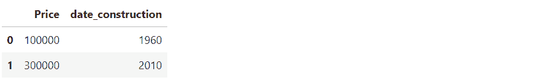

一旦创建了 Dataframe，我们可以检查每列的类型：

```py
type(df.Price),type(df.date_construction)
```

```py
(pandas.core.series.Series, pandas.core.series.Series)
```

应该很清楚，列是类型为 Series 的数据结构。

## 汇总函数

从现在开始，我们将通过使用 [Kaggle](https://www.kaggle.com/competitions/bike-sharing-demand/data) 上的共享单车数据集展示 Pandas 的潜力。我们可以通过以下方式导入 CSV 文件：

```py
df = pd.read_csv('/kaggle/input/bike-sharing-demand/train.csv')
df.head()
```

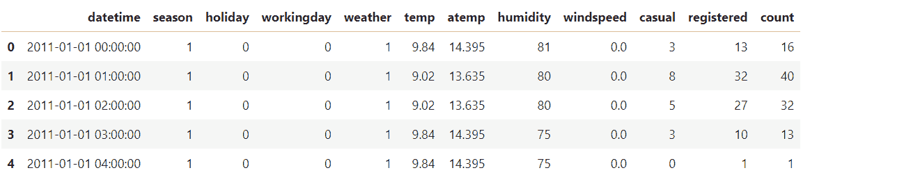

Pandas 不仅允许读取 CSV 文件，还可以读取 Excel 文件、JSON、Parquet 和其他类型的文件。你可以在 [这里](https://pandas.pydata.org/docs/user_guide/io.html) 找到完整的列表。

从输出中，我们可以查看 Dataframe 的前五行。如果我们想显示数据集的最后四行，可以使用 tail() 方法：

```py
df.tail(4)
```

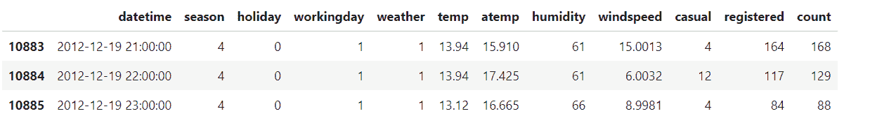

少量的行不足以对我们拥有的数据有一个良好的了解。开始分析的一个好方法是查看数据集的形状：

```py
df.shape                    #(10886, 12)
```

我们有 10886 行和 12 列。你想看看列名吗？这样做非常直观：

```py
df.columns
```

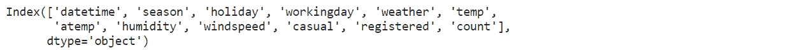

有一个方法可以将所有这些信息可视化为一个独特的输出：

```py
df.info()
```

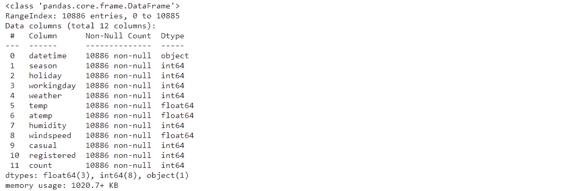

如果我们想显示每列的统计信息，可以使用 describe 方法：

```py
df.describe()
```


从分类字段中提取信息也很重要。我们可以找到季节列的唯一值和唯一值的数量：

```py
df.season.unique(),df.season.nunique()
```

输出：

```py
(array([1, 2, 3, 4]), 4)
```

我们可以看到这些值是 1, 2, 3, 4。然后，有四个可能的值。这个验证对于理解分类变量和防止列中可能存在的噪声至关重要。

要显示每个级别的频率，我们可以使用 value_counts() 方法：

```py
df.season.value_counts()
```

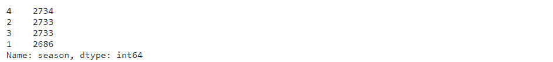

最后一步应该是检查每列中的缺失值：

```py
df.isnull().sum()
```

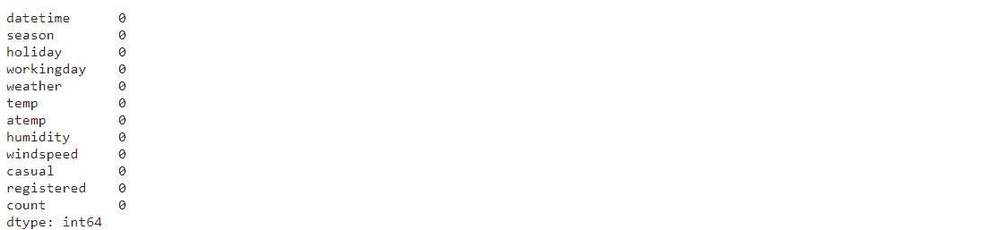

幸运的是，我们在这些字段中没有任何缺失值。

## 索引和切片

像在 NumPy 中一样，可以基于索引选择数据。数据框有两种主要方法来获取条目：

+   iloc 根据整数位置选择元素

+   loc 根据标签或布尔数组来获取项目。

要选择第一行，iloc 是最佳选择：

```py
df.iloc[0]
```

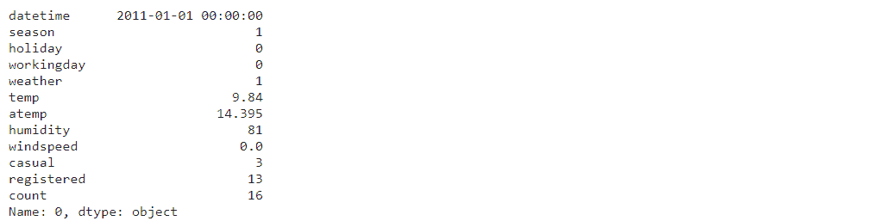

如果我们想选择所有行和仅第二列，可以这样做：

```py
df.iloc[:,1]
```

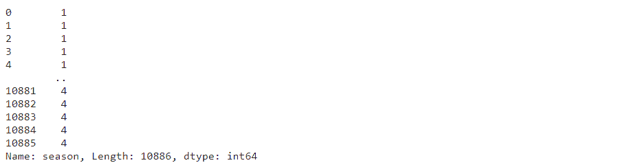

也可以同时选择更多列：

```py
df.iloc[0:3,[0,1,2,5]]
```

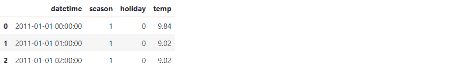

基于索引选择列会变得复杂。指定列名会更好。这可以通过 loc 实现：

```py
df.loc[0:3,['datetime','season','holiday','temp']]
```

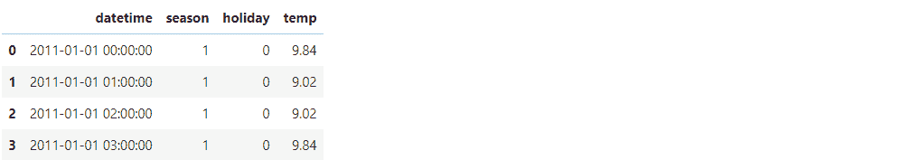

类似于 NumPy，可以根据条件筛选数据框。例如，我们想返回所有天气等于 1 的行：

```py
df[df.weather==1]
```


如果我们想返回特定列的输出，可以使用 loc：

```py
df.loc[df.weather==1,['season','holiday']]
```


## 创建新变量

创建新变量对从数据中提取更多信息和提高可解释性有着巨大的影响。我们可以基于 workingday 的值创建一个新的分类变量：

```py
df['workingday_c'] = df['workingday'].apply(lambda x: 'work' if x==1 else 'relax')
df[['workingday','workingday_c']].head()
```

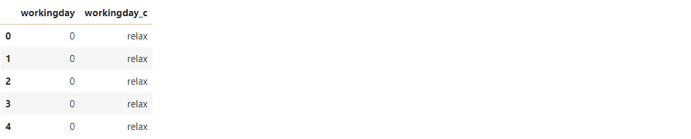

如果有多个条件，最好使用字典和 map 方法来映射这些值：

```py
diz_season = {1:'winter',2:'spring',3:'summer',4:'fall'}
df['season_c'] = df['season'].map(lambda x: diz_season[x])
df[['season','season_c']].head()
```

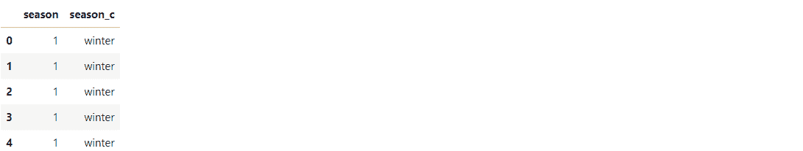

## 分组和排序

你可能希望基于分类列对数据进行分组。这可以通过 groupby 实现：

```py
df.groupby('season_c').agg({'count':['median','max']})
```

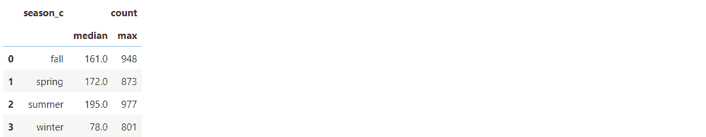

对于每个季节的级别，我们可以观察到租赁自行车的中位数和最大数量。没有基于列排序的情况下，这个输出可能会令人困惑。我们可以使用 sort_values()方法来完成这项工作：

```py
df.groupby('season_c').agg({'count':['median','max']}).reset_index().sort_values(by=('count', 'median'),ascending=False)
```

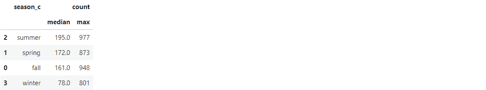

现在，输出更有意义了。我们可以推断出，夏季租赁自行车的数量最高，而冬季则不适合租赁自行车。

# 结束语

就这些了！希望你觉得这份指南对学习 NumPy 和 Pandas 的基础知识有所帮助。它们通常是分开学习的，但理解 NumPy 再学习 Pandas（Pandas 建立在 NumPy 之上）可能会很有启发。

这篇教程中肯定有一些方法没有覆盖，但目标是涵盖这两个库中最重要和最流行的方法。代码可以在 [Kaggle](https://www.kaggle.com/code/eugeniaanello/introduction-to-numpy-and-pandas) 上找到。感谢阅读！祝您有美好的一天！

**[尤金尼亚·安内洛](https://www.linkedin.com/in/eugenia-anello/)** 目前是意大利帕多瓦大学信息工程系的研究员。她的研究项目专注于结合异常检测的持续学习。

### 更多相关内容

+   [超越 NumPy 和 Pandas：解锁鲜为人知的 Python 库的潜力](https://www.kdnuggets.com/2023/08/beyond-numpy-pandas-unlocking-potential-lesserknown-python-libraries.html)

+   [使用 Pandas 进行更高效的数据分析的 NumPy](https://www.kdnuggets.com/numpy-with-pandas-for-more-efficient-data-analysis)

+   [数据科学中的 Pandas 入门](https://www.kdnuggets.com/2020/06/introduction-pandas-data-science.html)

+   [如何使用 [ ], .loc, iloc, .at… 在 Pandas 中选择行和列](https://www.kdnuggets.com/2019/06/select-rows-columns-pandas.html)

+   [10 个 Pandas 一行代码实现数据访问、处理和管理](https://www.kdnuggets.com/2023/01/pandas-one-liners-data-access-manipulation-management.html)

+   [掌握 Pandas 和 Python 数据处理的 7 个步骤](https://www.kdnuggets.com/7-steps-to-mastering-data-wrangling-with-pandas-and-python)
