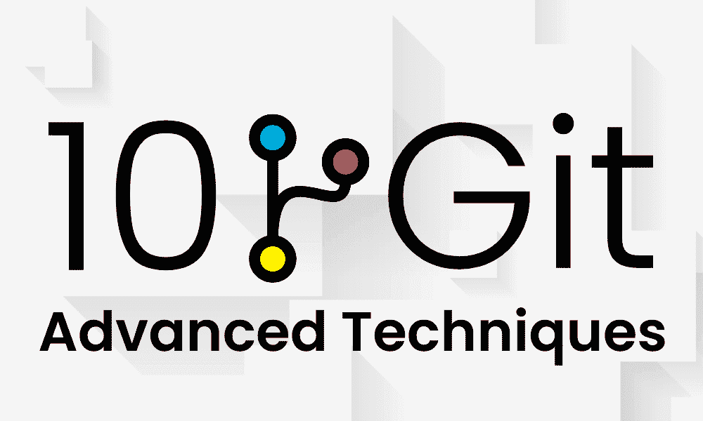
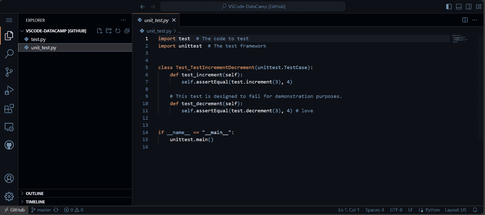
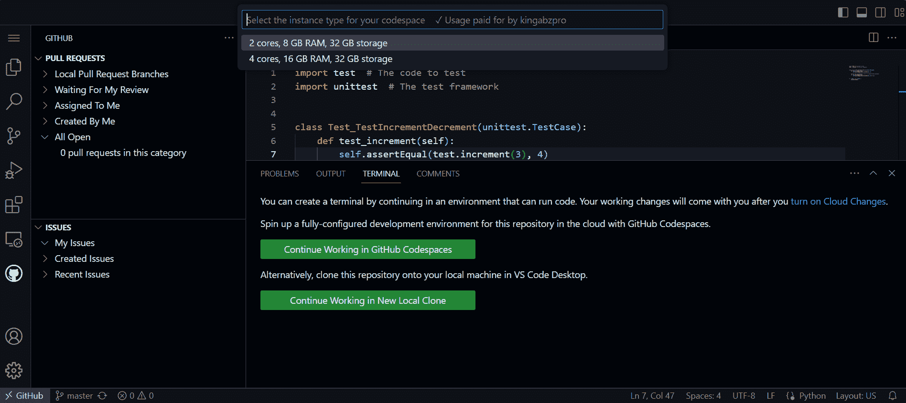
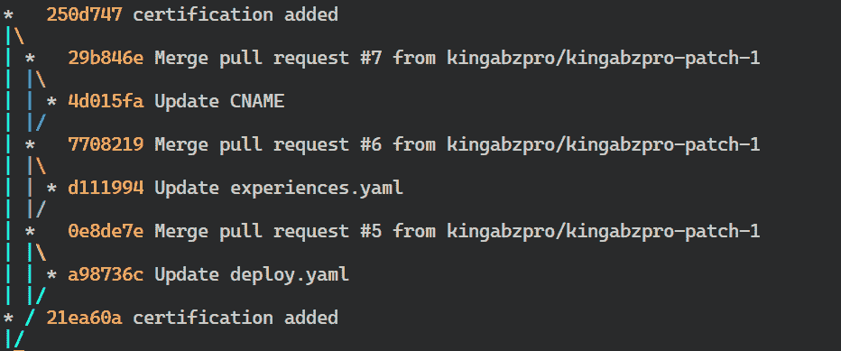

# 10 种高级 Git 技巧

> 原文：[`www.kdnuggets.com/10-advanced-git-techniques`](https://www.kdnuggets.com/10-advanced-git-techniques)



图片来自作者

是否曾想过如何在使用 Git 时在经理面前显得像个专家？在这篇文章中，我们将学习 10 种高级 Git 技巧和快捷方式，使你在版本控制、维护和共享代码时更加高效。

* * *

## 我们的前 3 个课程推荐

 1\. [谷歌网络安全证书](https://www.kdnuggets.com/google-cybersecurity) - 快速进入网络安全职业生涯。

 2\. [谷歌数据分析专业证书](https://www.kdnuggets.com/google-data-analytics) - 提升你的数据分析技能

 3\. [谷歌 IT 支持专业证书](https://www.kdnuggets.com/google-itsupport) - 支持你的组织在 IT 方面

* * *

你可能已经知道了使用 Git 进行提交、推送、拉取和分支的基础知识。但还有许多鲜为人知的命令和功能可以提升你的技能。阅读完这些，你将掌握一些炫酷的技巧，令同事对你的 Git 熟练度刮目相看。

# 1\. 添加 & 提交

你已经多次以这种方式添加和提交文件，但如果我告诉你可以使用 `-am` 标志在一行内完成呢？

```py
$ git add .
$ git commit -m "new project"
```

尝试使用这个命令，它会添加文件更改并使用消息创建提交。

```py
$ git commit -am "new project"
```

```py
[master 17d7675] new project
4 files changed, 2 insertions(+), 1 deletion(-)
```

# 2\. 修改

你可以使用 `--amend` 标志重命名当前的提交信息，并写入新信息。这将帮助你处理意外的提交信息。

```py
$ git commit --amend -m "Love"
```

```py
[master 7b7f891] Love
Date: Mon Jan 22 17:57:58 2024 +0500
4 files changed, 2 insertions(+), 1 deletion(-)
```

你可以在将当前提交推送到远程仓库之前包含额外的更改。为此，你需要添加文件更改，然后使用 `--amend` 标志提交。要保留之前的提交信息，只需使用 `--no-edit` 标志。

```py
$ git add . 
$ git commit --amend --no-edit
```

```py
[master f425059] Love
Date: Mon Jan 22 17:57:58 2024 +0500
6 files changed, 2 insertions(+), 34 deletions(-)
```

# 3\. 覆盖远程历史记录

如果你想推送本地提交并覆盖远程历史记录而不处理解决问题，你可以使用 `--force` 标志。然而，重要的是要注意，使用强制标志并不推荐，应该仅在你完全确定自己的操作时使用。请记住，使用强制标志将重写远程历史记录。

```py
$ git push origin master --force
```

```py
Enumerating objects: 7, **done**.
Counting objects: 100% (7/7), **done**.
Delta compression using up to 16 threads
Compressing objects: 100% (4/4), **done**.
Writing objects: 100% (4/4), 357 bytes | 357.00 KiB/s, **done**.
Total 4 (delta 2), reused 0 (delta 0), pack-reused 0
remote: Resolving deltas: 100% (2/2), completed with 2 local objects.
To https://github.com/kingabzpro/VSCode-DataCamp.git
8f184d5..f425059  master -> master
```

# 4\. 撤销

要在 Git 中撤销一次提交，你可以使用 `revert` 命令。然而，这个命令不会删除任何提交。相反，它会创建一个新提交，撤销原始提交所做的更改。

我们将使用 `log` 命令和 `--oneline` 标志以更简洁的形式查看提交历史。

```py
$ git log --oneline
```

```py
f425059 (HEAD -> master, origin/master) Love
8f184d5 first commit
```

要恢复到以前的提交，我们使用 `git revert` 命令，后面跟上提交 ID。这会创建一个新提交，包含以前提交的更改。

```py
$ git revert 8f184d5
```

# 5\. Codespace

你想提高在 GitHub 上的生产力吗？使用 GitHub Code Spaces，你现在可以直接在浏览器中编辑和运行代码。

要访问此功能，只需导航到你喜欢的仓库，按下键盘上的句点键（“.”），系统将重定向到 VSCode UI。



图片来自作者

你可以对代码进行更改并推送到远程仓库。然而，如果你想在终端中运行代码，你需要在云中运行 Codespace。免费版本提供了一个很好的选项，可以在浏览器中运行你的 Python 代码。这不是很棒吗？我今天才发现这个。



图片来自作者

# 6\. 存储

在处理项目时，你可以将文件添加到暂存区，然后提交以保存当前进度。然而，还有另一种方法可以轻松保存你的工作，那就是使用 `stash` 命令。当你使用 `stash` 时，你可以保存当前进度，而无需将其添加到暂存区或提交。这允许你保存进度并在需要时恢复。

我们将通过提供一个名称并将其存储来保存当前进度。

```py
$ git stash save new-idea
```

```py
Saved working directory and index state On master: new-idea
```

你可以查看你的 stash 列表，并记下对应的索引以便检索。

```py
$ git stash list
```

```py
stash@{0}: On master: new-idea
```

我们的“新想法”存储在索引 0 中。要检索它，请使用以下命令：

```py
$ git stash apply 0
```

```py
On branch master
Your branch is up to date with 'origin/master'.
```

# 7\. 重命名分支

你可以将默认分支名称重命名为更合适的名称。在这种情况下，我们将“master”重命名为“main”。

```py
$ git branch -M main
```


你可以使用以下命令验证更改：

```py
$ git status
```

```py
On branch main
Your branch is up to date with 'origin/master'.
```

# 8\. 装饰日志

如果你想查看当前仓库中所有提交的详细历史记录，你可以使用 `git log` 命令。然而，输出可能难以阅读。为了使其更易读，你可以使用 `graph`、`decorate` 和 `oneline` 标志。这将显示多个分支中的更改及其合并情况。

```py
$ git log --graph --decorate --oneline
```



# 9\. 切换回分支

在多个场合，我已经切换到一个新分支并忘记了之前分支的名称。因此，我不得不使用 `git branch -a` 命令查看分支名称列表。然而，使用 `git checkout` 命令后的破折号“-”有更简单的方法返回到原始分支。

我们将首先创建一个新的 Git 分支“neo”。

```py
$ git branch neo
```

我们将切换到“neo”分支。

```py
$ git checkout neo
```

```py
Switched to branch 'neo'
```

要返回到原始分支，我们将使用以下命令：

```py
$ git checkout -
```

```py
Switched to branch 'main'
```

# 10\. 复制远程更改

我们已经了解了如何覆盖远程仓库。现在，让我们学习如何使用远程仓库覆盖本地仓库。

我们将使用 `fetch` 命令从远程仓库获取最新更改。

```py
$ git fetch origin
```

接下来，我们将使用带有'hard'标志的'reset'命令来用远程版本覆盖任何本地更改。请注意，这将永久丢弃任何本地更改。

```py
$ git reset --hard origin/master
```

```py
HEAD is now at f425059 Love
```

如果仍然有未跟踪的文件，可以使用以下命令将其删除：

```py
$ git clean -df
```

# 结论

我受到 Fireship 的[YouTube 视频](https://www.youtube.com/watch?v=ecK3EnyGD8o&list=WL&index=1)的启发而写了这篇文章。我钦佩创作者能够以简单的方式解释复杂的主题。通过跟随他的方法，我学到了很多关于 Git 的功能。

在本文中，我们介绍了对于从事协作数据项目的数据科学家和软件工程师至关重要的高级 Git 技术。掌握这些技巧可以帮助你避免事故并更快地解决问题。

希望你觉得这个博客有用。如果你希望阅读更多关于数据科学世界中常用工具的简明信息，请告诉我。

[](https://www.polywork.com/kingabzpro)****[Abid Ali Awan](https://www.polywork.com/kingabzpro)**** ([@1abidaliawan](https://www.linkedin.com/in/1abidaliawan)) 是一位认证的数据科学专业人士，热衷于构建机器学习模型。目前，他专注于内容创作，并撰写有关机器学习和数据科学技术的技术博客。Abid 拥有技术管理硕士学位和电信工程学士学位。他的愿景是利用图神经网络构建一种 AI 产品，以帮助面临心理健康问题的学生。

### 相关主题

+   [数据科学家必备的 14 条 Git 命令](https://www.kdnuggets.com/2022/06/14-essential-git-commands-data-scientists.html)

+   [KDnuggets 新闻，10 月 5 日：初学者的顶级免费 Git GUI 客户端 •…](https://www.kdnuggets.com/2022/n39.html)

+   [数据科学的 Git 备忘单](https://www.kdnuggets.com/2022/11/git-data-science-cheatsheet.html)

+   [初学者的顶级免费 Git GUI 客户端](https://www.kdnuggets.com/2022/10/top-free-git-gui-clients-beginners.html)

+   [机器学习模型的高级特征选择技术](https://www.kdnuggets.com/2023/06/advanced-feature-selection-techniques-machine-learning-models.html)

+   [3 种基于研究的高级提示技术以提高 LLM 效率…](https://www.kdnuggets.com/3-research-driven-advanced-prompting-techniques-for-llm-efficiency-and-speed-optimization)
