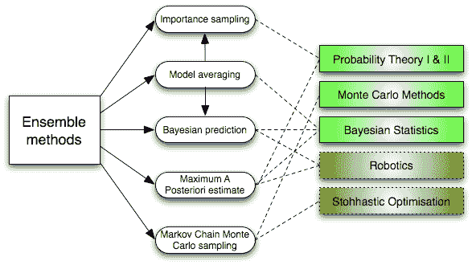
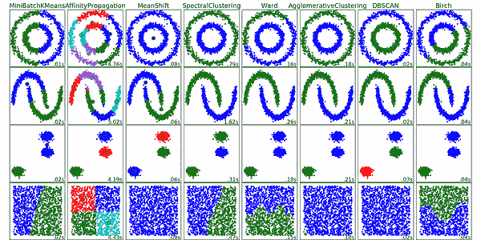
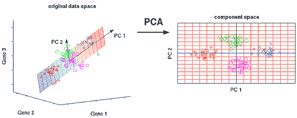
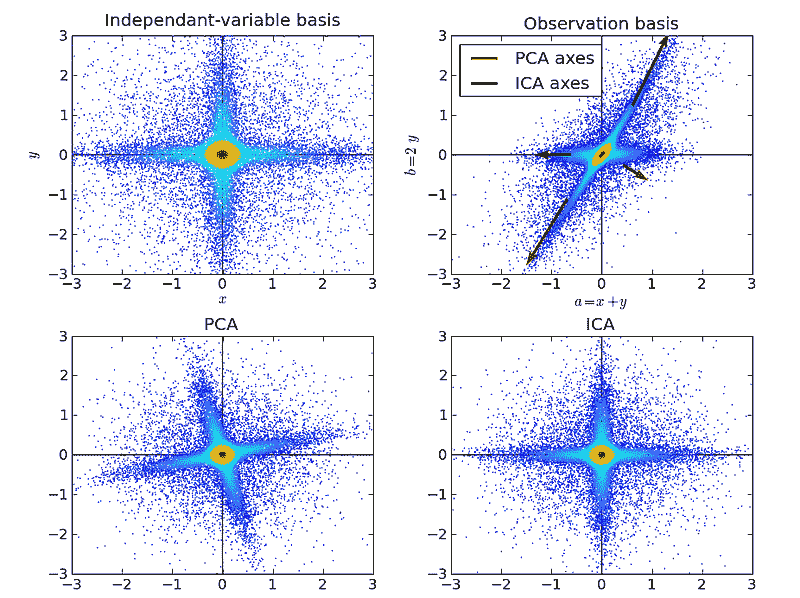

# 机器学习工程师需要了解的 10 种算法

> 原文：[`www.kdnuggets.com/2016/08/10-algorithms-machine-learning-engineers.html/2`](https://www.kdnuggets.com/2016/08/10-algorithms-machine-learning-engineers.html/2)

**6. 集成方法**：

* * *

## 我们的前三名课程推荐

 1\. [谷歌网络安全证书](https://www.kdnuggets.com/google-cybersecurity) - 快速进入网络安全职业轨道

 2\. [谷歌数据分析专业证书](https://www.kdnuggets.com/google-data-analytics) - 提升你的数据分析技能

 3\. [谷歌 IT 支持专业证书](https://www.kdnuggets.com/google-itsupport) - 支持你的组织进行 IT 工作

* * *

集成方法是学习算法，通过构建一组分类器，并通过对它们的预测进行加权投票来对新数据点进行分类。最初的集成方法是贝叶斯平均，但近年来的算法包括错误修正输出编码、袋装法和提升法。

*集成学习机器学习算法*那么集成方法如何工作，它们为什么优于单一模型？

+   它们平衡偏差：如果你将一堆倾向于民主的民调和倾向于共和的民调进行平均，你将得到一个没有倾向于任何一方的平均值。

+   它们减少了方差：一组模型的综合意见比单一模型的意见噪声更少。在金融领域，这被称为多样化——一个包含多只股票的混合投资组合的波动性远低于仅仅一只股票。这就是为什么你的模型在有更多数据点时表现更好，而不是更少数据点。

+   它们不容易过拟合：如果你有一些没有过拟合的个体模型，并且你以简单的方式（如平均、加权平均、逻辑回归）结合每个模型的预测，那么就不会出现过拟合的情况。

## 无监督学习算法

### **7. 聚类算法**：

聚类任务是将一组对象分组，使得同一组（*簇*）中的对象比其他组中的对象更相似。

*聚类算法*每种聚类算法都是不同的，以下是其中的一些：

+   基于质心的算法

+   基于连通性的算法

+   基于密度的算法

+   概率性

+   维度减少

+   神经网络 / 深度学习

### **8. 主成分分析**：

PCA 是一种统计程序，通过使用正交变换，将可能相关变量的观察值转换为称为主成分的线性无关变量的值集合。

*主成分分析* PCA 的一些应用包括压缩、简化数据以便于学习、可视化。注意，在决定是否使用 PCA 时，领域知识非常重要。数据噪声较大的情况下（PCA 的所有成分都有相当高的方差），PCA 不适用。

### **9. 奇异值分解**:

在线性代数中，SVD 是对实复矩阵的分解。对于给定的 *m * n* 矩阵 M，存在一种分解使得 M = UΣV，其中 U 和 V 是单位矩阵，Σ 是对角矩阵。

*奇异值分解* PCA 实际上是 SVD 的一种简单应用。在计算机视觉中，最早的面部识别机器学习算法使用 PCA 和 SVD 将面部表示为“特征脸”的线性组合，进行降维，然后通过简单的方法匹配面部身份；尽管现代方法更为复杂，但许多方法仍然依赖于类似的技术。

### **10. 独立成分分析**:

ICA 是一种统计技术，用于揭示隐藏在一组随机变量、测量值或信号背后的因素。ICA 为观察到的多变量数据定义了生成模型，这些数据通常以大型样本数据库的形式提供。

在模型中，数据变量被假设为某些未知潜在变量的线性混合，且混合系统也是未知的。潜在变量被假设为非高斯且相互独立，它们被称为观察数据的独立成分。

*独立成分分析* ICA 与 PCA 相关，但它是一种更强大的技术，能够在这些经典方法完全失败时找到来源的潜在因素。其应用包括数字图像、文档数据库、经济指标和心理测量。

现在，运用你对 AI 算法的理解，创建更好的机器学习应用，改善人们的体验。

**简介: [James Le](https://www.linkedin.com/in/khanhnamle94)** 是 New Story Charity 的产品实习生，同时也是 Denison University 的计算机科学与通信专业学生。

[原文](https://gab41.lab41.org/the-10-algorithms-machine-learning-engineers-need-to-know-f4bb63f5b2fa)。经许可转载。

**相关:**

+   AI、大数据和数据科学的 10 种算法类别

+   前 10 大数据挖掘算法，详解

+   机器学习关键术语，详解

### 相关主题

+   [建立一个稳固的数据团队](https://www.kdnuggets.com/2021/12/build-solid-data-team.html)

+   [使用管道编写干净的 Python 代码](https://www.kdnuggets.com/2021/12/write-clean-python-code-pipes.html)

+   [每个数据科学家都应该知道的三个 R 库（即使你使用 Python）](https://www.kdnuggets.com/2021/12/three-r-libraries-every-data-scientist-know-even-python.html)

+   [我们不需要数据科学家，我们需要数据工程师](https://www.kdnuggets.com/2021/02/dont-need-data-scientists-need-data-engineers.html)

+   [停止学习数据科学以寻找目标，并寻找目标来……](https://www.kdnuggets.com/2021/12/stop-learning-data-science-find-purpose.html)

+   [学习数据科学的统计学顶级资源](https://www.kdnuggets.com/2021/12/springboard-top-resources-learn-data-science-statistics.html)
