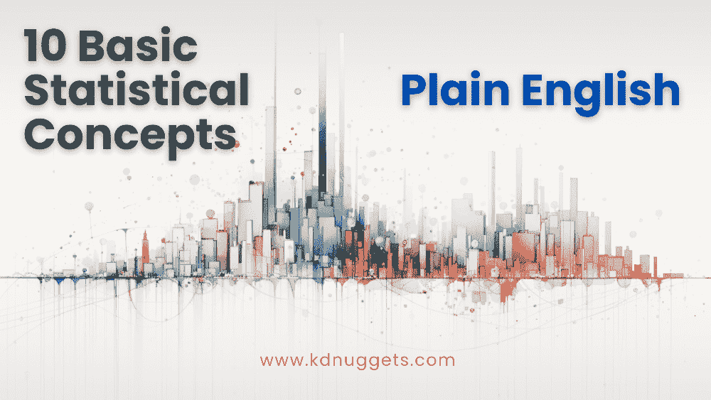

# 10 个基础统计概念简明易懂

> 原文：[`www.kdnuggets.com/10-basic-statistical-concepts-in-plain-english`](https://www.kdnuggets.com/10-basic-statistical-concepts-in-plain-english)

图片来源：作者

统计学在数据科学、商业、社会科学等众多领域中发挥着关键作用。然而，许多基础统计概念对于没有强数学背景的初学者来说可能显得复杂和令人生畏。本文将用简单、非技术性的术语介绍 10 个基础统计概念，旨在以易于理解的方式传达这些概念。

* * *

## 我们的前三个课程推荐

 1\. [谷歌网络安全证书](https://www.kdnuggets.com/google-cybersecurity) - 快速通道进入网络安全职业生涯。

 2\. [谷歌数据分析专业证书](https://www.kdnuggets.com/google-data-analytics) - 提升您的数据分析技能

 3\. [谷歌 IT 支持专业证书](https://www.kdnuggets.com/google-itsupport) - 支持您的组织的 IT 需求

* * *

# 1\. 概率分布

概率分布显示了在一个过程中不同结果发生的可能性。例如，假设我们有一个袋子，里面有相等数量的红色、蓝色和绿色玻璃珠。如果我们随机抽取玻璃珠，概率分布会告诉我们抽到每种颜色的几率。它会显示出得到红色、蓝色或绿色的机会都是相等的 1/3，即 33%的概率。许多现实世界的数据往往可以使用已知的概率分布进行建模，尽管这并非总是如此。

# 2\. 假设检验

假设检验允许我们基于数据做出声明，类似于法庭审判旨在根据现有证据证明罪或无罪。我们从一个假设或声明开始，称为原假设。然后我们检查观察到的数据是否支持或反驳这个声明，并在一定的置信水平内进行判断。例如，一家制药公司可能声称他们的新药比现有药物更快缓解疼痛。研究人员可以通过分析临床试验结果来测试这一声明。根据数据，他们可以在证据不足的情况下拒绝这一声明，或者无法拒绝原假设，表明没有足够的证据证明新药不会更快缓解疼痛。

# 3\. 置信区间

-   当从总体中抽取数据时，置信区间提供了一个值的范围，在这个范围内我们可以合理地确定总体的真实均值所在。例如，如果我们说一个国家的男性平均身高是 172 厘米，95%的置信区间为 170 厘米到 174 厘米，那么我们有 95%的信心认为所有男性的平均身高在 170 厘米到 174 厘米之间。通常，置信区间随着样本量的增大而变小，假设其他因素如变异性保持不变。

# 4\. 回归分析

-   回归分析帮助我们理解一个变量的变化如何影响另一个变量。例如，我们可以分析数据来查看广告支出如何影响销售。回归方程量化了这种关系，使我们能够基于预计的广告支出来预测未来的销售情况。在两个变量之外，多重回归包括多个解释变量，以隔离它们对结果变量的个别影响。

# 5\. 方差分析（ANOVA）

-   方差分析（ANOVA）让我们比较多个组的均值，以查看它们是否存在显著差异。例如，零售商可能会测试三种包装设计的客户满意度。通过分析调查评分，ANOVA 可以确认三组之间的满意度是否有所不同。如果存在差异，说明并非所有设计都能带来相同的满意度。这一洞察有助于选择最佳包装。

# 6\. P 值

-   P 值指示在假设零假设为真的情况下，获得至少与观察数据一样极端结果的概率。较小的 P 值提供了强有力的证据来反对零假设，因此你可以考虑拒绝零假设，支持备择假设。回到临床试验的例子，当比较新药与标准药物的止痛效果时，较小的 P 值表明新药确实有更快的作用。

# 7\. 贝叶斯统计

-   频率统计仅依赖数据，而贝叶斯统计则结合了现有信念和新的证据。随着我们获取更多数据，我们更新我们的信念。例如，假设根据预测今天降雨的概率是 50%。如果我们随后发现天空中有乌云，贝叶斯定理告诉我们如何基于新的证据将这一概率更新为 70%。贝叶斯方法计算上可能较为复杂，但在数据科学的某些方面颇受欢迎。

# 8\. 标准差

-   标准差量化了数据与均值的离散程度。低标准差意味着数据点集中在均值附近，而高标准差表示更大的变异。例如，85、88、89、90 的测试分数的标准差低于 60、75、90、100 的分数。标准差在统计学中非常有用，并且是许多分析的基础。

# 9\. 相关系数

相关系数测量两个变量线性关系的强度，从 -1 到 +1。接近 +/-1 的值表示强相关，而接近 0 的值则表示弱相关。例如，我们可以计算房屋面积和价格之间的相关性。强正相关意味着较大的房屋往往有更高的价格。需要注意的是，尽管相关性衡量了关系，但它并不意味着一个变量导致另一个变量的发生。大家一起：*相关性不意味着因果关系！*

# 10\. 中心极限定理

中心极限定理在样本量大时更为准确，它表明当我们从一个总体中抽取样本并计算样本均值时，这些均值遵循正态分布模式，无论原始分布如何。例如，如果我们对一组人的电影偏好进行调查，绘制每组的平均值并重复这一过程，这些平均值会形成一个钟形曲线，即使个体意见各异。

理解统计概念提供了一个分析的视角，通过这个视角我们可以开始解读数据，从而做出明智的、基于证据的决策。不论是在数据科学、商业、学校还是我们的日常生活中，统计学都是一套强大的工具，可以为我们提供关于世界如何运作的看似无尽的洞察。我希望这篇文章能够为你提供这些概念的直观而全面的介绍。

****[马修·梅奥](https://www.kdnuggets.com/wp-content/uploads/./profile-pic.jpg)**** ([**@mattmayo13**](https://twitter.com/mattmayo13)) 拥有计算机科学硕士学位和数据挖掘研究生文凭。作为[KDnuggets](https://www.kdnuggets.com/)和[Statology](https://www.statology.org/)的主编，以及[Machine Learning Mastery](https://machinelearningmastery.com/)的贡献编辑，马修旨在让复杂的数据科学概念变得易于理解。他的职业兴趣包括自然语言处理、语言模型、机器学习算法以及探索新兴人工智能。他的使命是让数据科学社区的知识普及化。马修从 6 岁开始编程。

### 更多相关话题

+   [数据科学的 8 个基础统计概念](https://www.kdnuggets.com/2020/06/8-basic-statistics-concepts.html)

+   [基础知识回顾第 2 周：数据库、SQL、数据管理及其他](https://www.kdnuggets.com/back-to-basics-week-2-database-sql-data-management-and-statistical-concepts)

+   [你应该了解的 5 个梯度下降和成本函数概念](https://www.kdnuggets.com/2020/05/5-concepts-gradient-descent-cost-function.html)

+   [你在了解 Transformers 之前应该知道的概念](https://www.kdnuggets.com/2023/01/concepts-know-getting-transformer.html)

+   [那些不那么性感但能让你脱颖而出的 SQL 概念](https://www.kdnuggets.com/2022/02/not-so-sexy-sql-concepts-stand-out.html)

+   [数据科学中你应该知道的 7 个 SQL 概念](https://www.kdnuggets.com/2022/11/7-sql-concepts-needed-data-science.html)
