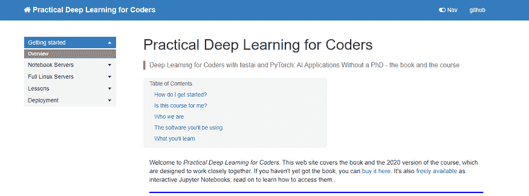
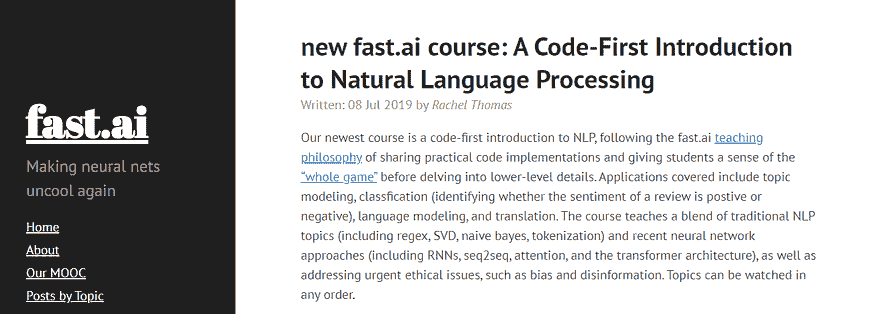
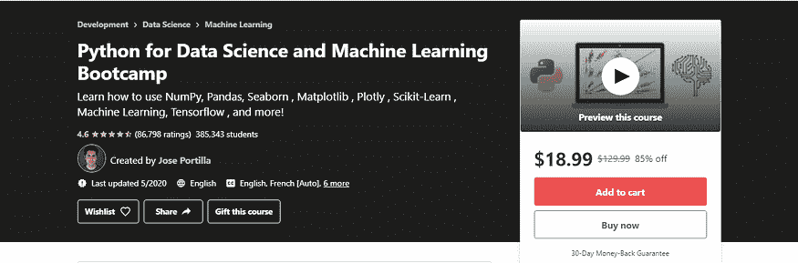
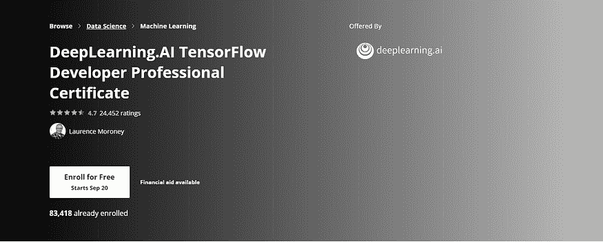
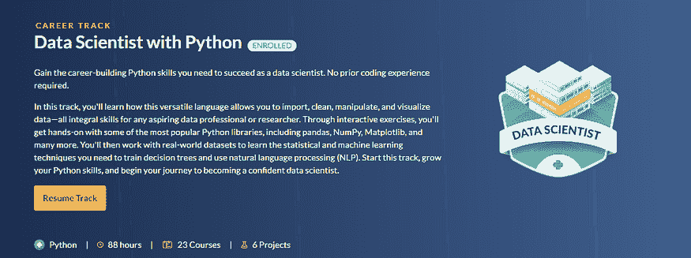
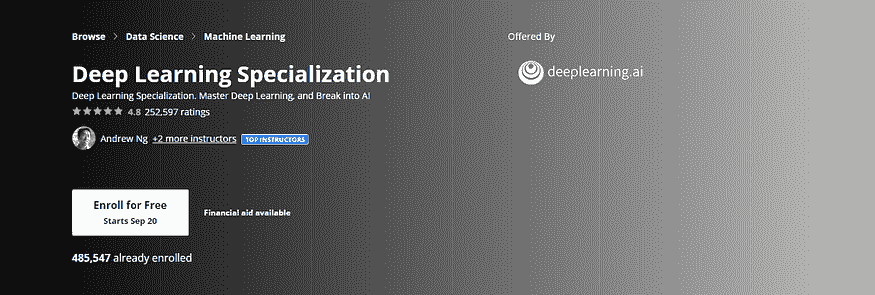
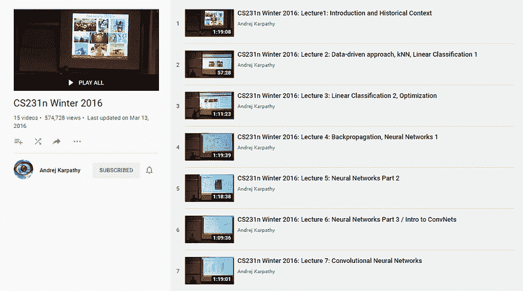
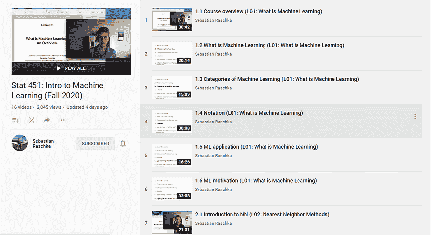
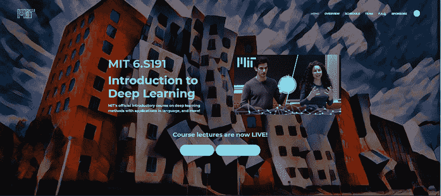

# 2020 年最佳机器学习课程

> 原文：[`www.kdnuggets.com/2020/10/10-best-machine-learning-courses-2020.html`](https://www.kdnuggets.com/2020/10/10-best-machine-learning-courses-2020.html)

评论

**由 [Ahmad Bin Shafiq](https://medium.com/@ahmadbinshafiq)，机器学习学生**。

*照片由 [Photos Hobby](https://unsplash.com/@photoshobby?utm_source=medium&utm_medium=referral) 提供，来自 [Unsplash](https://unsplash.com/?utm_source=medium&utm_medium=referral)。*

### 实用/动手课程，理论较少

**1) [面向编码者的实用深度学习 FAST.AI](https://course.fast.ai/)**

**价格：** 免费

**授课教师：** 这是互联网上最著名和实用的课程之一，由杰里米·霍华德（Jeremy Howard）教授，他是旧金山大学的研究科学家，[WAMRI](https://wamri.ai/)主席，还是 platform.ai 的首席科学家。他曾是数据科学平台 [Kaggle](https://www.kaggle.com/) 的总统和首席科学家，并连续两年在国际机器学习竞赛中排名第一。

**课程成果：** 该课程是深度学习的动手入门，你将直接通过构建最先进的分类器来深入学习深度学习。你将学习许多深度学习的实际方面，而无需了解其底层理论。

**2) [Fast.ai 的自然语言处理代码优先入门](https://www.fast.ai/2019/07/08/fastai-nlp/)**

**价格：** 免费

**授课教师：** [Rachel Thomas](https://www.youtube.com/channel/UC_pSCYWbMn4JcsxbWOzkgEQ) 是美国计算机科学家，旧金山大学应用数据伦理中心的创始主任。她与杰里米·霍华德共同创立了 fast.ai。

**课程成果：** 本课程是 NLP 的动手入门，你将首先根据课程名称编码一个实用的 NLP 应用，然后逐渐深入理解其底层理论。

涵盖的应用包括主题建模、分类（识别评论的情感是正面还是负面）、语言建模和翻译。课程讲授传统 NLP 主题（包括正则表达式、SVD、朴素贝叶斯、分词）和近期的神经网络方法（包括 RNN、seq2seq、注意力机制和变换器架构），并且涉及紧迫的伦理问题，如偏见和虚假信息。

**3) [数据科学与机器学习 Python 训练营](https://www.udemy.com/course/python-for-data-science-and-machine-learning-bootcamp/)**

**价格：** $129（促销价 $10-$20）

**讲师：**Jose Marcial Portilla 拥有圣克拉拉大学的机械工程学士和硕士学位，并在数据科学和编程领域有多年的专业讲师和培训师经验。他在微流体学、材料科学和数据科学技术等领域有出版物和专利。

**评分：**4.6*

**课程成果：**本课程是对机器学习和数据科学的非常实用的介绍。它不假设任何先前的知识，从教授基础的 Python 到 Numpy Pandas 开始，然后教授使用 Python 的机器学习，通过 scikit-learn 进行学习，接着涉及自然语言处理和 Tensorflow，以及通过 Spark 进行大数据处理。

这绝对是最好的课程之一，因为 Jose 是一位非常优秀的讲师。

**4) [DeepLearning.AI TensorFlow 开发者专业证书](https://www.coursera.org/professional-certificates/tensorflow-in-practice)**

**价格：**$49/月

**讲师：**[Laurence Moroney](https://www.coursera.org/professional-certificates/tensorflow-in-practice#instructors) 是 Google 的开发者倡导者，专注于使用 TensorFlow 进行人工智能工作。他也是许多书籍的作者。

**评分：**4.7*

**课程成果：**在这个动手实践的四课程专业证书项目中，你将学习使用 TensorFlow 构建可扩展的 AI 驱动应用程序所需的工具。Lawrence 将从 TensorFlow 的基础知识开始教学，逐步进展到使用 TensorFlow 的前沿应用。

**5) [数据营数据科学路径](https://www.datacamp.com/tracks/data-scientist-with-python)**

**价格：**$25/月或$300/年

**讲师：**多位行业专家

**课程成果：**即使没有编程基础，你也会从零开始学习编程，然后逐步掌握高级库和框架。每节课都有一些练习或任务。此外，你还可以访问数据营的项目，这将提升你的编程经验和简历。

### 理论课程较少实际操作

**1) [斯坦福大学的机器学习课程](https://coursera.org/learn/machine-learning/)**

**价格：**$80

**讲师：**Andrew Ng 是 Landing AI 的 CEO/创始人；Coursera 的联合创始人；斯坦福大学的兼职教授；曾任百度首席科学家，并且是 Google Brain 的创始首席。

**评分：**4.9

**课程成果：**你将学习所有著名机器学习算法的基础理论，从监督学习到无监督学习。你还将有机会在 MATLAB/Octave 中从零开始编写这些算法。

**2) [深度学习专业化课程](https://www.coursera.org/specializations/deep-learning)**

**价格：**$49/月

**讲师：**Andrew Ng

**评分：**4.8*

**课程成果：** 这门五部分的专业课程将教你深度学习的基本理论，从单层网络到多层密集网络，从 CNN 的基础知识到使用 YOLO 进行目标检测的理论，从 RNN 的基础知识到情感分析。

本课程还将介绍诸如 Tensorflow 或 Keras 等深度学习框架的基础知识。

**3) [CS231n by Andrej Karpathy](https://www.youtube.com/watch?v=NfnWJUyUJYU&list=PLkt2uSq6rBVctENoVBg1TpCC7OQi31AlC&ab_channel=AndrejKarpathy)**

**价格：** 免费

**授课教师：** **Andrej Karpathy**，特斯拉的 AI 高级总监，领导负责自动驾驶系统中所有神经网络的团队。他曾是 [OpenAI](http://openai.com/) 的研究科学家，专注于计算机视觉中的深度学习、生成建模和强化学习。他获得了斯坦福大学的博士学位。

**课程成果：** 本课程深入探讨了深度学习架构的细节，重点学习这些任务的端到端模型，特别是图像分类。学生将学习实现、训练和调试自己的神经网络，并深入了解计算机视觉领域的前沿研究。重点是教会如何设置图像识别问题、学习算法（例如反向传播）、训练的实用工程技巧以及网络的微调。

**4) [Stat 451: Introduction to Machine Learning](https://www.youtube.com/watch?v=OgK8JFjkSto&list=PLTKMiZHVd_2KyGirGEvKlniaWeLOHhUF3&ab_channel=SebastianRaschka)**

**价格：** 免费

**授课教师：** [Sebastian Raschka](https://www.youtube.com/channel/UC_CzsS7UTjcxJ-xXp1ftxtA) 是威斯康星大学麦迪逊分校的统计学助理教授，专注于机器学习和深度学习研究。

**课程成果：** 你将学习所有著名机器学习算法的基本理论，从神经网络到监督学习和无监督学习。

本课程最初由 Sebastian 博士在威斯康星大学麦迪逊分校授课。

**5) [MIT Introduction to Deep Learning | 6.S191](http://introtodeeplearning.com/)**

**价格：** 免费

**授课教师：** Ava Soleimany 是哈佛大学生物物理学博士生，同时在麻省理工学院工作，与 Sangeeta Bhatia 一起在 Koch Integrative Cancer Research Institute 工作，并获得 NSF 研究生奖学金的资助。

Alexander Amini 是麻省理工学院的博士生，隶属于 [计算机科学与人工智能实验室（CSAIL）](http://www.csail.mit.edu/)，与 [Prof. Daniela Rus](http://danielarus.csail.mit.edu/) 一起工作。他是 NSF 奖学金获得者，并在麻省理工学院完成了电气工程与计算机科学的学士和硕士学位，辅修数学。

**课程成果：**6.S191 是 MIT 官方的深度学习方法入门课程，应用于计算机视觉、自然语言处理、生物学等领域！学生将获得深度学习算法的基础知识。

学生还将获得在 TensorFlow 中构建神经网络的实践经验。

**相关：**

+   [成为更优秀数据科学家必须参加的在线课程](https://www.kdnuggets.com/2020/09/online-courses-better-data-scientist.html)

+   [顶尖大学的人工智能、数据科学、机器学习在线证书/课程](https://www.kdnuggets.com/2020/09/online-certificates-ai-data-science-machine-learning-top.html)

+   [从零开始的机器学习：免费在线教材](https://www.kdnuggets.com/2020/09/machine-learning-from-scratch-free-online-textbook.html)

* * *

## 我们的前三大课程推荐

 1\. [谷歌网络安全证书](https://www.kdnuggets.com/google-cybersecurity) - 快速进入网络安全职业轨道。

 2\. [谷歌数据分析专业证书](https://www.kdnuggets.com/google-data-analytics) - 提升你的数据分析技能

 3\. [谷歌 IT 支持专业证书](https://www.kdnuggets.com/google-itsupport) - 支持组织的 IT

* * *

### 了解更多主题

+   [2021 年最佳 ETL 工具](https://www.kdnuggets.com/2021/12/mozart-best-etl-tools-2021.html)

+   [成为优秀数据科学家所需的 5 项关键技能](https://www.kdnuggets.com/2021/12/5-key-skills-needed-become-great-data-scientist.html)

+   [每个初学者数据科学家应掌握的 6 种预测模型](https://www.kdnuggets.com/2021/12/6-predictive-models-every-beginner-data-scientist-master.html)

+   [停止学习数据科学以寻找目的，并寻找目的以…](https://www.kdnuggets.com/2021/12/stop-learning-data-science-find-purpose.html)

+   [数据科学统计学习的最佳资源](https://www.kdnuggets.com/2021/12/springboard-top-resources-learn-data-science-statistics.html)

+   [成功数据科学家的 5 个特征](https://www.kdnuggets.com/2021/12/5-characteristics-successful-data-scientist.html)
