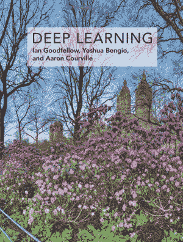
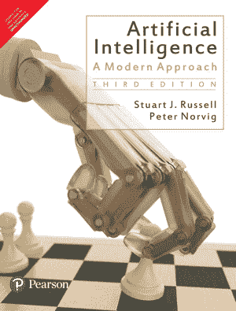
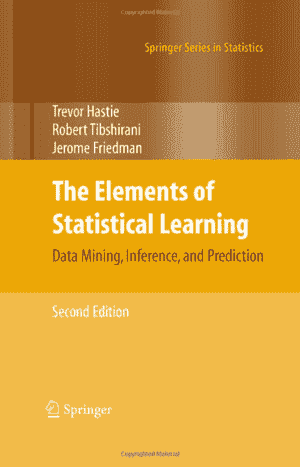
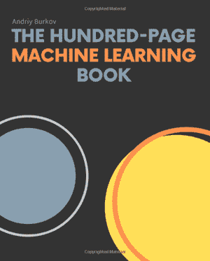
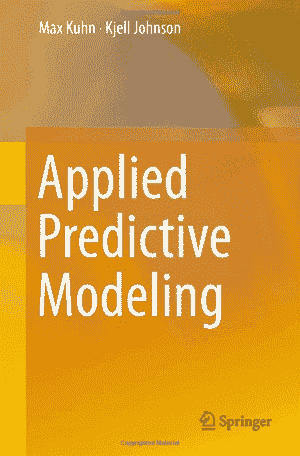
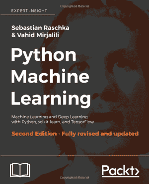
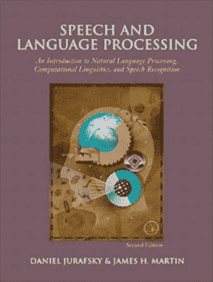

# 数据科学家必读的 10 本最佳机器学习教科书

> 原文：[`www.kdnuggets.com/2020/04/10-best-machine-learning-textbooks-data-scientists.html`](https://www.kdnuggets.com/2020/04/10-best-machine-learning-textbooks-data-scientists.html)

评论

**作者：[Daniel Smith](https://lionbridge.ai/articles/)，Lionbridge**

* * *

## 我们的前三大课程推荐

 1\. [Google 网络安全证书](https://www.kdnuggets.com/google-cybersecurity) - 快速进入网络安全职业。

 2\. [Google 数据分析专业证书](https://www.kdnuggets.com/google-data-analytics) - 提升你的数据分析技能

 3\. [Google IT 支持专业证书](https://www.kdnuggets.com/google-itsupport) - 支持你的组织的 IT 工作

* * *

机器学习作为一个首次接触的主题可能令人畏惧。这个术语涵盖了许多领域、研究主题和商业用例，可能很难知道从哪里开始。为了解决这个问题，通常可以转向介绍新研究领域基本原理的教科书。这对于人工智能和机器学习尤为适用，特别是如果你有统计或编程背景时。与我们*介绍训练数据*的在线文章配合使用，它们可以成为学习和成长的强大工具之一。

在本文中，我们将展示一些该领域最好的教科书。这些教科书在大学课程中被频繁使用，且受到教授和工程师的推荐，为你提供了对人工智能广阔世界的经验证介绍。即使你在机器学习方面有丰富经验，翻阅这些教科书也能让你得到很好的复习。毕竟，总有新的知识值得学习。

**深度学习**

Ian Goodfellow、Yoshua Bengio 和 Aaron Courville

**ISBN：** 978-0262035613

**购买本书：**在 Amazon [这里](https://www.amazon.com/dp/0262035618/)，或在[这里](https://www.deeplearningbook.org/)免费阅读全文。

在深度学习方面，这本书是最好的入门选择。这本全面的教科书提供了你开始自己工作的所需的一般知识和数学基础。*Deep Learning*得到了机器学习领域众多知名人士的认可，从 Geoffrey Hinton 到 Yann LeCun，它包含了对研究和工业领域的有用信息。

**人工智能：现代方法**

Stuart J. Russell 和 Peter Norvig

**ISBN:** 978-9332543515

**购买本书：** 在 Amazon 上[这里](https://www.amazon.com/Artificial-Intelligence-Approach-Stuart-Russell/dp/9332543518/)。

Russell 和 Norvig 的书是众多大学级人工智能课程的基石。特别适合初学者，*人工智能*提供了对该领域的全面介绍和几个关键研究主题的概述，逐步讲解了智能体如何做出决策，并深入解释了神经网络。如果你只拥有一本关于人工智能的书，这本就是你需要的。

**统计学习要素：数据挖掘、推断与预测**

Trevor Hastie, Robert Tibshirani, 和 Jerome Friedman

**ISBN:** 978-0387848570

**购买本书：** 在 Amazon 上[这里](https://www.amazon.com/dp/0387848576?)。

一直以来深受机器学习爱好者的喜爱

### 发现我们如何改进你的模型

e 学习社区，*统计学习要素*在其概念框架内涵盖了广泛的主题。它既可以作为神经网络、随机森林和测试方法等主题的入门书，也可以作为参考书。然而，这本书也以一种鼓励读者自己探索的风格编写。通过这种方式，它不仅是一本介绍书，还鼓励技能的发展，这对未来的机器学习职业生涯非常有用。最新版本于 2013 年发布。

**百页机器学习书**

Andriy Burkov

**ISBN:** 978-1999579500

**购买本书：** 在 Amazon 上[这里](https://www.amazon.com/Hundred-Page-Machine-Learning-Book/dp/199957950X/)，或在书籍网站上阅读各种章节的扩展版本[这里](http://themlbook.com/wiki/doku.php)。

这个项目始于对作者的 LinkedIn 挑战，后来发展成了一本机器学习畅销书。正如书名所示，它是目前市面上最简明的领域介绍之一。然而，Burkov 没有回避必要的数学，将理论和实践挤进了极小的平装本中。凭借其广泛的话题覆盖和机器学习领域思想领袖的推荐，这本短小的书应该出现在所有机器学习新手的书架上。

**模式识别与机器学习**

Christopher M. Bishop

**ISBN:** 978-0387310732

**购买本书：** 在 Amazon 上[这里](https://www.amazon.com/dp/0387310738?)。

Bishop 的书自 2006 年首次出版以来一直是重要的大学教材。尽管它假设读者已具备一定的线性代数和多变量微积分知识，但它是希望理解机器学习背后统计技术的任何人的关键参考点。书中还包括一个测试和大量问题，以巩固你所学到的知识。

**应用预测建模**

Max Kuhn 和 Kjell Johnson

**ISBN：** 978-1461468486

**购买书籍：** 在亚马逊上[这里](https://www.amazon.com/dp/1461468485?)。

Kuhn 和 Johnson 的书对于任何希望了解预测模型和建模过程的学生或开发人员来说都是一个很好的选择。它从头开始覆盖预测建模过程，从数据预处理开始，逐步讲解回归和分类技术。它专注于解决实际问题，使用动手示例，并为每个阶段提供相应的 R 代码。书中每章还包含一系列问题，旨在帮助读者应用所学知识。

**机器学习**

Tom M. Mitchell

**ISBN：** 978-0070428072

**购买书籍：** 在亚马逊上[这里](https://www.amazon.com/dp/0070428077?)，或阅读可能的第二版草稿[这里](http://www.cs.cmu.edu/~tom/NewChapters.html)。

*机器学习*是一本简明的文本，为机器学习基础提供了很好的介绍。从神经网络到贝叶斯学习，Mitchell 以较高的水平解释了各种概念和算法。虽然它不包含太多教程或实现建议，但它应能为你提供一个坚实的基础，以便进行更深入的研究。

**Python 机器学习**

Sebastian Raschka 和 Vahid Mirjalili

**ISBN：** 978-1783555130

**购买书籍：** 在亚马逊上[这里](https://www.amazon.com/Python-Machine-Learning-scikit-learn-TensorFlow/dp/1787125939/)。

对于那些希望直接进入编程的人，语言特定的机器学习介绍可能非常有用。*Python 机器学习*是对这一主题进行更技术性介绍的绝佳选择。该书解释了如何实现一系列流行的机器学习算法，特别关注使用 scikit-learn 进行实现。这是那些希望提高算法开发理解的人的绝佳选择。

**动手实践机器学习与 Scikit-Learn 和 TensorFlow：构建智能系统的概念、工具和技术**

Aurélien Géron

**ISBN：** 978-1491962299

**购买书籍：** 在亚马逊上[这里](https://www.amazon.com/Hands-Machine-Learning-Scikit-Learn-TensorFlow/dp/1491962291)。

这本实用的书籍专注于教程序员如何使用 scikit-learn 和 TensorFlow 框架来实现机器学习程序。Géron 的解释依靠实例和练习，帮助你学习从线性回归到深度神经网络的一系列技术。虽然理论较少，但如果你的主要目标是快速直观地学习如何构建自己的机器学习算法，这本书是值得寻找的绝佳选择。

**Speech and Language Processing**

丹尼尔·朱拉夫斯基 和 詹姆斯·H·马丁

**ISBN:** 978-0131873216

**购买书籍**: 在亚马逊 [这里](https://www.amazon.com/Speech-Language-Processing-Daniel-Jurafsky/dp/0131873210)。

对于那些有一点基础知识的人，还有一些很棒的教科书可以提供对特定机器学习领域的全面介绍。如果这是你的目标，我们推荐《*Speech and Language Processing*》。这本书被多位专家推荐，是任何对自然语言处理感兴趣的人的信息宝库。它涵盖了语言技术的广泛领域，将传统上各不相同的课程中的理念加以统一。重点介绍实际应用，这本书是了解语音和语言处理可能性的绝佳入门书籍。

通过阅读这些教科书的组合，你一定能建立起扎实的机器学习知识基础，并形成一个可以反复查阅的参考资料库。即使你只读了一本，所取得的进展也会激励你继续学习、提升和产生影响。

一旦你准备好并能够创建自己的机器学习算法，千万不要忘记数据对于你项目的成功至关重要。从图像标注到本体创建，Lionbridge 是一个经验丰富的数据提供商，为需要可信数据集的研究人员、工程师和企业提供服务。对于全面的标注和可靠的基础数据，请依赖我们处理你的所有标注需求。

### 了解我们如何改善你的模型

### [立即联系我们](https://lionbridge.ai/contact-sales/)

**个人简介**: **[丹尼尔·史密斯](https://lionbridge.ai/articles/)** 是 Lionbridge 网站营销团队的一员，撰写各种内容。

[原文](https://lionbridge.ai/articles/10-best-machine-learning-textbooks-all-data-scientists-should-read/)。经许可转载。

**相关内容:**

+   10 篇必读的机器学习文章（2020 年 3 月）

+   24 本最佳（且免费的）理解机器学习的书籍

+   每位数据科学家都应该阅读的 5 篇关于 CNN 的论文

### 更多相关话题

+   [教材是你所需的一切：一种革命性的 AI 培训方法](https://www.kdnuggets.com/2023/07/textbooks-all-you-need-revolutionary-approach-ai-training.html)

+   [你应该阅读的生成代理研究论文](https://www.kdnuggets.com/generative-agent-research-papers-you-should-read)

+   [2022 年你需要阅读的机器学习书籍](https://www.kdnuggets.com/2022/04/machine-learning-books-need-read-2022.html)

+   [KDnuggets 新闻，4 月 27 日：论文与代码的简要介绍；…](https://www.kdnuggets.com/2022/n17.html)

+   [2023 年值得阅读的顶级机器学习论文](https://www.kdnuggets.com/2023/03/top-machine-learning-papers-read-2023.html)

+   [2024 年值得阅读的 5 篇机器学习论文](https://www.kdnuggets.com/5-machine-learning-papers-to-read-in-2024)
