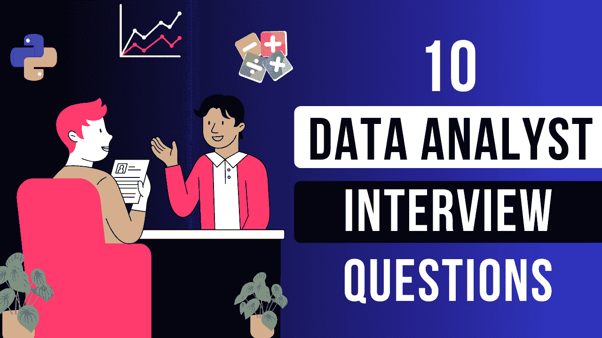

# 2024 年数据分析师面试问题

> 原文：[`www.kdnuggets.com/10-data-analyst-interview-questions-to-land-a-job-in-2024`](https://www.kdnuggets.com/10-data-analyst-interview-questions-to-land-a-job-in-2024)

作者提供的图片

作为一个初级数据分析师候选人，求职过程可能会感觉像是一个无休止的过程。

* * *

## 我们的三大课程推荐

 1\. [Google 网络安全证书](https://www.kdnuggets.com/google-cybersecurity) - 快速开启网络安全职业生涯

 2\. [Google 数据分析专业证书](https://www.kdnuggets.com/google-data-analytics) - 提升你的数据分析技能

 3\. [Google IT 支持专业证书](https://www.kdnuggets.com/google-itsupport) - 支持组织的 IT 需求

* * *

我在职业生涯初期申请了无数的数据分析师面试，常常感到迷茫和困惑。

我经常遇到边缘案例、业务问题和棘手的技术问题，每次面试之后，我都会感到信心动摇。

然而，在行业中工作了 4 年并帮助进行初级面试后，我对雇主在数据分析师候选人中寻找的东西有了更多了解。

在本文中，我们将深入探讨通常有三个重点领域——技术专长、业务问题解决以及软技能。

每一轮面试都会涵盖这些广泛领域的某些方面，尽管每个雇主对不同技能的重视程度不同。

例如，管理咨询公司非常看重演讲技能。他们想知道你是否能将复杂的技术见解呈现给商业利益相关者。

在这种情况下，你的软技能和解决问题的能力比技术技能更被重视。他们更关心你是否能够向利益相关者解释假设检验的结果，而不是你编写的 Python 代码是否干净。

相反，基于产品的公司或科技初创公司往往更重视技术技能。他们经常测试你的编码能力、执行 ETL 任务的能力以及按时完成交付物的能力。

不过我扯远了。

你来到这里是为了了解如何获得数据分析师的职位，所以让我们直接深入探讨你在面试过程中可能遇到的问题。

## 第一轮：数据分析师技术面试

通常，初级数据分析师面试的第一轮包括一系列技术问题。

这是一个计时的技术测试或家庭作业——其结果将用于决定你是否能进入下一轮。

这是你在这一轮面试中可以预期的一些问题，并附有如何回答的示例：

### 1\. 什么是假设检验？

**样本答案：**

假设检验是一种用于根据样本数据集来识别和决策总体参数的技术。

它始于制定原假设（H0），原假设代表没有效应的默认假设。

然后选择一个显著性水平，通常为 0.05 或 0.10。这是原假设将被拒绝的概率阈值。

然后应用统计检验，如 T 检验、ANOVA 或卡方检验，以使用样本数据测试初始假设。

然后计算检验统计量以及 p 值，p 值是指在原假设下观察到检验结果的概率。

如果 p 值低于显著性水平，则可以拒绝原假设，并有足够的证据支持备择假设。

### 2\. T 检验和卡方检验之间的区别是什么，何时使用它们？

**样本答案：**

T 检验和卡方检验是用于比较不同数据组分布的统计技术。它们用于不同的场景。

+   T 检验：此检验用于比较两组定量数据的均值，并评估它们是否在统计上存在显著差异。

+   卡方检验：此检验用于比较分类数据的分布，以检查变量是否相互关联。

以下是我会使用每种检验情况的描述：

+   T 检验：假设我们想了解广告对产品销售的影响。我们会使用配对 T 检验来比较广告前后产品销售的均值。

+   卡方检验：如果你在销售一种产品，并想测量性别与个人是否喜欢该产品之间的关系，可以使用卡方检验。

### 3\. 你如何处理数据集中的缺失数据？

**样本答案：**

处理数据集中的缺失数据有多种方法，具体取决于问题陈述和变量的分布。一些常见的方法包括：

+   删除：如果只有少量缺失数据点且看起来是随机的，可以简单地从数据集中删除这些整行数据。

+   填充：根据底层变量分布，可以选择用均值、中位数或众数填充缺失值。例如，如果特征是正态分布的，可以使用均值来保持数据的整体分布。

+   前向/后向填充：在时间序列数据中，缺失值通常由前一个或下一个数据点填充。

### 4\. 你如何检测和处理数据集中的异常值？

**样本答案：**

为了检测异常值，我会使用箱线图可视化变量，以识别图表“胡须”外的点。

我还会计算每个变量的 Z 分数，并将 Z 分数为+3 或-3 的数据点识别为异常值。

为了减少异常值的影响，我会使用像 Scikit-Learn 中的 RobustScaler() 这样的函数来转换数据集，该函数根据分位数范围对数据进行缩放。

我还可能使用像对数、平方根或 BoxCox 转换这样的转换来规范变量的分布。

### 5\. 解释 SQL 中 “Where” 和 “Having” 子句的区别。

**示例回答：**

“Where” 子句用于根据单独条件过滤表中的行，并在进行任何分组之前应用。

相比之下，“Having” 子句用于在表格聚合之后筛选记录，只能与 “Group By” 子句一起使用。

### 6\. 如果表 1 有 100 条记录，表 2 有 200 条记录，那么从这些表之间的内连接中你期望的记录范围是什么？

**示例回答：**

内连接只返回表之间具有匹配值的记录。如果数据集中没有匹配值，内连接的结果可能是 0\。

如果表 1 和表 2 之间的所有行都匹配，那么查询将返回表 1 中的记录总数，即 100。

因此，这些表之间的内连接所期望的记录范围是 0 到 100。

### 准备数据分析师的技术面试

注意，上述问题围绕数据预处理与分析、SQL 和统计学展开。

在某些情况下，你可能会获得一个 ER 图和一些表，并被要求当场编写 SQL 查询。你甚至可能被期望进行配对编程，你将获得一个数据集并需要与面试官一起解决一个问题。

这里有一些资源可以帮助你在技术 SQL 面试中脱颖而出：

1\. [如何在 2024 年学习 SQL 进行数据分析](https://youtu.be/TNNRBYsijeE?si=JbelGUv_z37BDuTm)

2\. [4 小时内学习 SQL 进行数据分析](https://youtu.be/7mz73uXD9DA?si=LYOl_sWAjd2gWZvL)

## 第二轮：数据分析师面试——商业问题解决

假设你已经通过了技术面试。

这意味着你满足了雇主的技术要求，现在离获得这份工作更近一步。

但你还没有完全摆脱困境。

大多数数据分析师面试包括案例研究型的问题，你将获得一个数据集，并被要求分析它以解决商业问题。

这是你可能在数据分析师面试中遇到的一个案例研究型问题的示例：

### 你将如何评估市场营销活动的成功？

**商业案例：** 我们正在启动一个市场营销活动，以增加产品销售和品牌知名度。该活动将包括店内促销和在线广告的混合。你将如何评估它的成功？

这是对上述问题的示例回答，概述了在面对上述情景时可能采取的每一步：

+   步骤 1：为了评估这次营销活动的成功，我们首先必须定义成功指标，如销售增长、店内客流量增加和客户参与度提升。

+   步骤 2：收集在线广告活动和店内出勤的数据。

+   步骤 3：将当前的指标，如店内客流量，与营销活动启动前的类似指标进行比较。

+   步骤 4：使用配对 T 检验等方法评估转化率或销售额是否有统计学意义上的改善。对于比例，如点击率，可以实施卡方检验。

+   步骤 5：对广告创意和社交媒体帖子进行 A/B 测试，以识别影响销售和转化的最有效因素。

### 准备数据分析师问题解决面试

类似于技术面试，这可能是一个现场问题，你会被呈现问题陈述，需要制定解决方案的步骤。

或者这可能是一个需要大约一周完成的家庭作业评估。

无论如何，为这一轮做最好的准备方式就是练习。

这里是一些我推荐的学习资源，帮助你在数据分析师面试的这一轮中取得成功：

1\. [如何解决数据分析案例研究问题](https://youtu.be/sjub3tYLHDc?si=BzzxSSQGfKAb5ZUO)

2\. [数据分析师案例研究面试](https://youtu.be/uJO4ZMB4QZw?si=Uccl0jNscOna2DVj)

## 第三轮：数据分析师面试 — 软技能与文化适配

很多人对面试中的软技能轮次不太在意。

这是候选人确信自己即将得到录用的时候——因为他们已经通过了最“困难”的面试轮次。

但不要过于自信。

我见过许多有潜力的候选人因为态度不对或不符合公司文化而被拒绝。

尽管面试的这一部分无法像前几轮那样量化，主要基于你给面试官留下的印象，但它常常是决定公司是否选择你的关键因素。

这里是你在面试过程中可能会遇到的一些问题：

### 1\. 描述一次你向非技术利益相关者解释技术概念的经历。

**示例回答：**

在我之前的角色中，我曾被要求向营销团队展示复杂的概念。

他们想了解我们的新客户细分模型是如何工作的，以及如何使用它来提高活动表现。

我开始通过视觉辅助工具来说明每个概念。我还为每个客户细分创建了角色，为每个用户组分配了名字，以使其对利益相关者更易于理解。

营销团队清楚理解了细分模型背后的价值，并在随后的活动中使用了它，这导致销售额提高了 15%。

注：如果你没有任何经验且这是你申请的第一个数据分析师职位，那么你可以提供一个你在未来遇到这种情况时的应对方式示例。

### 2\. 能否告诉我你最近做的一个数据分析项目？

**示例答案：**

在我最新的数据分析项目中，我分析了我国数据相关工作所需的各种技能的需求。

我通过抓取 5,000 个职位列表收集数据，并在 Python 中对这些数据进行了预处理。

然后，我识别了这些职位列表中的显著术语，如“Python”，“SQL”和“沟通”。

最终，我建立了一个 Tableau 仪表板，显示了每项技能在这些职位列表中出现的频率。

我写了一篇文章，解释了我从这个项目中得到的发现，并将我的代码上传到了 GitHub。

### 3\. 在你看来，数据分析师应该具备的最重要的特质是什么，为什么？

**示例答案：**

我认为数据分析师最重要的特质是好奇心。

在我所有过去的项目中，我都因为好奇心驱动着去学习我所呈现的数据。

我第一个数据分析项目，例如，是纯粹出于好奇心。我想了解好莱坞女性代表性是否随着时间的推移而有所改善，以及性别动态如何随时间变化。

在收集和探索数据后，我发现女性导演的电影通常评分低于男性导演的电影。

我不仅停留在表面分析上，还想弄清楚为什么会这样。

我通过收集这些电影的类型进行了进一步分析，并更好地理解了目标受众，发现我的数据集中女性导演的电影因集中在评分较低的类型中而评分较低。

这是一种相关性，而不是因果关系。

我认为发现这些见解并深入挖掘观察到的趋势需要一个有好奇心的人，而不是仅仅接受表面价值。

### 准备数据分析师行为面试

我建议事先将一些问题的答案写下来——就像你在其他面试轮次中会做的那样。

文化和个人适配对招聘经理来说非常重要，因为一个不遵守团队运作方式的个人可能会在之后造成摩擦。

你必须研究公司的文化和整体方向，并了解这些是否与你的整体目标一致。

例如，如果公司的环境节奏快，每个人都在从事前沿技术，那么评估一下这里是否是你能蓬勃发展的地方。

如果你是一个想要跟上行业趋势、尽可能多地学习并迅速晋升的人，那么这里是适合你的地方。

确保将这一信息传达给你的面试官，他们可能也拥有类似的抱负和对成长的热情。

同样，如果你是那种喜欢咨询环境的人，因为你喜欢客户工作并向非技术利益相关者分解解决方案，那么找到一家与你的技能相匹配并能够传达信息的公司。

简而言之，发挥你的优势，并确保它们传达给雇主。

虽然这听起来可能过于简单，但这比只是盲目申请 Indeed 上看到的每个空缺职位要好，并且不明白为什么在求职中无所进展。

## 10 个数据分析师面试问题以获得工作——下一步

如果你能跟到这里，恭喜你！

你现在了解了数据分析师面试中问到的 3 种问题，并且对雇主在寻找初级候选人时的要求有了深入了解。

以下是一些潜在的下一步措施，能提高你获得该领域工作的机会：

### 1\. 创建项目

项目是让你在众多候选人中脱颖而出并开始获得工作机会的好方法。你可以观看[这个视频](https://youtu.be/sPPFDBUJzA0?si=Qzr3c4uz-DLL6Zec)来了解如何创建项目以获得该领域的第一份工作。

### 2\. 构建个人网站

我还建议建立一个个人网站，以展示你的所有工作。这将提升你的可见性，并最大化你获得数据分析师职位的机会。

如果你不知道从哪里开始，我有一个[视频教程，教你从零开始用 ChatGPT 构建个人网站](https://youtu.be/jtfwcyDAcvE?si=c98TcaFtzHP9fW4l)。

### 3\. 提升你的技术技能

温习如统计学、数据可视化、SQL 和编程等技能。关于这些主题，有许多资源更详细地介绍了它们，我最喜欢的包括[Luke Barousse 的 YouTube 频道](https://www.youtube.com/c/lukebarousse)、[W3Schools](https://www.w3schools.com/sql/)和[StatQuest](https://www.youtube.com/@statquest)。

&nbsp

&nbsp

**[Natassha Selvaraj](https://linktr.ee/natasshaselvaraj)** 是一位自学成才的数据科学家，热衷于写作。Natassha 撰写所有与数据科学相关的内容，是所有数据主题的真正大师。你可以在[LinkedIn](https://www.linkedin.com/in/natassha-selvaraj-33430717a/)与她联系，或查看她的[YouTube 频道](https://www.youtube.com/@natassha_ds)。

### 更多相关内容

+   [2024 年获得数据分析师职位的 5 个项目](https://www.kdnuggets.com/5-data-analyst-projects-to-land-a-job-in-2024)

+   [免费数据科学面试书籍，助你获得理想工作](https://www.kdnuggets.com/free-data-science-interview-book-to-land-your-dream-job)

+   [无法找到数据科学工作？原因在这里](https://www.kdnuggets.com/2022/01/unable-land-data-science-job.html)

+   [KDnuggets™新闻 22:n05，2 月 2 日：掌握机器学习的 7 个步骤…](https://www.kdnuggets.com/2022/n05.html)

+   [2022 年将帮助你获得工作的数据科学项目](https://www.kdnuggets.com/2022/05/data-science-projects-land-job-2022.html)

+   [2022 年将帮助你获得工作的数据科学作品集](https://www.kdnuggets.com/2022/10/data-science-portfolio-land-job-2022.html)
