# 每个数据科学家都应该知道的 10 个基本 Pandas 函数

> 原文：[`www.kdnuggets.com/10-essential-pandas-functions-every-data-scientist-should-know`](https://www.kdnuggets.com/10-essential-pandas-functions-every-data-scientist-should-know)


作者图片

在今天的数据驱动世界中，数据分析和洞察帮助你最大化利用数据，并帮助你做出更好的决策。从公司的角度来看，它提供了**竞争优势**并使整个过程**个性化**。

* * *

## 我们的前 3 个课程推荐

 1\. [谷歌网络安全证书](https://www.kdnuggets.com/google-cybersecurity) - 快速进入网络安全职业轨道。

 2\. [谷歌数据分析专业证书](https://www.kdnuggets.com/google-data-analytics) - 提升你的数据分析技能

 3\. [谷歌 IT 支持专业证书](https://www.kdnuggets.com/google-itsupport) - 支持你所在组织的 IT 工作

* * *

本教程将深入探讨功能强大的 Python 库`pandas`，我们将讨论该库中对数据分析最重要的函数。由于其简洁性和高效性，初学者也可以跟随本教程。如果你的系统中没有安装 Python，你可以使用 Google Colaboratory。

# 数据导入

你可以从[这个链接](https://www.kaggle.com/datasets/kyanyoga/sample-sales-data)下载数据集。

```py
import pandas as pd
df = pd.read_csv("kaggle_sales_data.csv", encoding="Latin-1")  # Load the data

df.head()  # Show first five rows
```

输出：

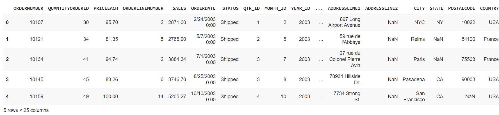

# 数据探索

在本节中，我们将讨论各种函数，这些函数帮助你更好地了解你的数据。例如查看数据或获取均值、平均值、最小值/最大值，或获取数据框的信息。

## 1\. 数据查看

1.  `df.head()`: 显示样本数据的前五行


1.  `df.tail()`: 显示样本数据的最后五行

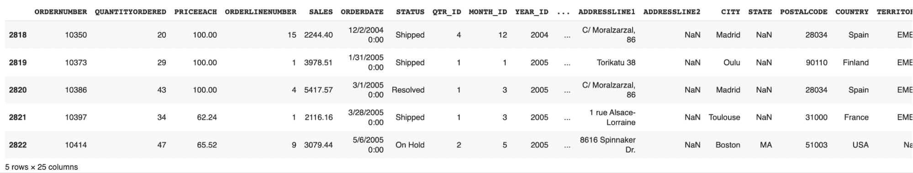

1.  `df.sample(n)`: 显示样本数据中的随机 n 行

```py
df.sample(6)
```

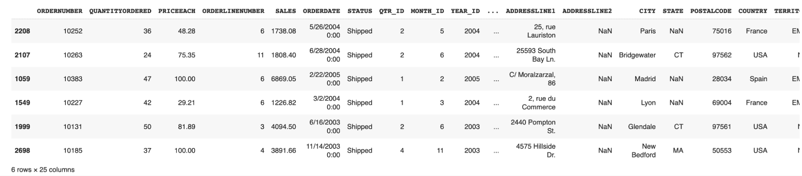

1.  `df.shape`: 显示样本数据的行和列（维度）。

```py
(2823, 25)
```

这意味着我们的数据集有 2823 行，每行包含 25 列。

## 2\. 统计

本节包含帮助你对数据进行统计分析的函数，如平均值、最小值/最大值和四分位数。

1.  `df.describe()`: 获取样本数据每列的基本统计信息

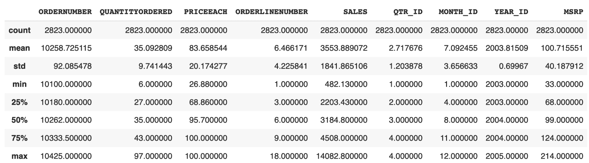

1.  `df.info()`：获取有关使用的各种数据类型以及每列的非空计数的信息。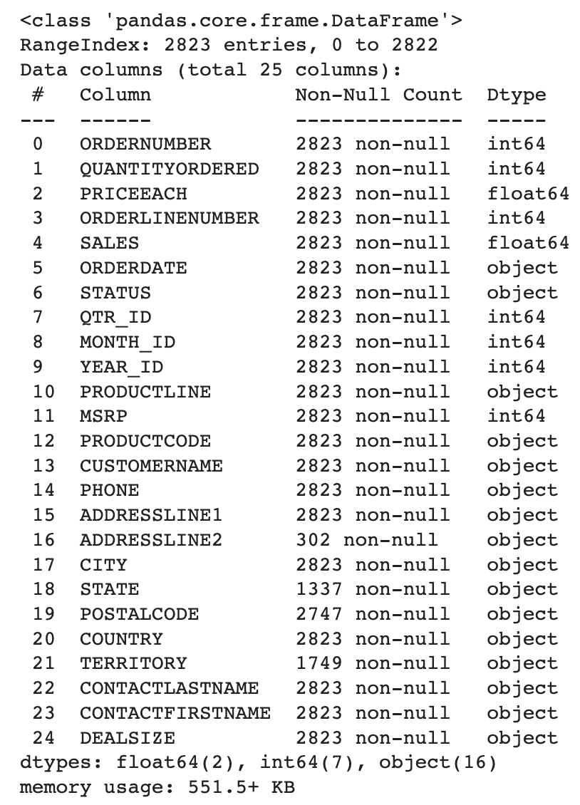

1.  `df.corr()`：这可以给你数据框中所有整数列之间的相关性矩阵。

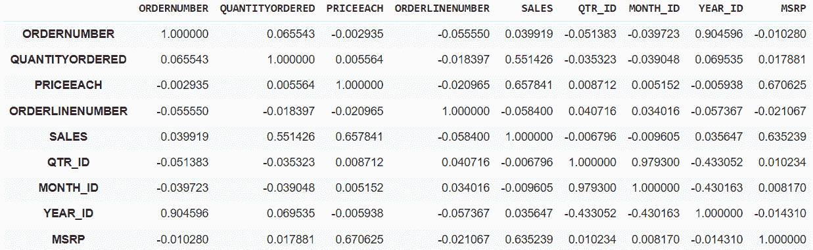

1.  `df.memory_usage()`：它将告诉你每列消耗的内存量。

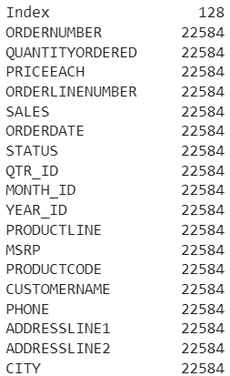

## 3. 数据选择

你也可以选择任何特定行、列，甚至多个列的数据。

1.  `df.iloc[row_num]`：它将根据索引选择特定的行。

例如，

```py
df.iloc[0]
```

1.  `df[col_name]`：它将选择特定的列。

例如，

```py
df["SALES"]
```

输出：

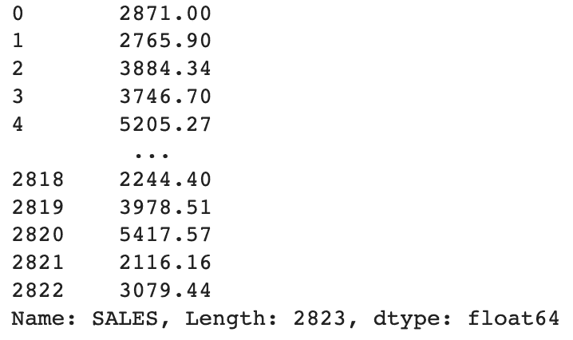

1.  `df[[‘col1’, ‘col2’]]`：这将选择给定的多个列。

例如，

```py
df[["SALES", "PRICEEACH"]]
```

输出：

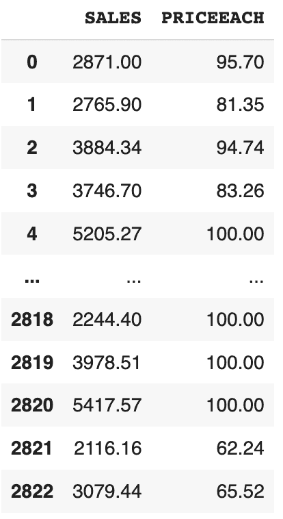

# 4. 数据清洗

这些函数用于处理缺失数据。数据中的某些行包含空值和垃圾值，这可能会影响我们训练模型的性能。因此，最好纠正或删除这些缺失值。

1.  `df.isnull()`：这将识别数据框中的缺失值。

1.  `df.dropna()`：这将删除包含任何列中缺失值的行。

1.  `df.fillna(val)`：这将用`val`填充缺失值。

1.  `df[‘col’].astype(new_data_type)`：它可以将选定列的数据类型转换为不同的数据类型。

例如，

```py
df["SALES"].astype(int)
```

我们将 SALES 列的数据类型从浮点型转换为整型。

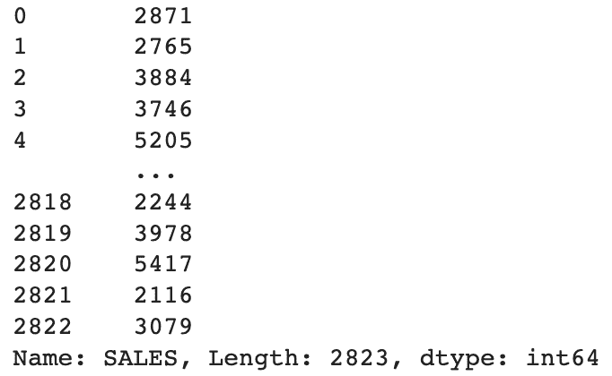

# 5. 数据分析

在这里，我们将使用一些数据分析中的有用函数，如分组、排序和过滤。

1.  **聚合函数：**

你可以按列名对列进行分组，然后应用一些聚合函数，如总和、最小/最大、平均等。

```py
df.groupby("col_name_1").agg({"col_name_2": "sum"})
```

例如，

```py
df.groupby("CITY").agg({"SALES": "sum"})
```

它将给出每个城市的总销售额。

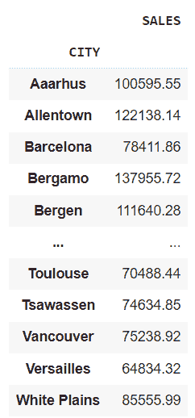

如果你想一次应用多个聚合，可以像这样编写它们。

例如，

```py
aggregation = df.agg({"SALES": "sum", "QUANTITYORDERED": "mean"})
```

输出：

```py
SALES              1.003263e+07

QUANTITYORDERED    3.509281e+01

dtype: float64
```

1.  **数据过滤：**

我们可以根据特定值或条件过滤行中的数据。

例如，

```py
df[df["SALES"] > 5000]
```

显示销售额大于 5000 的行。

你也可以使用`query()`函数来过滤数据框。它将生成类似的输出。

例如，

```py
df.query("SALES" > 5000)
```

1.  **数据排序：**

你可以根据特定列对数据进行排序，可以选择升序或降序。

例如，

```py
df.sort_values("SALES", ascending=False)  *# Sorts the data in descending order*
```

1.  **Pivot Tables:**

我们可以创建透视表，通过特定的列来汇总数据。当你只想考虑某些列的效果时，这非常有用。

例如，

```py
pd.pivot_table(df, values="SALES", index="CITY", columns="YEAR_ID", aggfunc="sum")
```

让我为你解释一下。

1.  `values`: 它包含你想要填充表格单元格的列。

1.  `index`: 使用的列将成为透视表的行索引，该列的每个唯一类别将成为透视表中的一行。

1.  `columns`: 它包含透视表的标题，每个唯一的元素将成为透视表中的一列。

1.  `aggfunc`: 这是我们之前讨论过的聚合函数。

输出：

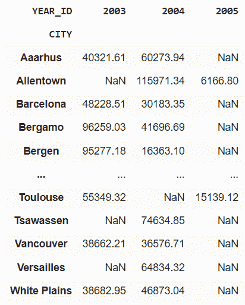

该输出显示了一个图表，描述了某个城市在特定年份的总销售额。

## 6\. Combining Data Frames

我们可以水平或垂直地组合和合并多个数据框。它会连接两个数据框并返回一个合并后的数据框。

例如，

```py
combined_df = pd.concat([df1, df2])
```

你可以基于一个公共列合并两个数据框。这在你想要结合两个具有共同标识符的数据框时非常有用。

例如，

```py
merged_df = pd.merge(df1, df2, on="common_col")
```

## 7\. Applying Custom Functions

你可以根据需要在行或列中应用自定义函数。

例如，

```py
def cus_fun(x):
    return x * 3

df["Sales_Tripled"] = df["SALES"].apply(cus_fun, axis=0)
```

我们编写了一个自定义函数，将每行的销售额三倍化。`axis=0` 表示我们想在列上应用自定义函数，`axis=1` 表示我们想在行上应用该函数。

在之前的方法中，你必须编写一个单独的函数，然后通过 apply() 方法调用它。Lambda 函数帮助你在 apply() 方法内部使用自定义函数。让我们看看如何做到这一点。

```py
df["Sales_Tripled"] = df["SALES"].apply(lambda x: x * 3)
```

**Applymap:**

我们还可以在一行代码中将自定义函数应用于数据框的每个元素。但要记住，这适用于数据框中的所有元素。

例如，

```py
df = df.applymap(lambda x: str(x))
```

它将数据框中所有元素的数据类型转换为字符串。

## 8\. Time Series Analysis

在数学中，时间序列分析指的是分析在特定时间间隔内收集的数据，而 pandas 提供了执行这种分析的函数。

**Conversion to DateTime Object Model:**

我们可以将日期列转换为 datetime 格式，以便更轻松地进行数据操作。

例如，

```py
df["ORDERDATE"] = pd.to_datetime(df["ORDERDATE"])
```

输出：


**Calculate Rolling Average:**

使用此方法，我们可以创建一个滚动窗口来查看数据。我们可以指定任何大小的滚动窗口。如果窗口大小为 5，则表示在该时间点上为 5 天的数据窗口。它可以帮助你消除数据中的波动，并帮助识别随时间变化的模式。

例如，

```py
rolling_avg = df["SALES"].rolling(window=5).mean()
```

输出：

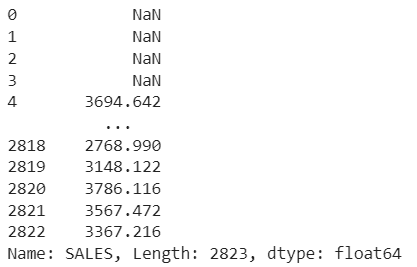

## 9\. 交叉表

我们可以对表中的两个列执行交叉表分析。它通常是一个频率表，显示各种类别的出现频率。这可以帮助你理解不同地区类别的分布。

例如，

获取 `COUNTRY` 和 `DEALSIZE` 之间的交叉表。

```py
cross_tab = pd.crosstab(df["COUNTRY"], df["DEALSIZE"])
```

它可以显示按不同国家排序的订单大小（‘DEALSIZE’）。

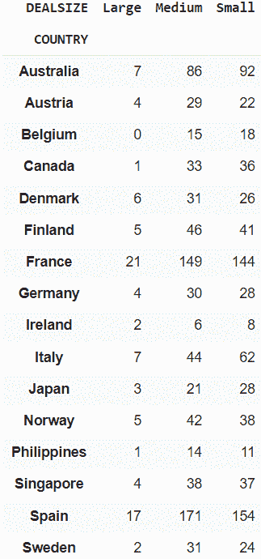

## 10\. 处理离群值

数据中的离群值指的是某个点远远超出平均范围。让我们通过一个例子来理解它。假设你有 5 个点，例如 3、5、6、46、8。我们可以明确地说，数字 46 是一个离群值，因为它远远超出了其余点的平均值。这些离群值可能导致错误的统计数据，应该从数据集中移除。

在这里，pandas 帮助找到这些潜在的离群值。我们可以使用一种叫做四分位数间距（IQR）的方法，这是一种常见的找到和处理这些离群值的方法。如果你想了解这个方法的更多信息，你可以 [这里](https://byjus.com/maths/interquartile-range/) 阅读更多内容。

让我们看看如何使用 pandas 来实现这个目标。

```py
Q1 = df["SALES"].quantile(0.25)
Q3 = df["SALES"].quantile(0.75)
IQR = Q3 - Q1
lower_bound = Q1 - 1.5 * IQR
upper_bound = Q3 + 1.5 * IQR

outliers = df[(df["SALES"] < lower_bound) | (df["SALES"] > upper_bound)]
```

Q1 是第一个四分位数，表示数据的第 25 百分位数，而 Q3 是第三个四分位数，表示数据的第 75 百分位数。

`lower_bound` 变量存储用于查找潜在离群值的下界。它的值设置为 Q1 下方 IQR 的 1.5 倍。同样，`upper_bound` 计算上界，即 Q3 上方 IQR 的 1.5 倍。

然后，你需要筛选出低于下界或高于上界的离群值。

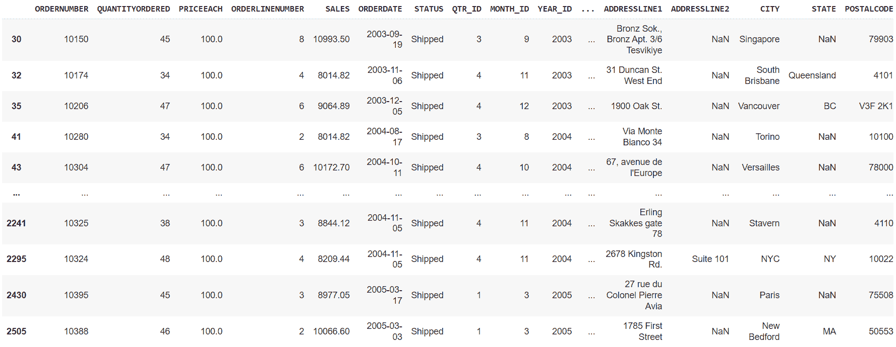

# 总结一下

Python pandas 库使我们能够执行高级数据分析和操作。这些只是其中的一些功能。你可以在 [这](https://dataanalysispython.readthedocs.io/en/latest/) pandas 文档中找到更多工具。一个重要的事情是，技术的选择可以根据你的需求和使用的数据集而有所不同。

**[](https://www.linkedin.com/in/aryan-garg-1bbb791a3/)**[Aryan Garg](https://www.linkedin.com/in/aryan-garg-1bbb791a3/)** 是一名 B.Tech. 电气工程专业的学生，目前在本科最后一年。他对 Web 开发和机器学习领域感兴趣。他已经追求了这一兴趣，并渴望在这些方向上进一步发展。**

### 更多相关内容

+   [KDnuggets™ News 22:n03, Jan 19: 深入了解 13 个数据…](https://www.kdnuggets.com/2022/n03.html)

+   [KDnuggets 新闻，5 月 25 日：每个 Python 机器学习工具的 6 个必备工具](https://www.kdnuggets.com/2022/n21.html)

+   [每个数据科学家都应该了解的 6 个 Python 机器学习工具](https://www.kdnuggets.com/2022/05/6-python-machine-learning-tools-every-data-scientist-know.html)

+   [每个数据科学家都应该了解的 12 个 Docker 命令](https://www.kdnuggets.com/2023/01/12-docker-commands-every-data-scientist-know.html)

+   [每个数据科学家都应该了解的工具：实用指南](https://www.kdnuggets.com/tools-every-data-scientist-should-know-a-practical-guide)

+   [每个数据科学家都应该了解的 10 个 Python 库](https://www.kdnuggets.com/10-python-libraries-every-data-scientist-should-know)
