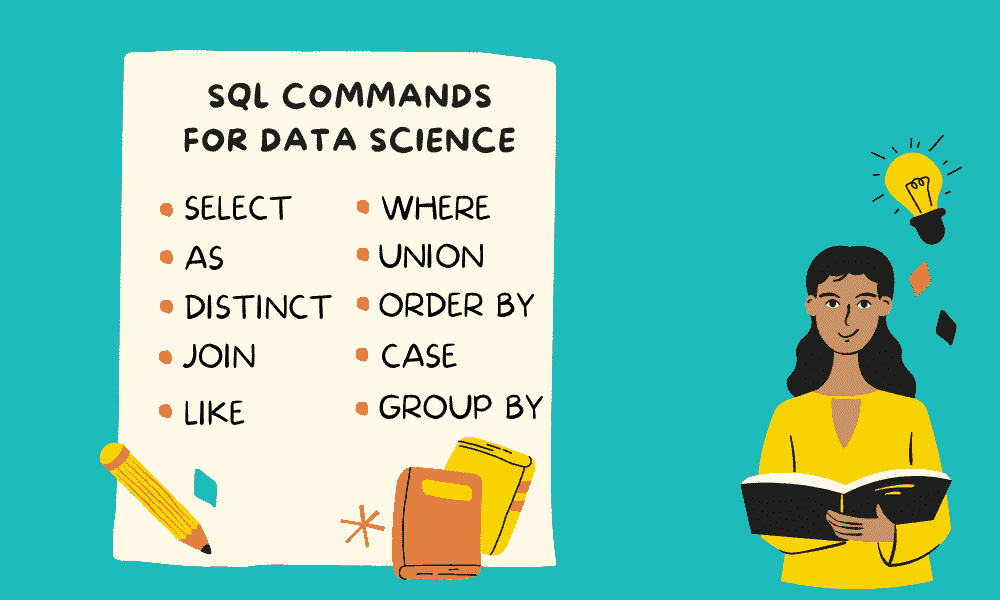

# 数据科学的 10 个基本 SQL 命令

> 原文：[`www.kdnuggets.com/2022/10/10-essential-sql-commands-data-science.html`](https://www.kdnuggets.com/2022/10/10-essential-sql-commands-data-science.html)



图片由作者提供

这是学习 SQL 命令的新一天，这些命令将帮助你在数据科学职业中。你将使用 SQL 查询来提取、保存和修改数据库以满足你的需求。

* * *

## 我们的前三课程推荐

 1\. [谷歌网络安全证书](https://www.kdnuggets.com/google-cybersecurity) - 快速进入网络安全职业。

 2\. [谷歌数据分析专业证书](https://www.kdnuggets.com/google-data-analytics) - 提升你的数据分析技能

 3\. [谷歌 IT 支持专业证书](https://www.kdnuggets.com/google-itsupport) - 支持你的组织 IT

* * *

那么，是什么阻止你学习提取数据和在 SQL 数据库上执行快速分析的最常用命令呢？

在这篇文章中，我们将通过使用[在线 SQL 编辑器](https://www.programiz.com/sql/online-compiler/)学习基本 SQL 命令及代码示例。它允许用户在线运行查询而不会遇到问题。该平台提供了一个编辑器和三个用于练习的 SQL 表。数据库包括三个表：**Customers**、**Orders**和**Shippings**。

1.  选择

1.  唯一

1.  条件

1.  LIKE

1.  按顺序排列

1.  作为

1.  连接

1.  UNION

1.  按组

1.  CASE

# 选择

SELECT 命令允许我们从表中提取选择的或所有列。这是 SQL 查询的基本构建块。

在我们的例子中，我们使用`*`从**Customer**表中显示所有列。

```py
SELECT *
FROM Customers;
```

| **客户编号** | **名** | **姓** | **年龄** | **国家** |
| --- | --- | --- | --- | --- |
| 1 | John | Doe | 31 | 美国 |
| 2 | Robert | Luna | 22 | 美国 |
| 3 | David | Robinson | 22 | 英国 |
| 4 | John | Reinhardt | 25 | 英国 |
| 5 | Betty | Doe | 28 | 阿联酋 |

在第二个示例中，我们只展示了**Customers**表中的三列。你可以输入用逗号“，”分隔的列名，并以**FROM**命令和表名结束。

```py
SELECT first_name,
       last_name,
       country
FROM Customers;
```

| **名** | **姓** | **国家** |
| --- | --- | --- |
| John | Doe | 美国 |
| Robert | Luna | 美国 |
| David | Robinson | 英国 |
| John | Reinhardt | 英国 |
| Betty | Doe | 阿联酋 |

# 唯一

DISTINCT 用于显示列中的唯一值。它现在只显示一个 John，而不是两个 John。

```py
SELECT DISTINCT first_name
FROM Customers;
```

| **名** |
| --- |
| John |
| Robert |
| David |
| Betty |

# 条件

WHERE 命令用于条件和过滤。我们将过滤表以显示年龄大于 25 的客户。除了大于，你还可以使用小于**<**、小于或等于**<=**、大于或等于**>=**和等于**=**。

```py
SELECT *
FROM Customers
WHERE age > 25;
```

结果显示我们只有两个年龄大于 25 的客户。

| **customer_id** | **first_name** | **last_name** | **age** | **country** |
| --- | --- | --- | --- | --- |
| 1 | John | Doe | 31 | 美国 |
| 5 | Betty | Doe | 28 | 阿联酋 |

你还可以使用**AND**、**OR**、**BETWEEN**和**IN**来组合两个或多个条件。在我们的案例中，我们正在寻找年龄大于 25 的美国客户。

```py
SELECT *
FROM Customers
WHERE age > 25
  AND country == 'USA';
```

| **customer_id** | **first_name** | **last_name** | **age** | **country** |
| --- | --- | --- | --- | --- |
| 1 | John | Doe | 31 | 美国 |

# LIKE

LIKE 命令用于字符串过滤。你提供表达式，它将用来查找匹配该表达式的值。例如，如果你想要所有以 J 开头的名字，可以使用“J%”。要查找以 J 结尾的名字，我们将使用“%J”。这很简单。

```py
SELECT *
FROM Customers
WHERE first_name LIKE "J%";
```

| **customer_id** | **first_name** | **last_name** | **age** | **country** |
| --- | --- | --- | --- | --- |
| 1 | John | Doe | 31 | 美国 |
| 4 | John | Reinhardt | 25 | 英国 |

尝试查找**first_name**以“J”开头且**last_name**以“e”结尾的客户。你可以通过阅读 SQL LIKE 操作符示例教程来了解更多创建表达式的其他方法。

```py
SELECT *
FROM Customers
WHERE first_name LIKE "J%"
  OR last_name LIKE "%e";
```

| **customer_id** | **first_name** | **last_name** | **age** | **country** |
| --- | --- | --- | --- | --- |
| 1 | John | Doe | 31 | 美国 |
| 4 | John | Reinhardt | 25 | 英国 |
| 5 | Betty | Doe | 28 | 阿联酋 |

# ORDER BY

ORDER BY 用于对查询结果进行排序。我们使用 ORDER BY 对结果进行基于**first_name**的升序排序。

```py
SELECT *
FROM Customers
ORDER BY first_name;
```

| **customer_id** | **first_name** | **last_name** | **age** | **country** |
| --- | --- | --- | --- | --- |
| 5 | Betty | Doe | 28 | 阿联酋 |
| 3 | David | Robinson | 22 | 英国 |
| 1 | John | Doe | 31 | 美国 |
| 4 | John | Reinhardt | 25 | 英国 |
| 2 | Robert | Luna | 22 | 美国 |

你可以尝试使用**DESC**在末尾对结果进行降序排序。

```py
SELECT *
FROM Customers
ORDER BY first_name DESC;
```

| **customer_id** | **first_name** | **last_name** | **age** | **country** |
| --- | --- | --- | --- | --- |
| 2 | Robert | Luna | 22 | 美国 |
| 1 | John | Doe | 31 | 美国 |
| 4 | John | Reinhardt | 25 | 英国 |
| 3 | David | Robinson | 22 | 英国 |
| 5 | Betty | Doe | 28 | 阿联酋 |

# AS

AS 命令用于创建别名或重命名列名。在下面的示例中，我们将“customer_id”重命名为“ID”，将“first_name”重命名为“Name”。

```py
SELECT customer_id AS ID,
       first_name AS Name
FROM Customers;
```

| **ID** | **Name** |
| --- | --- |
| 1 | John |
| 2 | Robert |
| 3 | David |
| 4 | John |
| 5 | Betty |

# JOIN

你将联接多个表进行数据分析，这非常简单。只需在第一个表后使用**LEFT JOIN**、**INNER JOIN**、**RIGHT JOIN**或**FULL JOIN**。写下第二个表的名称，然后跟上**ON**来在特定列上联接表。在我们的案例中，两个表都有一个名为**customer_id**的公共列。我们将使用“==”符号联接这两个表的列名。

```py
SELECT first_name,
       item,
       amount
FROM Customers
LEFT JOIN Orders 
ON Customers.customer_id == Orders.customer_id
```

| **first_name** | **item** | **amount** |
| --- | --- | --- |
| John | Keyboard | 400 |
| Robert | Mousepad | 250 |
| David | Monitor | 12000 |
| John | Keyboard | 400 |
| John | Mouse | 300 |
| Betty |  |  |

# UNION

UNION 用于将两个查询结果一起显示。在这个例子中，我们将**Customer**表中的“first_name”显示为“Name_item”，并将**Orders**表中的“item”一起显示。

**注意：** 确保两个查询显示相同数量的列。

```py
SELECT first_name AS Name_item
FROM Customers
UNION
SELECT item
FROM Orders
```

如你所见，结果包含了**Customers**表中的 first_name 和 **Orders** 表中的 item。列按 A-Z 排序。

| **Name_item** |
| --- |
| Betty |
| David |
| John |
| Keyboard |
| Monitor |
| Mouse |
| Mousepad |
| Robert |

# GROUP BY

GROUP BY 命令在数据分析任务中经常使用。你可以对任意列进行分组，从而更好地理解数据分布。

GROUP BY 需要聚合函数：

+   COUNT: 总行数

+   SUM: 所有值的总和

+   MAX: 最大值

+   MIN: 最小值

+   AVG: 平均值

你可以使用聚合函数和 GROUP BY 将列中的值合并为类别。在下面的示例中，我们将对金额进行 SUM 聚合，并按 item 名称进行分组。

```py
SELECT item,
       SUM(amount)
FROM Orders
GROUP BY item
```

单个键盘的价格是 400，我们售出了 2 个键盘。它将其加总显示为 800。我知道这是一个简单的例子，但这是一个开始。

| **item** | **SUM(amount)** |
| --- | --- |
| Keyboard | 800 |
| Monitor | 12000 |
| Mouse | 300 |
| Mousepad | 250 |

# CASE

CASE 命令类似于 Python 或其他语言中的**if-else 语句**。我们将用它来根据条件创建类别。

如果金额小于 1000，返回 ‘Low’，否则返回 ‘High’。

该命令以**CASE**开头，以**END**和列名结尾。

**If** 被替换为 **WHEN**，**else** 被替换为 **ELSE**。

```py
SELECT item,
       amount,
       CASE
           WHEN amount < 1000 THEN 'Low'
           ELSE 'High'
       END AS Priority
FROM Orders;
```

| **item** | **amount** | **Priority** |
| --- | --- | --- |
| Keyboard | 400 | Low |
| Mouse | 300 | Low |
| Monitor | 12000 | High |
| Keyboard | 400 | Low |
| Mousepad | 250 | Low |

**[Abid Ali Awan](https://www.polywork.com/kingabzpro)** ([@1abidaliawan](https://twitter.com/1abidaliawan)) 是一位认证的数据科学专业人士，热衷于构建机器学习模型。目前，他专注于内容创作和撰写关于机器学习和数据科学技术的技术博客。Abid 拥有技术管理硕士学位和电信工程学士学位。他的愿景是使用图神经网络为那些受精神疾病困扰的学生构建人工智能产品。

### 相关主题更多内容

+   [数据科学的 16 个基本 DVC 命令](https://www.kdnuggets.com/2022/07/16-essential-dvc-commands-data-science.html)

+   [数据科学家的 14 个基本 Git 命令](https://www.kdnuggets.com/2022/06/14-essential-git-commands-data-scientists.html)

+   [Streamlit 的 12 个基本命令](https://www.kdnuggets.com/2023/01/12-essential-commands-streamlit.html)

+   [KDnuggets 新闻，6 月 29 日：数据科学的 20 个基本 Linux 命令…](https://www.kdnuggets.com/2022/n26.html)

+   [数据科学初学者的 20 个基本 Linux 命令](https://www.kdnuggets.com/2022/06/20-basic-linux-commands-data-science-beginners.html)

+   [每位数据科学家都应了解的 12 个 Docker 命令](https://www.kdnuggets.com/2023/01/12-docker-commands-every-data-scientist-know.html)
