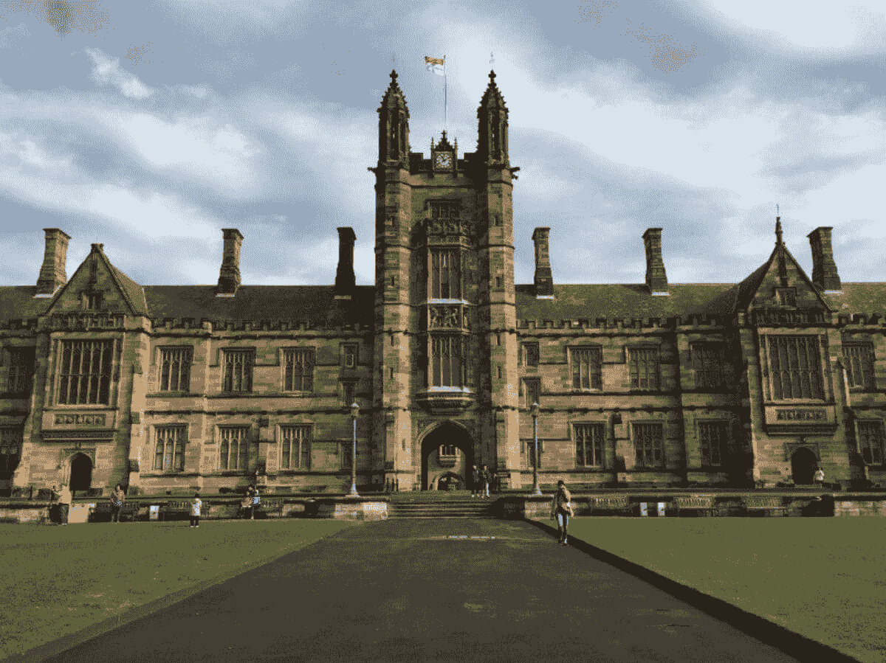

# 10 个顶级大学的免费机器学习课程

> 原文：[`www.kdnuggets.com/2023/02/10-free-machine-learning-courses-top-universities.html`](https://www.kdnuggets.com/2023/02/10-free-machine-learning-courses-top-universities.html)

机器学习是一个快速发展的领域，正在革新许多行业，包括医疗保健、金融和技术。凭借其分析大量数据并进行预测和决策的能力，机器学习是任何有意从事数据科学或人工智能职业的人的必备技能。

如果你想深入了解机器学习，那么你很幸运！网上有许多高质量的课程，由世界顶级大学提供。在本文中，我们将向你介绍 10 个来自顶级大学的免费机器学习课程。这些课程涵盖了从机器学习基础到更高级的技术，适合各个级别的学习者。无论你是想开始学习机器学习的初学者，还是想深化知识的经验丰富的数据科学家，你肯定会在这个列表中找到感兴趣的内容。那么，让我们开始吧！

* * *

## 我们的前三个课程推荐

 1\. [Google 网络安全证书](https://www.kdnuggets.com/google-cybersecurity) - 快速进入网络安全职业的快车道。

 2\. [Google 数据分析专业证书](https://www.kdnuggets.com/google-data-analytics) - 提升你的数据分析技能

 3\. [Google IT 支持专业证书](https://www.kdnuggets.com/google-itsupport) - 支持你的组织 IT

* * *

照片由 [Datingscout](https://unsplash.com/ja/@datingscout?utm_source=medium&utm_medium=referral) 拍摄，来源于 [Unsplash](https://unsplash.com?utm_source=medium&utm_medium=referral)

# 1\. 机器学习导论 - UC Berkeley

**课程链接：** [`lnkd.in/dChzX6dZ`](https://lnkd.in/dChzX6dZ)

第一门课程是 UC Berkeley 提供的机器学习导论课程。这门课程是对机器学习领域的非常好的入门介绍，尤其适合初学者。它涵盖了每个机器学习任务中最重要的机器学习算法，如：

+   分类：支持向量机（SVM）、高斯判别分析（线性判别分析 LDA 和二次判别分析 QDA）、逻辑回归、决策树、神经网络、卷积神经网络、提升方法和 K 近邻。

+   回归：最小二乘线性回归、逻辑回归、多项式回归、岭回归、Lasso。

+   聚类：*k*-均值聚类、层次聚类、谱图聚类。

如果你是初学者并希望在机器学习基础概念方面建立坚实的基础，这门课程将是一个完美的选择。

**预计时长:** 30 小时

**讲师:** [**Jonathan Shewchuk**](http://www.cs.berkeley.edu/~jrs)

**难度等级:** 初学者

**课程材料:**

+   [讲义](https://people.eecs.berkeley.edu/~jrs/189/#:~:text=Spring%202022.-,Lectures,-Now%20available%3A)

+   [作业与考试](https://people.eecs.berkeley.edu/~jrs/189/#:~:text=or%20eTextbook.-,Homework%20and%20Exams,-You%20have%20a)

# 2\. 机器学习简介 - 卡内基梅隆大学

**课程链接:** [`lnkd.in/dH8ktatw`](https://lnkd.in/dH8ktatw)

第二门课程也是由卡内基梅隆大学提供的入门级机器学习课程。这门课程以理论和实践两种方式涵盖了更多的机器学习算法。课程内容包括最重要的机器学习算法，如贝叶斯网络、决策树学习、支持向量机、统计学习方法、无监督学习算法、深度学习简介和强化学习。

此外，课程还涵盖了重要概念，如 PAC 学习框架、贝叶斯学习方法、基于边际的学习和奥卡姆剃刀。

这门课程旨在为你提供在机器学习领域研究或工作的人员目前所需的全面基础，包括方法论、技术、数学和算法。

**预计时长:** 50 小时

**讲师:** [Tom Mitchell](http://www.cs.cmu.edu/~tom) & [Maria-Florina Balcan](http://www.cs.cmu.edu/~ninamf/)

**难度等级:** 初学者

**课程材料:**

+   [作业](http://www.cs.cmu.edu/~ninamf/courses/601sp15/homeworks.shtml)

+   [项目](http://www.cs.cmu.edu/~ninamf/courses/601sp15/projects.html)

+   [视频与幻灯片](http://www.cs.cmu.edu/~ninamf/courses/601sp15/lectures.shtml)

# 3\. 机器学习 - 斯坦福大学

**课程链接:** [`lnkd.in/d4FzSKpJ`](https://lnkd.in/d4FzSKpJ)

第三门课程是著名的 Andrew Ng 的机器学习课程，授课于斯坦福大学。这门课程专注于理论和实践的机器学习技术。你不仅会理解最重要的机器学习算法，还将学习如何从头构建和实现它们。最后，你将了解一些行业最佳实践，涉及机器学习和人工智能的创新。

**注意：该课程在 Coursera 上有一个新版本，由 Andrew Ng 教授授课。你可以在这里找到它。**

**预计时长:** 60 小时

**讲师:** Andrew Ng

**难度等级:** 初学者

**课程材料:**

+   [课程页面](http://www.holehouse.org/mlclass/)

+   [视频](https://www.youtube.com/playlist?list=PLLssT5z_DsK-h9vYZkQkYNWcItqhlRJLN)

+   [Coursera 页面](https://www.coursera.org/learn/machine-learning)

# 4\. 机器学习与数据挖掘 - 加州理工学院

**课程链接：** [`lnkd.in/dUhbEyBx`](https://lnkd.in/dUhbEyBx)

第四门课程是加州理工学院的《机器学习与数据挖掘》课程。这门课程涵盖了机器学习和数据挖掘中最流行的方法，更侧重于建立对这些方法在实践中应用的深入理解。此外，它还涵盖了一些最新的研究进展，例如深度生成模型。

**估计时长：** 30 小时

**讲师：** [岳一松](http://www.yisongyue.com/)

**难度级别：**

**课程材料：**

+   [课程页面](http://www.yisongyue.com/courses/cs155/2017_winter/)

+   [视频（2017）](https://www.youtube.com/playlist?list=PLuz4CTPOUNi6BfMrltePqMAHdl5W33-bC)

+   [幻灯片](http://www.yisongyue.com/courses/cs155/2017_winter/#:~:text=Lectures%20%26%20Recitation%20Schedule)

+   [作业](http://www.yisongyue.com/courses/cs155/2017_winter/#:~:text=throughout%20the%20course.-,Assignments,-Homework%20LaTeX%20template)

# 5\. 数据学习 - 加州理工学院

**课程链接：** [`lnkd.in/d4zZZJ5h`](https://lnkd.in/d4zZZJ5h)

本列表中的第五门课程是加州理工学院的《数据学习》课程。这门课程以故事般的方式更侧重于学习理论，涵盖了学习是什么、机器能否学习以及如何学习等主题。它还平衡了理论和实践，并涵盖了机器学习的重要数学基础。

**估计时长：** 30 小时

**讲师：** 亚瑟·阿布-莫斯塔法教授

**难度级别：** 初学者

**课程材料：**

+   [课程页面](https://home.work.caltech.edu/telecourse.html)

+   [视频](https://www.youtube.com/playlist?list=PLD63A284B7615313A)

+   [幻灯片](https://work.caltech.edu/lectures.html#:~:text=Place%20the%20mouse%20on%20a%20lecture%20title%20for%20a%20short%20description)

# 6\. 智能系统机器学习 - 康奈尔大学

**课程链接：** [`lnkd.in/dtSjQ22i`](https://lnkd.in/dtSjQ22i)

本列表中的第六门课程是康奈尔大学的《智能系统机器学习》课程。这门课程将广泛介绍机器学习领域，并介绍一些最重要的机器学习算法和概念，帮助你开启机器学习之旅。

**估计时长：30 小时**

**讲师：** [基利安·温伯格](http://kilian.cs.cornell.edu/)

**难度级别：初学者**

**课程材料：**

+   [视频](https://www.youtube.com/playlist?list=PLl8OlHZGYOQ7bkVbuRthEsaLr7bONzbXS)

# 7\. 大规模机器学习 - 多伦多大学

**课程链接：** [`lnkd.in/dv8-7EFE`](http://www.cs.toronto.edu/~rsalakhu/STA4273_2015/)

我们列表中的第七门课程是由多伦多大学提供的大规模机器学习课程。这门课程更为高级，旨在为具有一定数学成熟度的研究生设计。课程从回归和分类的线性方法等基本机器学习方法开始，然后深入探讨统计机器学习方法，如贝叶斯网络、马尔可夫随机场及更多高级方法。

**预计时长：20 小时**

**讲师：** [拉斯·萨拉赫乌丁诺夫](https://video-archive.fields.utoronto.ca/list/speaker/8265-452-716)

**难度等级：** 高级

**课程材料：**

+   [课程页面](http://www.cs.toronto.edu/~rsalakhu/STA4273_2015/)

+   [视频](https://video-archive.fields.utoronto.ca/list/event/283)

+   [作业与项目](http://www.cs.toronto.edu/~rsalakhu/STA4273_2015/assignments.html)

# 8. 大数据机器学习 - 卡内基梅隆大学

**课程链接：** [`www.youtube.com/@user-yd6im1cq5k/about`](https://www.youtube.com/@user-yd6im1cq5k/about)

列表中的第八门课程是卡内基梅隆大学的大数据机器学习课程。这门课程以更深刻的方式处理与之前课程类似的问题。它关注如何构建能够处理大数据集的机器学习系统。处理大数据集具有几个困难，例如：

+   计算和训练模型非常昂贵

+   难以可视化和理解

+   大数据集在不同的学习方法中表现出不同的行为，影响最准确的预测。

基于处理大数据集需要不同的可扩展学习技术，包括：

+   流式学习技术

+   并行基础设施，如 map-reduce

+   特征哈希和布隆过滤器用于减少学习方法的内存需求。

**预计时长：40 小时**

**讲师：** 威廉·科恩

**难度等级：高级**

**课程材料：**

+   [课程页面](http://curtis.ml.cmu.edu/w/courses/index.php/Main_Page)

+   [视频](https://www.youtube.com/@user-yd6im1cq5k/videos)

# 9. 机器学习与统计推断基础 - 加州理工学院

**课程链接：** [`tensorlab.cms.caltech.edu/users/anima/cms165-2020.html#`](http://tensorlab.cms.caltech.edu/users/anima/cms165-2020.html)

第九门课程是由加州理工学院提供的机器学习与统计推断基础课程。该课程涵盖了机器学习和统计推断的核心概念。涵盖的机器学习概念包括：

+   谱方法

+   非凸优化

+   概率模型

+   表示理论

涵盖的统计推断主题包括：

+   检测与估计

+   充分统计量

+   克拉默-拉奥界限

+   拉奥-布莱克威尔理论

+   变分推断

课程假设你对分析、概率、统计和基本编程感到舒适。

**预计时长：30 小时**

**难度等级：初学者**

**课程材料：**

+   [视频](https://www.youtube.com/playlist?list=PLVNifWxslHCDlbyitaLLYBOAEPbmF1AHg)

+   [讲义](http://tensorlab.cms.caltech.edu/users/anima/cms165-2020.html#:~:text=1pm%20ANB%20105-,Lectures,-Lecture%20videos%20can)

+   [作业](http://tensorlab.cms.caltech.edu/users/anima/cms165-2020.html#:~:text=sdai%40caltech.edu-,Assignments,-Assignment%201)

# 10\. 机器学习的算法方面 - MIT

**课程链接：** https://ocw.mit.edu/courses/18-409-algorithmic-aspects-of-machine-learning-spring-2015/

这个列表中的第十个也是最后一个课程是麻省理工学院的《机器学习的算法方面》课程。该课程围绕机器学习中的算法问题进行结构化。现代机器学习系统总是建立在没有可证明保证的算法之上，何时以及为什么这些算法有效仍然是一个辩论的话题。在这门课程中，重点将是设计可以严格分析其性能的算法，针对基本的机器学习问题。

**讲师：** [**安库尔·莫伊特拉教授**](https://ocw.mit.edu/search?q=Prof.+Ankur+Moitra)

**预计时长：** 50 小时

**难度等级：** 初学者

**课程材料：**

+   [课程页面](https://ocw.mit.edu/courses/18-409-algorithmic-aspects-of-machine-learning-spring-2015/)

+   [课程视频](https://www.youtube.com/playlist?list=PLB3sDpSRdrOvI1hYXNsa6Lety7K8FhPpx)

总结来说，网络上有许多免费的机器学习课程，来自世界上一些顶尖大学。这些课程涵盖了从机器学习基础到更高级的技术等各种主题，适合各个水平的学习者。无论你是刚刚开始学习机器学习的初学者，还是希望深入知识的经验丰富的数据科学家，你肯定能在这 10 个免费的机器学习课程列表中找到感兴趣的内容。通过利用这些资源，你可以学习到宝贵的技能和知识，帮助你在快速发展的机器学习领域中取得成功。

**[尤瑟夫·拉法特](https://www.linkedin.com/in/youssef-hosni-b2960b135)** 是一名计算机视觉研究员和数据科学家。他的研究专注于为医疗保健应用开发实时计算机视觉算法。他还在营销、金融和医疗保健领域担任了超过 3 年的数据科学家。

### 更多相关主题

+   [来自顶尖大学的 5 个免费人工智能课程](https://www.kdnuggets.com/5-free-artificial-intelligence-courses-from-top-universities)

+   [大学提供的人工智能最佳课程（YouTube 播放列表）](https://www.kdnuggets.com/2023/08/best-courses-ai-universities-youtube-playlists.html)

+   [KDnuggets 新闻，12 月 14 日：3 个免费的机器学习课程…](https://www.kdnuggets.com/2022/n48.html)

+   [顶级 5 个免费的机器学习课程](https://www.kdnuggets.com/2022/02/top-5-free-machine-learning-courses.html)

+   [提升技能的前 5 名免费机器学习课程](https://www.kdnuggets.com/top-5-free-machine-learning-courses-to-level-up-your-skills)

+   [真正免费的课程：人工智能与机器学习版](https://www.kdnuggets.com/free-courses-that-are-actually-free-ai-ml-edition)
