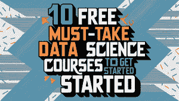

# 10 个免费必修的数据科学课程

> 原文：[`www.kdnuggets.com/10-free-must-take-data-science-courses-to-get-started`](https://www.kdnuggets.com/10-free-must-take-data-science-courses-to-get-started)

图片由 Ideogram.ai 生成

你是数据科学初学者并想开始你的数据科学家职业生涯吗？或者你之前学过这些内容，需要复习一下？那么，你刚刚读到了完美的文章！

* * *

## 我们的前三个课程推荐

 1\. [谷歌网络安全证书](https://www.kdnuggets.com/google-cybersecurity) - 快速进入网络安全职业生涯。

 2\. [谷歌数据分析专业证书](https://www.kdnuggets.com/google-data-analytics) - 提升你的数据分析技能

 3\. [谷歌 IT 支持专业证书](https://www.kdnuggets.com/google-itsupport) - 支持你的组织的 IT 工作

* * *

目前有许多免费的数据科学课程，这可能需要大量时间和技能。因此，这篇文章将指导你选择正确的免费课程来优化你的学习。

这些课程是什么？让我们来看看。

## 1\. IBM: 数据科学简介

在你跳入数据科学领域之前，你必须了解这个领域的内容。通过对工作职责和职位要求的良好理解，你可能会在未来获得更多收益。

这就是为什么他首先必须参加一个能够介绍数据科学重要性的课程： [IBM: 数据科学简介](https://www.edx.org/learn/data-science/ibm-introduction-to-data-science) 课程。

在这门课程中，你将学习必要的知识，如数据科学的定义、数据科学家做什么、通常使用的工具、成功所需的技能以及数据科学家在商业中的角色。

这是一个短期课程，为你未来的职业生涯奠定基础。

## 2\. 完全初学者的数据科学介绍

让我们继续学习，这次深入学习数据科学概念。你可能已经理解了数据科学是什么以及它如何运作，但还有一些概念你必须学习。

在 [完全初学者的数据科学介绍](https://www.udemy.com/course/intro2dseng/) 中，你将学习更多关于数据科学应用、机器学习概念以及数据科学与类似数据角色之间的区别。

这也是一个短期课程，完成大约需要一天时间，但学得好，它可以很好地支持你的职业生涯。

## 3\. 统计学介绍

数据科学领域与统计学密不可分。虽然它们是不同的概念，但由于统计技术在数据科学中的应用，它们紧密相连。这就是为什么我们需要学习统计学，以便在数据科学领域取得成功。

[斯坦福大学的统计学导论课程](https://www.coursera.org/learn/stanford-statistics)将向你介绍统计思维，这对于学习数据和与他人分享见解至关重要。在这门课程中，你将学习所有基本的统计概念，如描述统计、推断统计、概率、重抽样、回归等。

对初学者来说，这可能是一个相当具有挑战性的课程，但你可以慢慢进行，这将对你的数据科学职业生涯有极大帮助。

## 4\. Python 数据科学、AI 和开发

一旦你对数据科学领域有了深入的了解，就该投入到技术技能的学习中了。

在现代时代，数据科学现在与编程语言密不可分，因为它允许用户加速世界的进程。这就是为什么我们将从学习数据科学技能的基础开始：Python 编程。

[IBM 的数据科学、AI 和开发 Python 课程](https://www.coursera.org/learn/python-for-applied-data-science-ai) 是你学习 Python 的完美课程，这在数据科学领域是必需的。通过学习五个不同的模块，你将掌握所有基础知识，包括 Python 基础、数据结构、如何使用 Python 处理数据和 API。

这是一个自定进度的课程，你可以花费几周时间来掌握基础知识。

## 5\. 机器学习全课程

有了 Python 知识，我们来深入了解机器学习。机器学习已成为数据科学家解决业务问题的必备工具。因此，我们必须更加了解机器学习的概念。

在 [Machine Learning for Everybody – Full Course by freecodecamp.org](http://freecodecamp.org) 中，你将由经验丰富的讲师学习概念，并了解模型如何在 Python 中运作。主要收获是对机器学习概念的理解，而不是实践操作，因此你应该专注于学习这些概念。

这是一个短期课程，你可以尝试在一天内完成，但应在各个阶段花时间理解课程内容。

## 6\. 使用 Python 进行数据科学导论

在编程技能作为基础之后，我们将更深入地学习如何使用 Python 进行数据科学。在下一个课程中，我们将学习 [哈佛大学的 Python 数据科学导论](https://www.edx.org/learn/data-science/harvard-university-introduction-to-data-science-with-python)。

该课程适用于那些想要深入了解数据科学但已经具备最低限度的 Python 编程知识的人。这不是一个学习 Python 的课程，而是关于如何在数据科学工作中使用 Python 的课程。

这是因为许多课程涉及了 Python 在数据科学领域的实际应用，比如使用统计学习、模型开发、模型选择以及开发你的第一个数据科学项目。

如果你完成了这门课程，它可以作为你的第一个数据科学作品集。

## 7\. 使用 scikit-learn 在 Python 中进行机器学习

你应该学习的下一个课程是 [来自 Inria 的 Python 中的机器学习与 scikit-learn](https://www.fun-mooc.fr/en/courses/machine-learning-python-scikit-learn/)。这是一个入门级课程，旨在帮助你开发机器学习模型，但仍然需要理解编程和机器学习概念。

预测机器学习模型是数据科学家重要的工具，这门课程将教你开发它所需的所有基础知识。使用流行的 Scikit-Learn 库，课程将指导你创建管道、开发最佳模型、调整模型并评估模型。

课程是自定进度的，你可以花时间完成它。

## 8\. 学习 SQL 基础知识以专注于数据科学

Python 并不是数据科学家应该掌握的唯一编程语言。随着公司数据存储方式的变化，SQL 在数据角色中的重要性变得更加突出。这意味着数据科学家需要理解 SQL 进行数据查询。

[从 UC Davis 学习 SQL 基础知识以专注于数据科学](https://www.coursera.org/specializations/learn-sql-basics-data-science) 是学习 SQL 的合适课程，它适合任何没有编程技能的初学者。

该课程包含四个模块，难度逐步增加。你将从 SQL 基础知识开始学习，接着了解更多关于使用 SQL 进行数据处理和分析的内容。你还会学习如何使用分布式计算，并最终开发你的 SQL 项目。

完成这门课程将把你的职业生涯提升到一个新的水平，所以不要错过它。

## 9\. 数据可视化入门

对于数据科学家来说，将结果传达给观众和结果本身一样重要。如果你不能让观众理解你的数据科学项目并说服利益相关者项目的重要性，那么这就等于一个失败的项目。

数据可视化是一种比展示原始数据更具美感和更友好的方式来展示你的结果。[Simplilearn 的数据可视化入门](https://www.simplilearn.com/free-data-visualization-course-online-skillup)是学习如何可视化数据的一个很好的起点。

这门课程将教你数据可视化原则，如何用可视化进行沟通，以及如何使用多个可视化工具，如 PowerBI、Excel 和 Matplotlib。

这是一个短期课程，但如果你学得好，它可能会很有效。

## 10\. 传达数据科学结果

我们最后要学习的课程是如何进行沟通，尤其是与利益相关者和非技术观众的沟通。这是一项每位数据科学家都需要掌握的关键软技能，因为这是数据科学工作的一部分。

我们可能拥有数据科学的技术技能和优秀的成果，但错误的沟通可能会导致灾难性的项目。由[华盛顿大学提供的数据科学结果沟通课程](https://www.coursera.org/learn/data-results)是必要的。

该课程将教你如何有效地可视化数据结果、数据科学项目中的隐私和伦理问题，以及数据科学的可重复性和云计算。通过学习这些技能，你一定能够在职业生涯中脱颖而出。

## 结论

上述课程建议从头到尾逐一学习，但可以根据需要选择学习。文章的关键点在于，免费课程是必须学习的，因为它们教会你成为数据科学家所需的技能。

享受这个过程，并相信你可以成为一名数据科学家。

****[Cornellius Yudha Wijaya](https://www.linkedin.com/in/cornellius-yudha-wijaya/)**** 是一位数据科学助理经理和数据撰稿人。他在全职工作于 Allianz Indonesia 的同时，喜欢通过社交媒体和写作分享 Python 和数据技巧。Cornellius 撰写了各种 AI 和机器学习主题的文章。

### 更多相关内容

+   [为何提升数据可视化技能很重要（& 如何开始）](https://www.kdnuggets.com/2022/07/sphere-upskilling-data-vis-matters.html)

+   [联邦学习：协作机器学习教程…](https://www.kdnuggets.com/2021/12/federated-learning-collaborative-machine-learning-tutorial-get-started.html)

+   [A/B 测试的 3 个好处（+如何开始）](https://www.kdnuggets.com/2022/08/sphere-3-benefits-ab-testing-get-started.html)

+   [7 个适合初学者的项目，让你快速入门 ChatGPT](https://www.kdnuggets.com/2023/08/7-beginnerfriendly-projects-get-started-chatgpt.html)

+   [短小有趣的课程，让你快速了解生成 AI](https://www.kdnuggets.com/short-and-fun-courses-to-get-you-up-to-speed-about-generative-ai)

+   [如何快速入门 SQL - 免费学习资源列表](https://www.kdnuggets.com/2022/10/get-running-sql-list-free-learning-resources.html)
