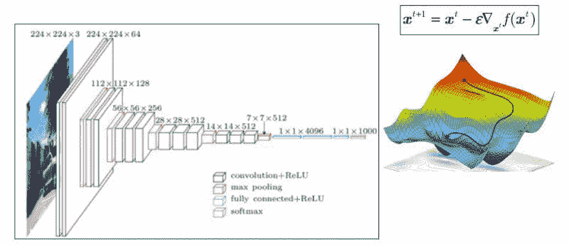
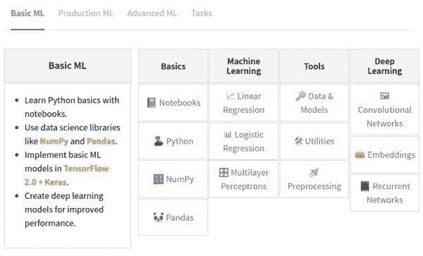

# 10 个免费的顶级机器学习课程

> 原文：[`www.kdnuggets.com/2019/12/10-free-top-notch-courses-machine-learning.html`](https://www.kdnuggets.com/2019/12/10-free-top-notch-courses-machine-learning.html)

评论

假期将至，如果你在家人、朋友和同事之间的活动中找不到消遣时间，何不利用这些优质的免费在线课程呢？

这是一个包含免费优质在线机器学习课程的集合，来自一些受尊敬的大学以及其他在线平台。无论你是寻找入门课程还是更高级的主题，理论课程还是实践课程，或者是一般性主题还是特定主题，这里的课程都应该能够满足你年末学习的需求。查看下面的课程，今天就开始学习新的知识吧。

别忘了查看底部的相关帖子，获取更多免费的机器学习课程。

来源: [机器学习简介（布法罗大学）](https://cedar.buffalo.edu/~srihari/CSE574/)

**1\. [Python 中的机器学习](https://www.springboard.com/resources/learning-paths/machine-learning-python/)**

Springboard

> 机器学习是过去十年中最热门的新技术之一，正在改变从消费电子到医疗保健，再到零售等领域。这导致许多学生和在职专业人士对这一行业产生了强烈的好奇。
> 
> 如果你是一名技术专业人士，比如软件开发者、业务分析师，甚至是产品经理，你可能会对机器学习如何改变你的工作方式和推动你的职业发展感到好奇。然而，作为一名忙碌的专业人士，你可能也在寻找一种既严格又实用，同时又简洁快速的机器学习理解方式。本教程将帮助你实现这些目标。

**2\. [机器学习简介](https://cedar.buffalo.edu/~srihari/CSE574/)**

布法罗大学

> 机器学习是一个关于设计可以从示例中学习的机器的激动人心的话题。课程涵盖了机器学习所需的理论、原则和算法。这些方法基于统计学和概率学——这些已经成为设计展现人工智能的系统的核心。
> 
> 参考教材包括 Chris Bishop 的《模式识别与机器学习》（Springer 2006）、Daphne Koller 和 Nir Friedman 的《概率图模型》（MIT Press 2009）以及 Goodfellow、Bengio 和 Courville 的《深度学习》（MIT Press 2016）。

**3\. [实用 AI: 机器学习的实用方法](https://practicalai.me/)**

practicalAI

> 

**4\. [一个 Python 的机器学习课程](https://github.com/machinelearningmindset/machine-learning-course)**

机器学习思维模式

> 机器学习作为人工智能的工具，是最广泛采用的科学领域之一。大量文献已经发布关于机器学习的内容。该项目的目的是通过使用 Python 提供机器学习的最重要方面，呈现一系列简单而全面的教程。在这个项目中，我们使用了许多不同的知名机器学习框架，如 Scikit-learn，来构建我们的教程。

**5\. [智能系统的机器学习](http://www.cs.cornell.edu/courses/cs4780/2018fa/syllabus/index.html)**

康奈尔大学

> 机器学习领域关注的问题是如何构建能够随着经验自动改进的计算机程序。近年来，许多成功的机器学习应用已经开发出来，从学习检测欺诈信用卡交易的数据挖掘程序，到学习用户阅读偏好的信息过滤系统，再到学习驾驶的自主车辆。此外，该领域的理论和算法也取得了重要进展。本课程将提供对机器学习领域的广泛介绍。先决条件：CSE 241 及足够的数学基础（矩阵代数、概率论/统计学、多变量微积分）。讲师将举行一场家庭考试（关于基本数学知识），考试截止日期为 1 月 30 日。

**6\. [深度学习](https://cedar.buffalo.edu/~srihari/CSE676/index.html)**

布法罗大学

> 深度学习算法学习数据的多层次表示，每一层以层级方式解释数据。这些算法在揭示数据中潜在结构方面非常有效，例如区分类别的特征。它们在许多人工智能问题中取得了成功，包括图像分类、语音识别和自然语言处理。该课程将通过讲座和项目进行教学，内容将涵盖基本理论、应用范围及从非常大的数据集中学习。课程将涉及与深度学习相关的连接主义架构，例如基础神经网络、卷积神经网络和递归神经网络。主要重点将是训练和优化这些架构的方法，以及如何有效地进行推理。学生将被鼓励使用开源软件库，如 Tensorflow。

**7\. [计算机视觉中的深度学习](http://www.scs.ryerson.ca/~kosta/CP8309-F2018/index.html)**

赖尔森大学

> 计算机视觉被广泛定义为从一张或多张图像中恢复世界的有用属性。近年来，深度学习作为解决计算机视觉任务的强大工具逐渐显现。本课程将涵盖深度学习和计算机视觉交叉领域的一系列基础主题。

**8\. [机器学习中的可解释性与解释性](https://interpretable-ml-class.github.io/)**

哈佛大学

> 随着机器学习模型越来越多地被用于帮助决策者在高风险环境中，如医疗保健和刑事司法，确保决策者（最终用户）正确理解并信任这些模型的功能变得尤为重要。该研究生课程旨在使学生熟悉解释性和可解释性机器学习的新进展。在本课程中，我们将回顾该领域的重要论文，理解模型解释性和可解释性的概念，详细讨论不同类型的可解释模型（例如，基于原型的方法、稀疏线性模型、基于规则的技术、广义加性模型）、后置解释（黑箱解释，包括反事实解释和显著性图），并探索解释性与因果关系、调试和公平性的关系。课程还将强调各种可以从模型解释性中获得巨大收益的应用，包括刑事司法和医疗保健。

*编辑注：课程在撰写时正在进行中，并非所有资源都已在线提供。*

**9\. [自然语言处理中的主题](https://www.cs.bgu.ac.il/~elhadad/nlp19.html)**

内盖夫本-古里安大学

> 这门课程是自然语言处理的入门课程。课程的主要目标是学习如何开发能够在自然语言上执行智能任务的实用计算机系统：分析、理解和生成书面文本。这个任务需要从多个领域学习材料：语言学、机器学习和统计分析，以及核心的自然语言技术。

**10\. [概率图模型课程](https://cedar.buffalo.edu/~srihari/CSE674/)**

布法罗大学

> 概率图模型是概率分布的图形表示。这些模型在表示许多科学和工程应用中遇到的复杂概率分布方面非常灵活。它们现在已成为设计展现高级人工智能的系统（如深度学习的生成模型）的关键。
> 
> 课程涵盖了与概率图模型相关的理论、原理和算法。讨论了有向图模型（贝叶斯网络）和无向图模型（马尔可夫网络），包括表示、推理和学习。

**相关**：

+   10 门必看的免费机器学习和数据科学课程

+   另 10 门必看的免费机器学习和数据科学课程

+   另 10 门必看的免费机器学习和数据科学课程

### 更多相关内容

+   [成为优秀数据科学家所需的 5 项关键技能](https://www.kdnuggets.com/2021/12/5-key-skills-needed-become-great-data-scientist.html)

+   [每个初学者数据科学家应该掌握的 6 种预测模型](https://www.kdnuggets.com/2021/12/6-predictive-models-every-beginner-data-scientist-master.html)

+   [2021 年最佳 ETL 工具](https://www.kdnuggets.com/2021/12/mozart-best-etl-tools-2021.html)

+   [学习数据科学统计学的顶级资源](https://www.kdnuggets.com/2021/12/springboard-top-resources-learn-data-science-statistics.html)

+   [停止学习数据科学以寻找目标，并寻找目标去…](https://www.kdnuggets.com/2021/12/stop-learning-data-science-find-purpose.html)

+   [建立一个强大的数据团队](https://www.kdnuggets.com/2021/12/build-solid-data-team.html)
