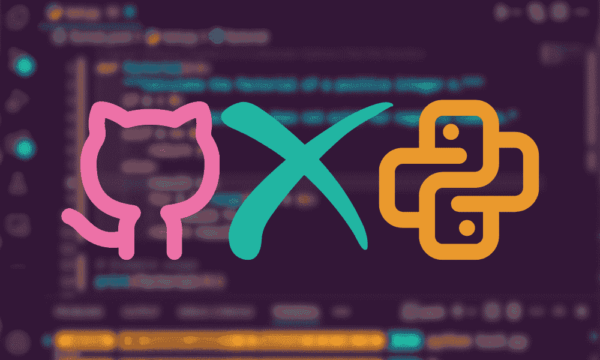

# 精通 Python 的 10 个 GitHub 库

> 原文：[`www.kdnuggets.com/10-github-repositories-to-master-python`](https://www.kdnuggets.com/10-github-repositories-to-master-python)

作者提供的图片

我们都知道免费的 Python 课程是学习这门语言的最佳方式，但你是否曾经查看过 GitHub 平台上的学习资源和项目？从课程中学习很棒，但通过实际项目和开源库进行实践可以将你的 Python 技能提升到一个新的水平。

* * *

## 我们的前三个课程推荐

 1\. [谷歌网络安全证书](https://www.kdnuggets.com/google-cybersecurity) - 快速进入网络安全职业生涯。

 2\. [谷歌数据分析专业证书](https://www.kdnuggets.com/google-data-analytics) - 提升你的数据分析技能

 3\. [谷歌 IT 支持专业证书](https://www.kdnuggets.com/google-itsupport) - 支持你的组织的 IT 需求

* * *

在这篇博客中，我们将介绍 10 个重要的 GitHub 库，帮助你精通 Python，并为你的职业生涯提供必备经验。这些库提供了丰富的知识，从适合初学者的教程到高级编码挑战，涵盖了广泛的主题，如网页开发、数据分析、机器学习等。

# 1\. Asabeneh/30-Days-Of-Python

[Asabeneh/30-Days-Of-Python](https://github.com/Asabeneh/30-Days-Of-Python) 通过为期一个月的挑战来开启你的 Python 学习之旅。该库为初学者设计，介绍了 Python 基础知识，并逐步深入到更复杂的主题，如统计学、数据分析、网页开发和数据库管理。每天花费几个小时，你将获得扎实的 Python 基础，为你转入任何技术岗位铺平道路。

# 2\. trekhleb/learn-python

[trekhleb/learn-python](https://github.com/trekhleb/learn-python) 是一个全面的资源，强调通过破解学习 Python。它涵盖了广泛的 Python 函数和最佳实践，适合不同水平的学习者。你可以修改或添加代码来查看其工作原理，并使用断言进行测试。这种互动式学习方法允许你添加和删除代码，以测试其是否正常工作，帮助你提升学习体验。

# 3\. Avik-Jain/100-Days-Of-ML-Code

对于那些希望深入了解 Python 机器学习的用户，[Avik-Jain/100-Days-Of-ML-Code](https://github.com/Avik-Jain/100-Days-Of-ML-Code) 提供了一种结构化的方法来掌握机器学习的基础。在 100 天内，它介绍了机器学习中的关键概念和算法，并利用 Python 进行实际实现。这个仓库非常适合希望转型为机器学习工程师的程序员。

# 4\. realpython/python-guide

[realpython/python-guide](https://github.com/realpython/python-guide/tree/master) 是一本免费提供在 GitHub 上的《Python 路书》。该指南包含了最佳实践和 Python 在各种场景中的应用。它提供了从设置和安装到高级主题如网页开发和机器学习的指导。《Python 路书》是开发者提升 Python 技能的宝贵资源。

# 5\. zhiwehu/Python-programming-exercises

[zhiwehu/Python-programming-exercises](https://github.com/zhiwehu/Python-programming-exercises) 挑战你的是一个包含 100 多个 Python 练习的集合，从简单到困难不等。它旨在测试和提高你的 Python 问题解决能力。这个仓库非常适合那些希望练习编码并为编码面试做准备的学习者。

# 6\. geekcomputers/Python

[geekcomputers/Python](https://github.com/geekcomputers/Python) 是一个包含各种 Python 脚本的代码库，展示了使用 Python 编程可以构建的不同内容。从简单的脚本到复杂的项目，它提供了一个实际的视角，说明了 Python 如何用于自动化任务，并作为初学者入门 Python 的教育示例。

# 7\. practical-tutorials/project-based-learning

[practical-tutorials/project-based-learning](https://github.com/practical-tutorials/project-based-learning?tab=readme-ov-file#python) 仓库是一个宝贵的资源，提供了各种编程语言的基于项目的教程链接，特别关注 Python。

通过基于项目的方法学习是一种有效的方式，可以将 Python 概念应用到现实世界的场景中。此外，它还可以帮助你建立开发者作品集，并获得经验，从而确保你的第一份工作。

# 8\. avinashkranjan/Amazing-Python-Scripts

[avinashkranjan/Amazing-Python-Scripts](https://github.com/avinashkranjan/Amazing-Python-Scripts) 仓库是一个汇集了各种 Python 脚本的集合，这些脚本可以帮助自动化任务、执行网页抓取等。这个资源对那些想要独立完成小项目的学生特别有用，因为有很多选择。此外，这些脚本也可以帮助构建更复杂的项目。

# 9\. TheAlgorithms/Python

如果你对算法感兴趣，[TheAlgorithms/Python](https://github.com/TheAlgorithms/Python)是一个很好的仓库。它提供了各种算法和数据结构的 Python 实现，提供了全面的算法学习体验。这个仓库非常适合那些希望探索计算机科学基础和竞争编程的人。然而，请注意，这些实现仅用于学习目的，可能不如 Python 标准库中的实现高效。

# 10\. vinta/awesome-python

最后，[vinta/awesome-python](https://github.com/vinta/awesome-python)仓库是一个收集了卓越 Python 框架、库、软件和资源的集合。它是探索 Python 工具和库的绝佳来源，能够帮助你完成项目和学习之旅。无论你寻找的是 Web 框架、数据分析工具，还是与 Python 相关的任何东西，你都可能在这里找到。

# 结论

这 10 个 GitHub 仓库向你介绍了 Python 编程的世界，涵盖了从基础到高级的主题，包括互动学习、基于项目的学习和基于练习的学习。通过探索这些仓库，你可以建立 Python 的坚实基础，发展解决问题的技能，并参与实际项目以积累经验。记住，学习 Python 的旅程是持续不断且不断发展的，这些仓库只是开始！

****[Abid Ali Awan](https://www.polywork.com/kingabzpro)**** ([@1abidaliawan](https://www.linkedin.com/in/1abidaliawan))是一位认证的数据科学专业人士，喜欢构建机器学习模型。目前，他专注于内容创作并撰写有关机器学习和数据科学技术的技术博客。Abid 拥有技术管理硕士学位和电信工程学士学位。他的愿景是使用图神经网络为那些与心理疾病斗争的学生构建 AI 产品。

### 更多相关话题

+   [掌握机器学习的 10 个 GitHub 仓库](https://www.kdnuggets.com/10-github-repositories-to-master-machine-learning)

+   [掌握计算机科学的 10 个 GitHub 仓库](https://www.kdnuggets.com/10-github-repositories-to-master-computer-science)

+   [掌握数据工程的 10 个 GitHub 仓库](https://www.kdnuggets.com/10-github-repositories-to-master-data-engineering)

+   [掌握 MLOps 的 10 个 GitHub 仓库](https://www.kdnuggets.com/10-github-repositories-to-master-mlops)

+   [掌握 SQL 的 10 个 GitHub 仓库](https://www.kdnuggets.com/10-github-repositories-to-master-sql)

+   [掌握数据科学的 10 个 GitHub 仓库](https://www.kdnuggets.com/10-github-repositories-to-master-data-science)
