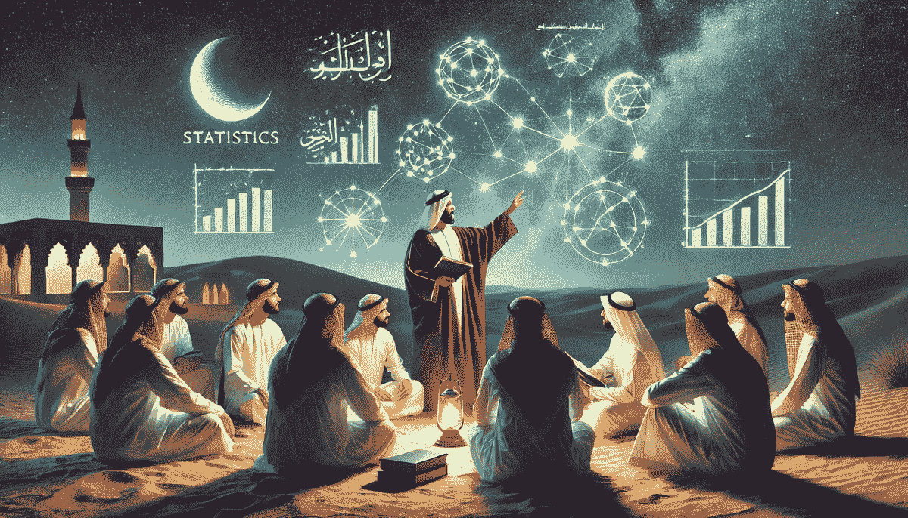

# 10 个 GitHub 仓库来掌握统计学

> 原文：[`www.kdnuggets.com/10-github-repositories-to-master-statistics`](https://www.kdnuggets.com/10-github-repositories-to-master-statistics)

图片由 ChatGPT 生成

学习统计学是成为数据科学家、数据分析师或甚至 AI 工程师的核心部分。现代技术中使用的大多数机器学习模型都是统计模型。因此，对统计学有深入的理解将使你更容易学习和构建先进的 AI 技术。

* * *

## 我们的前三大课程推荐

 1\. [谷歌网络安全证书](https://www.kdnuggets.com/google-cybersecurity) - 快速进入网络安全职业生涯

 2\. [谷歌数据分析专业证书](https://www.kdnuggets.com/google-data-analytics) - 提升你的数据分析能力

 3\. [谷歌 IT 支持专业证书](https://www.kdnuggets.com/google-itsupport) - 支持你的组织 IT

* * *

在这篇博客中，我们将探索 10 个 GitHub 仓库，帮助你掌握统计学。这些仓库包括代码示例、书籍、Python 库、指南、文档和视觉学习材料。

## 1\. 《数据科学家实用统计学》

**仓库：** [gedeck/practical-statistics-for-data-scientists](https://github.com/gedeck/practical-statistics-for-data-scientists)

这个仓库提供了来自《数据科学家实用统计学》一书的实际示例和代码片段，涵盖了基本的统计技术和概念。对于希望将统计方法应用于实际场景的数据科学家来说，这是一个很好的起点。

书中的代码仓库包含了适当的 R 和 Python 代码示例。如果你习惯了 Jupyter Notebook 风格的编码，它还提供了类似的 Python 和 R 的 Jupyter Notebook 示例。

## 2\. 《黑客的概率编程和贝叶斯方法》

**仓库：** [CamDavidsonPilon/Probabilistic-Programming-and-Bayesian-Methods-for-Hackers](https://github.com/CamDavidsonPilon/Probabilistic-Programming-and-Bayesian-Methods-for-Hackers)

这个仓库提供了使用 Python 的贝叶斯方法的互动式实践介绍。内容以 Jupyter 笔记本形式呈现，通过 nbviewer 展示，使得跟随关于贝叶斯模型和概率编程的理论及 Python 代码变得更加容易。

这本互动书籍包括对贝叶斯方法的介绍，Python 的 PyMC 库入门，马尔科夫链蒙特卡罗，大数法则，损失函数等内容。

## 3\. Statsmodels：Python 中的统计建模和计量经济学

**仓库：** [statsmodels/statsmodels](https://github.com/statsmodels/statsmodels)

Statsmodels 是一个强大的 Python 统计建模和计量经济学库。该仓库包括了执行各种统计测试、线性模型、时间序列分析等的全面文档和示例。我们可以使用这些文档中的示例来学习如何执行各种统计分析，包括时间序列分析、生存分析、多元分析、线性回归等。

## 4\. 《TensorFlow 概率》

**仓库：** [tensorflow/probability](https://github.com/tensorflow/probability)

TensorFlow Probability 是一个用于 TensorFlow 中的概率推理和统计分析的库。它扩展了 TensorFlow 核心库，提供了构建和训练概率模型的工具，是那些希望将深度学习与统计建模结合的人的极佳资源。

文档包含了线性混合效应模型、分层线性模型、概率主成分分析、贝叶斯神经网络等示例。

## 5\. 《概率与统计烹饪书》

**仓库：** [mavam/stat-cookbook](https://github.com/mavam/stat-cookbook)

该仓库是一个解决常见统计问题的食谱集合，为各种统计任务提供快速解决方案和示例，作为一个有用的参考。它提供了有关概率和统计的简明指导，包括连续分布、概率理论、随机变量、期望、方差和不等式等概念。你可以使用 make 命令本地访问食谱或下载 PDF 文件。该仓库还包括各种统计概念的 LaTeX 文件。

## 6\. 《看到理论》

**仓库：** [seeingtheory/Seeing-Theory](https://github.com/seeingtheory/Seeing-Theory)

《看到理论》是一个概率和统计的视觉介绍。该仓库包括互动可视化和解释，使复杂的统计概念变得更易于理解，尤其适合视觉学习者。

这是一本高度互动的初学者书籍，涵盖了各种主题，如基础概率、复合概率、概率分布、频率推断、贝叶斯推断和回归分析。

## 7\. 《Python 统计数学》

**仓库：** [tirthajyoti/Stats-Maths-with-Python](https://github.com/tirthajyoti/Stats-Maths-with-Python)

该仓库包含了涵盖一般统计学、数学编程和使用 Python 的科学计算的脚本和 Jupyter 笔记本。对于那些希望提升统计和数学编程技能的人来说，这是一个宝贵的资源。

它包括贝叶斯规则、布朗运动、假设检验、线性回归等示例。

## 8\. 《概率、统计与机器学习的 Python》

**代码库：** [unpingco/Python-for-Probability-Statistics-and-Machine-Learning](https://github.com/unpingco/Python-for-Probability-Statistics-and-Machine-Learning)

该代码库包含了《Python for Probability, Statistics, and Machine Learning》一书中的代码示例和 Jupyter 笔记本，涵盖了从基本概率和统计到高级机器学习技术的广泛主题。

在“chapters”文件夹内，有三个子文件夹，包含了关于统计学、概率论和机器学习的 Jupyter 笔记本。每个笔记本都包括代码、输出和描述，解释了方法论、代码和结果。

## 9\. 概率与统计 VIP 备忘单

**代码库：** [shervinea/stanford-cme-106-probability-and-statistics](https://github.com/shervinea/stanford-cme-106-probability-and-statistics)

该代码库包含斯坦福大学工程师概率与统计课程的 VIP 备忘单。这些备忘单提供了关键概念和公式的简明总结，是学生和专业人士的实用参考。

这是一个流行的备忘单，涵盖了条件概率、随机变量、参数估计、假设检验等主题。

## 10\. 机器学习基础数学

**代码库：** [hrnbot/Basic-Mathematics-for-Machine-Learning](https://github.com/hrnbot/Basic-Mathematics-for-Machine-Learning)

理解数学基础对掌握机器学习和统计学至关重要。该代码库旨在揭示数学的奥秘，并通过 Python Jupyter 笔记本帮助你学习代数、微积分、统计学、概率论、向量和矩阵的基础知识。

## 终极思考

在 GitHub 上分享的学习资源由专家和开源社区创建，旨在分享知识，为数据科学和统计领域的初学者铺平更容易的学习道路。你将通过阅读理论、解决代码示例、理解数学概念、构建项目、进行各种分析和探索流行的统计工具来学习统计学。所有这些内容都在上述 GitHub 代码库中涵盖。这些资源是免费的，任何人都可以参与改进它们。所以，继续学习并构建惊人的事物。

****[Abid Ali Awan](https://www.polywork.com/kingabzpro)**** ([@1abidaliawan](https://www.linkedin.com/in/1abidaliawan)) 是一位认证数据科学专家，热衷于构建机器学习模型。目前，他专注于内容创作和撰写有关机器学习和数据科学技术的技术博客。Abid 拥有技术管理硕士学位和电信工程学士学位。他的愿景是利用图神经网络为面临心理健康问题的学生打造一个 AI 产品。

### 了解更多

+   [掌握机器学习的 10 个 GitHub 仓库](https://www.kdnuggets.com/10-github-repositories-to-master-machine-learning)

+   [掌握计算机科学的 10 个 GitHub 仓库](https://www.kdnuggets.com/10-github-repositories-to-master-computer-science)

+   [掌握数据工程的 10 个 GitHub 仓库](https://www.kdnuggets.com/10-github-repositories-to-master-data-engineering)

+   [掌握 MLOps 的 10 个 GitHub 仓库](https://www.kdnuggets.com/10-github-repositories-to-master-mlops)

+   [掌握 Python 的 10 个 GitHub 仓库](https://www.kdnuggets.com/10-github-repositories-to-master-python)

+   [掌握 SQL 的 10 个 GitHub 仓库](https://www.kdnuggets.com/10-github-repositories-to-master-sql)
