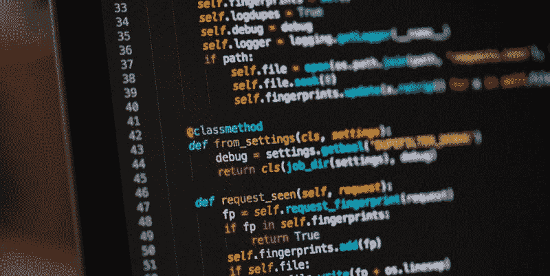

# 10 个适合有志数据科学家的优秀 Python 资源

> 原文：[`www.kdnuggets.com/2019/09/10-great-python-resources-aspiring-data-scientists.html`](https://www.kdnuggets.com/2019/09/10-great-python-resources-aspiring-data-scientists.html)

评论

Python 是数据科学中使用最广泛的语言之一，还是一个[极受欢迎的通用编程语言](https://spectrum.ieee.org/computing/software/the-top-programming-languages-2019)。

* * *

## 我们的前三大课程推荐

 1\. [Google 网络安全证书](https://www.kdnuggets.com/google-cybersecurity) - 快速进入网络安全职业生涯。

 2\. [Google 数据分析专业证书](https://www.kdnuggets.com/google-data-analytics) - 提升你的数据分析技能

 3\. [Google IT 支持专业证书](https://www.kdnuggets.com/google-itsupport) - 支持你的组织 IT

* * *

许多潜在的数据科学家首先面临的问题是，当开始涉足数据科学时，哪种编程语言可能是他们的选择。如果你没有现成的编程技能，这个问题会更加复杂。如果你能对 Python 有一个深入的理解（如果你的数据科学编程工具是其他语言，则替换为该语言），那将更好，但许多新手发现自己在编程一般或 Python 更具体的领域，几乎是从零开始。

这是一个包含 10 个有趣资源的集合，以文章和教程的形式，旨在为新手数据科学家提供洞察和实用指导。请注意，这些资源不是数据科学教程，而是涵盖边缘相关的主题和一般 Python 编程知识。

所以在此不再赘述，按无特定顺序，以下是 10 个旨在帮助你更好地学习 Python 的资源。

**1\. [有用的 Python 技巧 A-Z](https://www.freecodecamp.org/news/an-a-z-of-useful-python-tricks-b467524ee747/)**

> 我每天都使用 Python，它是我作为数据科学家工作的重要组成部分。在这个过程中，我掌握了一些有用的技巧和窍门。
> 
> 在这里，我以 A-Z 格式分享了一些技巧。
> 
> 这些“技巧”大多是我在日常工作中使用或偶然发现的。一些是我在浏览 Python 标准库文档时发现的，还有一些是在搜索 PyPi 时发现的。

**2\. [愉快地迁移到 Python 3](https://github.com/arogozhnikov/python3_with_pleasure)**

> Python 成为了机器学习和其他以数据为主的科学领域的主流语言；它拥有各种深度学习框架和成熟的数据处理与可视化工具。
> 
> 然而，Python 生态系统在 Python 2 和 Python 3 中共存，Python 2 在数据科学家中仍被使用。到 2019 年底，科学堆栈将停止支持 Python2\. 至于 numpy，2018 年后，任何新的功能发布将仅支持 Python3\. *更新（2018 年 9 月）：pandas、matplotlib、ipython、jupyter notebook 和 jupyter lab 现在也同样适用*。
> 
> 为了使过渡不那么令人沮丧，我收集了一些你可能会觉得有用的 Python 3 特性。

**3\. [10 分钟掌握函数式 Python](https://hackernoon.com/learn-functional-python-in-10-minutes-to-2d1651dece6f)**

> 在本文中，你将学习什么是函数式范式以及如何在 Python 中使用函数式编程。你还将了解列表推导式和其他形式的推导式。

**4\. [Python 异步编程：一个全面指南](https://insights.dice.com/2019/04/23/asynchronous-programming-python-walkthrough/)**

> 在 asyncio（有时写作 async IO）之前，Python 使用了基于生成器的协程；Python 3.10 移除了这些协程。asyncio 模块在 Python 3.4 中引入，async/await 则在 3.5 中加入。
> 
> 这里有几个你应该了解的异步概念：协程和任务。我们先来看一下协程。

**5\. [有问题的 Python 代码：Python 开发者最常犯的 10 个错误](https://www.toptal.com/python/top-10-mistakes-that-python-programmers-make)**

> Python 简单易学的语法可能会误导 Python 开发者——特别是那些对语言较新的开发者——忽视其一些细微之处，并低估了 Python 语言的多样性和强大功能。
> 
> 鉴于这一点，本文呈现了一个“前 10”列表，列出了即使是一些更高级的 Python 开发者也可能会犯的一些微妙且难以发现的错误。

**6\. [Python 装饰器入门](https://realpython.com/primer-on-python-decorators/)**

> 在本教程中，我们将了解装饰器是什么，以及如何创建和使用它们。装饰器提供了一种简单的语法来调用高阶函数。
> 
> 根据定义，装饰器是一个函数，它接受另一个函数，并在不显式修改后者函数的情况下扩展其行为。

**7\. [Python 入门 - 数据结构](https://python.swaroopch.com/data_structures.html)**

> 数据结构基本上就是这些 - 它们是可以将一些数据放在一起的结构。换句话说，它们用于存储相关数据的集合。
> 
> Python 有四种内置数据结构——*列表、元组、字典* 和 *集合*。我们将看看如何使用它们，以及它们如何使我们的生活更轻松。

**8\. [Django 入门教程 第一部分：构建一个作品集应用](https://realpython.com/get-started-with-django-1/)**

> Django 是一个功能齐全的 Python 网络框架，可以用来构建复杂的网络应用程序。在本教程中，你将通过示例学习 Django。你将按照步骤创建一个功能完整的网络应用程序，同时了解框架的一些重要特性及其如何协同工作。
> 
> 在本系列的后续文章中，你将看到如何利用 Django 的更多功能构建更复杂的网站，这些内容会超出本教程的范围。

**9\. [数据科学初学者的 Python 指南](https://towardsdatascience.com/a-beginners-guide-to-python-for-data-science-60ef022b7b67)**

> 一些编程语言在数据科学的核心中占据重要位置。Python 就是其中之一。它是数据科学的一个重要组成部分，反之亦然。实际上，要详细解释这一点将会非常漫长。
> 
> 首先，Python 提供了强大的功能来处理数学、统计和科学函数。在数据科学应用中，它提供了广泛的库来处理这些问题。更不用说它是开源的、解释型的、高级工具了！

**10\. [为什么 Python 对数据分析至关重要](https://www.simplilearn.com/why-python-is-essential-for-data-analysis-article)**

> Python 是一种通用编程语言，这意味着它可以用于开发网络和桌面应用程序。它在复杂的数值和科学应用开发中也很有用。由于这种多样性，Python 成为世界上增长最快的编程语言之一也就不足为奇了。
> 
> 那么 Python 如何与数据分析相结合呢？我们将详细探讨为什么这门多功能编程语言对任何希望从事数据分析工作的人来说都是必不可少的，或者对那些寻找提升技能途径的人来说很重要。了解这些之后，你将更清楚为什么应该选择 Python 进行数据分析。

**相关内容**：

+   10 个更多必看免费课程，适用于机器学习和数据科学

+   10 本机器学习和数据科学必读的免费书籍

+   另外 10 本机器学习和数据科学必读的免费书籍

### 更多相关内容

+   [使用管道编写干净的 Python 代码](https://www.kdnuggets.com/2021/12/write-clean-python-code-pipes.html)

+   [建立一个强大的数据团队](https://www.kdnuggets.com/2021/12/build-solid-data-team.html)

+   [数据科学学习统计的顶级资源](https://www.kdnuggets.com/2021/12/springboard-top-resources-learn-data-science-statistics.html)

+   [成为优秀数据科学家所需的五项关键技能](https://www.kdnuggets.com/2021/12/5-key-skills-needed-become-great-data-scientist.html)

+   [每个数据科学家都应该了解的三个 R 库（即使你使用 Python）](https://www.kdnuggets.com/2021/12/three-r-libraries-every-data-scientist-know-even-python.html)

+   [是什么让 Python 成为初创公司的理想编程语言](https://www.kdnuggets.com/2021/12/makes-python-ideal-programming-language-startups.html)
