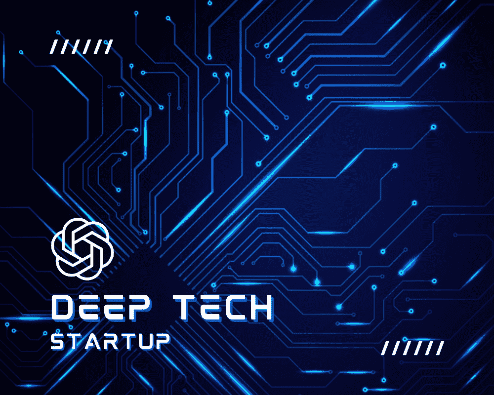
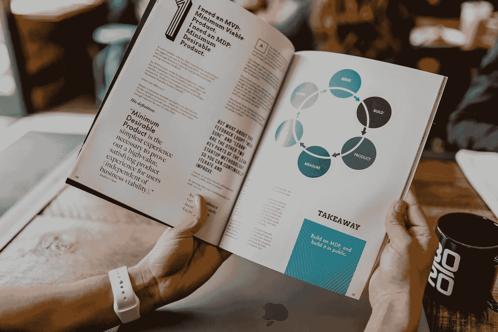

# 10 个在 ChatGPT 时代建立深科技初创公司的障碍

> 原文：[`www.kdnuggets.com/2023/04/10-hurdles-building-deep-tech-startup-age-chatgpt.html`](https://www.kdnuggets.com/2023/04/10-hurdles-building-deep-tech-startup-age-chatgpt.html)

图片由编辑提供

深科技初创公司面临着与其他科技公司不同的一系列挑战，这使得创始人和投资者必须做好更加复杂和苛刻的旅程的准备。

* * *

## 我们的前三名课程推荐

 1\. [Google 网络安全证书](https://www.kdnuggets.com/google-cybersecurity) - 快速进入网络安全职业生涯。

 2\. [Google 数据分析专业证书](https://www.kdnuggets.com/google-data-analytics) - 提升您的数据分析水平

 3\. [Google IT 支持专业证书](https://www.kdnuggets.com/google-itsupport) - 支持您的组织在 IT 领域

* * *

AI 和 ML 在这些公司中发挥了关键作用，使它们能够分析大量数据、识别模式并开发先进的解决方案，同时市场营销却退居一旁。

大型语言模型（LLMs），如 GPT-4，正在革新自然语言处理、药物发现和个性化医学。LLMs 还可以促进与用户的对话，使医疗提供者能够开发提供心理健康支持、回答患者问题甚至提供治疗干预的聊天机器人。通过利用 AI 的力量，这些前沿技术有可能改变心理健康护理的未来，并改善全球数百万人的生活。

在创建了之前的科技公司 Bright Box 并在 2017 年以 7500 万美元出售后，我发现自己在新的公司 Brainify.ai 中面临不同的环境，该公司旨在通过利用 AI/ML 驱动的 EEG 生物标志物预测，将新药批准的可能性提高 80% 并减少研发成本。

# 技术复杂性

深科技初创公司通常致力于前沿技术，这些技术在科学上非常复杂，需要对基础原理有深入的理解。这需要领域内具有专业知识的专家参与，这可能难以找到和留住。

# 长期开发周期

开发和验证新技术可能需要相当长的时间。这可能导致较长的开发周期和市场进入延迟，这对资源有限的初创公司尤其具有财务挑战。

图片来自 Unsplash

# 高风险性质

由于科学研究和开发中固有的不确定性，深科技初创企业往往面临更高的失败风险。投资者可能对资助这些企业持更谨慎的态度，这使得深科技初创企业更难获得资金。

# 监管障碍

深科技初创企业可能会在高度监管的行业中运营，例如医疗保健、生物技术或能源。应对复杂的监管要求和获得必要的批准可能耗时且资源密集。

# 知识产权（IP）保护

深科技初创企业通常依赖于有价值的知识产权（IP）来维持其竞争优势。通过专利和其他法律机制保护这些知识产权可能具有挑战性、昂贵，并且对初创企业的成功至关重要。

# 深科技初创企业的市场营销策略

作为一名经验丰富的企业家，在深科技初创企业中，最具挑战性的方面之一就是市场营销方式的差异。在深科技领域，大量时间花费在隐秘阶段，专注于研发，然后才会推广任何产品或服务。与其他行业不同，在其他行业中，市场营销可以在产品开发过程中早早开始，而深科技初创企业必须谨慎行事，确保任何提出的主张都经过科学验证和证明。

这意味着我不得不采取更为保守的营销策略，仅在我们达到特定里程碑或对我们的技术有了特定信心的阈值后才推广我们的产品。维护我们在科学界以及潜在投资者和客户中的声誉至关重要，因为在这一领域，可信度是关键。任何过早或未经证实的主张都可能迅速损害我们的声誉，并阻碍我们在长期内取得成功的能力。

图片来自 Unsplash

# 准确沟通

在围绕我们的技术建立兴奋感与确保我们仅传达准确和可验证的信息之间找到微妙的平衡，一直是经营深科技初创企业的特别具有挑战性的方面。

# 广泛的研究

深科技初创企业的主要区分因素在于广泛的研究活动、高风险和初期开发阶段的不确定性。最初，通常无法知道初创企业的科学基础是否可能。

# 科学失败的高风险

这与典型的科技初创企业形成对比，后者的重点更多在于产品市场契合度和执行策略。换句话说，对于科技初创企业而言，重点在于业务如何开展，而不是是否可行。而深科技初创企业由于研究活动的固有性质和涉及的不确定性，面临着更高的科学失败风险。

# 验证后的资金筹集

为我们的初创公司获得资金始于 Mariam Khayaredinova（首席执行官兼联合创始人）和我个人的 25 万美元投资。我们希望首先验证解决方案的需求并评估实现目标的可能性。一旦我们对创意的潜力有信心，我们决定从天使投资者那里筹集更多资本。凭借我之前的退出经验和我们强大的业绩记录，我们成功从天使投资者那里获得了约 100 万美元，并从创始团队获得了额外的 35 万美元。

目前，我们正在证明市场适配性，展示我们技术的可扩展性，并向投资者展示潜在的丰厚回报。保持对最新进展和新兴机会的关注至关重要。深度技术领域不断发展，因此了解挑战和可能性对成功至关重要。

**[Ivan Mishanin](https://www.linkedin.com/in/ivanmishanin/)** 是 Brainify.ai 的联合创始人兼首席运营官，该平台致力于用于精神病学的新治疗开发的 AI/ML 生物标志物。他之前的科技公司 Bright Box 被苏黎世保险集团以 7500 万美元收购。

### 了解更多此话题

+   [12 条建议：从数据分析师到初创公司联合创始人](https://www.kdnuggets.com/2021/12/12-tips-data-analyst-to-co-founder.html)

+   [生成 AI 时代的数据科学家仍然需要吗？](https://www.kdnuggets.com/2023/06/data-scientists-still-needed-age-generative-ai.html)

+   [理解 AI 时代的数据隐私](https://www.kdnuggets.com/understanding-data-privacy-in-the-age-of-ai)

+   [使用 Llama 和 ChatGPT 构建多聊天后台的微服务](https://www.kdnuggets.com/building-microservice-for-multichat-backends-using-llama-and-chatgpt)

+   [Visual ChatGPT: 微软结合 ChatGPT 和 VFM](https://www.kdnuggets.com/2023/03/visual-chatgpt-microsoft-combine-chatgpt-vfms.html)

+   [ChatGPT CLI: 将你的命令行界面转变为 ChatGPT](https://www.kdnuggets.com/2023/07/chatgpt-cli-transform-commandline-interface-chatgpt.html)
