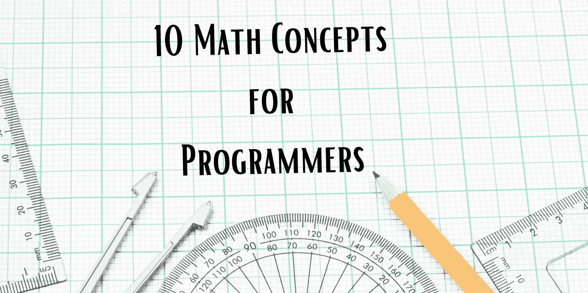

# 程序员的 10 个数学概念

> 原文：[`www.kdnuggets.com/10-math-concepts-for-programmers`](https://www.kdnuggets.com/10-math-concepts-for-programmers)

作者提供的图片

随着对程序员需求的增加，供应自然会因更多人进入行业而增加。然而，这个行业竞争激烈。为了持续提升自己，提升技能并增加薪资——你需要证明自己是一个高效的程序员。你可以通过学习那些别人通常不知道的东西来做到这一点。

* * *

## 我们的前三名课程推荐

 1\. [谷歌网络安全证书](https://www.kdnuggets.com/google-cybersecurity) - 快速进入网络安全职业道路。

 2\. [谷歌数据分析专业证书](https://www.kdnuggets.com/google-data-analytics) - 提升你的数据分析技能

 3\. [谷歌 IT 支持专业证书](https://www.kdnuggets.com/google-itsupport) - 支持你的组织的 IT 需求

* * *

许多人进入编程行业时以为不需要了解背后的数学。虽然这在某种程度上是对的，但理解编程背后的逻辑数学概念会让你成为一个更高效的程序员。

怎么做？通过理解你在做什么以及发生了什么。就是这样。

那么，让我们直接进入主题吧。程序员的十大数学概念是什么？

# 布尔代数

布尔代数源于代数。我想这很明显。如果你是程序员或正在成为程序员的路上，你可能已经知道什么是布尔代数。如果没有，我会迅速定义一下。

布尔值是一种数据类型/二元变量，它只有两个可能的值，例如 0（假）或 1（真）。布尔数据类型由布尔代数支持，其中变量的值称为真值，即真和假。在处理布尔代数时，你可以使用三种运算符：

+   连词或 AND 操作

+   离散或 OR 操作

+   否定或 Not 操作

这些可以通过维恩图来直观表示，以帮助你更好地理解输出。布尔代数由 6 条定律组成：

+   交换律

+   结合律

+   分配律

+   AND 定律

+   OR 定律

+   否定律

# 数字系统

计算机理解数字，这就是为什么它们需要数字系统。数字系统是用于表示数字的书写系统。例如，你有以下四种最常见的数字系统类型：

1.  十进制数字系统（基数 10）

1.  二进制数字系统（基数 2）

1.  八进制数字系统（基数 8）

1.  十六进制数字系统（基数 16）

计算机使用基数 2 的数字系统，其中可能的数字是 0 和 1。Base64 也用于将二进制数据编码为字符串格式。

# 浮点数

进一步了解数字，我们有浮点数。浮点数是一种表示实数近似值的变量数据类型。浮点数是小数点位置可以移动或“浮动”的数字，而不是固定在一个位置。这允许开发人员在范围和精度之间进行权衡。

为什么要近似？计算机的空间有限，要么是 32 位（单精度），要么是 64 位（双精度）。64 位是 Python 和 JavaScript 等编程语言的默认值。浮点数的示例有 1.29、87.565 和 9038724.2。它可以是带小数点的正数或负数。

# 对数

也称为对数，是一个数学概念，利用指数的逆操作来回答问题。那么为什么对数对程序员很重要？因为它简化了复杂的数学计算。例如，1000 = 10⁴ 也可以写成 4 = log10 1000。

基数是一个需要自身相乘的数学对象。指数是一个数字，它表示基数需要自身相乘多少次。因此，对数是一个指数，它指示一个基数必须提高到什么幂才能得到一个给定的数字。

当对数使用基数 2 时，它是二进制对数；如果基数是 10，则是常用对数。

# 集合论

集合是一个无序的唯一值集合，这些值之间不需要有任何关系。集合只能包含唯一的项目，不能包含相同的项目两次或更多次。

例如，Excel 文件或数据库包含具有一组唯一行的表。这是一种离散数学，因为这些结构可以有有限数量的元素。集合论的目标是理解值的集合及其相互之间的关系。这通常用于数据分析师、SQL 专家和数据科学家。

你可以通过以下方式进行：

+   内连接或交集 – 返回一个包含两个集合中都存在的元素的集合。

+   外连接或并集 – 返回两个集合中的所有元素。

+   全部并集 – 与外连接操作符相同，但它会包含所有重复项。

+   除了或减去 – 减去 B 的 A 是一个包含 A 集合中不属于 B 集合的元素的集合。

# 组合数学

组合数学是计算事物数量以获得结果，并通过模式理解有限结构的某些属性的艺术。编程的核心是解决问题，而组合数学是我们可以排列对象以研究这些有限离散结构的方法。

组合数学公式是排列与组合的结合。

+   排列是将一个集合安排成某种顺序或序列的行为。

+   组合是选择一个集合中的值，不考虑顺序。

# 图论

正如你所知道的，图是值的可视化表示，这些值可以相互连接。对于数据，这些值由于变量而连接，在图论中称为链接。

图论是研究图中边和顶点之间关系的学科。这使我们能够通过顶点（也称为节点）和边（也称为线）之间的对关系来创建对象对。图表示为一对 G(V, E)，其中 V 代表有限集合的顶点，E 代表有限集合的边。

# 复杂度理论

复杂度理论是研究算法运行所需的时间和内存量随输入大小变化的函数。复杂度有两种类型：

+   空间复杂度 - 一个算法运行所需的内存量。

+   时间复杂度 - 一个算法运行所需的时间量。

更多的人关注时间复杂度，因为我们可以重用算法的内存。对于时间复杂度，衡量的最佳方式是考虑算法执行的操作次数。算法是通过 if 语句和循环构建的，因此为了减少时间消耗，你需要使用具有尽可能少的 if 语句和循环的代码。

复杂度理论使用大 O 符号来帮助描述和提供对算法限制行为的更好理解。它用于根据输入大小的变化来分类算法。

# 统计学

啊，统计学。如果你想进入人工智能领域，你需要了解统计学。人工智能和机器学习是统计学的别名。统计编程用于解决数据密集型问题，例如 ChatGPT。ChatGPT 的响应完全基于与用户提供的提示匹配的概率。

在统计编程中，你需要学习的不仅仅是均值、中位数和众数。你还需要了解偏差、协方差和贝叶斯定理。作为程序员，你会遇到任务并意识到你在问这是线性回归问题还是逻辑回归问题。理解这两者之间的区别将帮助你确定手头的任务类型。

# 线性代数

你可能在学校学习过线性代数，也可能没有。线性代数非常重要，并广泛用于计算机图形学和深度学习。为了掌握线性代数，你需要理解这三个词：

+   标量 - 单个数值

+   向量 - 一维数组或数字列表

+   矩阵 - 二维数组或网格

向量可以表示 3D 空间中的点和方向，而矩阵可以表示这些向量发生的变换。

# 总结

本文为你提供了改进编程职业的十大数学概念的快速概述。学习这些复杂的内容不仅能使你的日常工作更加顺畅且易于理解，还可以向雇主展示你的潜力。

如果你正在寻找一本免费的书籍来帮助你，可以查看：机器学习数学：免费电子书

**[尼莎·阿利亚](https://www.linkedin.com/in/nisha-arya-ahmed/)** 是一名数据科学家、自由技术作家以及 KDnuggets 的社区经理。她特别关注提供数据科学职业建议或教程，以及围绕数据科学的理论知识。她还希望探索人工智能如何促进人类寿命的各种方式。作为一个热衷学习者，她寻求扩展她的技术知识和写作技能，同时帮助指导他人。

### 主题深入了解

+   [如何克服对数学的恐惧并学习数据科学数学](https://www.kdnuggets.com/2021/03/overcome-fear-learn-math-data-science.html)

+   [DeepMind 的 AlphaCode 会取代程序员吗？](https://www.kdnuggets.com/2022/04/deepmind-alphacode-replace-programmers.html)

+   [你需要知道的 5 个梯度下降和成本函数概念](https://www.kdnuggets.com/2020/05/5-concepts-gradient-descent-cost-function.html)

+   [数据科学的 8 个基础统计概念](https://www.kdnuggets.com/2020/06/8-basic-statistics-concepts.html)

+   [你在接触 Transformers 之前需要知道的概念](https://www.kdnuggets.com/2023/01/concepts-know-getting-transformer.html)

+   [那些不起眼但让你脱颖而出的 SQL 概念](https://www.kdnuggets.com/2022/02/not-so-sexy-sql-concepts-stand-out.html)
