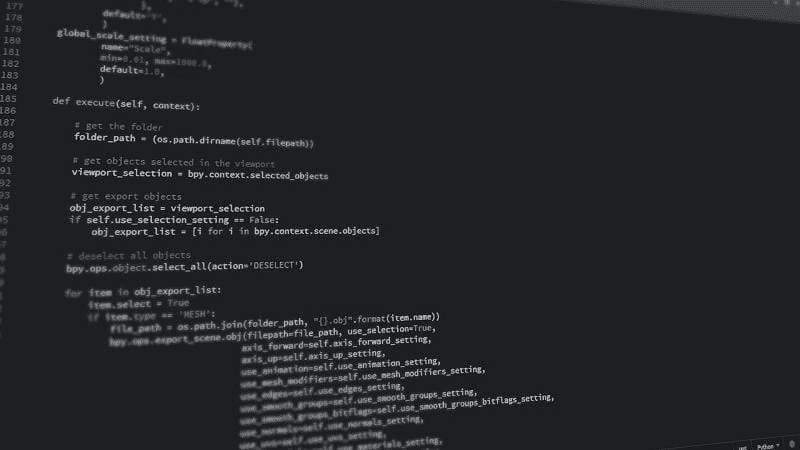

# 10 个我们都应该知道的 Python 代码片段

> 原文：[`www.kdnuggets.com/2021/06/10-python-code-snippets.html`](https://www.kdnuggets.com/2021/06/10-python-code-snippets.html)

评论

**由[Pralabh Saxena](https://www.linkedin.com/in/pralabh-saxena-05/), 软件开发者**



图片由[Johnson Martin](https://pixabay.com/users/johnsonmartin-724525/?utm_source=link-attribution&utm_medium=referral&utm_campaign=image&utm_content=1084923)提供，来源于[Pixabay](https://pixabay.com/?utm_source=link-attribution&utm_medium=referral&utm_campaign=image&utm_content=1084923)

* * *

## 我们的三大课程推荐

 1\. [谷歌网络安全证书](https://www.kdnuggets.com/google-cybersecurity) - 快速进入网络安全职业生涯。

 2\. [谷歌数据分析专业证书](https://www.kdnuggets.com/google-data-analytics) - 提升你的数据分析技能

 3\. [谷歌 IT 支持专业证书](https://www.kdnuggets.com/google-itsupport) - 支持你的组织 IT

* * *

近年来，Python 的用户群体增长巨大。初学者程序员由于其简单的语法和应用选择了 Python 作为他们的第一语言。

在这篇文章中，我将分享一些可以用来解决日常问题的 Python 代码片段。让我们开始吧！

### 1\. 合并两个字典

在`Python 3.5`之后，合并多个字典变得更简单了。我们可以使用`(**)`操作符在一行中合并多个字典。只需将字典传递到{}中，并使用(**)操作符即可完成。

> 语法：{**dictionary1, **dictionary2}

```py
Output:Merged dictionary: {'name': 'Joy', 'age': 25, 'city': 'New York'}
```

### 2\. 链式比较

这段代码允许你在一行中进行多种比较操作。

```py
Output:True
False
```

### 3\. 打印字符串 N 次

我们可以使用这段代码在不使用任何循环的情况下输出一个字符串 N 次。

```py
Output:
Hello!Hello!Hello!Hello!Hello!
```

### 4\. 检查文件是否存在

在进行文件处理及其他操作时，了解我们使用的文件是否存在是很重要的。使用这段代码，我们可以知道文件是否存在于我们的目录或指定路径中。

```py
Output:Does file exist: False
```

### 5\. 获取列表中的最后一个元素

我们可以使用以下方法从列表中检索最后一个元素。

### 6\. 列表推导

列表推导可以用来基于现有列表的元素在一行代码中创建一个新列表。

```py
Output:Vowels are:  ['i', 'i', 'o', 'e', 'a', 'o', 'i']
```

### 7\. 计算代码执行时间

我们可以使用`time`库来计算执行特定代码所需的时间。

```py
Output:Sum: 45
Time:  0.0009965896606445312
```

### 8\. 查找出现频率最高的元素

这段代码返回列表中出现频率最高的项。

```py
Output:most frequent item is: 2
```

### 9\. 将两个列表转换为字典

这个代码片段可以用来将两个列表转换成字典。在这个方法中，我们将两个列表作为输入值。第一个列表将作为字典的键，另一个列表中的值将作为字典的值。

```py
Output:{1: 'one', 2: 'two', 3: 'three'}
```

### 10. 错误处理

与其他编程语言一样，Python 也提供了使用 `try`、`except` 和 `finally` 块来处理异常的方法。

```py
Output:Can not divide by zero
Executing finally block
```

### 结论

本文到此为止。我们讨论了一些我认为非常有用的代码片段，这些片段可以用于日常问题。你可以在日常编程和竞赛编程问题中使用这些片段，以加快工作速度并提高代码效率。

感谢阅读！

欲了解更多 12 个代码片段，[请参见原文](https://levelup.gitconnected.com/22-code-snippets-that-every-python-programmer-must-learn-b7f7ec35e9df)。

### 提升编码能力

感谢你成为我们社区的一部分！ [订阅我们的 YouTube 频道](https://www.youtube.com/channel/UC3v9kBR_ab4UHXXdknz8Fbg?sub_confirmation=1) 或加入 [**Skilled.dev 编程面试课程**](https://skilled.dev/)。

[**编程面试问题 + 拿到开发工作 | Skilled.dev**](https://skilled.dev/)

掌握编程面试的课程

**简历：[Pralabh Saxena](https://www.linkedin.com/in/pralabh-saxena-05/)** 是一名拥有 1 年经验的软件开发者。Pralabh [撰写文章](https://pralabhsaxena.medium.com/) 主题包括 Python、机器学习、数据科学和 SQL。

[原文](https://levelup.gitconnected.com/22-code-snippets-that-every-python-programmer-must-learn-b7f7ec35e9df)。转载许可。

**相关内容：**

+   数据科学家，你需要学会编程

+   如何使 Python 代码运行得极快

+   如何排查 Python 中的内存问题

### 更多相关主题

+   [KDnuggets 新闻，4 月 13 日：数据科学家应知的 Python 库](https://www.kdnuggets.com/2022/n15.html)

+   [KDnuggets™ 新闻 22:n01, 1 月 5 日：跟踪和可视化的 3 种工具…](https://www.kdnuggets.com/2022/n01.html)

+   [2022 年数据科学家应知的 Python 库](https://www.kdnuggets.com/2022/04/python-libraries-data-scientists-know-2022.html)

+   [每位数据科学家都应知道的三个 R 库（即使你使用 Python）](https://www.kdnuggets.com/2021/12/three-r-libraries-every-data-scientist-know-even-python.html)

+   [每位数据科学家都应了解的 6 种 Python 机器学习工具](https://www.kdnuggets.com/2022/05/6-python-machine-learning-tools-every-data-scientist-know.html)

+   [KDnuggets 新闻，5 月 25 日：6 种 Python 机器学习工具](https://www.kdnuggets.com/2022/n21.html)
