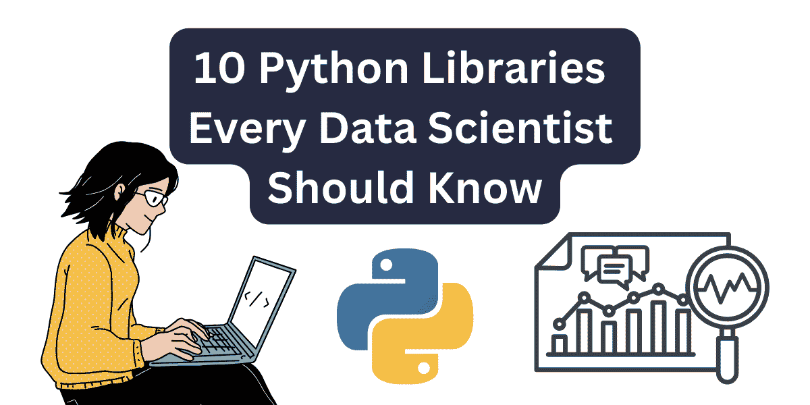
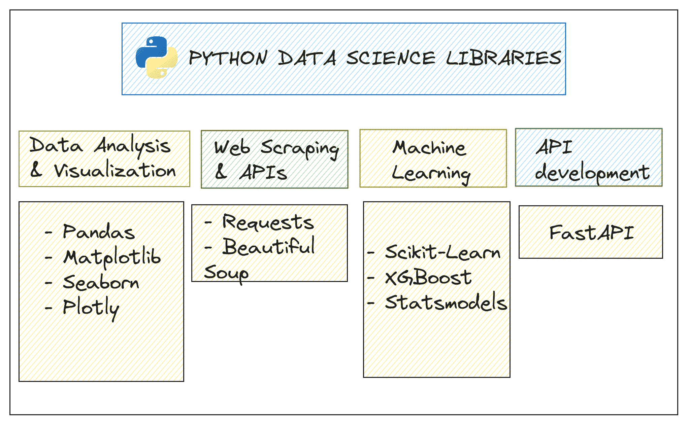

# 每个数据科学家都应该知道的 10 个 Python 库

> 原文：[`www.kdnuggets.com/10-python-libraries-every-data-scientist-should-know`](https://www.kdnuggets.com/10-python-libraries-every-data-scientist-should-know)

图片由作者提供

如果你想在数据领域发展，你可能知道 Python 是数据科学的首选语言。除了易于学习，Python 还拥有丰富的库，可以用几行代码完成任何数据科学任务。

* * *

## 我们的三大课程推荐

 1\. [Google 网络安全证书](https://www.kdnuggets.com/google-cybersecurity) - 加速进入网络安全领域的职业生涯。

 2\. [Google 数据分析专业证书](https://www.kdnuggets.com/google-data-analytics) - 提升你的数据分析技能

 3\. [Google IT 支持专业证书](https://www.kdnuggets.com/google-itsupport) - 支持你所在组织的 IT 工作

* * *

所以无论你是刚开始成为数据科学家，还是希望转行数据领域，学习使用这些库都将非常有帮助。在这篇文章中，我们将探讨一些数据科学必知的 Python 库。

我们特别关注用于数据分析和可视化的 Python 库、网页抓取、API 的使用、机器学习等。让我们开始吧。

Python 数据科学库 | 图片由作者提供

## 1\. Pandas

[Pandas](https://pandas.pydata.org/)是你在进行数据分析时首先接触的库之一。Series 和 dataframes，这两个 pandas 的关键数据结构，简化了操作结构化数据的过程。

你可以使用 pandas 进行数据清理、转换、合并和连接，因此它对数据预处理和分析都很有帮助。

让我们来了解一下 pandas 的关键特性：

+   Pandas 提供了两种主要的数据结构：Series（单维）和 DataFrame（二维），它们允许轻松操作结构化数据。

+   处理缺失数据、过滤数据以及执行各种操作以清理和预处理数据集的函数和方法

+   用于以灵活和高效的方式合并、连接和拼接数据集的函数

+   专门处理时间序列数据的函数，使处理时间数据更加容易

这门来自 Kaggle 的[短课程](https://www.kaggle.com/learn/pandas)将帮助你开始使用 pandas 进行数据分析。

## 2\. Matplotlib

你必须超越分析，进行数据可视化才能理解数据。[Matplotlib](https://matplotlib.org/)是你在转向其他库如 Seaborn、Plotly 等之前接触的第一个数据可视化库。

它是可自定义的（尽管需要一些努力），适用于从简单的折线图到更复杂的可视化的各种绘图任务。一些功能包括：

+   简单的可视化，如折线图、条形图、直方图、散点图等。

+   可自定义的图表，对图形的每个方面（如颜色、标签和尺度）具有相当细致的控制。

+   与 Pandas 和 NumPy 等其他 Python 库良好配合，使得可视化存储在数据框和数组中的数据变得更容易。

[Matplotlib 教程](https://matplotlib.org/stable/tutorials/index.html)应能帮助你开始绘图。

## 3\. Seaborn

[Seaborn](https://seaborn.pydata.org/) 建立在 Matplotlib 之上（它是更易用的 Matplotlib），专为统计和简化的数据可视化而设计。它通过高层接口简化了复杂可视化的创建过程，并与 pandas 数据框良好集成。

Seaborn 具有：

+   内置主题和颜色调色板，在不费太多力气的情况下改善图表

+   创建有用的可视化功能，如小提琴图、配对图和热图

Kaggle 上的[数据可视化微课程](https://www.kaggle.com/learn/data-visualization)将帮助你快速上手 Seaborn。

## 4\. Plotly

当你对使用 Seaborn 感到自如时，可以学习使用[Plotly](https://plotly.com/graphing-libraries/)，这是一个用于创建互动数据可视化的 Python 库。

除了各种图表类型外，使用 Plotly，你可以：

+   创建交互式图表

+   使用 Plotly Dash 构建网页应用和数据仪表板

+   将图表导出为静态图像、HTML 文件，或嵌入到网页应用中

指南[Plotly Python 开源绘图库基础](https://plotly.com/python/plotly-fundamentals/)将帮助你熟悉使用 Plotly 进行绘图。

## 5\. Requests

你通常需要通过发送 HTTP 请求从 API 获取数据，对于此目的可以使用[Requests](https://requests.readthedocs.io/)库。

它使用简单，使从 API 或网页获取数据变得轻而易举，具有开箱即用的会话管理、身份验证等支持。使用 Requests，你可以：

+   发送 HTTP 请求，包括 GET 和 POST 请求，以与网络服务进行交互

+   管理和保持设置 across requests，例如 cookies 和 headers

+   使用各种身份验证方法，包括基本认证和 OAuth

+   处理超时、重试和错误以确保可靠的网页交互

你可以参考[Requests 文档](https://requests.readthedocs.io/en/latest/)来获取简单和高级的使用示例。

## 6\. Beautiful Soup

网络爬虫是数据科学家的必备技能，[Beautiful Soup](https://beautiful-soup-4.readthedocs.io/en/latest/)是所有网络爬虫相关操作的首选库。获取数据后，可以使用 Beautiful Soup 来导航和搜索解析树，轻松定位和提取所需的信息。

因此，Beautiful Soup 通常与 Requests 库一起使用来获取和解析网页。你可以：

+   解析 HTML 文档以查找特定信息

+   使用 Python 风格的惯用语在解析树中导航和搜索，以提取特定数据

+   查找和修改文档中的标签和属性

[掌握 BeautifulSoup 的网络爬虫](https://www.kdnuggets.com/mastering-web-scraping-with-beautifulsoup)是学习 Beautiful Soup 的全面指南。

## 7\. Scikit-Learn

[Scikit-Learn](https://scikit-learn.org/)是一个机器学习库，提供了用于分类、回归、聚类和降维的现成算法实现。它还包括模型选择、预处理和评估的模块，使其成为构建和评估机器学习模型的实用工具。

Scikit-Learn 库还具有专门的模块用于：

+   数据预处理，例如缩放、标准化和编码类别特征

+   模型选择和超参数调优

+   模型评估

[使用 Python 和 Scikit-Learn 进行机器学习 - 完整课程](https://www.youtube.com/watch?v=hDKCxebp88A)是一个学习使用 Scikit-Learn 构建机器学习模型的好资源。

## 8\. Statsmodels

[Statsmodels](https://www.statsmodels.org/)是一个专注于统计建模的库。它提供了一系列用于估计统计模型、执行假设检验和数据探索的工具。如果你想探索计量经济学和其他需要严谨统计分析的领域，Statsmodels 特别有用。

你可以使用 statsmodels 进行估计、统计测试等。Statsmodels 提供了以下功能：

+   用于总结和探索数据集以获得建模前的见解的函数

+   不同类型的统计模型，包括线性回归、广义线性模型和时间序列分析

+   一系列统计测试，包括 t 检验、卡方检验和非参数检验

+   用于诊断和验证模型的工具，包括残差分析和拟合优度测试

[入门指南 - statsmodels](https://www.statsmodels.org/stable/gettingstarted.html)应该能帮助你学习这个库的基础知识。

## 9\. XGBoost

[XGBoost](https://xgboost.readthedocs.io/) 是一个优化的梯度提升库，旨在提供高性能和高效率。它广泛用于机器学习竞赛和实际应用中。XGBoost 适用于各种任务，包括分类、回归和排序，并包含正则化和跨平台集成功能。

XGBoost 的一些特性包括：

+   先进的提升算法实现，可用于分类、回归和排序问题。

+   内置正则化以防止过拟合并提高模型泛化能力。

[XGBoost](https://www.kaggle.com/code/dansbecker/xgboost) 在 Kaggle 上的教程是一个熟悉 XGBoost 的好地方。

## 10. **FastAPI**

到目前为止，我们已经看过了 Python 库。让我们以构建 API 的框架——**FastAPI** 来结束。

[FastAPI](https://fastapi.tiangolo.com/) 是一个用于用 Python 构建 API 的 web 框架。它非常适合创建用于服务机器学习模型的 API，提供了一种强大而高效的方式来部署数据科学应用。

+   FastAPI 易于使用和学习，允许快速开发 API。

+   提供对异步编程的全面支持，使其适合处理多个同时连接。

[FastAPI 教程：在几分钟内用 Python 构建 API](https://www.kdnuggets.com/fastapi-tutorial-build-apis-with-python-in-minutes) 是一个全面的教程，可以帮助你学习用 FastAPI 构建 API 的基础知识。

## 总结

我希望你发现这个数据科学库的汇总对你有所帮助。如果有一个要点，那就是这些 Python 库是你数据科学工具箱中有用的补充。

我们已经介绍了涵盖各种功能的 Python 库——从数据处理和可视化到机器学习、网页抓取和 API 开发。如果你对数据工程中的 Python 库感兴趣，你可能会觉得[每个数据工程师都应该知道的 7 个 Python 库](https://www.kdnuggets.com/7-python-libraries-every-data-engineer-should-know)很有帮助。

****[Bala Priya C](https://www.kdnuggets.com/wp-content/uploads/bala-priya-author-image-update-230821.jpg)** 是来自印度的开发者和技术作家。她喜欢在数学、编程、数据科学和内容创作的交汇点工作。她的兴趣和专长领域包括 DevOps、数据科学和自然语言处理。她喜欢阅读、写作、编程和喝咖啡！目前，她正致力于通过撰写教程、操作指南、观点文章等方式向开发者社区学习和分享她的知识。Bala 还制作了引人入胜的资源概述和编码教程。**

### 更多相关内容

+   [每个数据科学家都应该知道的三个 R 库（即使你使用 Python）](https://www.kdnuggets.com/2021/12/three-r-libraries-every-data-scientist-know-even-python.html)

+   [每个数据工程师都应该知道的 7 个 Python 库](https://www.kdnuggets.com/7-python-libraries-every-data-engineer-should-know)

+   [KDnuggets 新闻，4 月 13 日：数据科学家应该了解的 Python 库…](https://www.kdnuggets.com/2022/n15.html)

+   [KDnuggets 新闻，5 月 25 日：每个数据科学家都应该了解的 6 种 Python 机器学习工具…](https://www.kdnuggets.com/2022/n21.html)

+   [每个数据科学家都应该了解的 6 种 Python 机器学习工具](https://www.kdnuggets.com/2022/05/6-python-machine-learning-tools-every-data-scientist-know.html)

+   [数据科学家在 2022 年应该知道的 Python 库](https://www.kdnuggets.com/2022/04/python-libraries-data-scientists-know-2022.html)
