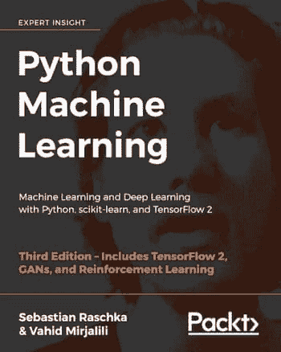

# 数据科学自学的 10 个资源

> 原文：[`www.kdnuggets.com/2021/02/10-resources-data-science-self-study.html`](https://www.kdnuggets.com/2021/02/10-resources-data-science-self-study.html)

评论

*照片由[Element5 Digital](https://unsplash.com/@element5digital?utm_source=medium&utm_medium=referral)提供，来源于[Unsplash](https://unsplash.com?utm_source=medium&utm_medium=referral)。*

* * *

## 我们的前三名课程推荐

 1\. [Google 网络安全证书](https://www.kdnuggets.com/google-cybersecurity) - 快速进入网络安全职业生涯。

 2\. [Google 数据分析专业证书](https://www.kdnuggets.com/google-data-analytics) - 提升你的数据分析技能

 3\. [Google IT 支持专业证书](https://www.kdnuggets.com/google-itsupport) - 支持你的组织 IT 需求

* * *

数据科学有两种基本路径：传统大学学位路径和自学路径。

**传统的大学学位路径：** 一些顶级大学提供传统的研究生级数据科学项目。由于这些是研究生级课程，大多数要求具有物理学、数学、会计、商业、计算机科学或工程等分析领域的本科学位。这些课程通常需要 3 到 4 个学期的时间，适合全日制学习。传统课程有不同的类型，例如：数据科学硕士、数据分析硕士或商业分析硕士。传统面对面的课程学费范围可能在$15,000 到$40,000 之间，不包括生活费用。对于在线数据科学硕士课程，费用可能在$12,000 到$40,000 之间。下面的链接探讨了欧洲和美国/加拿大的顶级 MS 学位，包含排名、学费等信息。

+   [最佳在线分析、商业分析、数据科学硕士课程 – 更新版](https://www.kdnuggets.com/2020/09/best-online-masters-data-science-analytics-online.html)

+   [美国/加拿大最佳分析、商业分析、数据科学硕士课程](https://www.kdnuggets.com/2019/05/best-masters-data-science-analytics-us-canada.html)

+   [2019 年欧洲最佳数据科学与分析硕士课程](https://www.kdnuggets.com/2019/04/best-masters-data-science-analytics-europe.html)

**自学路径：** 如果你愿意，可以在大学（或研究生院）投入四年时间。这将使你对数据科学领域有更深入的理解，但如果你的情况不允许你获得大学学位，你可以通过自学（有一定的热情和投入）来学习数据科学。像 edX、Coursera、DataCamp、Udacity 和 Udemy 等平台上有许多优秀的数据科学课程。只要投入一些时间，你就可以通过这些课程学习数据科学的基础知识。因此，自学路径相比于大学学位路径非常经济实惠。

在这篇博客中，我们讨论了 10 个用于数据科学自学的资源。这些资源被分为 3 个主要类别：（A）构建基础知识的资源；（B）数据科学实践的资源；和（C）网络和持续学习的资源。

### A. 构建基础知识的资源

你数据科学之旅的第一步是建立对基本数据科学概念的强大知识。以下讨论的资源有助于学习基本概念。

***1. 大规模开放在线课程 (MOOCs)***

对数据科学从业者需求的增加催生了大量的大规模开放在线课程（MOOCs）。最受欢迎的 MOOC 提供者包括以下几家：

+   **edX**: [`www.edx.org/`](https://www.edx.org/)

+   **Coursera**: [`www.coursera.org/`](https://www.coursera.org/)

+   **DataCamp**: [`www.datacamp.com/`](https://www.datacamp.com/)

+   **Udemy**: [`www.udemy.com/`](https://www.udemy.com/)

+   **Udacity**: [`www.udacity.com/`](https://www.udacity.com/)

+   **Lynda**: [`www.lynda.com/`](https://www.lynda.com/)

如果你打算参加这些课程，请记住，有些 MOOCs 是 100% 免费的，而有些则需要你支付订阅费（每门课程的费用可能从 $50 到 $200 或更多，具体取决于平台）。请记住，获得任何学科的专业知识需要大量的时间和精力。因此，不要急于求成。确保如果你决定注册课程，你应该准备好完成整个课程，包括所有作业和家庭作业。一些测验和家庭作业可能会相当具有挑战性。然而，记住如果你不挑战自己，你将无法在知识和技能上成长。

我自己完成了许多数据科学 MOOCs，以下是我最喜欢的 3 个数据科学专业课程。

[**数据科学专业证书**](https://www.edx.org/professional-certificate/harvardx-data-science) **（HarvardX，通过 edX）**

包含以下课程，全部使用 R 进行教学（你可以免费试听课程或购买认证证书）：

+   数据科学：R 基础；

+   数据科学：可视化；

+   数据科学：概率；

+   数据科学：推断与建模；

+   数据科学：生产力工具；

+   数据科学：数据清理；

+   数据科学：线性回归；

+   数据科学：机器学习；

+   数据科学：综合项目

[**分析：基本工具和方法**](https://www.edx.org/micromasters/gtx-analytics-essential-tools-and-methods) **（由 Georgia TechX 提供，通过 edX 平台）**

包括以下课程，所有课程均使用 R、Python 和 SQL 教授（您可以免费审计或购买经过验证的证书）：

+   分析建模导论；

+   数据分析计算基础；

+   商业数据分析。

[**Python 数据科学应用专业化**](https://www.coursera.org/specializations/data-science-python) **（由密歇根大学提供，通过 Coursera 平台）**

包括以下课程，所有课程均使用 Python 教授（您可以免费审计大多数课程，有些课程需要购买经过验证的证书）：

+   在 Python 中数据科学导论；

+   在 Python 中应用绘图、制图和数据表示；

+   《在 Python 中应用机器学习》；

+   在 Python 中应用文本挖掘；

+   在 Python 中应用社会网络分析

***2. 从教科书中学习***

从教科书中学习可以提供比在线课程更精细和深入的知识。这本书提供了对数据科学和机器学习的绝佳介绍，包含代码：《Python 机器学习》由 Sebastian Raschka 编写。 [`github.com/rasbt/python-machine-learning-book-3rd-edition`](https://github.com/rasbt/python-machine-learning-book-3rd-edition)

作者以非常易于理解的方式解释了机器学习的基本概念。此外，书中包含了代码，您可以实际使用这些代码进行练习并建立自己的模型。我个人发现这本书在我的数据科学旅程中非常有用。我会推荐这本书给任何数据科学的有志之士。只需具备基本的线性代数和编程技能即可理解本书。

还有很多其他优秀的数据科学教科书，如 Wes McKinney 的《[Python 数据分析](https://sushilapalwe.files.wordpress.com/2018/04/python-for-data-analytics-book.pdf)》、Kuhn 和 Johnson 的《[应用预测建模](https://vuquangnguyen2016.files.wordpress.com/2018/03/applied-predictive-modeling-max-kuhn-kjell-johnson_1518.pdf)》以及 Ian H. Witten、Eibe Frank 和 Mark A. Hall 的《[数据挖掘：实用机器学习工具与技术](https://www.wi.hs-wismar.de/~cleve/vorl/projects/dm/ss13/HierarClustern/Literatur/WittenFrank-DM-3rd.pdf)》。

***3. YouTube***

YouTube 上包含了许多教育视频和教程，可以教授数据科学所需的基本数学和编程技能，以及一些适合初学者的数据科学教程。简单的搜索可以找到许多视频教程和讲座。我在 YouTube 上最喜欢的三个课程是：

+   [Gilbert Strang 的线性代数](https://www.youtube.com/playlist?list=PL49CF3715CB9EF31D)

+   [Alexander Amini 的深度学习介绍](https://www.youtube.com/playlist?list=PLtBw6njQRU-rwp5__7C0oIVt26ZgjG9NI)

+   [John Guttag 和 Eric Grimson 的计算思维与数据科学介绍](https://www.youtube.com/playlist?list=PLRJdqdXieSHMtmKxr4s78F7U88l-SawAj)

***4\. 可汗学院***

可汗学院也是学习数据科学所需的基础数学、统计学、微积分和线性代数技能的好网站。这对那些对数据科学感兴趣但没有所需定量背景的个人来说应该是一个很好的资源。

### B. 数据科学实践资源

由于数据科学是一个实践性强的领域，单靠课程获得的学术知识不足以使你成为数据科学家。你需要将知识应用于实际的数据科学项目中，以便成为数据科学从业者。以下平台将帮助你通过将知识应用于实际问题来磨练数据科学技能。

***5\. Kaggle***

[Kaggle](https://www.kaggle.com/) 是世界上最大的 数据科学社区，提供强大的工具和资源，帮助你实现数据科学目标。Kaggle 允许用户查找和发布数据集、在基于网络的数据科学环境中探索和构建模型、与其他数据科学家和机器学习工程师合作，并参加解决数据科学挑战的竞赛。在这个平台上，你可以访问 [数据集](https://www.kaggle.com/datasets)、[课程](https://www.kaggle.com/learn/overview)、[笔记本](https://www.kaggle.com/notebooks) 和 [竞赛](https://www.kaggle.com/competitions)。当你参与 Kaggle 项目和竞赛时，你在数据科学方面的知识和经验将不断增长。Kaggle 也是与其他数据科学从业者和爱好者网络互动的绝佳平台。

***6\. 实习***

实习提供了在数据科学项目中工作的绝佳机会。许多公司为学生提供实习机会，实习期从几个月到一年不等。数据科学实习通常通过像 indeed.com 或 LinkedIn Jobs 这样的平台注册。

### C. 网络和持续学习资源

由于数据科学领域因技术进步而不断发展，因此持续学习在数据科学中至关重要。与其他数据科学家建立合作网络将使你始终保持领先。以下平台是出色的网络和持续学习资源。

***7\. 媒介***

[Medium](https://medium.com/) 现在被认为是学习数据科学和建立网络的最快增长的平台之一。如果你有兴趣使用这个平台进行数据科学自学，第一步是创建一个 Medium 账户。你可以创建一个免费账户或会员账户。免费账户每月可以访问的会员文章数量有限。会员账户需要每月支付 $5 或每年 $50 的订阅费。了解更多关于成为 Medium 会员的信息，请访问：[`medium.com/membership`](https://medium.com/membership)。

使用会员账户，你将可以无限制地访问 Medium 上的文章和出版物。Medium 有几个数据科学出版物，可以帮助你了解该领域的新发展，并与其他数据科学家或有志者建立联系。Medium 上的两大数据科学出版物是 [Towards Data Science](https://towardsdatascience.com/) 和 [Towards AI](https://pub.towardsai.net/)。每天，Medium 上都会发布涵盖数据科学、机器学习、数据可视化、编程、人工智能等主题的新文章。通过 Medium 网站上的搜索工具，你可以访问许多文章和教程，涵盖从基础到高级的各种数据科学主题。

***8\. LinkedIn***

LinkedIn 是一个出色的网络平台。LinkedIn 上有几个数据科学小组和组织，你可以加入，如 Towards AI、DataScienceHub、Towards data science、KDnuggets 等。你还可以在这个平台上关注该领域的顶尖领导者。

***9\. KDnuggets***

[KDnuggets](https://www.kdnuggets.com/) 是一个领先的网站，专注于**人工智能、分析、大数据、数据挖掘、数据科学和机器学习**。在这个网站上，你可以找到数据科学领域的重要教育工具和资源，以及职业发展工具。

+   [博客/新闻](https://www.kdnuggets.com/news/index.html)

+   [意见](https://www.kdnuggets.com/opinions/index.html)

+   [教程](https://www.kdnuggets.com/tutorials/index.html)

+   [头条新闻](https://www.kdnuggets.com/news/top-stories.html)

+   [公司](https://www.kdnuggets.com/companies/index.html)

+   [课程](https://www.kdnuggets.com/courses/index.html)

+   [数据集](https://www.kdnuggets.com/datasets/index.html)

+   [教育](https://www.kdnuggets.com/education/index.html)

+   [活动（在线）](https://www.kdnuggets.com/meetings/index.html)

+   [职位](https://www.kdnuggets.com/jobs/index.html)

+   [软件](https://www.kdnuggets.com/software/index.html)

+   [网络研讨会](https://www.kdnuggets.com/webcasts/index.html)

***10\. GitHub***

GitHub 包含了多个关于数据科学和机器学习的教程和项目。除了作为数据科学教育的极佳资源外，GitHub 还是一个出色的[项目组织](https://towardsdatascience.com/how-to-organize-your-data-science-project-dd6599cf000a)和作品集建设平台。有关如何在 GitHub 上创建数据科学作品集的更多信息，请参阅以下文章：[利用这些平台打造脱颖而出的作品集](https://www.kdnuggets.com/2021/01/build-data-science-portfolio.html)。

**相关：**

+   [2021 年免费学习数据科学](https://www.kdnuggets.com/2021/01/learn-data-science-free-2021.html)

+   [我迄今为止的数据科学学习历程](https://www.kdnuggets.com/2021/01/data-science-learning-journey.html)

+   [在线学习数据科学的 9 大课程](https://www.kdnuggets.com/2020/12/simplilearn-top-9-data-science-courses-online.html)

### 更多相关主题

+   [最佳数据科学资源、训练营和课程…](https://www.kdnuggets.com/2023/12/springboard-best-data-science-resources-bootcamp-courses-learn-data-science-new-year)

+   [学习数据分析和数据科学的最佳免费资源](https://www.kdnuggets.com/2024/03/365datascience-best-free-resources-learn-data-analysis-data-science)

+   [2022 年数据科学学习的最佳资源](https://www.kdnuggets.com/2022/01/best-learning-resources-data-science-2022.html)

+   [学习数据科学统计学的顶级资源](https://www.kdnuggets.com/2021/12/springboard-top-resources-learn-data-science-statistics.html)

+   [数据科学面试指南 - 第二部分：面试资源](https://www.kdnuggets.com/2022/04/data-science-interview-guide-part-2-interview-resources.html)

+   [免费的大学数据科学资源](https://www.kdnuggets.com/2022/05/free-university-data-science-resources.html)
