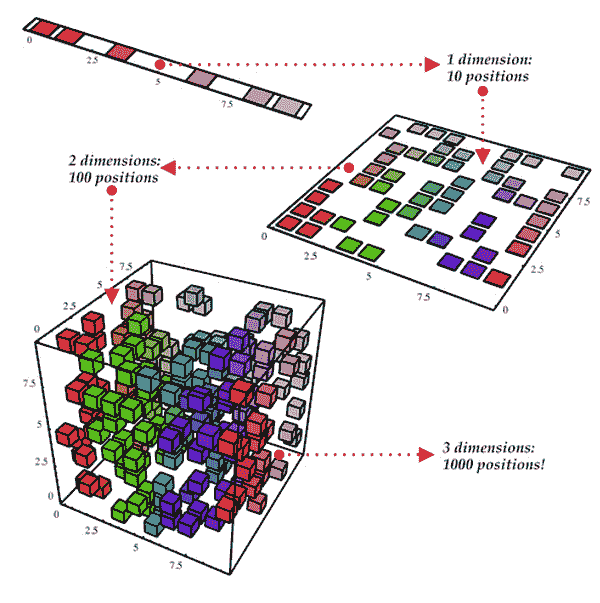
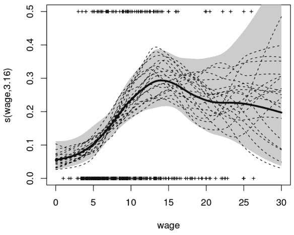
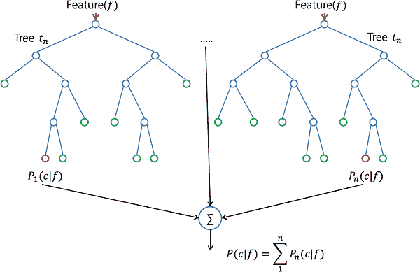
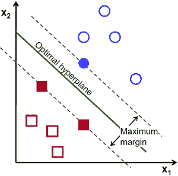
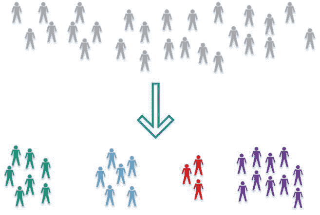

# 数据科学家需要掌握的 10 种统计技术

> 原文：[`www.kdnuggets.com/2017/11/10-statistical-techniques-data-scientists-need-master.html/2`](https://www.kdnuggets.com/2017/11/10-statistical-techniques-data-scientists-need-master.html/2)

****6 — 维度缩减：****

维度缩减将估计*p + 1*个系数的问题简化为估计*M + 1*个系数的简单问题，其中*M < p*。这通过计算*M*个不同的*线性组合*，或*投影*来实现。然后，这些*M*个投影被用作预测变量，通过最小二乘法拟合一个线性回归模型。处理此任务的 2 种方法是*主成分回归*和*偏最小二乘*。

+   可以将**主成分回归**描述为从大量变量中派生出低维特征集的一种方法。数据的*第一个*主成分方向是观测值变化最大的方向。换句话说，第一个主成分是一条尽可能贴合数据的直线。可以拟合*p*个不同的主成分。第二个主成分是与第一个主成分不相关的变量的线性组合，并在此约束下具有最大的方差。其理念是主成分通过在随后的正交方向上使用数据的线性组合来捕捉数据中的最大方差。通过这种方式，我们还可以结合相关变量的影响，从现有数据中获取更多信息，而在常规最小二乘法中，我们则需要丢弃一个相关变量。

+   我们上面描述的 PCR 方法涉及识别最佳表示预测变量的*X*的线性组合。这些组合（*方向*）是以无监督的方式识别的，因为响应*Y*未用于帮助确定主成分方向。也就是说，响应*Y*并不*监督*主成分的识别，因此没有保证最佳解释预测变量的方向也是预测响应的最佳方向（尽管这通常被假设）。**偏最小二乘**（PLS）是 PCR 的*有监督*替代方法。与 PCR 一样，PLS 也是一种维度缩减方法，它首先识别出原始特征的线性组合的新特征集，然后通过最小二乘法对新的*M*个特征拟合线性模型。然而，与 PCR 不同的是，PLS 利用响应变量来识别新特征。

****7 — 非线性模型：****

在统计学中，非线性回归是一种回归分析方法，其中观测数据通过一个非线性组合的模型参数的函数来建模，并且依赖于一个或多个自变量。这些数据通过逐步逼近的方法进行拟合。以下是处理非线性模型的一些重要技术：

+   如果一个实数上的函数可以写成区间指示函数的有限线性组合，那么这个函数被称为**阶跃函数**。非正式地说，阶跃函数是一个分段常数函数，只有有限多个区间。

+   **分段函数** 是由多个子函数定义的函数，每个子函数适用于主函数定义域的某个区间。分段实际上是一种表达函数的方式，而不是函数本身的特性，但经过额外的限定，它可以描述函数的性质。例如，**分段多项式**函数是一个在每个子域上都是多项式的函数，但每个子域上的多项式可能不同。

+   **样条函数** 是一种由多项式分段定义的特殊函数。在计算机图形学中，样条函数指的是分段的多项式参数曲线。样条函数因其构造的简单性、评估的便利性和准确性，以及通过曲线拟合和交互式曲线设计来逼近复杂形状的能力而受到欢迎。

+   **广义加性模型**是一种广义线性模型，其中线性预测变量依赖于某些预测变量的未知平滑函数，重点在于对这些平滑函数进行推断。

****8 — 基于树的方法:****

基于树的方法既可以用于回归问题，也可以用于分类问题。这些方法涉及将预测变量空间划分为若干个简单区域。由于用于划分预测变量空间的分割规则可以用树来总结，这些方法被称为**决策树**方法。以下这些方法生成多个树，然后将它们结合以得出单一的共识预测。

+   **Bagging** 是通过对原始数据集生成额外的数据进行训练，以重复组合的方式减少预测的方差，从而产生与原始数据具有相同规模/大小的多步骤数据。通过增加训练集的规模，无法提升模型的预测能力，只能减少方差，从而将预测值精确调整至预期结果。

+   **提升** 是一种使用多个不同模型计算输出，然后使用加权平均的方法来平均结果的方式。通过调整加权公式来结合这些方法的优缺点，你可以为更广泛的输入数据提供良好的预测能力，利用不同的精确调优模型。

+   **随机森林**算法实际上与袋装方法非常相似。这里，你会从训练集中抽取随机的自助样本。然而，除了自助样本，你还会抽取一个特征的随机子集来训练个体决策树；在袋装方法中，你会给每棵树提供完整的特征集。由于随机特征选择，你使得树之间相对独立于常规袋装方法，这通常会导致更好的预测性能（由于更好的方差-偏差权衡），而且也更快，因为每棵树只从特征的子集学习。

****9 — 支持向量机：****

支持向量机（SVM）是一种分类技术，被列在机器学习的监督学习模型下。通俗来说，它涉及到寻找一个超平面（二维中的直线，三维中的平面，以及更高维中的超平面），该超平面能以最大的间隔最好地分离两类点。本质上，这是一个约束优化问题，在约束条件下最大化间隔，即完美分类数据（硬间隔）。

支持这个超平面的数据点称为“支持向量”。在上图中，填充的蓝色圆圈和两个填充的方块就是支持向量。对于两个类别的数据不能线性可分的情况，这些点会被投影到一个扩展（更高维）空间，在那里可能会实现线性分离。涉及多个类别的问题可以被拆解为多个一对一或一对其余的二分类问题。

****10 — 无监督学习：****

到目前为止，我们只讨论了监督学习技术，其中组是已知的，算法所提供的经验是实际实体与它们所属组之间的关系。当数据的组（类别）未知时，可以使用另一组技术。这些技术被称为无监督学习，因为它由学习算法去找出提供的数据中的模式。聚类是无监督学习的一个例子，其中不同的数据集被聚类成紧密相关的组。以下是最广泛使用的无监督学习算法列表：

+   **主成分分析**帮助通过识别具有最大方差且互不相关的特征线性组合，生成数据集的低维表示。这种线性维度技术可能有助于在无监督设置中理解变量之间的潜在交互。

+   **k 均值聚类**：根据与簇中心的距离将数据划分为 k 个不同的簇。

+   **层次聚类**: 通过创建聚类树构建多级聚类层次。

-   这是一些基本统计技术的简介，旨在帮助数据科学项目经理或高管更好地理解数据科学团队内部的运作。事实上，一些数据科学团队纯粹通过 Python 和 R 库运行算法。他们中的大多数甚至不需要考虑基础数学。然而，能够理解统计分析的基础知识可以为你的团队提供更好的方法。深入了解最小的部分可以更轻松地进行操作和抽象。希望这个基本的数据科学统计指南能给你提供一个不错的理解！

*附注: 你可以从*[*我的 GitHub 源码在这里*](https://github.com/khanhnamle1994/statistical-learning)*获取所有讲座幻灯片和 RStudio 会议记录。感谢你们的热烈回应！*

**个人简介: [詹姆斯·李](https://www.linkedin.com/in/khanhnamle94/)** 目前正在申请 2018 年秋季入学的美国计算机科学硕士项目。他计划的研究将集中在机器学习和数据挖掘方面。同时，他作为自由职业全栈 Web 开发人员工作。

[原文](https://towardsdatascience.com/the-10-statistical-techniques-data-scientists-need-to-master-1ef6dbd531f7)。经许可转载。

**相关:**

+   机器学习工程师需知的 10 种算法

+   前 10 大数据挖掘算法解析

+   初学者的前 10 大机器学习算法

### 相关话题

+   [每个初学者数据科学家应掌握的 6 种预测模型](https://www.kdnuggets.com/2021/12/6-predictive-models-every-beginner-data-scientist-master.html)

+   [建立稳固的数据团队](https://www.kdnuggets.com/2021/12/build-solid-data-team.html)

+   [使用管道编写干净的 Python 代码](https://www.kdnuggets.com/2021/12/write-clean-python-code-pipes.html)

+   [成为伟大数据科学家所需的 5 项关键技能](https://www.kdnuggets.com/2021/12/5-key-skills-needed-become-great-data-scientist.html)

+   [2021 年最佳 ETL 工具](https://www.kdnuggets.com/2021/12/mozart-best-etl-tools-2021.html)

+   [停止学习数据科学，寻找目的，然后…](https://www.kdnuggets.com/2021/12/stop-learning-data-science-find-purpose.html)
