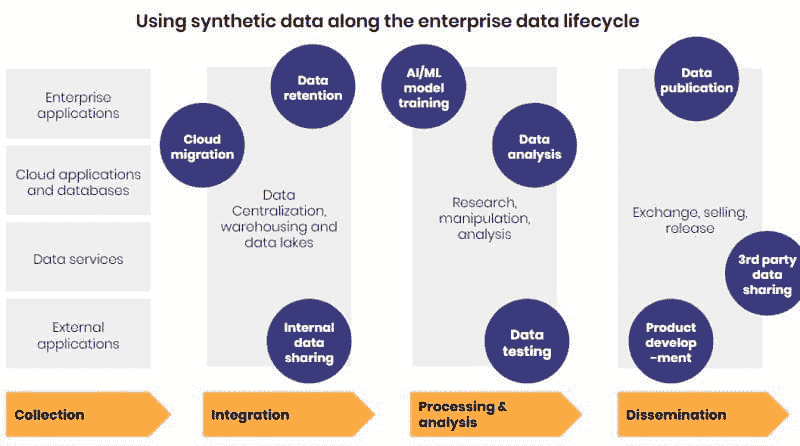

# 10 个隐私保护合成数据的使用案例

> 原文：[`www.kdnuggets.com/2020/08/10-use-cases-privacy-preserving-synthetic-data.html`](https://www.kdnuggets.com/2020/08/10-use-cases-privacy-preserving-synthetic-data.html)

评论

**由 [Elise Devaux](https://medium.com/@Elise_Deux) 和 [Statice](http://www.statice.ai/) 提供**

快速发展的数据保护法律正在不断重塑数据格局。组织克服敏感数据使用限制并保护客户隐私的能力将成为未来成功企业的关键驱动力。本博客介绍了十个隐私保护合成数据的具体应用，可能帮助企业保持竞争优势：

+   云迁移

+   内部数据共享

+   数据保留

+   数据分析

+   数据测试

+   AI/ML 模型训练

+   第三方数据共享

+   产品开发

+   数据货币化

+   数据发布

* * *

## 我们的前三课程推荐

 1\. [谷歌网络安全证书](https://www.kdnuggets.com/google-cybersecurity) - 快速进入网络安全职业生涯。

 2\. [谷歌数据分析专业证书](https://www.kdnuggets.com/google-data-analytics) - 提升您的数据分析技能

 3\. [谷歌 IT 支持专业证书](https://www.kdnuggets.com/google-itsupport) - 支持您的组织 IT

* * *

在适当的隐私保障下，隐私保护合成数据是一种匿名化数据。因此，它不属于个人数据保护法律的范围。这反过来减少了组织在使用敏感数据时的限制，同时保护了个人隐私。正如我们将在以下使用案例中看到的，它在监管严格的行业中尤为有价值。

### 合成数据的价值创造生命周期

数据正日益成为推动企业价值和增长的核心元素。在几乎每个数据孤岛和数据生命周期的每个阶段，企业都有能力生成价值。然而，数据在组织内部几乎没有流动，受到繁重的合规性和数据治理流程的阻碍。因此，合成数据在数据生命周期中的使用被拓展。从数据集成到数据传播，它提供了利用数据的另一种选择。

随着数据通过收集、集成、处理和传播阶段，企业可以生成价值。然而，由于严格的隐私法规，大部分潜在价值仍未被挖掘。

**1\. 云迁移**

将敏感数据迁移到云基础设施涉及复杂的合规流程。确保数据安全，同时保证其在未来使用中的完整性，可能既耗时又昂贵，甚至在某些情况下不可能。由于它嵌入了隐私设计原则，Statice 的合成数据使企业能够更轻松地将样本或完整数据资产迁移到云环境中。这为企业节省了时间和金钱，并提升了数据灵活性。

**2\. 内部数据共享**

隐私流程和内部控制会减缓，有时阻碍组织内理想数据流的实现。获取内部数据可能需要几周，甚至更长时间，特别是当不清楚需要哪些数据点时。使用合成数据样本或完整数据集，能够使企业摆脱获取敏感数据时遇到的障碍。它们可以更快地共享内部来源和汇总数据，从而提高利用数据的能力。

**3\. 数据保留**

数据保留的规定在过去十年里一直是欧洲的热点话题。今天，[GDPR 坚持](https://gdpr-info.eu/art-5-gdpr/)限制企业存储个人数据的时间和数量。此外，各国法律通常对某些性质的数据，如电信或银行信息，进行保留管理。问题在于，某些分析需要更长时间的数据存储，这会违反这些规定。例如，年度季节性分析需要至少两年的数据。在这种情况下，合成数据提供了一种遵守数据保留法律的方式，同时实现其他方式无法进行的长期分析。

**4\. 数据测试**

在测试环境中，缺乏有用的测试数据可能会减缓新系统的开发并阻碍现实测试。同样，合成数据提供了一种替代生产数据的方式。由于它模仿了生产数据的统计特性，合成数据可用于测试新产品和服务、验证模型或测试性能。这种资源易于快速获取，允许更大的数据灵活性和更快的软件开发上线时间。

**5\. 数据分析**

一方面，使用部分遮蔽的数据可能会影响分析质量，并且[存在强烈的重新识别风险](https://www.statice.ai/post/the-truth-about-anonymous_data)。另一方面，获取数据二次使用的系统同意是一个繁琐的过程，特别是考虑到当前的数据量和对数据处理的消费者情绪。隐私保护的合成数据帮助平衡隐私和实用性的困境。企业可以对以隐私保护方式生成的合成数据进行分析，而无需担心隐私或质量问题。这反过来帮助数据驱动的企业做出更好的决策。

**6\. AI/ML 模型训练**

同样，寻找大量合规数据以训练机器学习模型在许多行业中都是一个挑战。使用隐私保护合成数据来驱动机器学习模型可以是一种更具可扩展性的方法，同时也保护数据隐私。多个企业已经[验证了隐私保护机器学习的使用](https://www.statice.ai/post/future-proofing-data-operations-successful-insurance-mobiliere)，在使用合成数据构建和训练模型时产生了有意义的结果。这是企业以安全的方式扩展机器学习使用及其利益的机会。

**7\. 产品开发**

数据是产品和服务开发的关键资源。一旦隐私保护合成数据在企业仓库中可用，工程师和数据科学家可以轻松访问和使用这些数据。企业可以创建并提供不构成隐私泄露的数据仓库，为产品和服务开发提供资源。这反过来为他们带来价值，因为他们能够利用现有数据进行开发和创新。

**8\. 数据货币化**

向第三方打包和销售数据现在受到严格监管。隐私保护合成数据提供了一种从数据流中构建收入的机会，这些数据流在正常情况下过于敏感而无法用于此类目的。组织可以随意构建新的数据衍生收入流，而不会冒着侵犯个人隐私的风险。

**9\. 数据共享**

与第三方交换数据是推动企业创新的重要因素。但无论是与客户共享分析数据、与合作伙伴共同开发产品，还是向离岸站点发送数据，企业往往都面临敏感数据共享的固有挑战。为了避免这些耗时的过程并提高灵活性，企业可以使用**隐私保护合成数据**。

**10\. 数据发布**

对于举办黑客马拉松或寻求与外部利益相关者共享数据的企业来说，确保没有个人信息被泄露至关重要。臭名昭著的 Netflix 奖案例说明了发布匿名化不充分数据的风险。使用隐私保护合成数据，企业能够确保保护个人隐私。

在当今高度监管的环境中，企业必须找到解锁数据价值的方法，以保持竞争力。隐私保护合成数据是使用敏感数据的安全合规替代方案，能够为企业提供显著的竞争优势。从内部数据共享到数据货币化，企业可以创造额外的价值，这在竞争激烈的市场中可能是决定性的。

**简介： [Elise Devaux](https://medium.com/@Elise_Deux)** (**[@elise_deux](https://twitter.com/elise_deux)**) 是一位技术爱好者兼数字营销经理，现任职于 [Statice](http://www.statice.ai/)，一家专注于合成数据作为隐私保护解决方案的初创公司。

[原文](https://www.statice.ai/post/10-use-cases-synthetic-data)。转载自有权限。

**相关：**

+   应对 2020 年数据隐私和安全法律的 10 个步骤

+   Scikit-Learn 和更多工具用于机器学习的合成数据集生成

+   合成数据生成：新数据科学家必备的技能

### 更多相关话题

+   [如何利用合成数据克服机器学习模型训练中的数据短缺]https://www.kdnuggets.com/2022/03/synthetic-data-overcome-data-shortages-machine-learning-model-training.html)

+   [企业中的机器学习：应用案例与挑战](https://www.kdnuggets.com/2022/08/dss-machine-learning-enterprise-cases-challenges.html)

+   [NoSQL 数据库及其应用案例](https://www.kdnuggets.com/2023/03/nosql-databases-cases.html)

+   [DALLE-3 的 5 个应用案例](https://www.kdnuggets.com/5-use-cases-of-dalle-3)

+   [AI 和 LLM 使用案例中的向量数据库](https://www.kdnuggets.com/vector-databases-in-ai-and-llm-use-cases)

+   [为数据工程师和数据科学家提供的高保真合成数据](https://www.kdnuggets.com/2022/tonic-high-fidelity-synthetic-data-engineers-scientists-alike.html)
