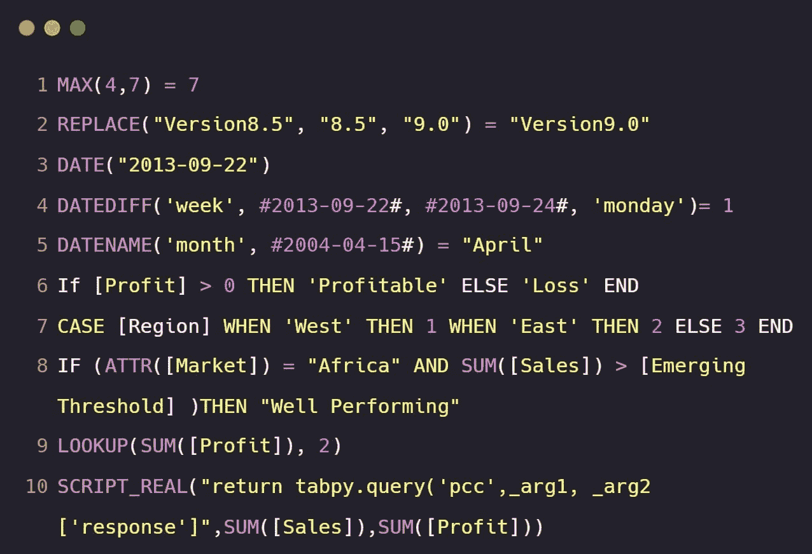
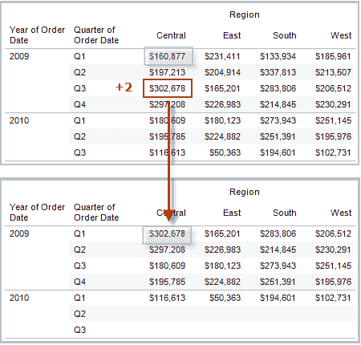

# 10 个最常用的 Tableau 函数

> 原文：[`www.kdnuggets.com/2022/08/10-used-tableau-functions.html`](https://www.kdnuggets.com/2022/08/10-used-tableau-functions.html)



图片作者 | [Carbon](https://carbon.now.sh/)

[Tableau 函数](https://help.tableau.com/current/pro/desktop/en-us/functions.htm) 为商业智能开发人员提供了额外的功能，以推动复杂分析和执行数学计算。它用于增强字符串、数字、日期和地理数据字段。

* * *

## 我们的前 3 个课程推荐

 1\. [谷歌网络安全证书](https://www.kdnuggets.com/google-cybersecurity) - 快速进入网络安全职业生涯。

 2\. [谷歌数据分析专业证书](https://www.kdnuggets.com/google-data-analytics) - 提升你的数据分析技能

 3\. [谷歌 IT 支持专业证书](https://www.kdnuggets.com/google-itsupport) - 支持你的组织的 IT

* * *

我们将学习最常用的 10 个 Tableau 函数，用于商业智能测试和开发。这些函数将帮助你理解 Tableau 不仅仅是一个拖放的华丽工具。

# MIN 和 MAX

**MAX** 函数将返回两个参数中的最高值。它也可以应用于数据字段，如下所示。

```py
MAX([Sales],[Profit])
```

**示例：**

```py
MAX(10,17) = 17
```

对于**MIN**，则相反。该函数将返回两个参数中最低的值。参数可以是数据字段或整数。

```py
MIN([Sales],[Profit])
```

**示例：**

```py
MIN(14,17) = 14
```

# REPLACE

**REPLACE** 函数可以应用于字符串数据字段和字符串。它需要三个参数：

+   **string**：可以是字符串数据字段或字符串。

+   **substring**：是你想更改的词或字母。

+   **replacement**：一个将替换子字符串的字符串。

```py
REPLACE(string, substring, replacement)
```

**示例：**

```py
REPLACE("Abid Ali", "Ali", "Awan") = "Abid Awan"
```

# DATEDIFF

用于查找两个日期字段之间的差异。你可以提取周、天、月和年的差异。

该函数需要 4 个参数：

+   **date_part**：是一个日期单位，用于返回两个日期之间的差异。

+   **date1 和 date2**：是日期字段

+   **start_of_week**：可以是星期一、星期日或星期二。这取决于你的需求。

```py
DATEDIFF(date_part, date1, date2, [start_of_week])
```

**示例：**

```py
DATEDIFF('week', #2019-10-22#, #2019-10-24#, 'monday')= 1
```

# DATENAME 和 DATEPART

**DATENAME** 用于返回日期数据字段中的 date_part 字符串。我们可以提取日期的天、年、周和月。

+   **date_part**：是应用于日期的日期单位

+   **date**：是一个日期字段或字符串。

+   **start_of_week**：日子被视为一周的第一天

```py
DATENAME(date_part, date, [start_of_week])
```

**示例：**

```py
DATENAME('month', #2020-03-25#) = "March"
```

代替返回字符串形式的月份名称，**DATEPART** 用于以整数形式从日期中提取日期部分。我们可以用它进行复杂的计算。

```py
DATEPART(date_part, date, [start_of_week])
```

**示例：**

```py
DATEPART('month', #2020-03-25#) = 3
```

# 类型转换

这是 Tableau 中使用最广泛的函数，我用它来将字符串转换为日期、整数转换为字符串、字符串转换为浮点数以及日期解析。

以下是类型转换函数的列表：

+   DATE(expression)

+   DATETIME(expression)

+   DATEPARSE(format, string)

+   FLOAT(expression)

+   INT(expression)

+   STR(expression)

# IF 和 ELSE

Tableau 具有简单的条件函数。你可以像 Python 一样执行 If else 语句。只需确保在语句末尾添加“**END**”以结束语句。

我使用**IF** 和 **ELSE** 语句来创建分类和绘制时间序列图。

```py
IF <expr> THEN <then> ELSE <else> END
```

**示例：**

```py
If [Profit] > 0 THEN 'Profitable' ELSE 'Loss' END
```

# AND 和 OR

对于高级逻辑函数，你还可以添加**AND** 和 **OR** 命令来扩展表达式。

```py
IF <expr1> AND <expr2> THEN <then> END
```

**示例：**

```py
IF (ATTR([Market]) = "South Asia" AND SUM([Sales]) > [Emerging Threshold] )THEN "Well Performing"
```

# CASE

类似于**IF** 和 **ELSE** 语句，你可以使用**CASE** 来创建逻辑函数。你可以将其应用于数据字段，并根据表达式创建多个分类。

```py
CASE <expression> WHEN <value1> THEN <return1> WHEN <value2> THEN <return2> ... ELSE <default return> END
```

**示例：**

以下脚本用于将“Language”字符串字段转换为整数。如果值是**English**，它将返回**1**；对于**Urdu**，返回**2**；对于其他任何值，返回**3**。

```py
CASE [Language] WHEN 'English' THEN 1 WHEN 'Urdu' THEN 2 ELSE 3 END
```

# LOOKUP

**LOOKUP** 用于在数据集中创建偏移。我主要使用这个函数来创建时间序列预测和分析。

需要一个数据字段和一个整数形式的偏移参数。

```py
LOOKUP(expression, [offset])
```

**示例：**

通过使用以下命令，我们将**Profit** 偏移了 2。现在，我们可以看到来自未来两个季度的销售值。

```py
LOOKUP(SUM([Profit]), 2)
```



图片来自 [Tableau](https://help.tableau.com/current/pro/desktop/en-us/functions_functions_tablecalculation.htm)

# TabPy

[TabPy](https://github.com/tableau/TabPy) 允许用户在 Tableau 中运行 Python 脚本。你可以使用 `pip install tabpy` 安装它，并通过在终端中输入 `tabpy` 来运行服务器。有关 Tabpy 安装的更多信息，请参见 [TabyPy 教程](https://www.datacamp.com/tutorial/getting-started-with-tabpy)。

你可以使用：

+   SCRIPT_BOOL

+   SCRIPT_INT

+   SCRIPT_REAL

+   SCRIPT_STR

每个命令都需要带有参数和参数列表的 Python 脚本。

```py
SCRIPT_REAL(Python Script, argument 1, argument 2, ...)
```

**示例：**

我们将创建一个相关性函数，它接受**Sales** 和 **Profit** 字段，并返回相关系数。如你所见，**_arg1** 和 **_arg2** 是**Sales** 和 **Profit** 的占位符。

```py
SCRIPT_REAL("import numpy as np 

return np.corrcoef(_arg1,_arg2)[0,1]",

SUM([Sales]),SUM([Profit]))
```

类似地，你可以将 Python 函数部署到 TabPy 服务器，并使用相同的脚本进行访问。阅读 [TabPy 教程：部署 Python 函数和 Prophet 预测模型](https://www.datacamp.com/tutorial/tabpy-tutorial-deploying-python-functions-and-prophet-forecasting-model) 了解有关部署 Python 函数的更多信息。

以**“return tabpy.query(<function name>, lists or arguments)[‘response’]”** 开头的 TabPy 查询脚本

```py
SCRIPT_REAL(TabPy Query Script, argument 1, argument 2, ...)
```

**示例：**

我们通过添加函数名（**pcc**）、参数占位符和参数来访问 Pearson 相关系数函数。

```py
SCRIPT_REAL("return tabpy.query('pcc',_arg1, _arg2)['response']",

SUM([Sales]),SUM([Profit]))
```

> 通过阅读官方[文档](https://help.tableau.com/current/pro/desktop/en-us/functions.htm)了解更多关于 Tableau 函数的信息。

**[Abid Ali Awan](https://www.polywork.com/kingabzpro)** ([@1abidaliawan](https://twitter.com/1abidaliawan)) 是一位认证数据科学专业人员，热爱构建机器学习模型。 目前，他专注于内容创作和撰写关于机器学习和数据科学技术的技术博客。 Abid 拥有技术管理硕士学位和电信工程学士学位。他的愿景是利用图神经网络为那些面临心理健康问题的学生构建一个 AI 产品。

### 更多相关主题

+   [KDnuggets 新闻，8 月 3 日：10 个最常用的 Tableau 函数 • 是…](https://www.kdnuggets.com/2022/n31.html)

+   [使用 Tableau 创建高效的组合数据源](https://www.kdnuggets.com/2022/05/create-efficient-combined-data-sources-tableau.html)

+   [为有效的 Tableau 和 Power BI 仪表板准备数据](https://www.kdnuggets.com/2022/06/prepare-data-effective-tableau-power-bi-dashboards.html)

+   [机器学习中使用的主要监督学习算法](https://www.kdnuggets.com/2022/06/primary-supervised-learning-algorithms-used-machine-learning.html)

+   [我每天使用 ChatGPT 五个月。这里有一些隐藏的宝石……](https://www.kdnuggets.com/2023/07/used-chatgpt-every-day-5-months-hidden-gems-change-life.html)

+   [为何单独使用 LLM 无法满足你公司预测需求](https://www.kdnuggets.com/2024/01/pecan-llms-used-alone-cant-address-companys-predictive-needs)
