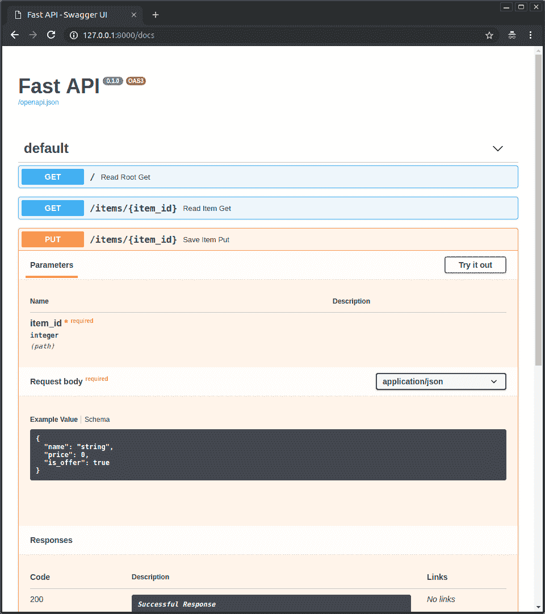

# 10 个对 Python 开发者有用的机器学习实践

> 原文：[`www.kdnuggets.com/2020/05/10-useful-machine-learning-practices-python-developers.html`](https://www.kdnuggets.com/2020/05/10-useful-machine-learning-practices-python-developers.html)

评论

**由[Pratik Bhavsar](https://www.linkedin.com/in/bhavsarpratik/)，远程 NLP 工程师**。

有时作为数据科学家，我们会忘记我们是因为什么而被雇佣的。我们主要是开发者，然后是研究人员，再然后可能是数学家。我们的首要责任是快速开发无错误的解决方案。

> * * *
> 
> ## 我们的前三个课程推荐
> ## 
>  1. [谷歌网络安全证书](https://www.kdnuggets.com/google-cybersecurity) - 快速进入网络安全职业生涯。
> 
>  2. [谷歌数据分析专业证书](https://www.kdnuggets.com/google-data-analytics) - 提升你的数据分析能力
> 
>  3. [谷歌 IT 支持专业证书](https://www.kdnuggets.com/google-itsupport) - 支持你的组织的 IT
> 
> * * *
> 
> 仅仅因为我们能创建模型，并不意味着我们是神。这并不赋予我们编写糟糕代码的自由。

自从开始以来，我犯了许多错误，并想分享我认为**ML 工程**中最常见的技能。在我看来，这也是当前行业中***最缺乏的技能***。

*我称他们为**软件文盲**数据科学家，因为很多人是非计算机科学专业的 Coursera 培训工程师。而我自己也曾是那样的人。* *????*

如果要在一位出色的数据科学家和一位出色的 ML 工程师之间选择，我会选择后者。

让我们开始吧。

### 1. 学会编写抽象类

一旦你开始编写抽象类，你会发现它可以为你的代码库带来多少清晰度。它们强制执行相同的方法和方法名称。如果许多人在同一个项目上工作，每个人开始编写不同的方法。这可能会造成无效的混乱。

### 2. 在顶部固定你的种子

实验的可重复性是非常重要的，种子是我们的敌人。抓住它。否则，它会导致训练/测试数据的不同划分以及神经网络中权重的不同初始化。这会导致结果不一致。

### 3. 从几行开始

如果你的数据过大，并且你在代码的后期部分工作，比如清洗数据或建模，使用**nrows**来避免每次都加载大量数据。当你只想测试代码而不是实际运行整个程序时，使用这个选项。

*这在你的本地 PC 配置不足以处理数据量时非常适用，但你仍然喜欢在本地使用 Jupyter/VS code/Atom 进行开发。*

> df_train = pd.read_csv(‘train.csv’，***nrows=1000****)*

### 4. 预期失败（成熟开发者的标志）

始终检查数据中的 NA，因为这些会在以后导致问题。即使当前数据中没有，也不意味着未来的重训练循环中不会出现。因此，仍然要保持检查。????

> *print(len(df))*
> 
> *df.isna().sum()*
> 
> *df.dropna()*
> 
> *print(len(df))*

### 5. 展示处理进度

当你处理大数据时，知道处理所需的时间以及我们在整个处理中的进展是很好的。

选项 1 — tqdm

选项 2 — fastprogress

### 6\. Pandas 可能会很慢

如果你使用过 pandas，你知道它有时会很慢——尤其是 groupby。与其绞尽脑汁寻找‘优秀’的加速方案，不如通过改变一行代码直接使用 modin。

> *import modin.pandas as pd*

### 7\. 计时函数

不是所有的函数都是一样的。

即使整个代码运行正常，也不意味着你写了出色的代码。一些软性错误实际上会让你的代码变慢，因此有必要找到它们。使用这个装饰器来记录函数的运行时间。

### 8\. 不要在云上烧钱

没有人喜欢浪费云资源的工程师。

我们的一些实验可能会运行几个小时。很难跟踪并在完成时关闭云实例。我自己也犯过错误，也看到过有人让实例开几天。

*这发生在我们在周五工作，留下东西在运行，周一才意识到。* *????*

只需在执行结束时调用此函数，你的屁股将再也不会着火了！

但将主代码包裹在***try***中，再将此方法包裹在***except***中——这样，如果发生错误，服务器不会继续运行。是的，我也处理过这些情况。????

我们要负点责任，不要生成二氧化碳。????

### 9\. 创建并保存报告

在建模的特定阶段之后，所有伟大的见解都仅来自错误和指标分析。确保为自己和经理创建并保存格式良好的报告。

反正，管理层喜欢报告，对吧？????

### 10\. 编写出色的 API

一切以坏结局收尾的都是坏的。

你可以做很好的数据清洗和建模，但最终仍然可能造成巨大的混乱。我与许多人的经验告诉我，很多人对如何编写好的 API、文档和服务器设置不清楚。

*下面是经典机器学习和深度学习部署在负载不高的情况下的一个好方法——比如 1000/min。*

组合见 — Fastapi + uvicorn

+   **最快**— 使用**fastapi**编写 API，因为它在 I/O 绑定方面是最快的，如 [this](https://www.techempower.com/benchmarks/#section=test&runid=7464e520-0dc2-473d-bd34-dbdfd7e85911&hw=ph&test=query&l=zijzen-7)所示，原因在 [这里](https://fastapi.tiangolo.com/benchmarks/)中解释。

+   **文档**— 使用 fastapi 编写 API 为我们提供了**免费文档**，并且测试端点位于 http:url/docs → 随着代码的更改，由 fastapi 自动生成和更新

+   **工作者**— 使用**uvicorn**部署 API

运行这些命令以使用 4 个工作进程进行部署。通过负载测试优化工作进程的数量。

> *pip install fastapi uvicorn*
> 
> *uvicorn main:app --workers 4 --host 0.0.0.0 --port 8000*

[原文](https://medium.com/modern-nlp/10-great-ml-practices-for-python-developers-b089eefc18fc)。经许可转载。

**相关：**

+   [数据科学家的编码习惯](https://www.kdnuggets.com/2020/05/coding-habits-data-scientists.html)

+   [作为机器学习工程师的第一年中学到的 12 件事](https://www.kdnuggets.com/2019/07/12-things-learned-machine-learning-engineer.html)

+   [数据科学的编程最佳实践](https://www.kdnuggets.com/2018/08/programming-best-practices-data-science.html)

### 更多相关话题

+   [为什么越来越多的开发者使用 Python 进行机器学习项目？](https://www.kdnuggets.com/2022/01/developers-python-machine-learning-projects.html)

+   [低代码：开发者还需要吗？](https://www.kdnuggets.com/2022/04/low-code-developers-still-needed.html)

+   [3 个有用的 Python 自动化脚本](https://www.kdnuggets.com/2022/11/3-useful-python-automation-scripts.html)

+   [4 个有用的中级 SQL 查询用于数据科学](https://www.kdnuggets.com/2022/12/4-useful-intermediate-sql-queries-data-science.html)

+   [KDnuggets 新闻，12 月 7 日：揭示十大数据科学误区 • 4…](https://www.kdnuggets.com/2022/n47.html)

+   [5 个真正有用的 Bash 脚本用于数据科学](https://www.kdnuggets.com/2023/02/bash-scripts-data-science.html)
