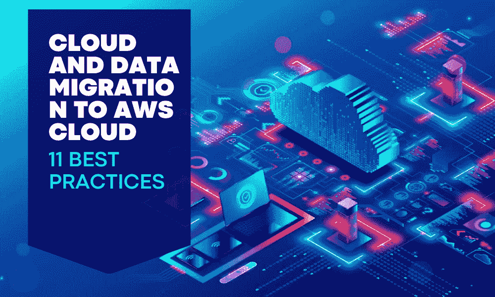

# 11 个最佳实践：云迁移和数据迁移到 AWS 云

> 原文：[`www.kdnuggets.com/2023/04/11-best-practices-cloud-data-migration-aws-cloud.html`](https://www.kdnuggets.com/2023/04/11-best-practices-cloud-data-migration-aws-cloud.html)

图片来源：编辑

我们的一位客户——**Ubicquia——智能物联网智能城市解决方案提供商**，由于最终客户对合规性、治理和安全性的要求，想将他们的工作负载从某个公共云平台迁移到 AWS。作为他们的实施合作伙伴，Anblicks 帮助完成了这次迁移，提高了云基础设施的连接性、可靠性、性能、可扩展性和成本效率。它还提供了访问 AWS 各种托管服务的机会，帮助团队更快地交付产品，并满足合规要求。

* * *

## 我们的前三个课程推荐

 1\. [谷歌网络安全证书](https://www.kdnuggets.com/google-cybersecurity) - 快速进入网络安全职业生涯。

 2\. [谷歌数据分析专业证书](https://www.kdnuggets.com/google-data-analytics) - 提升您的数据分析技能。

 3\. [谷歌 IT 支持专业证书](https://www.kdnuggets.com/google-itsupport) - 支持您的组织的 IT 需求。

* * *

在今天的数字化环境中，大多数企业越来越倾向于通过[云迁移服务来提升运营](https://www.anblicks.com/services/data-analytics/data-platform-migration)，以保持竞争优势。采用云解决方案带来了众多好处，包括提高实时性能、可扩展性、灵活性和成本效益。通过利用云服务，企业可以访问先进的工具和技术，这些工具和技术可以简化操作、增强协作，并提供更好的客户体验。此外，基于云的解决方案还提供了增强的数据安全性、灾难恢复和业务连续性能力，使其成为各类企业和行业的首选。

尽管云迁移服务提供了众多好处，但企业在迁移过程中面临一些常见挑战。要克服这些挑战，必须遵循最佳实践，例如评估当前基础设施、自动化流程、从小处开始、评估迁移服务的局限性、在迁移过程中进行优化、使用安全且合规的数据迁移技术，并进行全面测试。

# 11 个最佳实践：云迁移和数据迁移到 AWS 云

本文包括了一份从我们迁移到 AWS 云的过程中总结的**最佳实践**清单。为了确保平稳过渡并减少对操作的干扰，您可以在迁移实施过程中利用这些措施。

## 1\. 评估

迁移前的架构评估不仅应包括对现有硬件、软件系统以及网络和数据存储配置的审查。在确定目标架构之前，评估人员应评估应用程序和基础设施的可用性、可维护性、安全性、可扩展性和性能要求。在评估过程中识别的任何瓶颈有助于确定改进领域，并在迁移期间进行必要的更改或升级。在迁移计划中优先考虑应用程序可以通过评估每个应用程序的业务需求并确定其关键性水平来实现。AWS 应用发现服务就是一个例子，可以帮助在将工作负载迁移到 AWS 云之前发现您的资产。

评估数据源的因素，如数据大小、结构、格式和与目标系统的兼容性，对于确定最佳迁移方法以及发现数据迁移过程中可能出现的潜在问题至关重要。例如，您可能需要为大数据集使用与小数据集不同的迁移策略。对于数据丢失预防至关重要的系统，持续复制到目标系统直到切换完成的迁移方式将是必需的。此外，如果数据是专有格式的，您可能需要在迁移之前将其转换为目标系统兼容的更通用格式。例如，AWS DMS 服务提供的迁移前评估报告可以帮助识别在源数据迁移到 AWS RDS 期间可能出现的兼容性问题。

## 2\. 网络管理

规划您的网络架构，并考虑使用 AWS 虚拟私有云（VPC）来实现安全和隔离的网络环境。使用 AWS Direct Connect 或 VPN 连接建立您本地网络与 AWS 环境之间的安全可靠连接。实施网络监控和流量分析工具，以识别和解决网络性能问题。

## 3\. 迁移成本

分析您现有的基础设施，并找出可以降低成本的领域，例如使用预留实例或利用 AWS 定价模型如抢占实例。使用自动化工具以减少手动操作，降低整体迁移成本。

实施一个包括定期监控和优化 AWS 资源的云成本管理策略，以避免意外开支。

## 4\. 自动化

类似于自动化可以帮助其他领域一样，它也可以简化迁移过程并减少错误的可能性。通过自动化任务如数据转移和应用部署，你可以提高迁移的整体效率。利用 AWS 服务如 AWS DataSync、AWS Database Migration Service 和 AWS Application and Server Migration Services。这些服务可以帮助提高迁移的整体效率，并使数据和应用迁移到云端变得更容易。

## 5\. 从小规模开始

从小部分数据和有限数量的应用程序开始，可能是迁移到任何云端的好方法。通过这样做，你可以评估迁移过程，检测可能的问题，并验证其是否按预期运行。这种方法还可以帮助你完善迁移过程，并在全量迁移之前进行必要的调整。此外，从小规模开始还可以帮助你熟悉完成成功迁移所需的过程、工具和资源。通过分阶段的方法，你可以降低风险并最小化迁移过程中的停机时间。

## 6\. 评估迁移服务的限制

虽然有众多迁移服务，但重要的是要注意每个服务可能有其限制和前提条件。因此，务必仔细评估服务的功能，以确保它符合你迁移的具体要求。此外，在规划迁移时，考虑网络带宽、数据大小和复杂性以及整体迁移时间线等因素也很重要。

2017 年，全球教育公司 Pearson 在云迁移过程中经历了重大挑战。迁移导致了显著的停机时间和服务中断，导致了客户投诉和收入损失。

## 7\. 在迁移过程中进行优化

云迁移允许你的组织在过程中优化成本和资源。在发现阶段识别出不再需要的资源和应用程序。丢弃这些未使用的资源可以节省成本。此外，分析师可以检查历史资源使用情况，并指出哪些资源被低估使用。你可以在迁移到云端时缩减这些资源，以实现成本优化。

此外，尽可能利用 AWS 托管服务的优势是合理的。AWS 为许多应用程序提供托管服务，如数据库、缓存等。这些服务本质上具有高可用性、可扩展性和安全性。此外，这些服务的升级由 AWS 处理，从而减少了管理资源所需的行政工作。

## 8\. 使用安全且合规的数据迁移技术

数据安全和合规性是迁移到云时的关键考虑因素。AWS 提供各种服务来帮助保护静态数据和传输中的数据。例如，Amazon S3、RDS 以及许多其他服务提供静态数据的加密选项。虽然这满足了迁移后的合规要求，但同样重要的是要安全地将数据从现有数据源迁移到云。在数据迁移过程中，存储解决方案和服务不应公开或开放给更广泛的网络，只应允许来自目标云系统的访问。使用传输加密还增加了一层额外的安全保障。

## 9\. 监控

使用 AWS 监控工具，如 Amazon CloudWatch，来跟踪资源利用情况、检测潜在问题，并根据预定义的阈值触发警报。然后实施集中式日志记录，以收集和分析 AWS 环境中的日志数据。

使用性能测试工具来确保你的应用程序和工作负载在新的云环境中运行最佳。

## 10\. 治理

定义管理 AWS 环境中访问、权限和安全的政策和程序是重要的。实施安全最佳实践，如 SSO、多因素认证和加密，以保护你在云中的数据和基础设施。使用 AWS 服务限制来控制 AWS 资源的使用，防止意外超支。

## 11\. 综合测试

在迁移后进行彻底的验证是重要的，以确保所有应用程序和数据都已成功转移并正常工作。这个过程包括对数据完整性、性能和安全措施的全面测试，*最终目标*是建立一个稳定和安全的系统。确保迁移系统无错误或问题的一种方法是生成并执行系统上的测试用例。在测试阶段，制定回滚计划也是一种良好的做法，以防出现任何问题。

# 总结

如果迁移到云的过程不正确，它可能变得复杂且耗时。但它带来了显著的好处，如提高性能、可扩展性、成本节约和安全性。通过遵循 AWS 迁移框架的最佳实践——**评估、动员、迁移与现代化**，我们可以确保为我们的组织实现顺利而成功的迁移。此外，彻底了解新的云平台并利用 AWS 提供的各种服务和功能来优化你的工作负载也是至关重要的。云迁移对希望改善基础设施并在今天的市场中保持竞争力的组织来说具有重要价值。

**[Tonu Varughese](https://www.linkedin.com/in/tvarughese/)** 是一位高度熟练的高级 DevOps 工程师，拥有超过 12 年的技术行业经验。他专注于云计算、DevOps 实践和 Linux 管理。他在为各种组织设计、实施和维护稳健且可扩展的基础设施方面有着可靠的业绩记录。

### 更多相关内容

+   [数据仓库和 ETL 最佳实践](https://www.kdnuggets.com/2023/02/data-warehousing-etl-best-practices.html)

+   [将 ChatGPT 融入数据科学工作流程：技巧与最佳实践](https://www.kdnuggets.com/2023/05/integrating-chatgpt-data-science-workflows-tips-best-practices.html)

+   [MLOps：最佳实践及其应用方法](https://www.kdnuggets.com/2022/04/mlops-best-practices-apply.html)

+   [在 AWS EC2 上设置和使用 JupyterHub (TLJH)](https://www.kdnuggets.com/2023/01/setup-jupyterhub-tljh-aws-ec2.html)

+   [数据可视化最佳实践与有效沟通资源](https://www.kdnuggets.com/2023/04/data-visualization-best-practices-resources-effective-communication.html)

+   [数据科学团队协作的 5 个最佳实践](https://www.kdnuggets.com/2023/06/5-best-practices-data-science-team-collaboration.html)
