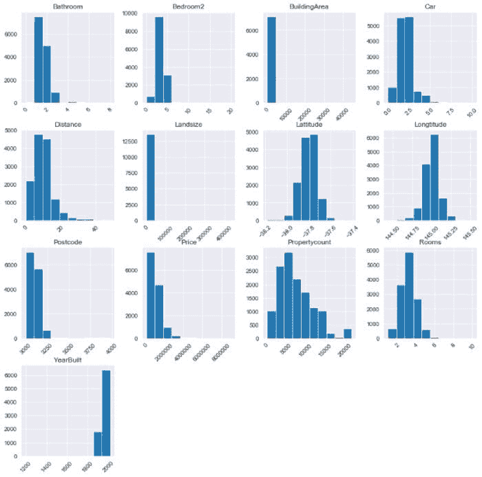
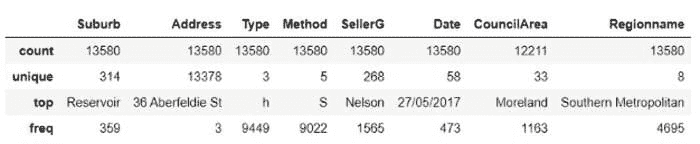
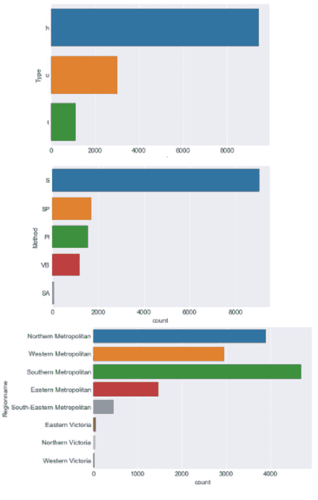
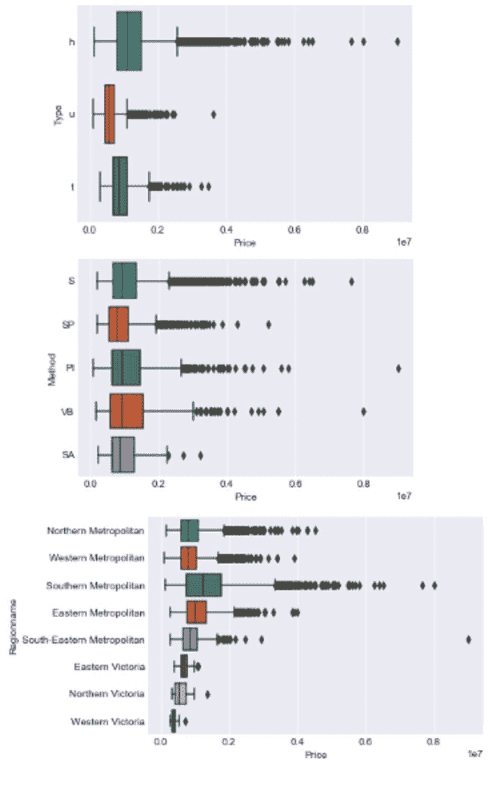
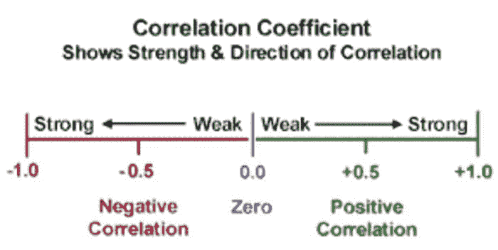
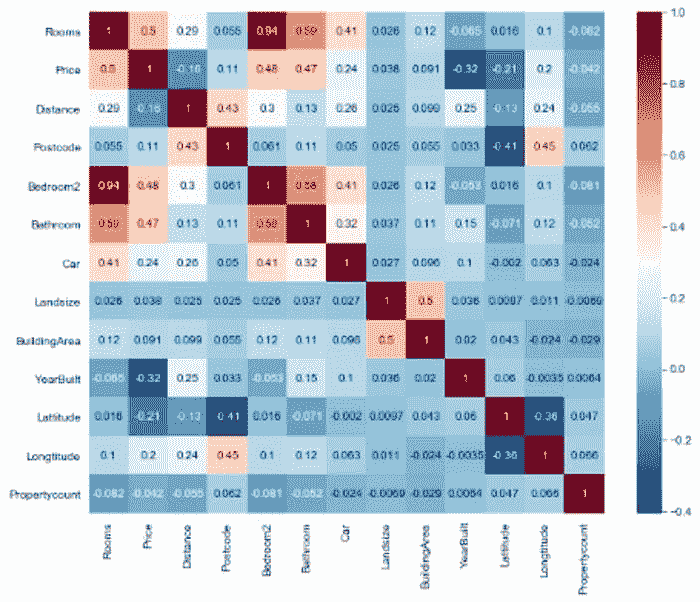

# 完整 EDA（探索性数据分析）的 11 个必备代码块

> 原文：[`www.kdnuggets.com/2021/03/11-essential-code-blocks-exploratory-data-analysis.html`](https://www.kdnuggets.com/2021/03/11-essential-code-blocks-exploratory-data-analysis.html)

评论

**由[Susan Maina](https://www.linkedin.com/in/suemnjeri/)，对数据充满热情，机器学习爱好者，[Medium 作者](https://medium.com/@suemnjeri)**

探索性数据分析，或称 EDA，是[data science process](https://www.datasciencegraduateprograms.com/the-data-science-process/)的第一步之一。它涉及尽可能多地了解数据，同时不花费过多时间。在这里，你可以对数据有直观和高层次的实际理解。在这个过程中结束时，你应该对数据集的结构、一些清理思路、目标变量以及可能的建模技术有一个大致的了解。

在大多数问题中，有一些通用策略可以快速执行 EDA。在这篇文章中，我将使用来自 kaggle 的[墨尔本住房快照数据集](https://www.kaggle.com/dansbecker/melbourne-housing-snapshot)来演示你可以用来进行满意的探索性数据分析的 11 个代码块。该数据集包括`Address`、房地产的`Type`、`Suburb`、销售`Method`、`Rooms`、`Price`、房地产代理`(SellerG)`、`Date`、`Distance`与 CBD 的距离。你可以通过[这里](https://www.kaggle.com/dansbecker/melbourne-housing-snapshot/download)下载数据集跟随学习。

第一步是导入所需的库。我们需要[Pandas](https://en.wikipedia.org/wiki/Pandas_(software))、[Numpy](https://towardsdatascience.com/4-fundamental-numpy-properties-every-data-scientist-must-master-c906236eb44b)、[matplotlib](https://en.wikipedia.org/wiki/Matplotlib)和[seaborn](https://seaborn.pydata.org/)。为了确保所有列都显示出来，请使用`pd.set_option(’display.max_columns’, 100)`。默认情况下，pandas 显示 20 列并隐藏其余列。

```py
import pandas as pd
pd.set_option('display.max_columns',100)import numpy as npimport matplotlib.pyplot as plt
%matplotlib inlineimport seaborn as sns
sns.set_style('darkgrid')
```

Panda 的`pd.read_csv(path)`将 csv 文件读取为 DataFrame。

```py
data = pd.read_csv('melb_data.csv')
```

### 基本数据集探索

**1\. DataFrame 的形状（维度）**

Pandas DataFrame 的`.shape`属性提供数据的整体结构。它返回一个[tuple](https://towardsdatascience.com/ultimate-guide-to-lists-tuples-arrays-and-dictionaries-for-beginners-8d1497f9777c)的长度为 2，表示数据集中有多少行观察值和列。

```py
data.shape### Results
(13580, 21)
```

我们可以看到数据集有 13,580 个观察值和 21 个特征，其中一个特征是目标变量。

**2\. 各列的数据类型**

DataFrame 的`.dtypes`属性显示各列的数据类型，作为 Panda 的[Series](https://www.geeksforgeeks.org/python-pandas-series/)（Series 表示一个值及其索引的列）。

```py
data.dtypes### Results
Suburb            object
Address           object
Rooms              int64
Type              object
Price            float64
Method            object
SellerG           object
Date              object
Distance         float64
Postcode         float64
Bedroom2         float64
Bathroom         float64
Car              float64
Landsize         float64
BuildingArea     float64
YearBuilt        float64
CouncilArea       object
Lattitude        float64
Longtitude       float64
Regionname        object
Propertycount    float64
dtype: object
```

我们观察到数据集中具有**分类**（对象）和**数值**（浮点数和整数）特征的组合。此时，我回到 Kaggle 页面以了解列及其含义。请查看使用[Datawrapper](https://www.datawrapper.de/)创建的列及其定义的表格[这里](https://datawrapper.dwcdn.net/hHuXG/4/)。

注意事项：

+   应该是分类的数值特征，反之亦然。

从快速分析来看，我没有发现数据类型的任何不匹配。这是有道理的，因为此数据集版本是原始[墨尔本数据](https://www.kaggle.com/anthonypino/melbourne-housing-market)的清理快照。

**3\. 显示几行数据**

Pandas DataFrame 提供了非常方便的函数来显示几个观察值。`data.head()`显示前 5 个观察值，`data.tail()`显示最后 5 个，`data.sample()`从数据集中随机选择一个观察值。你可以使用`data.sample(5)`显示 5 个随机观察值。

```py
data.head()
data.tail()
data.sample(5)
```

注意事项：

+   你能理解列名吗？它们有意义吗？（如有需要，请再次检查变量定义）

+   这些列中的值有意义吗？

+   是否发现了显著的缺失值（NaN）？

+   分类特征有哪些类别？

我的见解：`Postcode`和`Propertycount`特征均根据`Suburb`特征发生了变化。此外，`BuildingArea`和`YearBuilt`存在显著的缺失值。

### 分布

这指的是特征中值的分布情况，或它们出现的频率。对于数值特征，我们将查看特定列中数字组出现的次数，而对于分类特征，则查看每列的类别及其频率。我们将使用**图形**和实际的汇总**统计**。图形使我们能够整体了解分布，而统计数据提供了实际数字。这两种策略都推荐使用，因为它们相辅相成。

### 数值特征

**4\. 绘制每个数值特征**

我们将使用 Pandas [直方图](https://pandas.pydata.org/pandas-docs/stable/reference/api/pandas.DataFrame.hist.html)。直方图将数字分组到范围（或区间）中，柱子的高度显示该范围内的数字数量。`df.hist()`在网格中绘制数据的数值特征的直方图。我们还将提供`figsize`和`xrot`参数，以增加网格大小并将 x 轴旋转 45 度。

```py
data.hist(figsize=(14,14), xrot=45)
plt.show()
```



作者的直方图

注意事项：

+   可能无法解释的异常值或可能是测量错误

+   应该是分类的数值特征。例如，`Gender`由 1 和 0 表示。

+   不合理的边界值，如百分比值> 100。

从直方图中，我注意到`BuildingArea`和`LandSize`在右侧有潜在的异常值。我们的目标特征`Price`也高度偏向右侧。我还注意到`YearBuilt`非常偏向左侧，边界从 1200 年开始，这很奇怪。让我们继续查看汇总统计信息以获得更清晰的图像。

**5\. 数值特征的汇总统计信息**

现在我们对数值特征有了直观的了解，我们将查看实际统计数据，使用`df.describe()`显示其汇总统计信息。

```py
data.describe()
```

我们可以看到每个数值特征的*count*（值的数量）、*mean*（均值）、*std*（标准差）、*minimum*（最小值）、*25th*（25 百分位数）、*50th*（50 百分位数或中位数）、*75th*（75 百分位数）和*maximum*（最大值）。从 count 中我们还可以识别出具有**缺失值**的特征；它们的数量与数据集的总行数不相等。这些特征是`Car`、`LandSize`和`YearBuilt`。

我注意到`LandSize`和`BuildingArea`的最小值为 0。我们还看到`Price`的范围从 85,000 到 9,000,000，这是一个很大的范围。我们将在项目后续的详细分析中探索这些列。

然而，查看`YearBuilt`特征时，我们注意到最小年份为 1196。这可能是数据输入错误，将在清理过程中删除。

### 分类特征

**6\. 分类特征的汇总统计信息**

对于分类特征，重要的是在绘制图形之前展示汇总统计信息，因为某些特征有很多独特的类别（如我们将看到的`Address`），如果在 countplot 上进行可视化，这些类别将变得难以阅读。

要检查仅分类特征的汇总统计信息，我们将使用`df.describe(include='object')`

```py
data.describe(include='object')
```



作者分类汇总统计

这个表格与数值特征的表格略有不同。在这里，我们获得每个特征的*count*（值的数量）、*unique*（唯一类别的数量）、*top*（最频繁的类别）以及该类别在数据集中出现的*frequently*（频率）。

我们注意到一些类别有很多独特的值，例如`Address`，其次是`Suburb`和`SellerG`。根据这些发现，我将仅绘制具有 10 个或更少独特类别的列。我们还注意到`CouncilArea`有缺失值。

**7\. 绘制每个分类特征**

根据上述统计数据，我们注意到`Type`、`Method`和`Regionname`有少于 10 个类别，可以有效地进行可视化。我们将使用[Seaborn countplot](https://seaborn.pydata.org/generated/seaborn.countplot.html)绘制这些特征，它类似于分类变量的直方图。countplot 中的每一条柱子代表一个独特的类别。

我创建了一个[For loop](https://towardsdatascience.com/a-gentle-introduction-to-flow-control-loops-and-list-comprehensions-for-beginners-3dbaabd7cd8a)。对于每个分类特征，将显示一个计数图以展示该特征的类别分布。行`df.select_dtypes(include=’object’)`选择分类列及其值并显示它们。我们还将包括一个[If-statement](https://towardsdatascience.com/a-gentle-introduction-to-flow-control-loops-and-list-comprehensions-for-beginners-3dbaabd7cd8a)，以便仅选择包含 10 个或更少类别的三列，使用行`Series.nunique() < 10`。阅读`.nunique()`文档[这里](https://pandas.pydata.org/pandas-docs/stable/reference/api/pandas.Series.nunique.html)。

```py
for column in data.select_dtypes(include='object'):
    if data[column].nunique() < 10:
        sns.countplot(y=column, data=data)
        plt.show()
```



按作者绘制的计数图

注意事项：

+   稀疏类别可能会影响模型的性能。

+   类别标记错误，例如两个完全相同的类别只有细微的拼写差异。

我们注意到`Regionname`有一些稀疏类别，这些类别在建模过程中可能需要合并或重新分配。

### 分组和分段

分段允许我们切割数据并观察分类特征与数值特征之间的关系。

**8. 按分类特征对目标变量进行分段。**

在这里，我们将比较目标特征`Price`与主要分类特征`(Type`、`Method`和`Regionname)`的各个类别之间的差异，并观察`Price`如何随类别变化。

我们使用了[Seaborn boxplot](https://seaborn.pydata.org/generated/seaborn.boxplot.html)，它绘制了`Price`在分类特征的各个类别中的分布。该[教程](https://www.geeksforgeeks.org/how-to-show-mean-on-boxplot-using-seaborn-in-python/)清晰地解释了箱线图的特征。两端的点表示离群值。


图片来自[www.geekeforgeeks.org](https://www.geeksforgeeks.org/how-to-show-mean-on-boxplot-using-seaborn-in-python/)

我再次使用了一个*for loop*来绘制每个分类特征与`Price`的箱线图。

```py
for column in data.select_dtypes(include=’object’):
 if data[column].nunique() < 10:
 sns.boxplot(y=column, x=’Price’, data=data)
 plt.show()
```



按作者绘制的箱线图

注意事项：

+   哪些类别对目标变量的影响最大。

注意到`Price`在之前看到的`Regionname`的 3 个稀疏类别中仍然分布稀疏，这进一步支持了我们对这些类别的论点。

还注意到`SA`类别（出现频率最低的`Method`类别）指令价格很高，几乎与最频繁出现的类别`S.`相似。

**9. 按每个分类特征对数值特征进行分组。**

在这里，我们将看到所有其他数值特征（不仅仅是 `Price`）如何随每个类别特征变化，通过总结各类别的数值特征来实现。我们使用 [Dataframe 的 groupby](https://www.shanelynn.ie/summarising-aggregation-and-grouping-data-in-python-pandas/) 函数按类别分组数据，并计算各种数值特征的指标（如 *均值*、*中位数*、*最小值*、*标准差* 等）。

对于只有 3 个类别特征且类别少于 10 的情况，我们对数据进行分组，然后计算数值特征的 `mean`。我们使用 `display()`，这比 `print()` 结果更清晰。

```py
for column in data.select_dtypes(include='object'):
    if data[column].nunique() < 10:
        display(data.groupby(column).mean())
```

我们可以比较 `Type,` `Method` 和 `Regionname` 类别在数值特征上的分布情况。

### 数值特征与其他数值特征之间的关系

**10. 不同数值特征的相关性矩阵**

[相关性](https://www.mathsisfun.com/data/correlation.html)是一个介于 -1 和 1 之间的值，表示两个不同特征的值如何同时变化。*正相关*意味着当一个特征增加时，另一个特征也会增加，而*负相关*则表示一个特征增加时另一个特征减少。接近 0 的相关性表示*弱*关系，而接近 -1 或 1 则表示*强*关系。



图片来自 [edugyan.in](http://www.edugyan.in/2017/02/correlation-coefficient.html)

我们将使用 `df.corr()` 计算数值特征之间的 [相关性](https://machinelearningmastery.com/how-to-use-correlation-to-understand-the-relationship-between-variables/)，并返回一个 DataFrame。

```py
corrs = data.corr()
corrs
```

现在这可能意义不大，所以让我们绘制一个热力图来可视化相关性。

**11. 相关性的热力图**

我们将使用 [Seaborn 热力图](https://seaborn.pydata.org/generated/seaborn.heatmap.html) 将网格绘制为矩形的颜色编码矩阵。我们使用 `sns.heatmap(corrs, cmap='RdBu_r', annot=True)`。

`cmap='RdBu_r'` 参数告诉热力图使用什么颜色调色板。高正相关性显示为 *深红色*，高负相关性显示为 *深蓝色*。接近白色表示弱关系。阅读 [这个](https://medium.com/@morganjonesartist/color-guide-to-seaborn-palettes-da849406d44f) 好教程获取其他颜色调色板。`annot=True` 包括了相关性值在框中，便于阅读和解释。

```py
plt.figure(figsize=(10,8))
sns.heatmap(corrs, cmap='RdBu_r', annot=True)
plt.show()
```



作者制作的热力图

需要注意的事项：

+   强相关的特征；要么是深红色（正相关），要么是深蓝色（负相关）。

+   目标变量；如果它与其他特征有强正相关或负相关关系。

我们注意到`Rooms`、`Bedrooms2`、`Bathrooms`和`Price`之间有强正相关关系。另一方面，`Price`作为我们的目标特征，与`YearBuilt`有稍微弱*负*相关关系，与`Distance`从 CBD 的距离有更弱的*负*相关关系。

在这篇文章中，我们探讨了墨尔本数据集，并对其结构及特征有了初步了解。在这一阶段，我们不需要做到 100%的全面，因为在未来的阶段，我们会更详细地探索数据。你可以在 Github 上获得完整的代码，[点击这里](https://github.com/suemnjeri/medium-articles/blob/main/melbourne/EDA_melbourne_for_medium.ipynb)。我将很快上传数据集清理的概念。

**简介: [苏珊·梅纳](https://www.linkedin.com/in/suemnjeri/)** 对数据充满热情，是机器学习爱好者，[Medium 上的作者](https://medium.com/@suemnjeri)。

[原始内容](https://towardsdatascience.com/11-simple-code-blocks-for-complete-exploratory-data-analysis-eda-67c2817f56cd)。经许可转载。

**相关内容:**

+   仅用两行代码进行强大的探索性数据分析

+   Pandas Profiling: 一行代码实现 EDA

+   一行代码进行统计和视觉探索性数据分析

* * *

## 我们的 3 个顶级课程推荐

 1\. [谷歌网络安全证书](https://www.kdnuggets.com/google-cybersecurity) - 快速进入网络安全职业。

 2\. [谷歌数据分析专业证书](https://www.kdnuggets.com/google-data-analytics) - 提升你的数据分析能力

 3\. [谷歌 IT 支持专业证书](https://www.kdnuggets.com/google-itsupport) - 支持你的组织在 IT 领域

* * *

### 更多相关主题

+   [数据科学家共享代码块的新方法](https://www.kdnuggets.com/2022/03/new-ways-sharing-code-blocks.html)

+   [数据科学家探索性数据分析的必备指南](https://www.kdnuggets.com/2023/06/data-scientist-essential-guide-exploratory-data-analysis.html)

+   [如何通过使用自动 EDA 工具来成功应对数据科学评估测试](https://www.kdnuggets.com/2022/04/ace-data-science-assessment-test-automatic-eda-tools.html)

+   [掌握 SQL、Python、数据清理、数据处理等的指南汇总](https://www.kdnuggets.com/collection-of-guides-on-mastering-sql-python-data-cleaning-data-wrangling-and-exploratory-data-analysis)

+   [非结构化数据的探索性数据分析技术](https://www.kdnuggets.com/2023/05/exploratory-data-analysis-techniques-unstructured-data.html)

+   [掌握探索性数据分析的 7 个步骤](https://www.kdnuggets.com/7-steps-to-mastering-exploratory-data-analysis)
