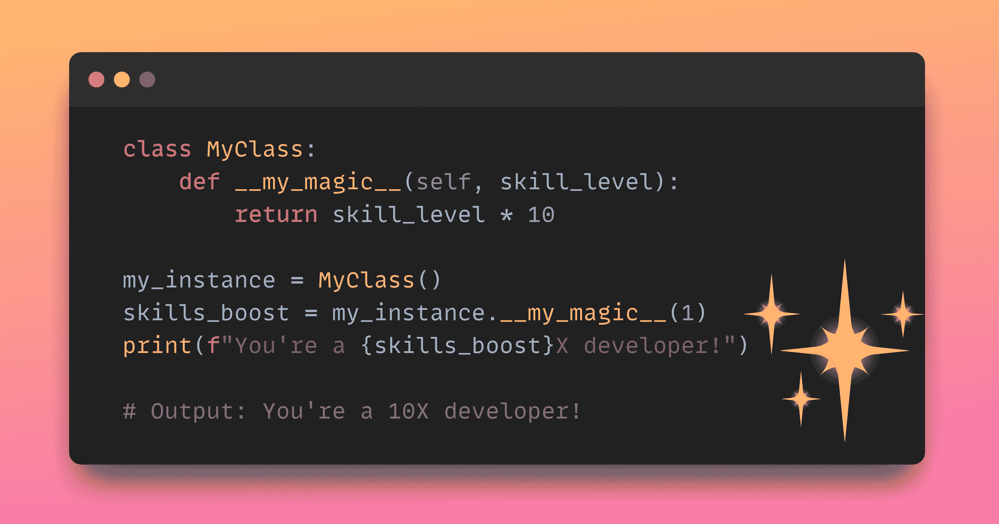

# 每个程序员都应该知道的 11 个 Python 魔法方法

> 原文：[`www.kdnuggets.com/11-python-magic-methods-every-programmer-should-know`](https://www.kdnuggets.com/11-python-magic-methods-every-programmer-should-know)



作者提供的图片

在 Python 中，魔法方法帮助你在 Python 类中模拟内置函数的行为。这些方法有前后双下划线（__），因此也称为**双下划线方法**。

这些魔法方法还帮助你在 Python 中实现运算符重载。你可能见过这样的例子。例如，使用乘法运算符*与两个整数相乘会得到乘积。而与字符串和整数`k`一起使用，则会得到重复`k`次的字符串：

```py
 >>> 3 * 4
12
>>> 'code' * 3
'codecodecode'
```

在这篇文章中，我们将通过创建一个简单的二维向量`Vector2D`类来深入探讨 Python 中的魔法方法。

我们将从你可能熟悉的方法开始，逐步构建更有用的魔法方法。

让我们开始编写一些魔法方法吧！

# 1\. __init__

考虑以下`Vector2D`类：

```py
class Vector2D:
    pass
```

一旦你创建了一个类并实例化一个对象，你可以这样添加属性：`obj_name.attribute_name = value`。

然而，与其手动为你创建的每个实例添加属性（这当然毫无趣味！），你需要一种方法来初始化这些属性。

为此，你可以定义`__init__`方法。让我们为我们的`Vector2D`类定义`__init__`方法：

```py
class Vector2D:
    def __init__(self, x, y):
        self.x = x
        self.y = y

v = Vector2D(3, 5)
```

# 2\. __repr__

当你尝试检查或打印你实例化的对象时，你会发现没有得到任何有用的信息。

```py
v = Vector2D(3, 5)
print(v)
```

```py
Output >>> <__main__.Vector2D object at 0x7d2fcfaf0ac0>
```

这就是为什么你应该添加一个表示字符串，即对象的字符串表示。为此，请添加一个`__repr__`方法，如下所示：

```py
class Vector2D:
    def __init__(self, x, y):
        self.x = x
        self.y = y

    def __repr__(self):
        return f"Vector2D(x={self.x}, y={self.y})"

v = Vector2D(3, 5)
print(v)
```

```py
Output >>> Vector2D(x=3, y=5)
```

`__repr__`应该包含创建类实例所需的所有属性和信息。`__repr__`方法通常用于调试目的。

# 3\. __str__

`__str__`也用于添加对象的字符串表示。通常，`__str__`方法用于向类的最终用户提供信息。

让我们为我们的类添加一个`__str__`方法：

```py
class Vector2D:
    def __init__(self, x, y):
        self.x = x
        self.y = y

    def __str__(self):
        return f"Vector2D(x={self.x}, y={self.y})"

v = Vector2D(3, 5)
print(v)
```

```py
Output >>> Vector2D(x=3, y=5)
```

如果没有`__str__`的实现，它将回退到`__repr__`。因此，对于你创建的每个类，你至少应该添加一个`__repr__`方法。

# 4\. __eq__

接下来，让我们添加一个方法来检查任何两个`Vector2D`类对象的相等性。如果两个向量对象的 x 和 y 坐标相同，则它们是相等的。

现在创建两个`Vector2D`对象，x 和 y 值相等，并比较它们的相等性：

```py
v1 = Vector2D(3, 5)
v2 = Vector2D(3, 5)
print(v1 == v2)
```

结果是 False。因为默认情况下，比较检查内存中对象 ID 的相等性。

```py
Output >>> False
```

让我们添加`__eq__`方法来检查相等性：

```py
class Vector2D:
    def __init__(self, x, y):
        self.x = x
        self.y = y

    def __repr__(self):
        return f"Vector2D(x={self.x}, y={self.y})"

    def __eq__(self, other):
        return self.x == other.x and self.y == other.y
```

现在，相等性检查应该按预期工作：

```py
v1 = Vector2D(3, 5)
v2 = Vector2D(3, 5)
print(v1 == v2)
```

```py
Output >>> True 
```

# 5\. __len__

Python 内置的 `len()` 函数帮助你计算内置可迭代对象的长度。假设对于一个向量，长度应返回向量包含的元素数量。

那么让我们为 `Vector2D` 类添加一个 `__len__` 方法：

```py
class Vector2D:
    def __init__(self, x, y):
        self.x = x
        self.y = y

    def __repr__(self):
        return f"Vector2D(x={self.x}, y={self.y})"

    def __len__(self):
        return 2

v = Vector2D(3, 5)
print(len(v))
```

所有 `Vector2D` 类的对象长度为 2：

```py
Output >>> 2
```

# 6\. **add**

现在让我们考虑一下我们在向量上执行的常见操作。让我们添加魔法方法来加减任意两个向量。

如果你直接尝试添加两个向量对象，你将遇到错误。因此，你应该添加一个 `__add__` 方法：

```py
class Vector2D:
    def __init__(self, x, y):
        self.x = x
        self.y = y

    def __repr__(self):
        return f"Vector2D(x={self.x}, y={self.y})"

    def __add__(self, other):
        return Vector2D(self.x + other.x, self.y + other.y)
```

你现在可以像这样添加任意两个向量：

```py
v1 = Vector2D(3, 5)
v2 = Vector2D(1, 2)
result = v1 + v2
print(result)
```

```py
Output >>> Vector2D(x=4, y=7)
```

# 7\. **sub**

接下来，让我们添加一个 `__sub__` 方法来计算 `Vector2D` 类中任意两个对象之间的差异：

```py
class Vector2D:
    def __init__(self, x, y):
        self.x = x
        self.y = y

    def __repr__(self):
        return f"Vector2D(x={self.x}, y={self.y})"

    def __sub__(self, other):
        return Vector2D(self.x - other.x, self.y - other.y)
```

```py
v1 = Vector2D(3, 5)
v2 = Vector2D(1, 2)
result = v1 - v2
print(result)
```

```py
Output >>> Vector2D(x=2, y=3)
```

# 8\. **mul**

我们还可以定义一个 `__mul__` 方法来定义对象之间的乘法。

让我们实现处理

+   标量乘法：向量与标量的乘法

+   内积：两个向量的点积

```py
class Vector2D:
    def __init__(self, x, y):
        self.x = x
        self.y = y

    def __repr__(self):
        return f"Vector2D(x={self.x}, y={self.y})"

    def __mul__(self, other):
        # Scalar multiplication
        if isinstance(other, (int, float)):
            return Vector2D(self.x * other, self.y * other)
        # Dot product
        elif isinstance(other, Vector2D):
            return self.x * other.x + self.y * other.y
        else:
            raise TypeError("Unsupported operand type for *")
```

现在我们将举几个例子来看看 `__mul__` 方法的实际效果。

```py
v1 = Vector2D(3, 5)
v2 = Vector2D(1, 2)

# Scalar multiplication
result1 = v1 * 2
print(result1)  
# Dot product
result2 = v1 * v2
print(result2)
```

```py
Output >>>

Vector2D(x=6, y=10)
13
```

# 9\. **getitem**

`__getitem__` 魔法方法允许你对对象进行索引，并使用熟悉的方括号 [ ] 语法访问属性或属性切片。

对于 `Vector2D` 类的对象 `v`：

+   `v[0]`：x 坐标

+   `v[1]`：y 坐标

如果你尝试通过索引访问，会遇到错误：

```py
v = Vector2D(3, 5)
print(v[0],v[1])
```

```py
---------------------------------------------------------------------------

TypeError                             	Traceback (most recent call last)

 <ipython-input-6-3fbbbf13d881>in <cell line:="">()
----> 1 print(v[0],v[1])

TypeError: 'Vector2D' object is not subscriptable</cell></ipython-input-6-3fbbbf13d881>
```

让我们实现 `__getitem__` 方法：

```py
class Vector2D:
    def __init__(self, x, y):
        self.x = x
        self.y = y

    def __repr__(self):
        return f"Vector2D(x={self.x}, y={self.y})"

    def __getitem__(self, key):
        if key == 0:
            return self.x
        elif key == 1:
            return self.y
        else:
            raise IndexError("Index out of range")
```

你现在可以使用它们的索引访问元素，如下所示：

```py
v = Vector2D(3, 5)
print(v[0])  
print(v[1])
```

```py
Output >>>

3
5
```

# 10\. **call**

通过实现 `__call__` 方法，你可以像调用函数一样调用对象。

在 `Vector2D` 类中，我们可以实现一个 `__call__` 方法来按给定因子缩放向量：

```py
class Vector2D:
    def __init__(self, x, y):
        self.x = x
        self.y = y

    def __repr__(self):
        return f"Vector2D(x={self.x}, y={self.y})"

    def __call__(self, scalar):
        return Vector2D(self.x * scalar, self.y * scalar)
```

所以，如果你现在调用 3，你将得到按 3 的因子缩放的向量：

```py
v = Vector2D(3, 5)
result = v(3)
print(result)
```

```py
Output >>> Vector2D(x=9, y=15)
```

# 11\. **getattr**

`__getattr__` 方法用于获取对象的特定属性值。

在这个示例中，我们可以添加一个 `__getattr__` 方法，该方法在计算 向量的大小（L2 范数） 时被调用：

```py
class Vector2D:
    def __init__(self, x, y):
        self.x = x
        self.y = y

    def __repr__(self):
        return f"Vector2D(x={self.x}, y={self.y})"

    def __getattr__(self, name):
        if name == "magnitude":
            return (self.x ** 2 + self.y ** 2) ** 0.5
        else:
            raise AttributeError(f"'Vector2D' object has no attribute '{name}'")
```

让我们验证一下这是否按预期工作：

```py
v = Vector2D(3, 4)
print(v.magnitude)
```

```py
Output >>> 5.0
```

# 结论

本教程到此结束！希望你学会了如何为你的类添加魔法方法，以模拟内置函数的行为。

我们已经介绍了一些最有用的魔法方法。但这并不是一个详尽无遗的列表。为了进一步了解，请创建一个你选择的 Python 类，并根据所需功能添加魔法方法。继续编程！

**[](https://twitter.com/balawc27)**[Bala Priya C](https://www.kdnuggets.com/wp-content/uploads/bala-priya-author-image-update-230821.jpg)** 是来自印度的开发人员和技术作家。她喜欢在数学、编程、数据科学和内容创作的交叉点上工作。她的兴趣和专长领域包括 DevOps、数据科学和自然语言处理。她喜欢阅读、写作、编程和咖啡！目前，她正致力于通过撰写教程、操作指南、评论文章等方式学习和分享知识。Bala 还创建引人入胜的资源概述和编码教程。**

* * *

## 我们的三大课程推荐

 1\. [Google 网络安全证书](https://www.kdnuggets.com/google-cybersecurity) - 快速进入网络安全职业生涯。

 2\. [Google 数据分析专业证书](https://www.kdnuggets.com/google-data-analytics) - 提升你的数据分析技能

 3\. [Google IT 支持专业证书](https://www.kdnuggets.com/google-itsupport) - 支持你的组织在 IT 方面

* * *

### 更多相关内容

+   [Python f-Strings 魔法：每个程序员需要知道的 5 个改变游戏规则的技巧](https://www.kdnuggets.com/python-fstrings-magic-5-gamechanging-tricks-every-coder-needs-to-know)

+   [理解 Python 的迭代与成员资格：__contains__ 和 __iter__ 魔法方法指南](https://www.kdnuggets.com/understanding-pythons-iteration-and-membership-a-guide-to-__contains__-and-__iter__-magic-methods)

+   [Jupyter Notebook 魔法方法备忘单](https://www.kdnuggets.com/jupyter-notebook-magic-methods-cheat-sheet)

+   [每个数据科学家都应该了解的 6 个 Python 机器学习工具](https://www.kdnuggets.com/2022/05/6-python-machine-learning-tools-every-data-scientist-know.html)

+   [每个数据科学家都应该知道的三大 R 库（即使你使用 Python）](https://www.kdnuggets.com/2021/12/three-r-libraries-every-data-scientist-know-even-python.html)

+   [KDnuggets 新闻，5 月 25 日：每个……的 6 个 Python 机器学习工具](https://www.kdnuggets.com/2022/n21.html)
