# 12 个 Streamlit 必备命令

> 原文：[`www.kdnuggets.com/2023/01/12-essential-commands-streamlit.html`](https://www.kdnuggets.com/2023/01/12-essential-commands-streamlit.html)

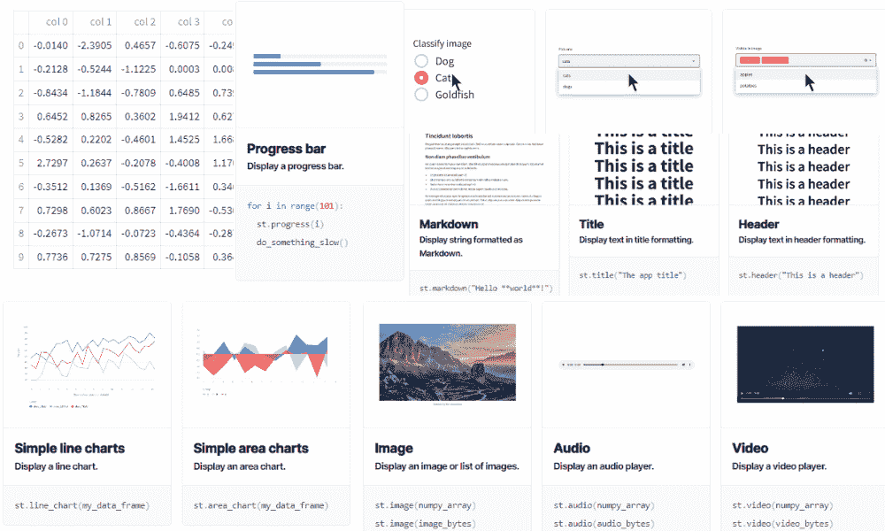

作者提供的图像

# 1\. write

* * *

## 我们的前三个课程推荐

 1\. [Google 网络安全证书](https://www.kdnuggets.com/google-cybersecurity) - 快速进入网络安全职业生涯

 2\. [Google 数据分析专业证书](https://www.kdnuggets.com/google-data-analytics) - 提升你的数据分析水平

 3\. [Google IT 支持专业证书](https://www.kdnuggets.com/google-itsupport) - 支持你的组织的 IT

* * *

[st.write](https://docs.streamlit.io/library/api-reference/write-magic/st.write) 不仅仅是一个打印函数来显示文本和数字。你可以用它来显示 pandas DataFrame、错误、字典、交互式可视化和 Keras 模型。

```py
st.write(*args, unsafe_allow_html=False, **kwargs)
```

就像打印一样，你需要提供字符串/数字或对象。

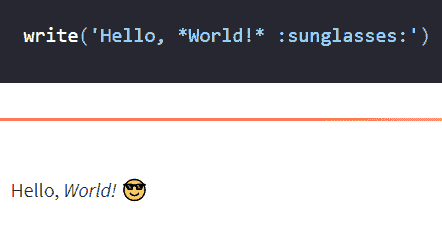

来自 Streamlit API 参考

**注意：** 你还可以使用 `st.title`、`st.header`、`st.header`、`st.code` 和 `st.latex` 来显示各种类型的文本元素。

# 2\. markdown

如果你熟悉 Markdown，那么 [st.markdown](https://docs.streamlit.io/library/api-reference/text/st.markdown) 是你的好帮手。它将帮助你显示图像、文本、标题等。

```py
st.markdown(body, unsafe_allow_html=False)
```

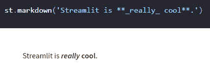

来自 Streamlit API 参考

# 3\. dataframe

你可以使用 [st.dataframe](https://docs.streamlit.io/library/api-reference/data/st.dataframe) 来显示 pandas DataFrame 和 Styler、pyarrow 表、NumPy 数组、PySpark DataFrame 和 Snowpark DataFrame 和表格。该函数允许你自定义表格，通过调整宽度和高度，并使用 pandas styler 进行样式设置。

```py
st.dataframe(data=None, width=None, height=None, *, use_container_width=False)
```

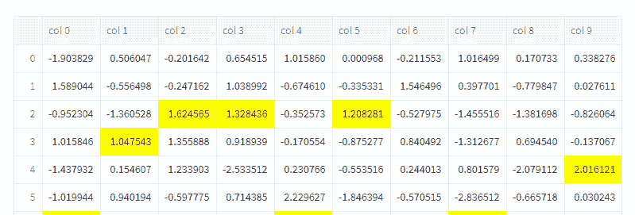

来自 Streamlit API 参考

# 4\. metric

如果你创建了仪表盘，你会知道显示 KPI 和关键性能指标的重要性。

[st.metric](https://docs.streamlit.io/library/api-reference/data/st.metric) 命令使显示各种指标变得容易，并带有 delta 指示器。你还可以使用 [st.columns](https://docs.streamlit.io/library/api-reference/layout/st.columns) 显示多个指标。

```py
st.metric(label, value, delta=None, delta_color="normal", help=None)
```

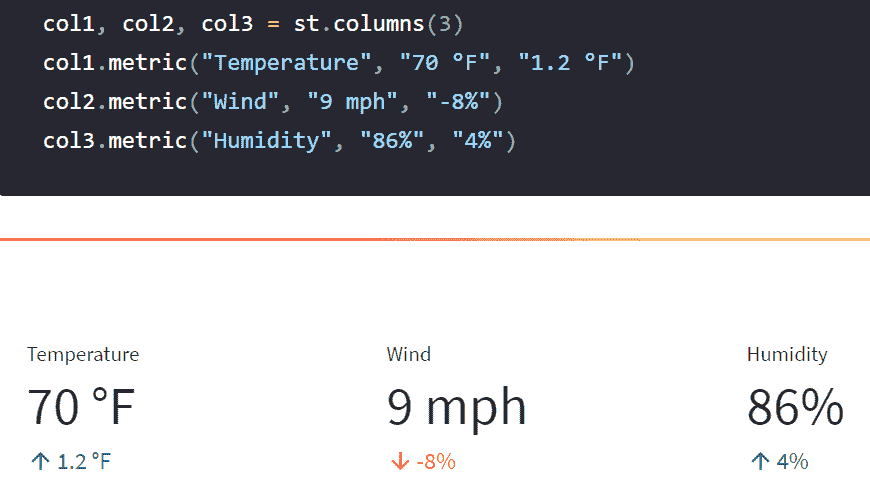

来自 Streamlit API 参考

# 5\. line_chart

Streamlit 还具有其可视化命令，这是 st.altair_chart 的语法糖。你可以使用 [st.line_chart](https://docs.streamlit.io/library/api-reference/charts/st.line_chart) 在几秒钟内显示折线图。它比 st.altair_chart 更易于使用，因为它使用数据的列和索引来确定图表的规范。

```py
st.line_chart(data=None, *, x=None, y=None, width=0, height=0, use_container_width=True)
```

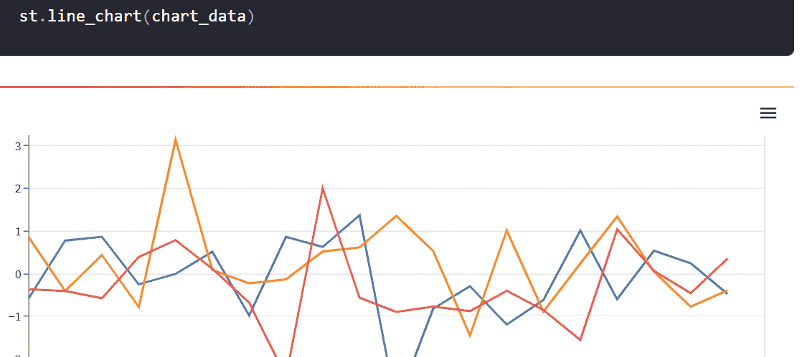

图片来自 Streamlit API 参考

# 6\. matplotlib

[st.pyplot](https://docs.streamlit.io/library/api-reference/charts/st.pyplot) 显示 matplotlib.pyplot 图形。你可以用它来显示各种图表，并像在 Jupyter Notebook 中一样自定义它们。

```py
st.pyplot(fig=None, clear_figure=None, **kwargs)
```

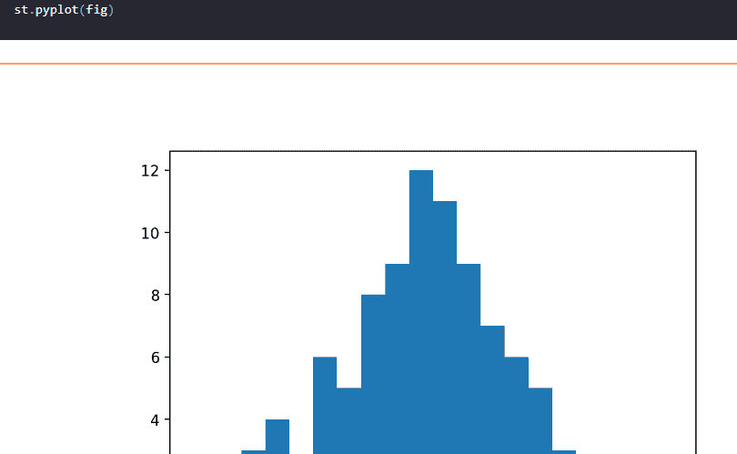

图片来自 Streamlit API 参考

**注意：** 你还可以使用 st.altair_chart、st.vega_lite_chart、st.plotly_chart、st.pydeck_chart、st.graphviz_chart 和 st.map 来显示交互式可视化图表。

# 7\. 文本输入

[st.text_input](https://docs.streamlit.io/library/api-reference/widgets/st.text_input) 显示单行文本输入控件。你可以用它来向函数提供用户输入，使你的 web 应用程序更具互动性和可定制性。它通常用于 NLP 和机器学习任务。

```py
st.text_input(label, value="", max_chars=None, key=None, type="default", help=None, autocomplete=None, on_change=None, args=None, kwargs=None, *, placeholder=None, disabled=False, label_visibility="visible")
```

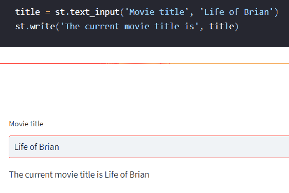

图片来自 Streamlit API 参考

# 8\. 选择框

除了文本输入，你还可以使用 [st.selectbox](https://docs.streamlit.io/library/api-reference/widgets/st.selectbox) 小部件，并向用户提供选项。这将改善用户体验，因为他们可以通过选择不同的选项进行操作。

```py
st.selectbox(label, options, index=0, format_func=special_internal_function, key=None, help=None, on_change=None, args=None, kwargs=None, *, disabled=False, label_visibility="visible")
```

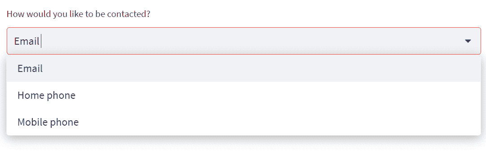

图片来自 Streamlit API 参考

**注意：** 你还可以使用 st.button、st.download_button、st.checkbox、st.radio、st.slider、st.number_input、st.text_area、st.date_input、st.time_input、st.file_uploader、st.camera_input 和 st.color_picker 作为输入控件。

# 9\. 图像

要显示图像，你需要使用 PIL 打开图像，并将对象提供给 [st.image](https://docs.streamlit.io/library/api-reference/media/st.image)。这些函数接受 Numpy ndarray 来显示各种图像。

```py
st.image(image, caption=None, width=None, use_column_width=None, clamp=False, channels="RGB", output_format="auto")
```

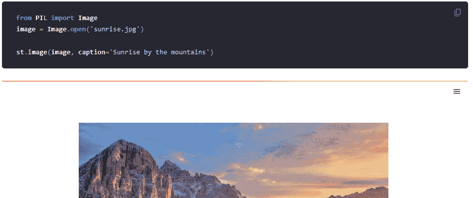

图片来自 Streamlit API 参考

**注意：** 你还可以使用 st.audio 和 st.video 来收听音频和观看视频。

# 10\. 进度

[st.progress](https://docs.streamlit.io/library/api-reference/status/st.progress) 是一项了不起的功能。你可以通过查看进度条来估计时间，而不是等待一个未知的时间段。这将改善用户体验。

```py
st.progress(value)
```


图片来自 Streamlit API 参考

**注意：** 你还可以使用 [status elements](https://docs.streamlit.io/library/api-reference/status) 来显示旋转器、警告、错误、信息、成功和异常。

# 11\. sidebar

[st.sidebar](https://docs.streamlit.io/library/api-reference/layout/st.sidebar) 是自定义布局和容器的一部分。它用于分析和机器学习应用。它还为你提供了更多空间来添加用户选项。

```py
with st.sidebar:
    st.[element_name]
```

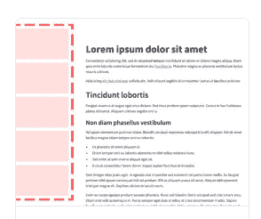

图片来自 Streamlit API 参考

**注意：** 你还可以使用 [Layouts and Containers](https://docs.streamlit.io/library/api-reference/layout) 来自定义标签页、容器、列和扩展器。

# 12\. cache

[st.cache](https://docs.streamlit.io/library/api-reference/performance/st.cache) 是处理大数据集和机器学习模型时的最佳伙伴。它是一个函数装饰器，用于记忆函数执行并节省时间。

```py
st.cache(func=None, persist=False, allow_output_mutation=False, show_spinner=True, suppress_st_warning=False, hash_funcs=None, max_entries=None, ttl=None)
```

```py
@st.cache(persist=True)
def fetch_and_clean_data(url):
    # Fetch data from URL here, and then clean it up.
    return data
```

# 结论

你可以使用这些命令来创建数据分析仪表板、机器学习演示、Web 应用程序，甚至创建你的个人作品网站。如果你寻找灵感，可以看看社区创建和分享的 [Gallery](https://streamlit.io/gallery)。

在这篇文章中，我们介绍了 12 个最基本的 Streamlit 命令，如果你想了解所有命令，可以查看 [Streamlit Cheat Sheet](https://docs.streamlit.io/library/cheatsheet)。我们已经了解了文本、数据框、可视化、指标、输入和小部件、布局以及实用命令。

如果你喜欢我的工作，请在社交媒体上分享，或者如果你对 Streamlit 有任何问题，可以通过 [LinkedIn](https://www.linkedin.com/in/1abidaliawan/) 联系我。

**[Abid Ali Awan](https://www.polywork.com/kingabzpro)** ([@1abidaliawan](https://twitter.com/1abidaliawan)) 是一名认证的数据科学专家，热衷于构建机器学习模型。目前，他专注于内容创作，并撰写关于机器学习和数据科学技术的技术博客。Abid 拥有技术管理硕士学位和电信工程学士学位。他的愿景是利用图神经网络为面临心理健康问题的学生开发一个 AI 产品。

### 更多相关内容

+   [数据科学家的 14 个基本 Git 命令](https://www.kdnuggets.com/2022/06/14-essential-git-commands-data-scientists.html)

+   [数据科学的 16 个基本 DVC 命令](https://www.kdnuggets.com/2022/07/16-essential-dvc-commands-data-science.html)

+   [数据科学的 10 个基本 SQL 命令](https://www.kdnuggets.com/2022/10/10-essential-sql-commands-data-science.html)

+   [数据科学初学者的 20 个基本 Linux 命令](https://www.kdnuggets.com/2022/06/20-basic-linux-commands-data-science-beginners.html)

+   [KDnuggets 新闻，6 月 29 日：20 个基本的 Linux 命令用于数据科学……](https://www.kdnuggets.com/2022/n26.html)

+   [每位数据科学家都应该知道的 12 个 Docker 命令](https://www.kdnuggets.com/2023/01/12-docker-commands-every-data-scientist-know.html)
