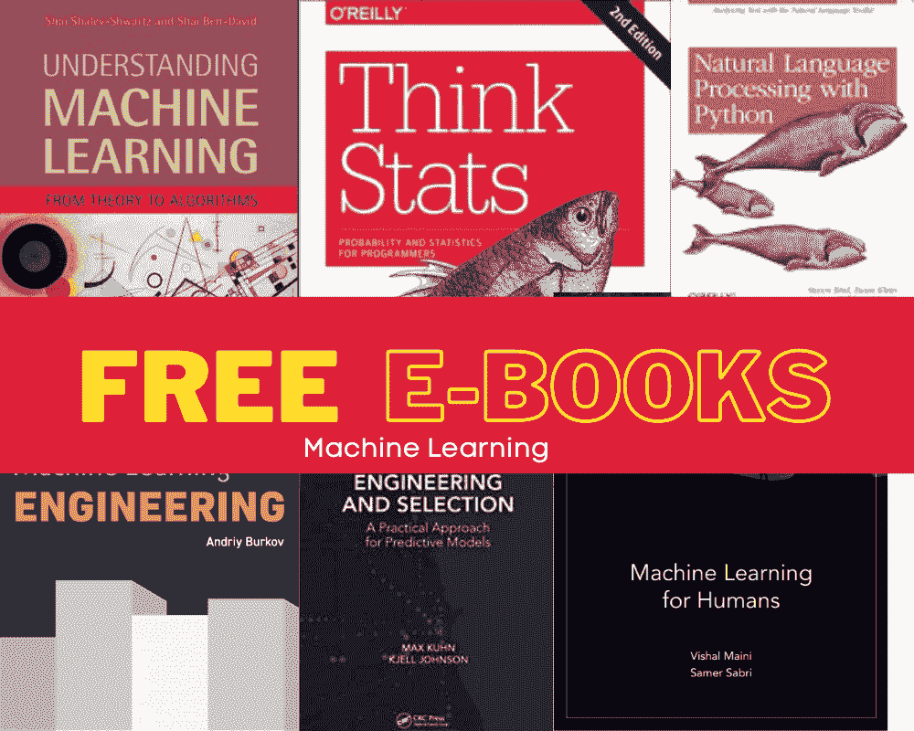

# 15 本免费机器学习和深度学习书籍

> 原文：[`www.kdnuggets.com/2022/10/15-free-machine-learning-deep-learning-books.html`](https://www.kdnuggets.com/2022/10/15-free-machine-learning-deep-learning-books.html)

图片由编辑提供

如果你希望在机器学习领域发展职业或作为数据科学家希望转型进入机器学习领域，下面是一些免费的电子书列表，帮助你实现这一目标。

# 《理解机器学习：从理论到算法》

* * *

## 我们的前三个课程推荐

 1\. [谷歌网络安全证书](https://www.kdnuggets.com/google-cybersecurity) - 快速进入网络安全职业轨道。

 2\. [谷歌数据分析专业证书](https://www.kdnuggets.com/google-data-analytics) - 提升你的数据分析技能

 3\. [谷歌 IT 支持专业证书](https://www.kdnuggets.com/google-itsupport) - 支持你的组织在 IT 领域

* * *

作者：Shai Shalev-Shwartz 和 Shai Ben-David

这本书分为四部分：第一部分：基础，第二部分：从理论到算法，第三部分：附加学习模型，第四部分：高级理论。如果你想查看内容，请点击[这里](https://www.cs.huji.ac.il/~shais/UnderstandingMachineLearning/toc.html)。

[点击这里阅读](https://www.cs.huji.ac.il/~shais/UnderstandingMachineLearning/understanding-machine-learning-theory-algorithms.pdf)。

# 《思考统计：程序员的概率与统计》

作者：Allen B. Downey

如果你已经对 Python 有了基本了解，并且能够应用它，你可以进一步应用这些技能，更好地理解概率和统计的概念。这本书深入讲解，会将你的机器学习之旅提升到新的水平。

[点击这里阅读](https://greenteapress.com/thinkstats2/thinkstats2.pdf)。

# 《统计学习入门》

作者：Gareth James、Daniela Witten、Trevor Hastie 和 Rob Tibshirani

统计学是机器学习的一个重要部分，因此了解得越多越好。如果你正在寻找一本帮助你掌握统计学的书籍——这本书深入讲解了深度学习、生存分析、多重检验等内容。

[点击这里阅读](https://hastie.su.domains/ISLR2/ISLRv2_website.pdf)。

# 《机器学习为人类》

作者：Vishal Maini 和 Samer Sabri

另一本适合初学者的好书。如果你对机器学习还不太熟悉，想要增加对其基础知识的了解——这是一本非常有价值的电子书。你将学习监督学习、无监督学习、神经网络和深度学习、强化学习以及最佳的机器学习资源。

[点击这里阅读](https://everythingcomputerscience.com/books/Machine%20Learning%20for%20Humans.pdf)。

# 《大数据挖掘》

作者：Jure Leskovec, Anand Rajaraman, 和 Jeffrey D. Ullman

我们有大量的数据可用，数据越多，数据集就越大。能够挖掘庞大的数据集，并提取有价值的见解以进一步用于决策过程是一项越来越受欢迎的技能。

[点击这里阅读](http://infolab.stanford.edu/~ullman/mmds/book.pdf)。

# 机器学习工程

作者：Andriy Burkov

如果你正在寻找一份工作，尤其是作为机器学习工程师——这本书适合你。书中分为 9 章：简介、项目开始前、数据收集与准备、特征工程、监督模型训练（第一部分）、监督模型训练（第二部分）、模型评估、模型部署、模型服务、监控与维护，以及结论。这是对机器学习工程师日常工作的终极解读。

[点击这里阅读](http://www.mlebook.com/wiki/doku.php)。

# 《百页机器学习书》

作者：Andriy Burkov

Burkov 还有另一本机器学习书籍，但这本书首先讲解该领域的基础知识，然后深入探讨更高级的实践，如符号和定义、基础算法及深入材料、学习算法的结构、基本实践、神经网络和深度学习、问题与解决方案、高级实践。

[点击这里阅读](http://themlbook.com/wiki/doku.php)。

# 机器学习数学

作者：Marc Peter Deisenroth, A. Aldo Faisal, Cheng Soon Ong

我们永远无法忘记数学在机器学习中的重要性。这是一个需要花费大量时间才能掌握的领域。在这本书中，你将学习线性代数、解析几何、矩阵分解、线性回归、主成分分析（PCA）的降维、密度估计以及支持向量机分类。

[点击这里阅读](https://mml-book.github.io/book/mml-book.pdf)。

# 特征工程与选择：预测模型的实用方法

作者：Max Kuhn 和 Kjell Johnson

特征工程是机器学习模型的重要元素。本电子书指导你正确进行特征工程和预测建模的实践。涵盖的主题包括使用实例进行预测建模、性能测量、参数调整、模型优化、探索性可视化等。

[点击这里阅读](http://www.feat.engineering/index.html)。

# 模式识别与机器学习

作者：Christopher M Bishop

这本 758 页的电子书内容丰富！你将首先广泛介绍概率及其分布。接着，你将进入回归和分类的线性模型，然后进一步学习神经网络和其他主题，如核方法等。

[点击这里阅读](https://www.microsoft.com/en-us/research/uploads/prod/2006/01/Bishop-Pattern-Recognition-and-Machine-Learning-2006.pdf)。

# 实用机器学习与 R

作者：Bradley Boehmke 和 Brandon Greenwell

如果 R 是你选择的编程语言，并且你已经开始深入了解机器学习——这本书适合你。它涵盖了最常见的机器学习方法，如广义低秩模型、聚类算法、自编码器、正则化模型、随机森林、梯度提升机器、深度神经网络、堆叠/超级学习器等。

[点击这里阅读](https://bradleyboehmke.github.io/HOML/)。

# 机器学习解释性简介

作者：Patrick Hall 和 Navdeep Gill

作为一名机器学习工程师，你可能会遇到需要解释你的模型的时刻。高管通常没有技术背景，因此能够解释和阐述你的 AI 给这类人群是一项非常重要的技能，并且能让你走得更远。

[点击这里阅读](https://h2o.ai/content/dam/h2o/en/marketing/documents/2019/08/An-Introduction-to-Machine-Learning-Interpretability-Second-Edition.pdf)。

# 使用 Python 进行自然语言处理

作者：Steven Bird, Ewan Klein, 和 Edward Loper

如果你对自然语言处理感兴趣并且精通 Python——这本书适合你。你将学习：

1.  语言处理与 Python

1.  访问文本语料库和词汇资源

1.  处理原始文本

1.  编写结构化程序

1.  分类和标记单词

1.  学习文本分类

1.  从文本中提取信息

1.  分析句子结构

1.  构建基于特征的语法

1.  分析句子的意义

1.  管理语言数据

1.  后记：面对语言挑战

[点击这里阅读](https://www.nltk.org/book/)。

# Python 机器学习项目

作者：Brian Bocheron 和 Lisa Tagliaferri

你可能已经到了想创建机器学习项目来测试你的技能和建立一个作品集的阶段。项目是你在科技行业职业生涯中的一个重要元素，并且对帮助你找到工作至关重要。

[点击这里阅读](http://assets.digitalocean.com/books/python/machine-learning-projects-python.pdf)。

# 机器学习面试书介绍

作者：Chip Huyen

如果你已经对机器学习有了良好的理解，并且准备开始申请工作——了解你将面临的面试问题类型是非常有用的。你将更好地理解不同的角色、公司和面试流程。

[点击这里阅读](https://huyenchip.com/ml-interviews-book/)

# 结论

希望这篇文章能帮助你收集免费的资源，以帮助你在机器学习方面建立知识并启动你的职业生涯。

关注下一批免费的机器学习和深度学习电子书！

**[Nisha Arya](https://www.linkedin.com/in/nisha-arya-ahmed/)** 是一名数据科学家和自由职业技术作家。她特别感兴趣于提供数据科学职业建议或教程以及围绕数据科学的理论知识。她还希望探索人工智能如何（或可以）促进人类寿命的不同方式。作为一名热衷学习者，她寻求拓宽技术知识和写作技能，同时帮助指导他人。

### 相关主题更多内容

+   [KDnuggets 新闻，11 月 2 日：数据科学的现状…](https://www.kdnuggets.com/2022/n43.html)

+   [15 本更多免费的机器学习和深度学习书籍](https://www.kdnuggets.com/2022/11/15-free-machine-learning-deep-learning-books.html)

+   [理解机器学习的 24 本最佳（且免费）书籍](https://www.kdnuggets.com/2020/03/24-best-free-books-understand-machine-learning.html)

+   [掌握 SQL、Python、数据科学、机器学习和自然语言处理的 25 本免费书籍](https://www.kdnuggets.com/25-free-books-to-master-sql-python-data-science-machine-learning-and-natural-language-processing)

+   [掌握机器学习的 5 本免费书籍](https://www.kdnuggets.com/5-free-books-to-master-machine-learning)

+   [2023 年必读的 5 本免费数据科学书籍](https://www.kdnuggets.com/2023/01/5-free-data-science-books-must-read-2023.html)
