# 你必须了解的 15 个 Python 编码面试问题

> 原文：[`www.kdnuggets.com/2022/04/15-python-coding-interview-questions-must-know-data-science.html`](https://www.kdnuggets.com/2022/04/15-python-coding-interview-questions-must-know-data-science.html)


了解 Python 是每个数据科学家应掌握的[关键技能之一](https://www.stratascratch.com/blog/what-skills-do-you-need-as-a-data-scientist/)。这并非没有理由。Python 的能力，加上 Pandas 库，能够以多种不同方式操控和分析数据，使其成为数据科学工作的理想工具。

* * *

## 我们的前 3 个课程推荐

 1\. [Google 网络安全证书](https://www.kdnuggets.com/google-cybersecurity) - 快速进入网络安全职业生涯。

 2\. [Google 数据分析专业证书](https://www.kdnuggets.com/google-data-analytics) - 提升你的数据分析能力

 3\. [Google IT 支持专业证书](https://www.kdnuggets.com/google-itsupport) - 支持你的组织 IT

* * *

不足为奇的是，所有寻求数据科学家的公司都会在面试中测试他们的 Python 技能。

我们将探讨你应熟悉的技术概念以及 Python/Pandas 函数，以[获得数据科学职位](https://www.stratascratch.com/blog/how-to-get-a-data-science-job-the-ultimate-guide/)。

这是我们将讨论的五个主题：

+   聚合、分组和排序数据

+   联接表

+   数据过滤

+   文本操作

+   日期时间操作

毋庸置疑，这些概念很少单独测试，因此通过解决一个问题，你将展示你对多个 Python 主题的知识。

# 聚合、分组和排序数据


这三个技术主题通常一起出现，它们是创建报告和进行任何数据分析的基础。

它们允许你执行一些数学操作，并以可表示和用户友好的方式展示你的发现。

我们将向你展示几个实际示例，以确保你了解我们所讨论的内容。

## Python 编码面试问题 #1：类性能

这个 Box 面试问题问你：

*“给定一个表，包含班级学生的作业分数。写一个查询，识别所有作业总分的最大差异。输出两个学生之间总分的差异。”*

问题链接：[`platform.stratascratch.com/coding/10310-class-performance?python=1`](https://platform.stratascratch.com/coding/10310-class-performance?python=1)

你需要使用的表是 box_scores，它有以下列：

| id | int64 |
| --- | --- |
| student | object |
| assignment1 | int64 |
| assignment2 | int64 |
| assignment3 | int64 |

表中的数据如下所示：

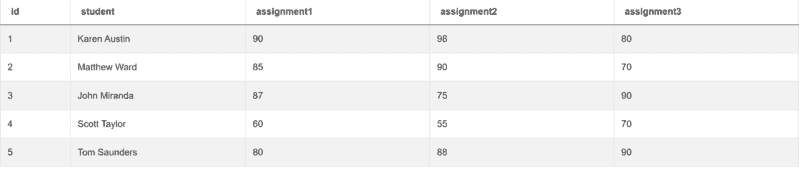

作为回答问题的第一步，你应该汇总所有作业的评分：

```py
import pandas as pd
import numpy as np
box_scores['total_score'] = box_scores['assignment1']+box_scores['assignment2']+box_scores['assignment3']
```

这部分代码将给你如下结果：

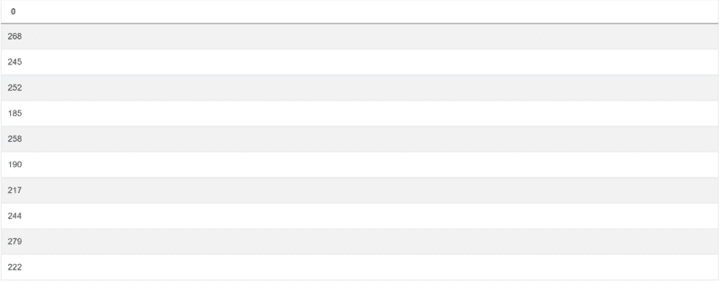

现在你知道了，下一步是找到总分之间的最大差异。你需要使用`max()`和`min()`函数来实现这一点。或者，更具体地说，就是这两个函数输出之间的差异。将这部分代码添加到上面的代码中，你就得到了最终答案：

```py
import pandas as pd
import numpy as np
box_scores['total_score'] = box_scores['assignment1']+box_scores['assignment2']+box_scores['assignment3']
box_scores['total_score'].max() - box_scores['total_score'].min()
```

这是你要找的输出：

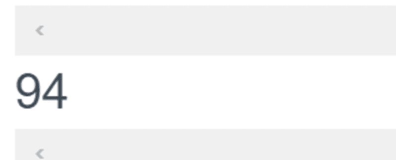

问题要求只输出这个差异，所以不需要其他列。

## Python 编码面试题 #2：企业检查评分

前一个问题不需要任何数据分组和排序，这与旧金山城市提出的以下问题不同：

这是旧金山城市提出的一个问题：

*“找出每个企业的检查评分中位数，并输出结果以及企业名称。根据检查评分的降序排列记录。尽量用你自己精确的中位数计算方法。在 Postgres 中有`percentile_disc`函数可用，但它只是一个近似值。”*

问题链接：[`platform.stratascratch.com/coding/9741-inspection-scores-for-businesses?python=1`](https://platform.stratascratch.com/coding/9741-inspection-scores-for-businesses?python=1)

在这里，你应该使用`notnull()`函数来确保只获取那些有检查评分的企业。此外，你还需要按企业名称分组数据，并计算检查评分的中位数。使用`median()`函数。此外，使用`sort_values()`按降序排序输出。

## Python 编码面试题 #3：按种类的记录数

看看这个微软的问题：

*“找出数据集中每种类别的记录总数。输出类别及其对应的记录数量。按类别的升序排列记录。”*

问题链接：[`platform.stratascratch.com/coding/10168-number-of-records-by-variety?python=1`](https://platform.stratascratch.com/coding/10168-number-of-records-by-variety?python=1)

在前两个示例之后，这个问题应该不难解决。首先，你应该按列的种类和萼片长度进行分组。要查找每种类的记录数，请使用`count()`函数。最后，使用`sort_values`按字母顺序对种类进行排序。

# 表连接

在所有之前的示例中，我们只给出了一张表。我们选择这些示例，以便你更容易理解 Python 中如何进行聚合、分组和排序。

然而，作为数据科学家，你通常需要知道如何编写查询来从多个表格中提取数据。

## Python 编程面试题 #4：最低价格订单

在 Python 中连接两个表格的最简单方法之一是使用 merge() 函数。我们将使用它来解决亚马逊问题：

*“查找每个客户的最低订单成本。输出客户 id 以及名字和最低订单价格。”*

链接到问题：[`platform.stratascratch.com/coding/9912-lowest-priced-orders?python=1`](https://platform.stratascratch.com/coding/9912-lowest-priced-orders?python=1)

你需要处理两个表格。第一个表格是 customers：

| id | int64 |
| --- | --- |
| first_name | object |
| last_name | object |
| city | object |
| address | object |
| phone_number | object |

这是数据：

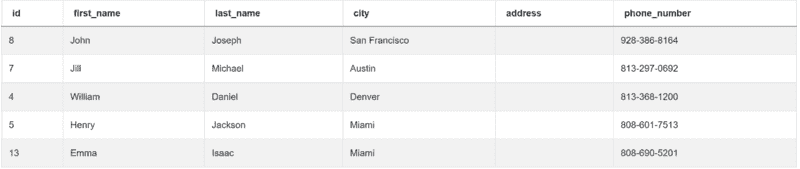

第二个表格名为 orders，包含以下列：

| id | int64 |
| --- | --- |
| cust_id | int64 |
| order_date | datetime64[ns] |
| order_details | object |
| total_order_cost | int64 |

数据如下：

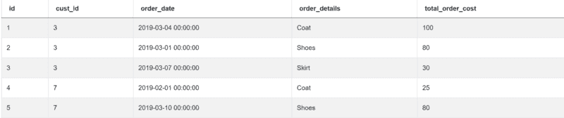

由于你需要两个表格中的数据，因此你必须合并或进行内连接：

```py
import pandas as pd
import numpy as np
merge = pd.merge(customers, orders, left_on="id", right_on="cust_id")
```

你可以在 customers 表的 id 列和 orders 表的 cust_id 列上进行此操作。结果显示为两个表格合并成一个：

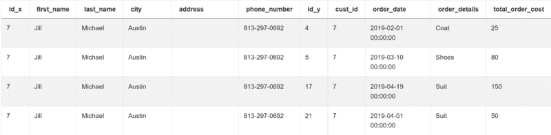

一旦完成，使用 groupby() 函数按 cust_id 和 first_name 分组输出。这些是问题要求你展示的列。你还需要显示每个客户的最低订单成本，这可以通过 min() 函数来实现。

完整的答案如下：

```py
import pandas as pd
import numpy as np
merge = pd.merge(customers, orders, left_on="id", right_on="cust_id")
result = merge.groupby(["cust_id", "first_name"])["total_order_cost"].min().reset_index()
```

该代码返回所需的输出。

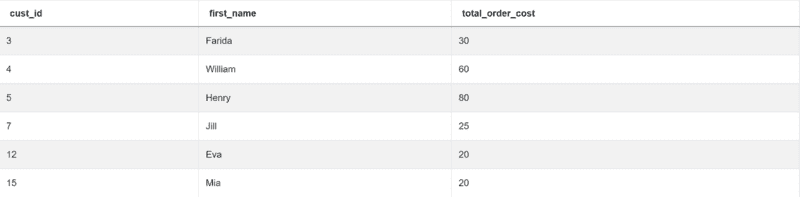

## Python 编程面试题 #5：按职位和性别统计收入

这里，我们还有一个来自旧金山的问题：

*“根据员工的职位和性别计算平均总薪酬。总薪酬通过将每个员工的工资和奖金相加来计算。”*

*然而，并非每个员工都会收到奖金，因此在计算时忽略没有奖金的员工。员工可以收到多个奖金。*

*输出员工职位、性别（即 sex）以及平均总薪酬。*

链接到问题：[`platform.stratascratch.com/coding/10077-income-by-title-and-gender?python=1`](https://platform.stratascratch.com/coding/10077-income-by-title-and-gender?python=1)

回答这个问题时，第一步应是按工人和奖金进行分组，同时使用 sum() 函数获取每个工人 id 的奖金。然后你应该合并你拥有的表格。这也是内连接。完成后，你可以通过将工资和奖金相加来获得总薪酬。最后一步是输出员工职位、性别和平均总薪酬，这可以通过使用 mean() 函数获得。

## Python 编程面试问题 #6：产品交易数量

这是微软的问题：

*“找出每个产品发生的交易数量。输出产品名称以及相应的交易数量，并按产品 ID 升序排列记录。你可以忽略没有交易的产品。”*

问题链接：[`platform.stratascratch.com/coding/10163-product-transaction-count?python=1`](https://platform.stratascratch.com/coding/10163-product-transaction-count?python=1)

下面是一些编写代码的提示。首先，你应该使用 notnull() 函数获取至少有一笔交易的产品。接下来，使用 merge() 函数将该表与 excel_sql_inventory_data 表进行内连接。使用 groupby() 和 transform() 函数获取交易数量。然后，去除重复的产品，并显示每个产品的交易数量。最后，按 product_id 排序输出。

# 数据过滤

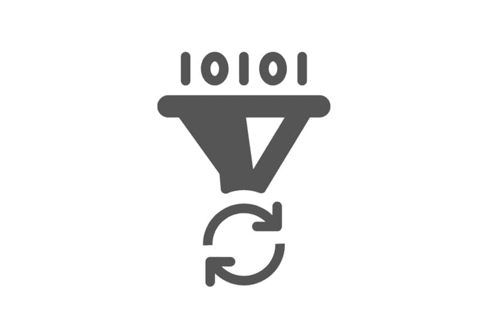

当你使用 Python 时，通常会处理大量数据。然而，你不需要输出所有数据，因为那样做没有意义。

数据分析还包括设置某些标准以仅提取你想在输出中看到的数据。为此，你应该使用某些数据过滤方法。

虽然 merge() 也以某种方式过滤数据，但这里我们讨论的是使用比较操作符（==、<、>、<=、>=）、between() 或其他方法来限制输出中的行数。让我们看看在 Python 中是如何做到的！

## Python 编程面试问题 #7：找到 2010 年排名前 10 的歌曲

这是你在 Spotify 面试中可能会被问到的问题：

*“2010 年排名前 10 的歌曲是什么？输出排名、组合名称和歌曲名称，但不要重复显示相同的歌曲。根据 year_rank 升序排列结果。”*

问题链接：[`platform.stratascratch.com/coding/9650-find-the-top-10-ranked-songs-in-2010?python=1`](https://platform.stratascratch.com/coding/9650-find-the-top-10-ranked-songs-in-2010?python=1)

解决问题时，你只需要表 billboard_top_100_year_end：

| id | int64 |
| --- | --- |
| year | int64 |
| year_rank | int64 |
| group_name | object |
| artist | object |
| song_name | object |

表中的数据如下：

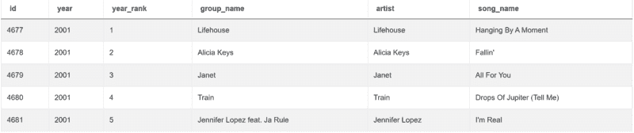

这是我们解答问题的方法。

```py
import pandas as pd
import numpy as np
conditions = billboard_top_100_year_end[(billboard_top_100_year_end['year'] == 2010) & (billboard_top_100_year_end['year_rank'].between(1,10))]
```

上述代码设置了两个条件。第一个是使用 ‘==’ 操作符，通过它我们选择 2010 年出现的歌曲。第二个条件选择排名在 1 到 10 之间的歌曲。

运行此代码的结果为：

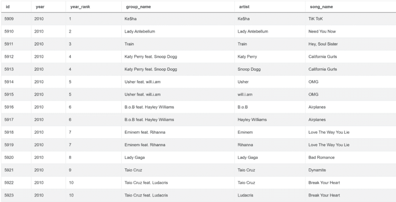

之后，我们只需要选择三列：year_rank、group_name 和 song_name。我们还将使用 drop_duplicates() 函数删除重复项。

这使得代码完整：

```py
import pandas as pd
import numpy as np
conditions = billboard_top_100_year_end[(billboard_top_100_year_end['year'] == 2010) & (billboard_top_100_year_end['year_rank'].between(1,10))]
result = conditions[['year_rank','group_name','song_name']].drop_duplicates()
```

它将给你 2010 年排名前 10 的歌曲：

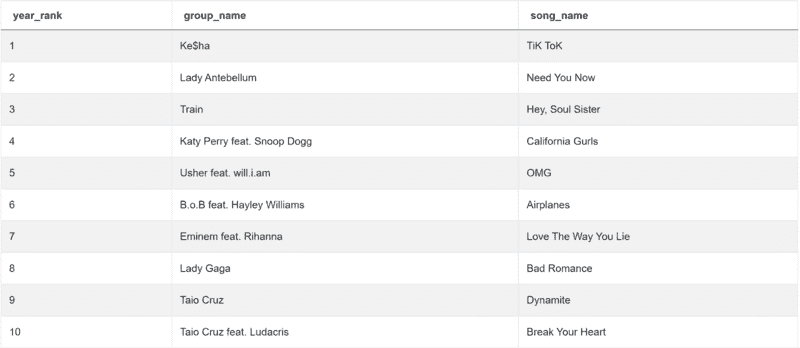

## Python 编码面试问题 #8：纽约市和哈莱姆区的公寓

尝试解决 Airbnb 的问题：

*“找到纽约市哈莱姆区 50 个公寓搜索的详细信息。”*

问题链接：[`platform.stratascratch.com/coding/9616-apartments-in-new-york-city-and-harlem?python=1`](https://platform.stratascratch.com/coding/9616-apartments-in-new-york-city-and-harlem?python=1)

这里有一些提示。你需要设置三个条件，只获取公寓类别，只包含哈莱姆区的公寓，且城市必须是纽约市。所有三个条件将使用‘==’操作符设置。你不需要展示所有公寓，因此使用 head()函数限制输出的行数。

## Python 编码面试问题 #9：重复邮箱

上一个问题集中于数据筛选，出自 Salesforce：

*“找到所有有重复的邮箱。”*

问题链接：[`platform.stratascratch.com/coding/9895-duplicate-emails?python=1`](https://platform.stratascratch.com/coding/9895-duplicate-emails?python=1)

这个问题相对简单。你需要使用 groupby()函数按邮箱分组，并找出每个邮箱地址出现的次数。然后对邮箱地址数量使用‘>’操作符，以获取重复项。

# 操作文本

在处理数据时，你需要对数据进行操作，以使其更适合你的分析。这通常适用于文本数据。它包括根据存储的文本分配新的值，解析和合并文本，或查找其长度、特定字母的位置、符号等。

## Python 编码面试问题 #10：评论数量的分类

下一个问题出自 Airbnb：

*“为了更好地理解评论数量对住宿价格的影响，将评论数量分为以下几个组别，并考虑价格。”*

*    0 条评论：没有*

*    1 到 5 条评论：少量*

*    6 到 15 条评论：一些*

*    16 到 40 条评论：许多*

*    超过 40 条评论：很多*

*输出价格及其分类。按住宿级别进行分类。**“*

问题链接：[`platform.stratascratch.com/coding/9628-reviews-bins-on-reviews-number?python=1`](https://platform.stratascratch.com/coding/9628-reviews-bins-on-reviews-number?python=1)

你正在处理的只有一个表，但列相当多。该表是 airbnb_search_details，列有：

| id | int64 |
| --- | --- |
| price | float64 |
| property_type | object |
| room_type | object |
| amenities | object |
| accommodates | int64 |
| bathrooms | int64 |
| bed_type | object |
| cancellation_policy | object |
| cleaning_fee | bool |
| city | object |
| host_identity_verified | object |
| host_response_rate | object |
| host_since | datetime64[ns] |
| neighbourhood | object |
| number_of_reviews | int64 |
| review_scores_rating | float64 |
| zipcode | int64 |
| bedrooms | int64 |
| beds | int64 |

这是表格中的几行前几条数据：

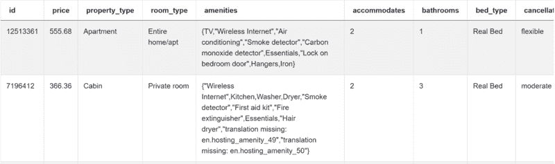

编写代码的第一步应该是获取评论数量。

```py
import pandas as pd
import numpy as np
num_reviews = airbnb_search_details['number_of_reviews']
```

你得到的是：

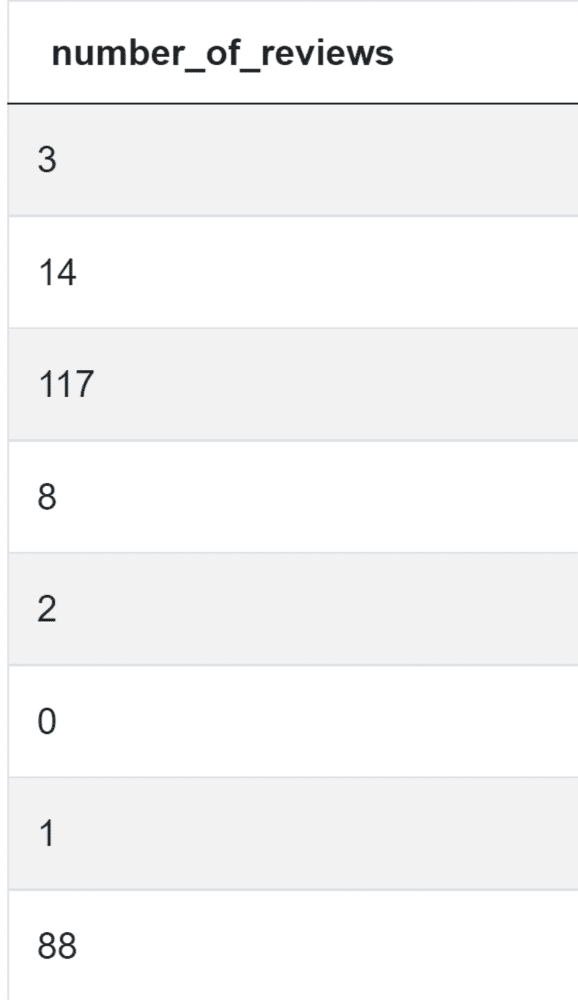

接下来，你需要获取评论数为 0 的住宿，然后是 1-5，6-15，16-40 和超过 40 条评论的住宿。为了实现这一点，你需要‘==’和‘>’运算符的组合，以及 between()函数。

```py
import pandas as pd
import numpy as np
num_reviews = airbnb_search_details['number_of_reviews']
condlist = [num_reviews == 0, num_reviews.between(1,5),num_reviews.between(5,15),num_reviews.between(15,40),num_reviews>40]
```

这是你当前的输出应如下所示：


现在开始处理文本，以分配类别。这些类别包括：NO、FEW、SOME、MANY、A LOT。到目前为止，你的代码是：

```py
import pandas as pd
import numpy as np
num_reviews = airbnb_search_details['number_of_reviews']
condlist = [num_reviews == 0, num_reviews.between(1,5),num_reviews.between(5,15),num_reviews.between(15,40),num_reviews>40]
choicelist = ['NO','FEW','SOME','MANY','A LOT']
```

好的，这是你的类别：

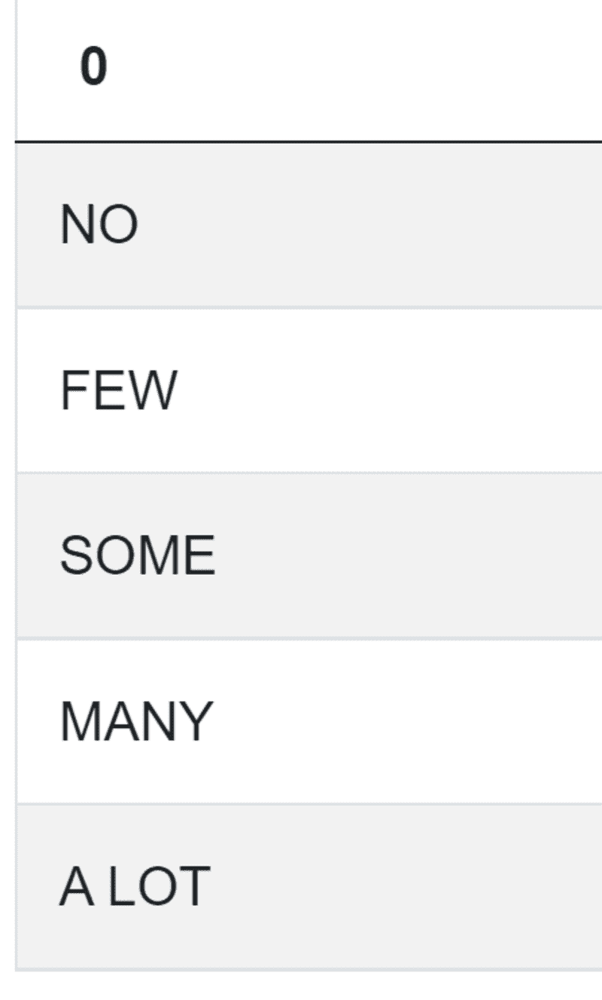

最后一步是将这些类别分配给住宿，并列出其价格：

```py
import pandas as pd
import numpy as np
num_reviews = airbnb_search_details['number_of_reviews']
condlist = [num_reviews == 0, num_reviews.between(1,5),num_reviews.between(5,15),num_reviews.between(15,40),num_reviews>40]
choicelist = ['NO','FEW','SOME','MANY','A LOT']
airbnb_search_details['reviews_qualification'] = np.select(condlist,choicelist)
result = airbnb_search_details[['reviews_qualification','price']]
```

这段代码将为你提供所需的输出：

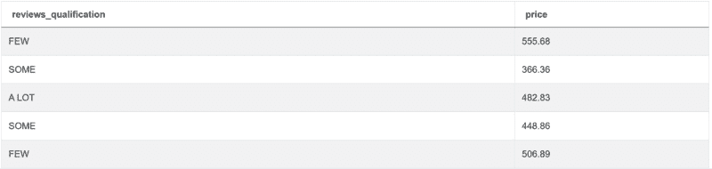

## Python 编程面试题 #11: 商业名称长度

下一个问题是由旧金山市提出的：

*“找出每个商业名称中的单词数量。避免将特殊符号计入单词（例如 &）。输出商业名称及其单词数量。”*

问题链接: [`platform.stratascratch.com/coding/10131-business-name-lengths?python=1`](https://platform.stratascratch.com/coding/10131-business-name-lengths?python=1)

在回答问题时，你应该首先使用 drop_duplicates()函数找到唯一的商业名称。然后使用 replace()函数将所有特殊符号替换为空白，这样你就不会在后续计算中计入这些符号。使用 split()函数将文本拆分为列表，然后使用 len()函数计算单词数量。

## Python 编程面试题 #12: 字母'a'的位置

这个问题由亚马逊提出，要求你：

*“找到工人'Amitah'名字中字母'a'的位置。使用基于 1 的索引，例如第二个字母的位置是 2。”*

问题链接: [`platform.stratascratch.com/coding/9829-positions-of-letter-a?python=1`](https://platform.stratascratch.com/coding/9829-positions-of-letter-a?python=1)

解决方案中有两个主要概念。第一个是使用‘==’运算符过滤工人‘Amitah’。第二个是对字符串使用 find()函数以获取字母‘a’的位置。

# 操作日期时间


作为数据科学家，你将经常处理日期。根据可用的数据，你可能需要将数据转换为日期时间格式，提取某个时间段（如月份或年份），或以其他适当的方式操作日期时间。

## Python 编码面试题#13：过去 30 天每个用户的评论数量

Meta/Facebook 提出的问题如下：

*“返回每位用户在过去 30 天内收到的评论总数。不输出在定义时间段内未收到任何评论的用户。假设今天是 2020 年 2 月 10 日。”*

问题链接: [`platform.stratascratch.com/coding/2004-number-of-comments-per-user-in-past-30-days?python=1`](https://platform.stratascratch.com/coding/2004-number-of-comments-per-user-in-past-30-days?python=1)

你可以在表格 fb_comments_count 中找到数据。

| user_id | int64 |
| --- | --- |
| created_at | datetime64[ns] |
| number_of_comments | int64 |

数据也在这里：

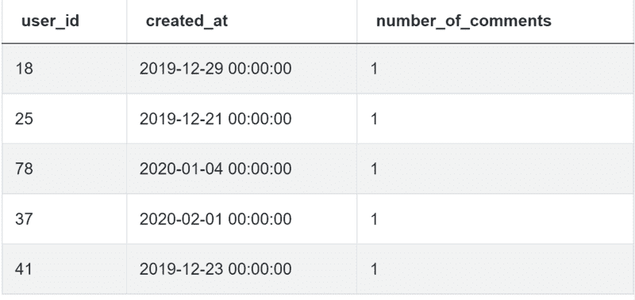

查看解决方案，然后我们将下面解释：

```py
import pandas as pd
from datetime import timedelta
result = fb_comments_count[(fb_comments_count['created_at'] >= pd.to_datetime('2020-02-10') - timedelta(days=30)) & (
fb_comments_count['created_at'] <= pd.to_datetime('2020-02-10'))].groupby('user_id')[
'number_of_comments'].sum().reset_index()
```

要查找 2020 年 2 月 10 日不超过三十天的评论，首先需要使用`to_datetime()`函数将日期转换为 datetime 格式。为了得到你感兴趣的评论的最新日期，使用`timedelta()`函数从今天的日期中减去 30 天。所有你感兴趣的评论日期都等于或大于这个差值。此外，你还需要排除所有在 2020 年 2 月 10 日之后发布的评论。这就是为什么有第二个条件。最后，根据`user_id`进行分组，并使用`sum()`函数得到每个用户的评论数量。

如果你做对了所有的步骤，你会得到如下输出：

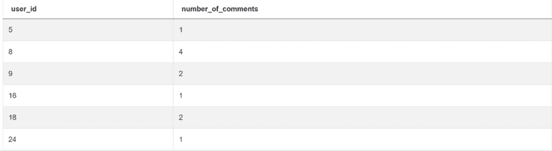

## Python 编码面试题#14：查找用户购买记录

这是 Amazon 提出的问题：

*“编写一个查询以识别回访的活跃用户。回访活跃用户是指在任何其他购买后的 7 天内进行了第二次购买的用户。输出这些回访活跃用户的 user_ids 列表。”*

问题链接: [`platform.stratascratch.com/coding/10322-finding-user-purchases?python=1`](https://platform.stratascratch.com/coding/10322-finding-user-purchases?python=1)

为了解决这个问题，你需要使用`strftime()`函数将购买日期格式化为 MM-DD-YYYY 格式。然后使用`sort_values()`按照用户 ID 和购买日期的升序排序输出。要得到前一个订单，应用`shift()`函数，按`user_id`分组，并显示购买日期。

使用`to_datetime`将订单及前一订单的日期转换为 datetime 格式，然后找出两个日期之间的差异。最后，过滤结果，使其只输出在第一次和第二次购买之间相差七天或更少的用户，并使用`unique()`函数得到唯一用户。

## Python 编码面试题#15：3 月份客户收入

最后的问题由 Meta/Facebook 提出：

*“计算 2019 年 3 月每位客户的总收入。仅包括 2019 年 3 月活跃的客户。”*

*“输出收入及客户 ID，并根据收入按降序排列结果。”*

问题链接：[`platform.stratascratch.com/coding/9782-customer-revenue-in-march?python=1`](https://platform.stratascratch.com/coding/9782-customer-revenue-in-march?python=1)

你需要对列 order_date 使用 to_datetime()。然后从同一列中提取 2019 年 3 月。最后，按 cust_id 分组并对列 total_order_cost 求和，这将是你要找的收入。使用 sort_values() 根据收入降序排列输出结果。

# 结论

通过展示来自顶级公司的 15 个面试问题，我们涵盖了面试官在测试你的 Python 技能时感兴趣的五个主要话题。

我们从数据的聚合、分组和排序开始。然后我们展示了如何连接表格和过滤输出。最后，你学会了如何操作文本和日期时间数据。

这些当然不是你应该知道的唯一概念。但它应该为你的面试准备和回答一些 [更多 Python 面试问题](https://www.stratascratch.com/blog/top-30-python-interview-questions-and-answers/?utm_source=blog&utm_medium=click&utm_campaign=kdnuggets) 提供一个良好的基础。

要练习更多的 Python Pandas 函数，请查看我们的帖子“[*Python Pandas 面试问题*](https://www.stratascratch.com/blog/python-pandas-interview-questions-for-data-science/)”，它将为你提供 Pandas 数据操作的概述以及在 [数据科学面试](https://www.stratascratch.com/blog/data-science-interview-guide-questions-from-80-different-companies/) 中常见的 Pandas 问题类型。

**[内特·罗西迪](https://www.stratascratch.com)** 是一名数据科学家和产品战略专家。他还是一位兼职教授，教授分析课程，并且是 [StrataScratch](https://www.stratascratch.com/) 的创始人，这个平台帮助数据科学家准备面试，提供来自顶级公司的真实面试问题。你可以在 [Twitter: StrataScratch](https://twitter.com/StrataScratch) 或 [LinkedIn](https://www.linkedin.com/in/nathanrosidi/) 上与他联系。

### 更多相关话题

+   [KDnuggets 新闻，5 月 4 日：9 门免费哈佛课程以学习数据…](https://www.kdnuggets.com/2022/n18.html)

+   [你必须知道的 10 个高级数据科学 SQL 面试问题…](https://www.kdnuggets.com/2023/01/top-10-advanced-data-science-sql-interview-questions-must-know-answer.html)

+   [3 个难度较大的 Python 编码面试问题（适用于数据科学）](https://www.kdnuggets.com/2023/03/3-hard-python-coding-interview-questions-data-science.html)

+   [如何回答数据科学编码面试问题](https://www.kdnuggets.com/2022/01/answer-data-science-coding-interview-questions.html)

+   [7 个必须知道的 Python 编码面试技巧](https://www.kdnuggets.com/2023/03/7-mustknow-python-tips-coding-interviews.html)

+   [你应该知道的 26 个数据科学面试问题](https://www.kdnuggets.com/26-data-science-interview-questions-you-should-know)
