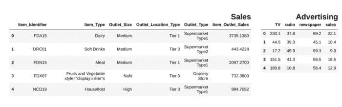
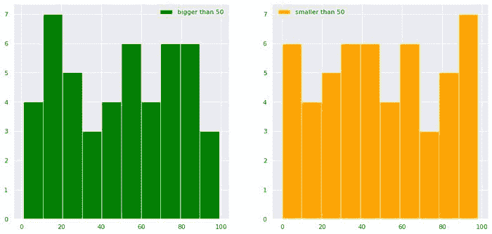
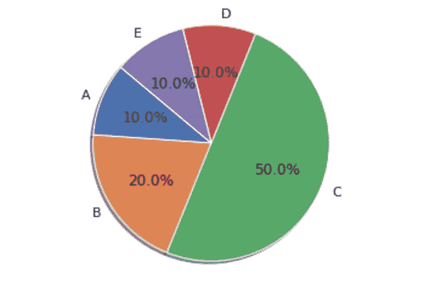

# 优化数据科学管道的 15 个 Python 代码片段

> 原文：[`www.kdnuggets.com/2021/08/15-python-snippets-optimize-data-science-pipeline.html`](https://www.kdnuggets.com/2021/08/15-python-snippets-optimize-data-science-pipeline.html)

评论

**由 [Lucas Soares](https://www.linkedin.com/in/lucas-soares-969044167/)，K1 Digital 的机器学习工程师**


由 [Carlos Muza](https://unsplash.com/@kmuza?utm_source=medium&utm_medium=referral) 在 [Unsplash](https://unsplash.com/?utm_source=medium&utm_medium=referral) 上提供的照片

## 为什么代码片段对数据科学很重要

* * *

## 我们的前三个课程推荐

 1. [Google 网络安全证书](https://www.kdnuggets.com/google-cybersecurity) - 快速进入网络安全职业生涯

 2. [Google 数据分析专业证书](https://www.kdnuggets.com/google-data-analytics) - 提升您的数据分析技能

 3. [Google IT 支持专业证书](https://www.kdnuggets.com/google-itsupport) - 支持您组织的 IT

* * *

在我的日常工作中，我需要处理很多类似的情况，从加载 csv 文件到可视化数据。因此，为了帮助简化我的工作流程，我养成了存储在不同情况下有用的代码片段的习惯，从加载 csv 文件到可视化数据。

***在这篇文章中，我将分享 15 个代码片段，帮助您处理数据分析管道的不同方面***

## 1. 使用 glob 和列表推导式加载多个文件

```py
import glob
import pandas as pd
csv_files = glob.glob("path/to/folder/with/csvs/*.csv")
dfs = [pd.read_csv(filename) for filename in csv_files]
```

## 2. 从列表中获取唯一值

```py
import pandas as pd
df = pd.read_csv("path/to/csv/file.csv")
df["Item_Identifier"].unique()array(['FDA15', 'DRC01', 'FDN15', ..., 'NCF55', 'NCW30', 'NCW05'],
      dtype=object)
```

## 3. 并排显示 pandas 数据框

```py
from IPython.display import display_html
from itertools import chain,cycledef display_side_by_side(*args,titles=cycle([''])):
    # source: https://stackoverflow.com/questions/38783027/jupyter-notebook-display-two-pandas-tables-side-by-side
    html_str=''
    for df,title in zip(args, chain(titles,cycle(['</br>'])) ):
        html_str+='<th style="text-align:center"><td style="vertical-align:top">'
        html_str+="<br>"
        html_str+=f'<h2>{title}</h2>'
        html_str+=df.to_html().replace('table','table style="display:inline"')
        html_str+='</td></th>'
    display_html(html_str,raw=True)
df1 = pd.read_csv("file.csv")
df2 = pd.read_csv("file2")
display_side_by_side(df1.head(),df2.head(), titles=['Sales','Advertising'])
### Output
```



作者提供的图片

## 4. 删除 pandas 数据框中的所有 NaNs

```py
df = pd.DataFrame(dict(a=[1,2,3,None]))
df
df.dropna(inplace=True)
df
```


## 5. 显示 DataFrame 列中的 NaN 条目数量

```py
def findNaNCols(df):
    for col in df:
        print(f"Column: {col}")
        num_NaNs = df[col].isnull().sum()
        print(f"Number of NaNs: {num_NaNs}")
df = pd.DataFrame(dict(a=[1,2,3,None],b=[None,None,5,6]))
findNaNCols(df)# OutputColumn: a
Number of NaNs: 1
Column: b
Number of NaNs: 2
```

## 6. 使用 `.apply` 和 lambda 函数转换列

```py
df = pd.DataFrame(dict(a=[10,20,30,40,50]))
square = lambda x: x**2
df["a"]=df["a"].apply(square)
df
```


## 7. 将两个 DataFrame 列转换为字典

```py
df = pd.DataFrame(dict(a=["a","b","c"],b=[1,2,3]))
df_dictionary = dict(zip(df["a"],df["b"]))
df_dictionary{'a': 1, 'b': 2, 'c': 3}
```

## 8. 绘制具有条件的分布网格

```py
import numpy as np
import matplotlib.pyplot as plt
import seaborn as sns
sns.set()
import pandas as pd

df = pd.DataFrame(dict(a=np.random.randint(0,100,100),b=np.arange(0,100,1)))
plt.figure(figsize=(15,7))
plt.subplot(1,2,1)
df["b"][df["a"]>50].hist(color="green",label="bigger than 50")
plt.legend()
plt.subplot(1,2,2)
df["b"][df["a"]<50].hist(color="orange",label="smaller than 50")
plt.legend()
plt.show()
```



作者提供的图片

## 9. 在 pandas 中对不同列的值进行 t 检验

```py
from scipy.stats import ttest_rel

data = np.arange(0,1000,1)
data_plus_noise = np.arange(0,1000,1) + np.random.normal(0,1,1000)
df = pd.DataFrame(dict(data=data, data_plus_noise=data_plus_noise))
print(ttest_rel(df["data"],df["data_plus_noise"]))# Output
Ttest_relResult(statistic=-1.2717454718006775, pvalue=0.20375954602300195)
```

## 10. 在指定列上合并数据框

```py
df1 = pd.DataFrame(dict(a=[1,2,3],b=[10,20,30],col_to_merge=["a","b","c"]))
df2 = pd.DataFrame(dict(d=[10,20,100],col_to_merge=["a","b","c"]))
df_merged = df1.merge(df2, on='col_to_merge')
df_merged
```


## 11. 使用 sklearn 标准化 pandas 列中的值

```py
from sklearn.preprocessing import MinMaxScaler
scaler = MinMaxScaler()
scores = scaler.fit_transform(df["a"].values.reshape(-1,1))
```

## 12. 在 pandas 中删除特定列中的 NaNs

```py
df.dropna(subset=["col_to_remove_NaNs_from"],inplace=True)
```

## 13. 使用条件和 `or` 语句选择数据框的子集

```py
df = pd.DataFrame(dict(result=["Pass","Fail","Pass","Fail","Distinction","Distinction"]))
pass_index = (df["result"]=="Pass") | (df["result"]=="Distinction")
df_pass = df[pass_index]
df_pass
```


## 14. 基础饼图

```py
import matplotlib.pyplot as plt

df = pd.DataFrame(dict(a=[10,20,50,10,10],b=["A","B","C","D","E"]))
labels = df["b"]
sizes = df["a"]
plt.pie(sizes, labels=labels, autopct='%1.1f%%', shadow=True, startangle=140)
plt.axis('equal')
plt.show()
```



## 15. 使用 `.apply()` 将百分比字符串转换为数值

```py
def change_to_numerical(x):
    try:
        x = int(x.strip("%")[:2])
    except:
        x = int(x.strip("%")[:1])
    return x

df = pd.DataFrame(dict(a=["A","B","C"],col_with_percentage=["10%","70%","20%"]))
df["col_with_percentage"] = df["col_with_percentage"].apply(change_to_numerical)
df
```


## 结论

我认为代码片段非常有价值，重写代码可能是时间的真正浪费，因此拥有一个包含所有简单解决方案的完整工具包来简化你的数据分析过程可以提供极大的帮助。

如果你喜欢这篇文章，可以在 [Twitter](https://twitter.com/LucasEnkrateia)、[LinkedIn](https://www.linkedin.com/in/lucas-soares-969044167/) 上与我联系，并在 [Medium](https://lucas-soares.medium.com/) 上关注我。谢谢，下次见！:)

*更多内容请访问*[***plainenglish.io***](http://plainenglish.io/)

**个人简介：[卢卡斯·索亚雷斯](https://www.linkedin.com/in/lucas-soares-969044167/)** 是一位 AI 工程师，专注于深度学习应用于各种问题。

[原文](https://python.plainenglish.io/15-data-science-snippets-to-optimize-your-coding-pipeline-93a5625d48cd)。已获许可转载。

**相关内容：**

+   如何在 Python 中工程化日期特征

+   在本地开发和测试 AWS 的 ETL 管道

+   Prefect：如何用 Python 编写和调度你的第一个 ETL 管道

### 更多相关内容

+   [如何优化 SQL 查询以加快数据检索速度](https://www.kdnuggets.com/2023/06/optimize-sql-queries-faster-data-retrieval.html)

+   [优化和管理机器学习生命周期的 10 大 MLOps 工具](https://www.kdnuggets.com/2022/10/top-10-mlops-tools-optimize-manage-machine-learning-lifecycle.html)

+   [如何优化 Dockerfile 指令以加快构建时间](https://www.kdnuggets.com/how-to-optimize-dockerfile-instructions-for-faster-build-times)

+   [构建供应链管道所需的 6 种数据科学技术](https://www.kdnuggets.com/2022/01/6-data-science-technologies-need-build-supply-chain-pipeline.html)

+   [ETL 与 ELT：哪个更适合你的数据管道？](https://www.kdnuggets.com/2023/03/etl-elt-one-right-data-pipeline.html)

+   [使用 Bash 构建你的第一个 ETL 管道](https://www.kdnuggets.com/building-your-first-etl-pipeline-with-bash)
