# 我对数据科学候选人的 15 个期望

> 原文：[`www.kdnuggets.com/2021/08/15-things-data-science-candidates.html`](https://www.kdnuggets.com/2021/08/15-things-data-science-candidates.html)

评论

**由[Mathias Gruber](https://www.linkedin.com/in/nanomathias/)，LEO Pharma 首席数据科学家**

Office 矢量图由 macrovector 创建 — [www.freepik.com](https://www.freepik.com/)

数据科学一如既往地受欢迎，但矛盾的是，它似乎也比以往任何时候都更加支离破碎和定义模糊。对于新手来说，弄清楚如何进入这个领域可能相当困难，更困难的是，管理者可能很难确定如何招聘合适的职位，除非你确切知道你在寻找什么。

在这篇文章中，我总结了我对数据科学候选人的期望。免责声明：这些反思基于我在生物技术和制药公司工作的经历，在这些公司中，数据科学是一个 *支持性的* 功能，而不是业务的核心部分；即，不是那种你可以 *专门* 从事销售预测的 AI 架构工作的职位，而是你需要端到端地工作以在 *多个* 业务领域创造价值的职位。

## 1\. 激情与好奇心

热情和好奇心，当然，是任何从事技术工作的人的可取品质。数据科学作为一种巨大的领域，我认为在这个特定领域，它是一种更普遍的前提。在许多其他技术领域，你可以专注于一套技能，并利用这些技能为业务创造价值多年 — 也许每隔 X *年* 需要学习一种新的编程语言或工具。然而，数据科学本质上是一个 *科学的* 学科，每天都在发展。

> 对于那些持续研究新数据科学发展并与团队分享这些信息的充满激情的候选人，价值巨大。

此外，候选人需要一定程度的热情和韧性，才能持续愿意从事数据科学工作，而不是因挫折而频繁跳槽；调试一个算法为什么不起作用可能比调试一个软件或基础设施为什么不起作用要复杂和令人沮丧得多。你需要一种特殊的疯狂才能多次经历这些挫折。????‍♂ 正如我之前所述 [在这里](https://towardsdatascience.com/20-lessons-learned-going-from-junior-data-scientist-to-chief-data-scientist-6fe09ff89d78)：

> 如果选项在一位普通的资深数据科学家和一位眼中充满火焰的极度热情的候选人之间，所有其他条件相等时，选择后者。

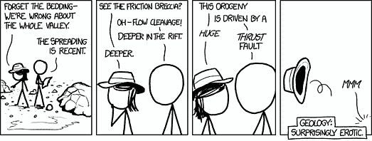

如果你对数据科学没有热情，就不要进入这个领域；这不值得。漫画来自 [xkcd.com](https://xkcd.com/1082/)

## 2\. 心理承受能力

数据科学作为一种职业并不适合所有人。我们应该停止假装它适合所有人。

[Alberto Romero](https://medium.com/u/7ba6be8a3022?source=post_page-----e72d3d671b3--------------------------------)

最近写了一篇有趣的 [文章](https://towardsdatascience.com/the-hard-truth-data-science-isnt-for-everyone-1689b7c05e62) ，描述了许多人存在的误解；如果你付出足够的努力，你可以成为一名数据科学家。这是不真实的。它是一项艰难的工作：

> 你需要理解数学和算法，你需要进行编码和软件开发，你需要理解商业问题，*还*需要具备良好的讲故事和人际交往能力。不是每个人都能同时做得很好。

我并不是说你需要 130 以上的智商才能成为数据科学家。我也不是试图吓退那些想要转行做数据科学的人。相反，如果你现在在其他学术级别的职位上，你很可能在数据科学领域表现良好。但如果你处于智商分布的低端，并且难以理解新概念和流程，那真的会是一场艰苦的战斗；不断学习新事物和挑战现状是数据科学工作的核心。注意，我这里说的不是使用低代码/无代码工具的普通数据科学家。

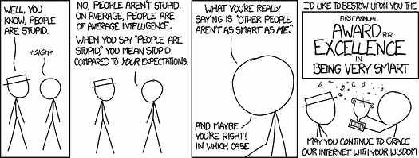

你不必是天才，但需要一定程度的智力。漫画来自 [xkcd.com](https://xkcd.com/1082/)

## 3\. 将现实问题转化为机器学习（ML）问题的能力

擅长工程化机器学习（ML）算法是一回事，擅长理解商业问题又是另一回事。然而，将这两者结合起来并找出如何用 ML 解决商业问题则是完全不同的挑战。

> 你需要能够将现实世界的问题转化为可以解决的机器学习问题。

最近 [Brian Kent](https://medium.com/u/fea25fff8539?source=post_page-----e72d3d671b3--------------------------------) 写了一篇很棒的 [文章](https://towardsdatascience.com/data-before-models-but-problem-formulation-first-b4c2a9a3e978) ，详细描述了数据科学的这一方面。实际上，当你作为数据科学家工作时（至少在我曾经工作的职位上），你*很少*会遇到“这是你的数据集，为这个目标拟合一个回归模型”这样的任务。你更常面临的商业问题可能是以下这些：

+   “我们希望利用一些新的人工智能技术来改善我们的现金流，” 

+   “我们希望通过机器学习将这个化学品的产量提高 10%。”

+   “我们想要提高这个或那个过程/机器的效率。”

将这些现实世界的目标转化为可解决的 ML 问题是一个*极其*被低估的技能——你需要对相关业务过程和可用数据有透彻的理解，需要对 ML 能做什么有坚实的基础，最后，你需要对如何有效地应用不同技术以实现业务目标有良好的直觉。

这种技能稀缺，但你可以通过熟悉大量的 ML 应用程序并实际花时间思考这些问题来加以练习。

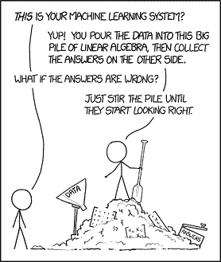

什么数据？什么模型？弄清楚*要解决什么*并不容易。*漫画来自 [xkcd.com](https://xkcd.com/1838/)*

## 4\. 诚实与谦逊

想象一下：业务想用 AI/ML 来优化一些过程。大家都很兴奋，你也很兴奋，所有人都期待看到结果。你做了一个模型，最初看起来很棒，大家都很兴奋。你随之意识到你在评估模型的方式上犯了一个错误，实际上它非常糟糕——数据中根本没有*信号*。

> 你需要成为一个完全承担责任的人，并承认自己犯错，无论后果如何。

错误是不可避免的。我们都会犯错。但没有人会因将错误掩盖在地毯下或*更糟糕的*，将错误归咎于他人而得到好处。上述情况应通过在展示结果时始终保持一定的谦逊来避免；如果结果是尚未经过同行验证的初步结果，那么在展示时*清晰地*说明这一点。不夸大其词。此外，一个优秀的候选人将始终是自己最严格的批评者：

> 花费与你得出结论一样多的时间来尝试反驳自己的结论，这样会建立自信。

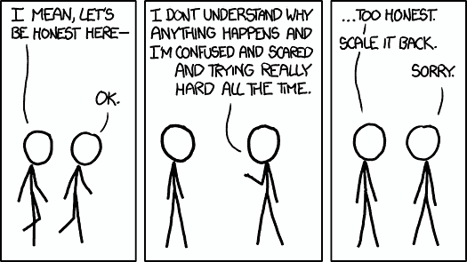

诚实对数据科学至关重要。*漫画来自 [xkcd.com](https://xkcd.com/1146/)*

## 5\. 自动化与优化

每个人都讨厌重复性的任务。有些人讨厌到极点，尽可能地去自动化这些任务。我们说的是从自动化机器学习（autoML）和 GitHub copilot 这样的流行术语，到自动化代码环境的设置，以及普遍的“代码即一切”，甚至自动化日常时间记录等。对我来说，自动化和优化是优秀开发者/数据科学家的标志性思维方式。

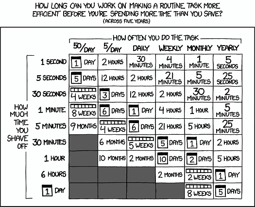

自动化一切。在有意义的时候。*漫画来自 [xkcd.com](https://xkcd.com/1319/)*

## 6\. 实用主义与价值追求

数据科学是一个*科学的*学科。然而，当你被雇佣为数据科学家时，这份工作通常是将数据科学工具应用于创造商业价值。很少涉及做研究、提出新算法、开创新领域等。虽然有时会涉及，但很少。我们通常是被雇佣来创造商业价值的。

> 我们工作的目标是创造商业价值。

在从事工业数据科学工作的过程中，你必须对这一总体目标持务实态度。我在之前的一篇文章中写到了在我进入行业后学到的几个应避免的陷阱；你可以在这里阅读更多内容：

### 从初级数据科学家到首席数据科学家的 20 条经验教训

总结来说，我会说务实的方法包括：

+   始终以客户为中心——如果业务部门不支持，终止项目，它永远不会创造价值。

+   创造并选择正确的想法——不要仅仅因为上级认为某个问题/想法是个好主意就去做。如果技术上不可行，你需要转移注意力。

+   避免过度工程化——如果一种更简单的方法可以在一半的时间内解决问题，就使用那种方法。

+   关注执行——不要陷入过多的演示、讨论、如果这样和如果那样的情境中。开始做些事情吧。

我认为在 Medium 上有很多文章可以帮助你成为一个更务实的数据科学家。我最近读了[这篇文章](https://towardsdatascience.com/10-strategies-to-boost-your-impact-as-a-data-scientist-590f1398ed37)，作者是[丹尼斯·艾勒斯](https://medium.com/u/7383a58c0e3e?source=post_page-----e72d3d671b3--------------------------------)，这篇文章描述了如何在工作中变得更加高效和有影响力，以及[这篇文章](https://towardsdatascience.com/dodging-pitfalls-when-transitioning-from-academia-to-industry-9f9367e7b563)，作者是[阿奇·德·伯克](https://medium.com/u/f651916e4a3f?source=post_page-----e72d3d671b3--------------------------------)，讲述了从学术界转型到工业界的注意事项。

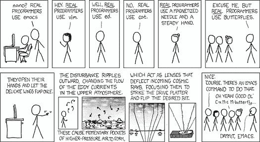

务实并创造商业价值。不要关注那些不创造价值的事情。漫画来源于[xkcd.com](https://xkcd.com/378/)

## 7. 人格与团队契合

显然，候选人的性格及其与团队其他成员的契合度是重要的。这对所有候选人和所有工作都是如此。这也是为什么许多公司有 HR 部门，并在就业前进行性格测试的原因。心理学家通常使用 “[五大性格特质](https://en.wikipedia.org/wiki/Big_Five_personality_traits)” 来评估你刚认识的人。在这些性格特质中，我认为某些特质是相当重要的，例如一定程度的 *尽责性*（高效/有组织）、*不讨好*（发表你的意见，不做傻瓜）和 *外向性*（与业务交流，进行演示等），*以及* *开放性*（研究新技术并打破固有思维）。总体来说，我不认为数据科学家有一个“理想”的性格特征，因此主要是避免有毒的性格。

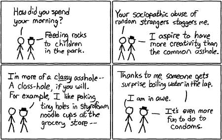

只要保持冷静和友好即可。漫画来自 [xkcd.com](https://xkcd.com/72/)

## 8\. 编码经验

编码是数据科学的核心部分。通常，你编写的代码必须与同事共享，以便将其投入生产，使你和未来的同事可以在未来多年维护它。因此，拥有一般软件开发和良好实践的经验是数据科学家最重要的素质之一。

> 如果另一个开发人员必须花费你编写代码的 2 倍时间来审查和修复这些代码，才能将其投入生产，那么你对团队来说是一个负担，而不是资产。

请注意，我不太在意不同的编码范式，也不在乎你是偏好笔记本还是纯脚本等。这些是各个团队可以制定的标准。我说的是，我见过初级开发者编写的代码完全可以理解，并且可以在几分钟内进行审查，而我也见过拥有 30 多年经验的高级开发者将 2 周的工作浓缩成 4 行难以理解的 R 代码。

> 如果你有一个公开的 Github 账户，展示了你能够编写易于理解的代码并提供良好的文档，这将是一个巨大的加分项。

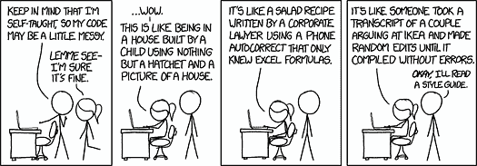

编写其他人可以理解的代码。漫画来自 [xkcd.com](https://imgs.xkcd.com/comics/code_quality.png)

## 9\. 调试技能

我们常开玩笑说，工作的一部分就是花时间在 StackOverflow 上找代码片段。虽然你可以通过这种方式找到很多优秀的解决方案，但 *调试* 技能远不止于此。

> 不要成为唯一的调试技能是 StackOverflow 的人。

在纯代码方面，你需要阅读文档以了解事物的实际运作，有时甚至需要查看你所使用的开源库的源代码。在数据科学方面，情况可能会更加复杂；你可能需要阅读论文来理解事物的工作原理，然后找出为什么它没有按预期工作——这可能真的是一次艰难的经历，尤其是因为人们在实现算法时的所有数值细节并不总是记录在代码或论文中。

> 我会觉得看到候选人如何调试一段损坏的代码比他们通过查看在线资源解决特定问题的能力更有趣。

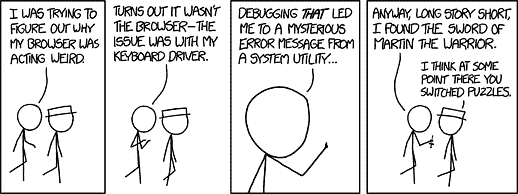

调试是一种技能和艺术。漫画来自[xkcd.com](https://xkcd.com/1722/)

## 10\. 适应性

*适应性*可能已经涵盖了关于务实和个性的要点。尽管如此，适应性是如此重要，以至于我希望它作为一个单独的要点。领域发展迅速，我们必须能够舍弃我们的宠儿。花了数百小时在一个项目上，但结果没有创造业务价值？放弃它。花了数百小时在 Tensorflow 上，但现在整个团队想使用 PyTorch？放弃它，学习 PyTorch。花了数千小时在 Python 上，但现在它无法满足你的需求？放弃它，学习一种新的足够的语言。不要沉迷于你花了多少时间做某事；那只会拖慢你的进度。

> 当你停止适应时，就是你开始在数据科学游戏中失去竞争力的那一天。

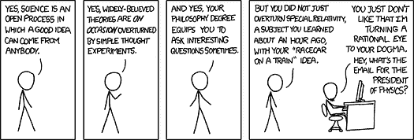

保持开放的心态并保持适应性。漫画来自[xkcd.com](https://xkcd.com/675/)

## 11\. 全栈潜力

我曾经[描述过](https://towardsdatascience.com/20-lessons-learned-going-from-junior-data-scientist-to-chief-data-scientist-6fe09ff89d78)我认为典型的数据科学建议，即在特定领域专注以避免成为“样样精通却无一专长”的建议是糟糕的。相反，应该努力成为“样样精通，几乎都精通”。

> 不要回避“数据科学独角兽”的想法，而是努力成为其中之一。

尽管如此，我不会寻找*数据科学独角兽*；人才库太稀缺，定义也不够明确。然而，我会筛选那些抱怨“成为数据科学独角兽是不可能的”的人。在我看来，这种在行业中相当普遍的说法是有害的，表明对动手实践和完成任务的厌恶。

> 自然，你不需要成为一个完整的前端/后端开发者和云/数据工程师。但我发现那些愿意涉猎其他领域的人在交付成果方面要有效得多。

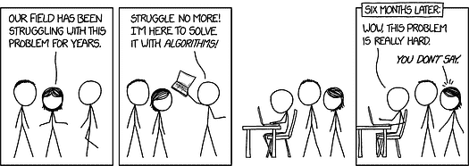

保持开放的心态拓展你的视野，即使你可能不会成为大师。漫画来自 [xkcd.com](https://xkcd.com/1831/)

## 12\. 背景

在生物信息学、量子物理学或其他科学领域有背景显然在进入数据科学领域时有优势；这意味着你习惯阅读研究论文，曾经做过统计分析，也许有些编程经验等等。然而，拥有高级教育绝不是必需的。这不过是几年结构化的学习。但自然，你以前所做的和取得的成就会在申请新工作时被考虑。

> 我宁愿雇佣一个从零开始成为 Kaggle 比赛大师的人，也不愿雇佣一个有华丽教育背景的人，其他条件相同的话。

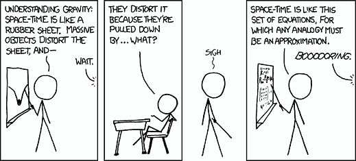

你的背景自然会影响你当前的技能。漫画来自 [xkcd.com](https://xkcd.com/895/)

## 13\. 讲故事

这一点已经被无数次提及，所以我不会花太多时间讲解，尽管它很重要：数据科学家需要讲好故事。这*意味着*什么？学习创建吸引人的可视化效果，制作精美的演示文稿，进行有趣的演讲，撰写博客文章等。

> 你做得越多，尝试比上次做得更好，你就会变得越好。

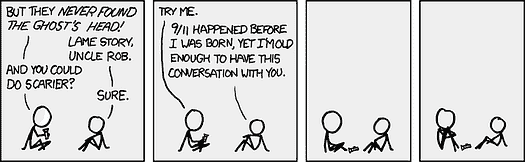

学会讲有影响力的故事。漫画来自 [xkcd.com](https://xkcd.com/647/)

## 14\. 协作

我的一个弱点是我在协作方面不太擅长——我认为这是因为在获得“真正”工作之前，我已经做了 10 多年的一人军队。这一事实使我更加欣赏那些擅长协作的人；创造商业价值的数据科学是一项团队工作，因此你必须擅长协作，包括所有相关内容；配对编程、适当的文档编制、合理的 git 提交、冲刺计划、回顾会议等。这种经验绝对是一个优势！如果你刚开始接触协作，找一个有趣的开源项目参与其中。

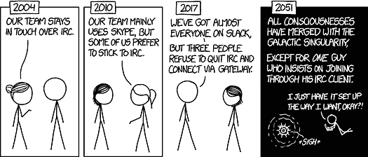

你需要能够在团队中工作！数据科学不能由一人完成。漫画由 [xkcd.com](https://xkcd.com/1782/)

## 15\. 数据科学经验

我列表上的最后一点是实际的 *数据科学* 经验。自然，如果候选人接触过该领域的各种学科，那将是有利的；例如，计算机视觉、自然语言处理、预测、经典监督/无监督技术、通用深度学习等。

根据我的经验，你很少会多次得到“相同”的任务。因此，拥有尽可能 *广泛* 的知识基础是有利的——有一天，你可能在做销售预测，另一天你可能在预测分子的化学属性或优化生产过程。如果我在招聘销售预测方面的人才，我不会过于担心候选人是否之前从未做过销售预测，只要这个人有做其他类型机器学习的丰富历史。学习如何解决新问题只是工作的另一天。

获得广泛经验的障碍相对较低；积极参与几个不同领域的 Kaggle 竞赛，你应该能开始获得基本的概览。此外，通过这样做，你还会建立一个展示你能力的作品集。我不是说这 *容易*，只是说开始起来容易。确保在遇到新概念时你能充分理解。

> **不要** 仅仅将算法作为黑箱使用，而要让自己理解它们实际上在做什么。

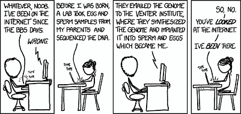

你在这一领域的时间越长，你获得的经验就越多；我们都在不断学习。漫画来自 [xkcd.com](https://xkcd.com/2300/)

## 最后的备注

我最后写了一篇相当长的文章。如果你读完了所有内容，我感谢你 ???? 我意识到许多提到的点适用于许多职业，特别是类似的数据工程、云工程等工作。这些是我从数据科学的角度出的反思。请注意，我从未期望一个初级开发者能完全符合所有提到的点——而是希望找到一个能够在所有这些方面成长的人。最后，我非常希望了解其他人在数据科学候选人身上寻找什么，所以欢迎留言或通过其他渠道与我联系。

**简介: [Mathias Gruber](https://www.linkedin.com/in/nanomathias/)** 在自然科学方面有广泛的背景，特别是在纳米科学和生物物理学方面。Mathias 在具有挑战性的环境中茁壮成长，热衷于获得知识和开发前沿技术。目前主要兴趣是数据科学的一切，即利用机器学习算法解决大规模数据问题，特别强调最前沿的深度学习方法。

[原文](https://towardsdatascience.com/15-things-i-look-for-in-data-science-candidates-e72d3d671b3)。经授权转载。

**相关：**

+   你如何从数百名其他数据科学候选人中脱颖而出？

+   数据科学家与机器学习工程师的区别

+   你为什么以及如何学习“高效数据科学”？

### 更多相关内容

+   [KDnuggets™ 新闻 22:n03，1 月 19 日：深入了解 13 个数据……](https://www.kdnuggets.com/2022/n03.html)

+   [深入了解 13 种数据科学家角色及其职责](https://www.kdnuggets.com/2022/01/deep-look-13-data-scientist-roles-responsibilities.html)

+   [选择下一个数据科学职位前要牢记的 5 件事](https://www.kdnuggets.com/2022/01/5-things-keep-mind-selecting-next-job.html)

+   [你不知道的关于 SAS 数据科学学院的 3 件事](https://www.kdnuggets.com/2022/07/sas-3-things-didnt-know-sas-academy-data-science.html)

+   [我开始数据科学时希望知道的 3 件事](https://www.kdnuggets.com/2023/01/3-things-wish-knew-started-data-science.html)

+   [学生在数据科学简历中遗漏的 7 件事](https://www.kdnuggets.com/7-things-students-are-missing-in-a-data-science-resume)
