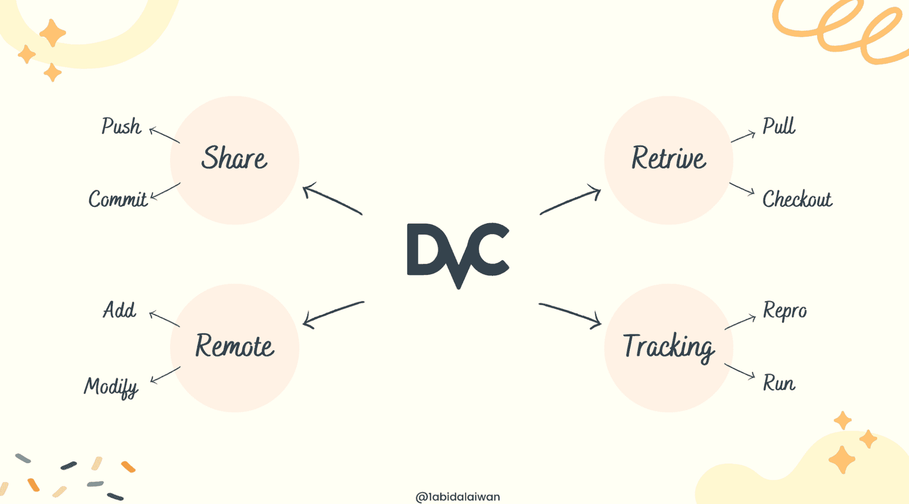
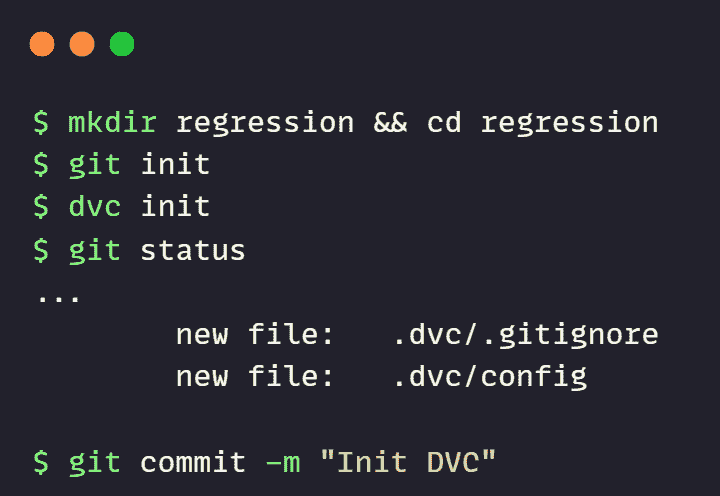
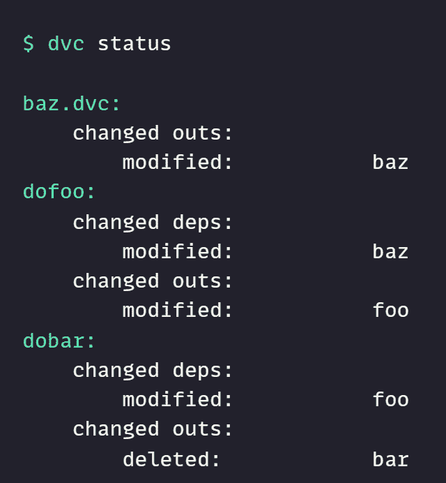
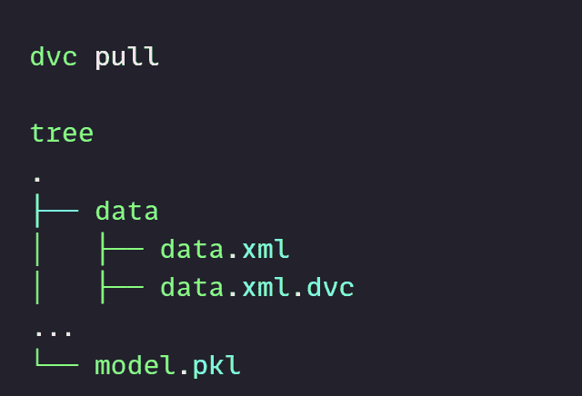
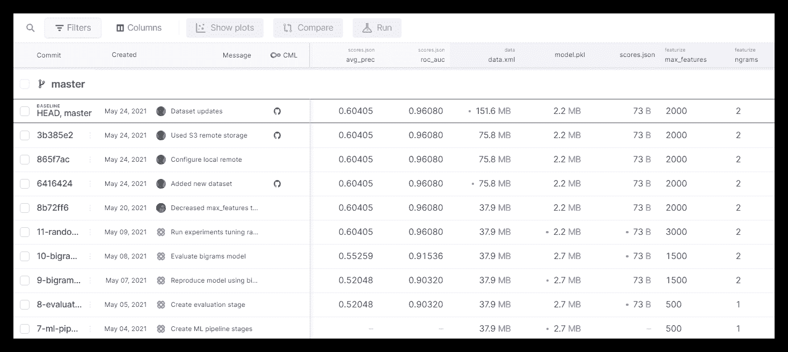
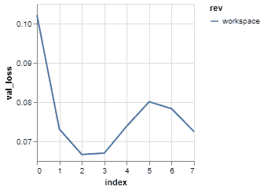
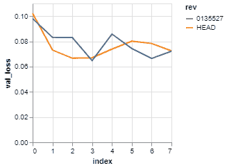
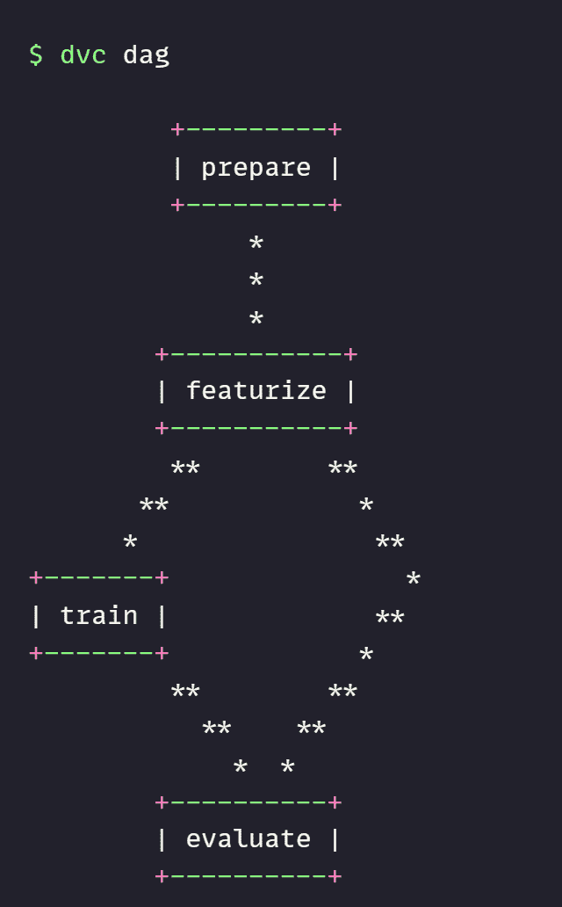

# 数据科学的 16 个关键 DVC 命令

> 原文：[`www.kdnuggets.com/2022/07/16-essential-dvc-commands-data-science.html`](https://www.kdnuggets.com/2022/07/16-essential-dvc-commands-data-science.html)



图片由作者提供

[DVC](https://dvc.org/)（数据版本控制）是一个有用的工具，用于跟踪数据和机器学习模型、管道及实验。它与 Git 无缝协作，提供代码和数据版本控制环境。

* * *

## 我们的 3 个最佳课程推荐

 1\. [谷歌网络安全证书](https://www.kdnuggets.com/google-cybersecurity) - 快速进入网络安全职业轨道。

 2\. [谷歌数据分析专业证书](https://www.kdnuggets.com/google-data-analytics) - 提升你的数据分析技能

 3\. [谷歌 IT 支持专业证书](https://www.kdnuggets.com/google-itsupport) - 支持你在 IT 领域的组织

* * *

DVC 命令与 Git 相似，除了版本控制外，它还提供了一个丰富的环境来训练、验证和部署机器学习模型。类似于 Git，你可以共享和协作处理机器学习项目。

在这篇文章中，我们将学习用于初始化、管理和共享 DVC 项目的重要命令。

**16 个关键命令概览：**

1.  init

1.  remote

1.  add

1.  remove

1.  status

1.  commit

1.  checkout

1.  push

1.  pull

1.  run

1.  exp

1.  repro

1.  metrics

1.  plots

1.  dag

1.  gc

# 1\. init

**DVC** 初始化依赖于 Git。如果你在一个新目录中，请先初始化 Git，然后按照下面的示例初始化 DVC。

```py
git init
dvc init
```

**init** 命令已创建一个 **.dvc** 目录。它包含与 DVC 配置和文件相关的所有元数据。



# 2\. remote

DVC 远程命令用于与团队共享数据或在远程存储中创建副本。

只需添加一个远程名称和远程 URL。如我之前所说，这个命令与 Git 非常相似。

```py
dvc remote add dagshub https://dagshub.com/kingabzpro/Urdu-ASR-SOTA.dvc
```

**要查看远程存储列表，请使用：**

```py
dvc remote list

>>> dagshub https://dagshub.com/kingabzpro/Urdu-ASR-SOTA.dvc
```

要修改现有的远程配置，你可以使用下面的命令。它需要一个远程名称和一个新 URL。

```py
dvc remote modify dagshub https://dagshub.com/kingabzpro/solar-radiation-ISB-MLOps.dvc
```

你可以使用上述模式重命名或移除远程。相对来说比较简单。

# 3\. add

使用此命令来跟踪单个或多个文件和目录。

```py
dvc add ./model ./data
```

当你将文件添加到 DVC 时，该命令会使用 **.gitignore** 从 Git 中移除它。相反，Git 将使用 **.dvc** 跟踪指针，以跟踪和提交更改。

在运行 add 命令后，你需要将文件添加到 Git 暂存区。

```py
git add model.dvc data.dvc .gitignore
```

# 4\. remove

要停止跟踪文件和目录，请使用 `dvc remove <file>` 命令。确保目录或文件具有扩展名 **.dvc**。你还可以使用此命令从 **dvc.yml** 中移除一个阶段。

```py
dvc remove model.dvc
```

# 5\. status

它将显示项目管道中的更改，并展示缓存和工作区或远程存储之间的更改。

```py
dvc status
```



# 6\. commit

commit 命令用于记录 DVC 跟踪的文件和文件夹中的更改。

```py
dvc commit
```

# 7\. checkout

当你使用 `git checkout` 更改仓库到较旧版本时，`dvc checkout` 用于根据 **dvc.lock** 和 .**dvc** 文件更新工作区中的跟踪文件。

```py
dvc checkout
```

# 8\. push

类似于 Git，你可以使用 `dvc push` 将文件从本地工作区推送到默认远程。push 命令对于团队协作和保持多个数据副本以避免灾难是必要的。

我使用 **DagsHub** 的远程存储来存储和更新生产中的模型。

**对于默认远程：**

```py
dvc push
```

**对于特定的远程存储：**

```py
dvc push -r <remote-name>
```

# 9\. pull

pull 命令用于使用远程存储更新本地工作区。push 和 pull 的工作方式类似于 Git。

**从默认远程提取文件：**

```py
dvc pull
```

**从特定远程提取文件：**

```py
dvc pull -r <remote-name>
```



# 10\. run

它帮助你在**dvc.yml**中创建和修改管道阶段。**run** 命令可用于组装机器学习和数据管道。

+   -n 是阶段名称

+   -d 是依赖项

+   -o 是输出

```py
dvc run -n printer -d write.sh -o pages ./write.sh
```

# 11\. exp

**exp** 或 **experiment** 命令用于生成、管理和运行机器学习实验。这是一个新功能。你可以在[这里](https://dvc.org/doc/user-guide/experiment-management)阅读更多关于实验管理的信息。

```py
dvc exp {show,apply,diff,run,gc,branch,list,push,pull,remove,init}
```



图片来自 DVC [experiments](https://dvc.org/doc/user-guide/experiment-management/experiments-overview)

# 12\. repro

**repro** 类似于 [Make](https://www.gnu.org/software/make/)。你可以使用它来重现完整或部分管道。它按正确的顺序执行在其阶段中定义的命令。

```py
dvc repro
```

# 13\. metrics

通过使用 `dvc repro` 运行机器学习管道后，将生成模型性能指标。它表示标量数字，如 **AUC**。

**要在终端查看指标，请使用：**

```py
dvc metrics show
```

**并且要比较指标，请使用：**

```py
dvc metrics diff
```

**metric diff** 命令将比较工作区的指标与 HEAD。你也可以与特定的提交进行比较。

# 14\. plots

**plots** 用于可视化数据系列，如 RMSE 与周期和损失函数。**plots** 可以与图像文件（JPEG、GIF 或 PNG）和数据系列文件（JSON、YAML、CSV 或 TSV）一起使用。它使用数据系列文件通过 [Vega-Lite](https://vega.github.io/vega-lite/) 渲染折线图。

**显示机器学习结果：**

```py
dvc plots show logs.csv
```



图片来自 DVC [Doc](https://dvc.org/doc/command-reference/plots)

**与 HEAD 比较结果：**

```py
dvc plots diff HEAD^ --targets logs.csv
```



图片来自 DVC [Doc](https://dvc.org/doc/command-reference/plots)

> **注意：** 在[DVC VSCode 新扩展](https://marketplace.visualstudio.com/items?itemName=Iterative.dvc)中运行实验和可视化结果非常互动。

# 15\. dag

它用于以一个或多个连接阶段的图形形式可视化管道。

```py
dvc dag
```



# 16\. gc

它用于从缓存或远程存储中删除未使用的文件或目录。类似于 Git，它用于优化仓库。

```py
dvc gc -w
```

# 结论

DVC 已经成为数据科学和机器学习操作的一个重要工具。你可以对数据和模型进行版本控制，跟踪实验，开发管道，分享和协作，并将模型部署到生产环境。在这篇文章中，我们学习了 DVC 的基本命令。阅读[文档](https://dvc.org/doc)以了解更多命令和功能。

如果你是新手并想互动体验 DVC，可以尝试[DagsHub](https://dagshub.com)。该平台专为数据科学家和机器学习工程师而设计。你可以查看我的个人资料[这里](https://dagshub.com/kingabzpro)以获得灵感。

> **注意：** 如果你想从 Git 仓库中删除 dvc 文件、管道、实验和指标，请使用`dvc destroy`。

## 更多关于数据科学命令的主题

+   数据科学家的 14 个必备 Git 命令

+   数据科学初学者的 20 个基础 Linux 命令

**[Abid Ali Awan](https://www.polywork.com/kingabzpro)** ([@1abidaliawan](https://twitter.com/1abidaliawan)) 是一位认证的数据科学专业人士，喜欢构建机器学习模型。目前，他专注于内容创作，并撰写有关机器学习和数据科学技术的技术博客。Abid 拥有技术管理硕士学位和电信工程学士学位。他的愿景是利用图神经网络构建一个 AI 产品，帮助那些在心理健康方面挣扎的学生。

### 更多相关主题

+   [数据科学的 10 个必备 SQL 命令](https://www.kdnuggets.com/2022/10/10-essential-sql-commands-data-science.html)

+   [数据科学家的 14 个必备 Git 命令](https://www.kdnuggets.com/2022/06/14-essential-git-commands-data-scientists.html)

+   [Streamlit 的 12 个必备命令](https://www.kdnuggets.com/2023/01/12-essential-commands-streamlit.html)

+   [KDnuggets 新闻，6 月 29 日：数据科学的 20 个基础 Linux 命令…](https://www.kdnuggets.com/2022/n26.html)

+   [数据科学初学者的 20 个基础 Linux 命令](https://www.kdnuggets.com/2022/06/20-basic-linux-commands-data-science-beginners.html)

+   [每个数据科学家都应该知道的 12 个 Docker 命令](https://www.kdnuggets.com/2023/01/12-docker-commands-every-data-scientist-know.html)
