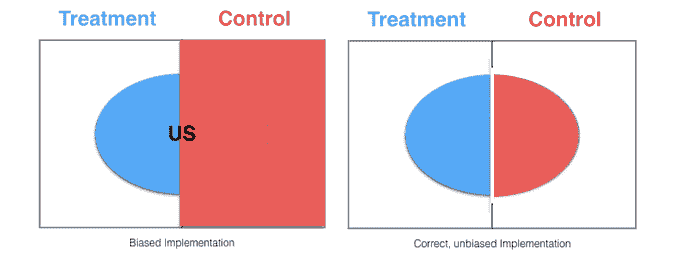
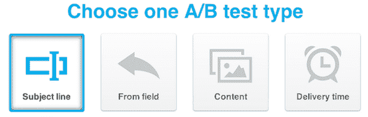
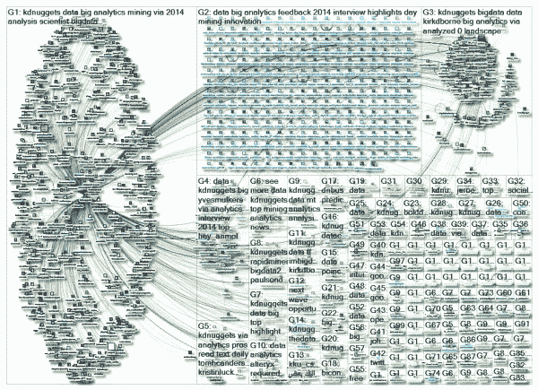

# 17 个必知的数据科学面试问题及答案，第三部分

> 原文：[`www.kdnuggets.com/2017/03/17-data-science-interview-questions-answers-part-3.html/2`](https://www.kdnuggets.com/2017/03/17-data-science-interview-questions-answers-part-3.html/2)

### Q15\. 在 A/B 测试中，我们如何确保各个桶的分配是真正随机的？

**Matthew Mayo 回答：**

首先，让我们考虑如何在桶分配之前最好地确保桶之间的可比性，而不需要知道人群属性的任何分布。

* * *

## 我们的前三大课程推荐

 1\. [Google 网络安全证书](https://www.kdnuggets.com/google-cybersecurity) - 快速进入网络安全职业生涯。

 2\. [Google 数据分析专业证书](https://www.kdnuggets.com/google-data-analytics) - 提升你的数据分析能力

 3\. [Google IT 支持专业证书](https://www.kdnuggets.com/google-itsupport) - 支持你的组织 IT

* * *

答案很简单：随机选择和桶分配。在不考虑人群属性的情况下进行随机选择和桶分配是一种统计上合理的方法，只要人群足够大。

例如，假设你正在测试网站功能的更改，并且只对特定区域（例如美国）的响应感兴趣。通过首先将样本分为 2 组（对照组和处理组），而不考虑用户区域（且人群足够大），美国访问者应当在这两组之间分配。从这 2 个桶中，可以检查访问者属性以进行测试，例如：

```py
 if (region == "US" && bucket == "treatment"):
      # do something treatment-related here
  else:
      if (region == "US" && bucket == "control"):
          # do something control-related here
      else:
          # catch-all for non-US (and not relevant to testing scenario) 
```



[图片来源](https://blog.twitter.com/2015/detecting-and-avoiding-bucket-imbalance-in-ab-tests)。

请记住，即使在进行了一轮随机桶分配后，也可以利用统计测试来检查/验证桶成员属性的随机分布（例如，确保没有显著更多的美国访问者被分配到桶 A）。如果没有，可以尝试新的随机分配（并进行类似的检查/验证过程），或者--如果确定人群不符合合作分布--可以采取如下方法。

如果我们事先知道某些不均匀的人群属性分布，[分层随机抽样](https://en.wikipedia.org/wiki/Stratified_sampling) 可能有助于确保更均匀的抽样。这种策略可以帮助消除选择偏差，这是 A/B 测试的死敌。

**参考文献：**

+   [检测和避免 A/B 测试中的桶不平衡](https://blog.twitter.com/2015/detecting-and-avoiding-bucket-imbalance-in-ab-tests)

+   [有哪些方法可以确保 A/B 测试中的人群分割是随机的？](http://datascience.stackexchange.com/questions/10406/what-are-the-methods-to-ensure-that-the-population-split-for-a-b-test-is-random)

+   [A/B 测试](https://www.optimizely.com/ab-testing/)

* * *

### Q16. 你会如何对选择功能进行 A/B 测试？

**Matthew Mayo 答复：**

这个问题似乎有些模糊，有多种可解释的含义（这一点可以参考[这篇文章](http://stats.stackexchange.com/questions/95620/how-to-conduct-am-a-b-test-for-a-feature-which-cannot-be-accessed-by-every-visit)）。让我们首先看看这个问题的不同可能解释，然后再讨论。

1.  **你会如何对选择版本的功能与非选择版本的功能进行 A/B 测试？**

    这将不允许进行公平或有意义的 A/B 测试，因为一个桶会从整个网站的用户中填充，而另一个桶则从已经选择的用户组中填充。这样的测试就像将一些苹果与所有橙子进行比较，因此是不明智的。

1.  **你会如何对选择功能的采纳（或使用）进行 A/B 测试（即测试实际的选择）？**

    这将是测试实际的选择过程——例如测试两个“点击这里注册”功能的版本——因此这只是一个常规的 A/B 测试（有关一些见解，请参见上述问题）。

1.  **你会如何对不同版本的选择功能（即那些已经选择的用户）进行 A/B 测试？**

    这可能再次被解读为几种含义之一，但我打算将其视为事件链的复杂场景，下面将详细展开。



让我们详细探讨上面列表中的第 3 点。我们先来看一个可以测试的简单事件链，然后再进行概括。假设你在对一封电子邮件营销活动进行 A/B 测试。假设变量是主题行，内容在两个版本之间保持不变。假设主题行如下：

1.  我们有一些东西给你

1.  本周末最好的在线数据科学课程免费！立即尝试，无需承诺！

确实是人为构造的。撇开其他不谈，直觉上说，主题 #2 会获得更多的点击。

但除此之外，还有心理学因素在起作用。即使点击任何一个主题后的内容是相同的，点击第二个主题的个人可能会有更高的兴奋感和对后续内容的期待。不同群体之间这种期望和投入程度的差异可能会导致主题行 #2 所在组的点击率更高——即使内容相同。

稍微转移话题… **你会如何对不同版本的选择功能（即对那些已经选择的人）进行 A/B 测试？**

如果我对评估一系列链式事件的解释是正确的，那么这样的 A/B 测试可以从不同的输入位置开始，都是相同内容的选择，然后转到选择后的不同后续着陆页，目的是测量用户在结果着陆页上的行为。

不同来源位置对相同的选择程序是否会导致不同的后续行为？当然，这仍然是一个 A/B 测试，具有相同的目标、设置和评估；然而，所测量的具体用户心理是不同的。

这与面试问题有什么关系？除了能够识别 A/B 测试的基本概念，能够处理不精确的问题对于从事分析和数据科学工作的人来说是一项资产。

* * *

### Q17. 如何确定 Twitter 用户的影响力？

**Gregory Piatetsky 回答：**

社交网络是当今网络的核心，而在社交网络中确定影响力是一个巨大的研究领域。Twitter 影响力是整体社交网络影响力研究中的一个狭窄领域。

Twitter 用户的影响力超越了简单的关注者数量。我们还希望检查推文的有效性——它们被转发、收藏的可能性，或其中的链接被点击的频率。什么算作有影响力的用户取决于定义——讨论的不同类型的影响包括名人、意见领袖、影响者、讨论者、创新者、主题专家、策展人、评论员等。

一个关键挑战是高效地计算影响力。Twitter 上的另一个问题是区分人类和机器人。

用于量化 Twitter 上影响力的常见测量方法包括许多版本的网络中心性——节点在网络中的重要性，以及基于 PageRank 的度量。



KDnuggets Twitter 社交网络，在 2014 年 5 月由 NodeXL 可视化。

使用的传统网络[测量方法](https://arxiv.org/pdf/1508.07951.pdf)包括

+   接近中心性，基于从一个节点到所有其他节点的最短路径的长度。它测量每个节点相对于整个网络的可见性或可达性。

+   间接中心性考虑了每个节点 i 的所有最短路径，这些路径应通过 i 连接网络中的所有其他节点。它测量每个节点在网络内促进通信的能力。

其他提出的测量方法包括转发影响（推文被转发的可能性）和 PageRank 的变体，如 TunkRank——参见 [A Twitter Analog to PageRank](http://thenoisychannel.com/2009/01/13/a-twitter-analog-to-pagerank)。

对整体影响力的一个重要补充是查看话题内的影响力——由 Agilience 和 RightRelevant 完成。例如，贾斯汀·比伯可能整体影响力很高，但在数据科学领域，他的影响力不如 KDnuggets。

Twitter 提供了一个[REST API](https://dev.twitter.com/)，允许访问关键指标，但对请求数量和返回的数据有限制。

许多网站曾测量 Twitter 用户的影响力，但由于许多业务模型未能实现，许多网站被收购或倒闭。目前仍然活跃的网站包括以下内容：

**免费：**

+   Agilience（KDnuggets 在机器学习领域排名第 1，在数据挖掘领域排名第 1，在数据科学领域排名第 2）

+   Klout，[klout.com](http://klout.com/)（KDnuggets 的 Klout 评分为 79）

+   Influence Tracker，[www.influencetracker.com](http://www.influencetracker.com/)，KDnuggets 影响力评分 39.2

+   [Right Relevance](http://www.rightrelevance.com/about)——衡量 Twitter 用户在某一话题中的具体相关性。

**付费：**

+   Brandwatch（购买了 PeerIndex）

+   Hubspot

+   Simplymeasured

**相关的 KDnuggets 文章：**

+   Agilience 顶级数据挖掘、数据科学权威

+   Twitter 上的 12 位数据分析思想领袖

+   数据科学领域的 123 位最具影响力人物

+   RightRelevance 帮助寻找大数据、数据科学及其他领域的关键话题和顶级影响者

**相关的 KDnuggets 标签：**

+   /tag/influencers

+   /tag/big-data-influencers

若需更深入的分析，请参阅以下技术文章：

+   [什么是衡量 Twitter 用户影响力的好方法？](https://www.quora.com/What-is-a-good-measure-of-the-influence-of-a-Twitter-user)，Quora

+   [在 Twitter 上测量用户影响力：百万关注者的误区](http://www.aaai.org/ocs/index.php/ICWSM/ICWSM10/paper/viewFile/1538/1826)，AAAI，2010

+   [在 Twitter 上测量用户影响力：一项调查](https://arxiv.org/abs/1508.07951)，arXiv，2015

+   [在 Twitter 上测量影响力](http://www.l2f.inesc-id.pt/~fmmb/wiki/uploads/Work/misnis.ref07.pdf)，I. Anger 和 C. Kittl

+   [一位数据科学家解释如何最大化你在 Twitter 上的影响力](http://www.businessinsider.com/how-to-maximize-your-influence-on-twitter-2014-1)，Business Insider，2014

**相关：**

+   17 个必须知道的数据科学面试问题和答案

+   17 个必须知道的数据科学面试问题和答案，第二部分

+   21 个必须知道的数据科学面试问题和答案

+   21 个必知的数据科学面试问题及答案，第二部分

### 更多相关内容

+   [识别伪数据科学家的 20 个问题（含答案）：ChatGPT…](https://www.kdnuggets.com/2023/01/20-questions-detect-fake-data-scientists-chatgpt-1.html)

+   [识别伪数据科学家的 20 个问题（含答案）：ChatGPT…](https://www.kdnuggets.com/2023/02/20-questions-detect-fake-data-scientists-chatgpt-2.html)

+   [7 个数据分析面试问题及答案](https://www.kdnuggets.com/2022/09/7-data-analytics-interview-questions-answers.html)

+   [5 个 Python 面试问题及答案](https://www.kdnuggets.com/2022/09/5-python-interview-questions-answers.html)

+   [停止学习数据科学以寻找目标并通过寻找目标来…](https://www.kdnuggets.com/2021/12/stop-learning-data-science-find-purpose.html)

+   [数据科学学习统计的最佳资源](https://www.kdnuggets.com/2021/12/springboard-top-resources-learn-data-science-statistics.html)
性？

+   我们是否应该根据清洗工作的成本、数据的使用频率还是其在数据模型中的相对重要性来选择数据进行清洗？或者，这些因素的组合？是什么样的组合？

+   通过去除不完整或错误的数据来提高数据准确性是否是一个好主意？在删除某些数据时，我们如何确保不会引入偏差？

鉴于工作范围广泛和资源极其有限（相对而言！），在大数据项目中的数据质量工作常见的一种方法是采用基线方法，其中，对数据用户进行调查，以确定和记录确保支持的业务流程不被干扰所需的最低数据质量。这些最低满意的数据质量水平被称为基线，数据质量工作集中在确保每个数据的质量不低于其基线水平。这看起来是一个不错的起点，之后你可以根据业务需求和预算情况深入到更高级的工作中。

**改进大数据项目数据质量的建议总结：**

+   **识别并优先考虑业务用例**（然后，利用这些用例定义数据质量指标、测量方法、改进目标等）。

+   基于对业务用例的深入理解和为实现这些用例所实施的大数据架构，**设计并实施一个最佳的数据治理层**（数据定义、元数据要求、数据所有权、数据流图等）。

+   **记录关键数据的基线质量水平**（考虑“关键路径”图和“吞吐瓶颈”评估）。

+   **定义数据质量工作回报率**（以创建回馈循环，用于改进效率并维持数据质量工作的资金支持）。

+   **整合数据质量工作**（通过减少冗余来提高效率）。

+   **自动化数据质量监控**（以降低成本并让员工专注于复杂任务）。

**不要依赖机器学习自动处理差的数据质量**（机器学习是科学，而不是魔法！）。

下一页还有 3 个有趣的答案 - 继续阅读...

### 更多相关话题

+   [检测伪数据科学家的 20 个问题（附答案）：ChatGPT…](https://www.kdnuggets.com/2023/01/20-questions-detect-fake-data-scientists-chatgpt-1.html)

+   [检测伪数据科学家的 20 个问题（附答案）：ChatGPT…](https://www.kdnuggets.com/2023/02/20-questions-detect-fake-data-scientists-chatgpt-2.html)

+   [7 个数据分析面试问题及答案](https://www.kdnuggets.com/2022/09/7-data-analytics-interview-questions-answers.html)

+   [5 个 Python 面试问题及答案](https://www.kdnuggets.com/2022/09/5-python-interview-questions-answers.html)

+   [停止学习数据科学以寻找目标，并以寻找目标…](https://www.kdnuggets.com/2021/12/stop-learning-data-science-find-purpose.html)

+   [学习数据科学统计的顶级资源](https://www.kdnuggets.com/2021/12/springboard-top-resources-learn-data-science-statistics.html)
