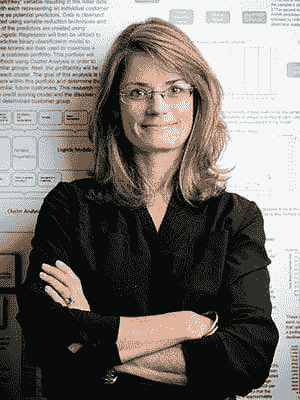
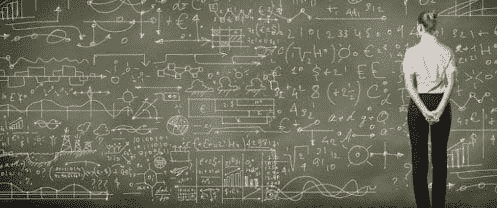

# 想成为一名数据科学家？首先阅读本次采访

> 原文：[`www.kdnuggets.com/2017/10/成为数据科学家，先看这个采访.html`](https://www.kdnuggets.com/2017/10/成为数据科学家，先看这个采访.html)

 评论

市场学家 Kevin Gray 询问 Jennifer Priestley，肯尼索州立大学研究生学院副院长和统计学与数据科学教授，数据科学到底是什么，成为一个好的数据科学家需要什么，以及如何成为一名数据科学家。

**Kevin Gray: 你能用简单易懂的话给我们定义数据科学吗？**

* * *

## 我们的前 3 个课程推荐

 1\. [Google 网络安全证书](https://www.kdnuggets.com/google-cybersecurity) - 加快专业网络安全职业发展步伐。

 2\. [Google 数据分析专业证书](https://www.kdnuggets.com/google-data-analytics) - 提高你的数据分析能力

 3\. [Google IT 支持专业证书](https://www.kdnuggets.com/google-itsupport) - 在 IT 方面提供组织支持

* * *

**Jennifer Priestly:** 我喜欢 Josh Wills 在推特上恰当发表的定义 - "作为一个人，在统计学方面要比任何软件工程师更擅长，在软件工程方面要比任何统计学家更优秀"。我还想添加我称之为”The Priestley Corollary”的定义 - "作为一个人，在解释分析结果的商业影响方面要比任何科学家更擅长，在分析科学方面要比任何 MBA 更优秀"。

**统计学家和数据科学家之间有什么区别？**

这是一个很好的问题。我经常被问到计算机科学家和数据科学家有什么区别。两个领域都贡献了重要且有意义的方式来推动这一新兴学科发展，但二者都不是独立足够的。

数据不仅在规模上增长，而且我们甚至认为什么是数据的定义也在不断扩展。例如，文本和图像正越来越成为集成到分类和风险建模等分析方法中的常见数据形式。 数据定义的这种扩展将统计学和计算机科学推出了它们的传统核心，并进入各自的边缘领域 - 而正是在这些边缘领域进行新的思考 - 边缘的融合正在形成数据科学的基础。大部分传统统计学核心不能轻易地处理由上亿条记录和/或非结构化数据定义的问题。同样，虽然计算机科学的核心能够有效地捕获和存储大量结构化和非结构化数据，但该学科无法适应通过建模、分类然后可视化将这些数据转化为信息的过程。

我同意，在数据科学领域，统计学家更有可能得到糟糕的结果。我认为这是不幸的。几年前，Simply Statistics 博客上有一篇文章《大数据出问题了：他们忘记了应用统计学》。这篇文章突出了一种急于追求机器学习、文本挖掘和神经网络的兴奋，错过了与数据行为相关的基本统计概念的重要性，包括变异性、置信度和分布。这导致了糟糕的决策。虽然数据科学并不是统计学，但统计学以一种基础性的方式为这门学科做出了贡献。

**直到几年前，我们中的很少有人听说过数据科学。你能给我们提供它的历史概述吗？**

这个术语可以追溯到 1960 年计算机科学家彼得·勒，但“数据科学”也在统计学中拥有进化的基础。1962 年，约翰·W·图基（我们这个时代最知名和受尊敬的统计学家之一）写道：“很长一段时间，我认为我是一名统计学家，对从特定到一般的推断感兴趣。但当我看着数学统计学发展时，我……开始感觉到我的中心兴趣在于数据分析……数据分析本质上是一个经验科学。”

术语“数据科学”在 1996 年国际分类学会第五届大会论文集中有所提及。这篇文章的标题是《数据科学，分类学和相关方法》。在 1997 年，宾夕法尼亚大学创始教授 C. F. [Jeff Wu](http://www2.isye.gatech.edu/~jeffwu/)（目前在乔治亚理工学院）在密歇根大学担任 H.C. Carver 统计学教授的就职演说中，实际上呼吁将统计学命名为数据科学，统计学家命名为数据科学家。

数据科学的一个关键里程碑发生在 2002 年，当时推出了首本专门致力于数据科学的学术同行评审期刊——《数据科学杂志》……接下来的一年又推出了《数据科学杂志》。此后，还出现了几本其他期刊，专门促进和传播该领域的学术研究。

专门的学术期刊的出现对学术界尤为重要——这些期刊现在为新兴的博士项目（比如我们的项目）和新兴的学术部门建立了独特的研究、学术和出版平台。现在数据科学教员和博士生可以在自己的社区内从事知识生产和思想领导。

**2011 年[麦肯锡](http://www.mckinsey.com/business-functions/digital-mckinsey/our-insights/big-data-the-next-frontier-for-innovation)的一项被广泛宣传的研究预测到 2018 年时，“……仅美国就可能面临 19 万名具备深厚分析能力以及 150 万名具备运用大数据分析做出有效决策能力的经理和分析师的短缺”。这一预测的准确性如何？现在是否有其他预测我们应该使用？**

我经常被问到这个问题—具体来说，很多公司高管问类似的问题，“数据科学这个东西是时尚吗？”。我认为我们需要重新构思讨论。

我的[观点](https://www.linkedin.com/pulse/next-generation-data-scientists-better-than-you-priestley-ph-d-/)是，我们不需要“19 万人”或“150 万管理人员”具有深厚的分析能力。我认为每个人都需要一定水平的分析能力。我认为基本的数据素养应该与阅读和数学一样成为我们教育体系的基础。看到基本编码能力越来越多地在小学教育中教授是令人鼓舞的。在大学阶段，我认为数据科学应该成为通识教育课程的一部分（现在我能听到我们学术事务办公室的惊叹声）。

因此，尽管目前的人才缺口非常真实，但这是教育体系与市场需求不相匹配的结果。各个层次的教育仍在转变，未来将继续如此。我预计，在一代人的时间内，对这些技能的需求不会减少，但供给将更加紧密地对齐。

> 普里斯特利推论—（这是）一个比任何科学家更擅长解释分析结果的业务影响，也比任何工商管理硕士更擅长分析科学的人。

**许多人，包括那些考虑职业转换的人，都将职业目标设定为数据科学。不过，并不是每个人都适合这个职业。在数据科学领域工作需要哪些资质和技能？成为一名数据科学家有哪些最佳途径？**

这是一个很好的问题。我们可以讨论后辈们...以及我们需要做些什么来使他们准备好...但现实情况是，目前有很多 20 多岁、30 多岁和 40 多岁的人正在寻找转向数据科学的机会。

我在办公室里看到了很多这样的人。我曾有过一次以上这样的对话：“我刚向 XX 大学支付了 1 万美元完成了数据科学证书...但我仍然找不到工作。”虽然一些这类“证书”项目是经过精心开发且具有高价值的，但不幸的是，很多项目却并非如此。

首先，你不能通过参加一个为期 5 天的证书项目从诗人变成数据科学家。或者更糟的是，一个在线证书项目。

其次，我认为人们需要对实现职业目标真正需要付出的努力抱有现实的期望。这些技能需求量很大，薪水很高，因为它们很难-或者至少需要主动去发展和完善。

第三，我认为人们需要评估一下现有技能和目标位置之间的差距。这个问题的答案自然会决定如何达到目标。那些陷入易于在线证书项目的诱惑的人们应该记住《爱丽丝梦游仙境》中的猫猫：“如果你不知道你要去哪里的话，你走哪条路都无所谓”。

我告诉问我在这个领域寻求建议的人们-

(1) 如果你是一位诗人，并且你希望真正地、深入地以数据科学作为职业，那么你需要放下你的羽毛笔，取而代之的是你的牛仔裤和背包，然后回到学校。全日制。大多数数据科学研究生项目不到两年，并且大多数都提供某种形式的研究生研究助理职位。你应该寻找包括编程、统计、建模的项目。但也要有充分的机会与当地公司、非营利组织、地方政府等合作，参与真实世界的项目。我再次强调，实践、动手经验对于任何数据科学项目至关重要。这就是为什么在线或短期证书项目对于从零开始的人来说行不通的原因所在。通过实践经验，人们才能理解数据科学中更隐秘的方面，比如叙事的作用、创造力（被低估了）和项目管理。

（2）如果你是计算机科学家/程序员，找一个商学院专业有分析方向或者应用统计学项目的学校。可能你的编码和数学技能已经到位了-你可能需要统计/建模/分析-再次强调-来讲述故事，并学会如何与思想和你不同的团队合作。

（3）我鼓励每个人考虑学习像 Tableau 这样的基本可视化工具。我还鼓励任何人定期考虑参加在线/异步编程课程。这些课程通常价格不高（甚至免费），可以让你继续保持技能的熟练。

我能理解并同意并非所有人都想成为计算机程序员-我并不特别喜欢编程。我不得不学习编程来找到对我提出的研究问题的答案。如果我能够使用我那可靠的 HP-12C 和一支自动铅笔找到答案，我会满意的。你必须懂一些基本的数学，必须能够阅读和写作，而且，在 21 世纪，你还必须精通基本的编程。

**数据科学家经常评论，在许多组织中，管理层并不真正知道如何利用分析进行决策。决策仍然主要是凭直觉做出的，并且受到组织政治的重大影响。这也是你的经验吗？**

我经常在公司活动上发表演讲，在那里这个问题存在于房间中-即使没有被表达出来。我会这样来框架谈话-组织可以大致分为数据本土化和非本土化。

符合“本土化数据”的例子是主宰头条新闻和股票市场的公司-亚马逊，谷歌和 Facebook。这些公司在 30 年前是无法存在的。它们是如此基础性的数据甚至不存在，但即使存在，我们也没有捕获它或执行与人工智能，机器学习，深度学习相关的深度分析方法的计算能力，使它们能够做他们所做的事情。

但通常被忽视的是，这些公司的另一个维度是，由于它们是数据本土化的，这具有巨大的文化影响。这些公司从组织结构的最高到最低都是以数据驱动的。它们的基因中流淌着数据。几乎每个进入这些公司的人都有数据为中心的取向，很可能学过计算学科，越来越多地是数据科学。Facebook 员工的中位年龄是 29 岁。谷歌也是 29 岁，亚马逊是 30 岁（不包括仓库员工）。

那些与数据无关的公司是在我们听到“数据科学”和“大数据”等术语之前就取得成功的公司。例如沃尔玛和阿比。这些是非常成功的公司，最初并没有数据贯穿其业务。尽管这些公司现在非常依赖数据来指导决策和提供产品和服务，但在组织结构中计算素养存在很大的差异。但他们的领导在文化转变中非常前瞻，使这些公司成为市场领导者，因为它们成为基于事实、数据驱动的组织。他们所在的市场中的其他公司（西尔斯、梅西百货……麦当劳、温迪）却没有做到这一点。

**最后，您认为人工智能和自动化将在未来 10-15 年对数据科学产生什么影响？**

我并不是这个领域的专家，但我认为任何因自动化而导致统计学、计算机科学或数据科学的衰亡的预测都是为时过早的。计算器“自动化”了数学……但如今的数学比使用计算器之前更广泛、更复杂。我相信在数据科学领域也将是如此。

**谢谢你，詹！**

**[凯文·格雷](https://www.linkedin.com/in/cannongray)**是[Cannon Gray](http://cannongray.com/home)的总裁，这是一家市场科学和分析咨询公司。

[**詹妮弗·刘易斯·普雷斯特利**](http://facultyweb.kennesaw.edu/jpriestl/)是肯尼索州立大学研究生院副院长、统计学和数据科学教授。

[原始链接](https://www.linkedin.com/pulse/want-become-data-scientist-read-first-kevin-gray/)。经许可重新发布。

*本文首次发布于 2017 年 7 月的 Greenbook 杂志。*

**相关链接:**

+   统计建模：入门指南

+   时间序列分析：入门指南

+   回归分析：入门指南

### 更多关于这个话题

+   [成为优秀数据科学家所需的 5 种关键技能](https://www.kdnuggets.com/2021/12/5-key-skills-needed-become-great-data-scientist.html)

+   [初学者数据科学家应掌握的 6 种预测模型](https://www.kdnuggets.com/2021/12/6-predictive-models-every-beginner-data-scientist-master.html)

+   [2021 年最佳 ETL 工具](https://www.kdnuggets.com/2021/12/mozart-best-etl-tools-2021.html)

+   [成功数据科学家的 5 个特征](https://www.kdnuggets.com/2021/12/5-characteristics-successful-data-scientist.html)

+   [每位数据科学家都应该了解的三个 R 语言库（即使你使用 Python）](https://www.kdnuggets.com/2021/12/three-r-libraries-every-data-scientist-know-even-python.html)

+   [停止学习数据科学以寻找目的，寻找目的以…](https://www.kdnuggets.com/2021/12/stop-learning-data-science-find-purpose.html)
