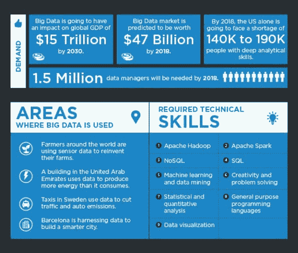
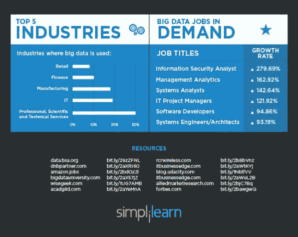

# 探索大数据领域的前 12 大有趣职业

> 译文：[`www.kdnuggets.com/2016/10/top-12-interesting-careers-explore-big-data.html`](https://www.kdnuggets.com/2016/10/top-12-interesting-careers-explore-big-data.html)

 评论

**由 [Simplilearn](https://www.simplilearn.com/) 提供**。

大数据不再是未来能力的流行词，而是已经被各种行业的企业所使用。从数据驱动的策略到决策，大数据的真正价值已经显现，并且带来了[令人惊叹的职业选择](https://www.kdnuggets.com/2016/08/simplilearn-5-free-ebooks-data-science-big-data.html)。

* * *

## 我们的前 3 名课程推荐

 1\. [谷歌网络安全证书](https://www.kdnuggets.com/google-cybersecurity) - 快速进入网络安全职业生涯。

 2\. [谷歌数据分析专业证书](https://www.kdnuggets.com/google-data-analytics) - 提升您的数据分析技能

 3\. [谷歌 IT 支持专业证书](https://www.kdnuggets.com/google-itsupport) - 支持您的 IT 组织

* * *

### 顶级大数据职业

1.  **数据科学家**

    这些人利用他们的分析和技术能力[从数据中提取有意义的见解](http://www.simplilearn.com/becoming-a-data-scientist-learning-path-article)。

    薪资：$65,000 - $110,000

1.  **数据工程师**

    他们确保服务器和应用程序之间数据的连续流动，并负责数据架构。

    薪资：$60,0945 - $124,635

1.  **大数据工程师**

    大数据工程师根据解决方案架构师创建的设计进行构建。他们在组织内部开发、维护、测试和评估大数据解决方案。

    薪资：$100,000 - $165,000

1.  **机器学习科学家**

    他们从事用于自适应系统的算法研发。他们构建预测产品建议和需求预测的方法，探索大数据以自动提取模式。

    薪资：$78,857 - $124,597

1.  **商业分析专家**

    商业分析专家支持各种开发计划，协助测试活动和测试脚本的开发，进行研究以了解业务问题，并开发切实可行的经济解决方案。

    薪资：$50,861 - $94,209

1.  **数据可视化开发者**

    他们设计、开发并提供企业范围内互动数据可视化的生产支持。他们具备艺术思维，能够构思、设计和开发可重用的图形/数据可视化，并运用强大的技术知识使用最新技术实现这些可视化。

    薪资：$108,000 - $130,000

1.  **商业智能（BI）工程师**

    他们具备数据分析专业知识和设置报告工具、查询及维护数据仓库的经验。他们亲自处理大数据，采取数据驱动的方法解决复杂问题。

    薪资：$96,710 - $138,591

1.  **BI 解决方案架构师**

    他们迅速提出解决方案，帮助企业做出时间敏感的决策，拥有较强的沟通与分析能力，对数据可视化充满热情，并且具有追求卓越和自我激励的动力。

    薪资：$107,000 - $162,000

1.  **BI 专家**

    他们负责支持企业范围内的商业智能框架。此职位需要批判性思维、关注细节以及有效的沟通技巧。

    薪资：$77,969 - $128,337

1.  **分析经理**

    分析经理负责数据分析解决方案或 BI 工具的配置、设计、实施和支持。他们特别需要分析通过事务活动收集的大量信息。

    薪资：$83,910 - $134,943

1.  **机器学习工程师**

    机器学习工程师的最终“输出”是工作的软件，他们的“受众”是其他自动运行的组件，几乎无需人工监督。决策由机器做出，影响产品或服务的行为。

    薪资：$96,710 - $138,591

1.  **统计学家**

    他们收集数值数据并展示它，帮助公司理解定量数据，发现趋势并进行预测。

    薪资：$57,000 - $80,110

### 建议的认证

+   Hadoop

+   SAS

+   Excel

+   R

+   MongoDB

+   Python

+   Pandas

+   Apache Spark & Scala

+   Apache Storm

+   Apache Cassandra

+   MapReduce

+   Cloudera

+   HBase

+   Pig

+   Flume

+   Hive

+   Zookeeper

**相关：**

+   帮助你进入行业的前 5 名大数据课程

+   进入数据科学或大数据职业前要读的 5 本电子书

+   大数据大师课程，改变你的职业生涯

### 更多相关话题

+   [轻松在笔记本电脑上探索 LLMs，使用 openplayground](https://www.kdnuggets.com/2023/04/explore-llms-easily-laptop-openplayground.html)

+   [开放助手：探索开放和协作聊天机器人的可能性…](https://www.kdnuggets.com/2023/04/open-assistant-explore-possibilities-open-collaborative-chatbot-development.html)

+   [Python 的上下文管理器的 3 个有趣用途](https://www.kdnuggets.com/3-interesting-uses-of-python-context-managers)

+   [数据科学家、数据工程师及其他数据职业解析](https://www.kdnuggets.com/2021/05/data-scientist-data-engineer-data-careers-explained.html)

+   [数据科学职业的现状](https://www.kdnuggets.com/2022/10/current-state-data-science-careers.html)

+   [KDnuggets 新闻，11 月 2 日：数据科学的现状…](https://www.kdnuggets.com/2022/n43.html)
