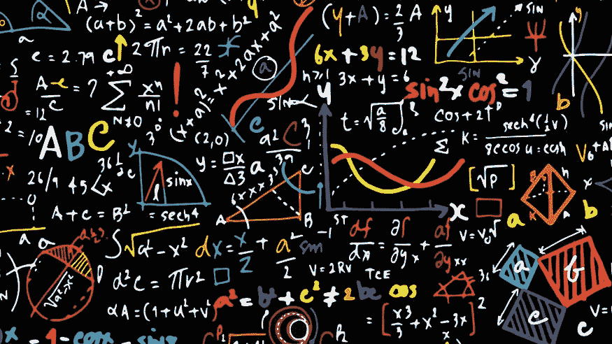
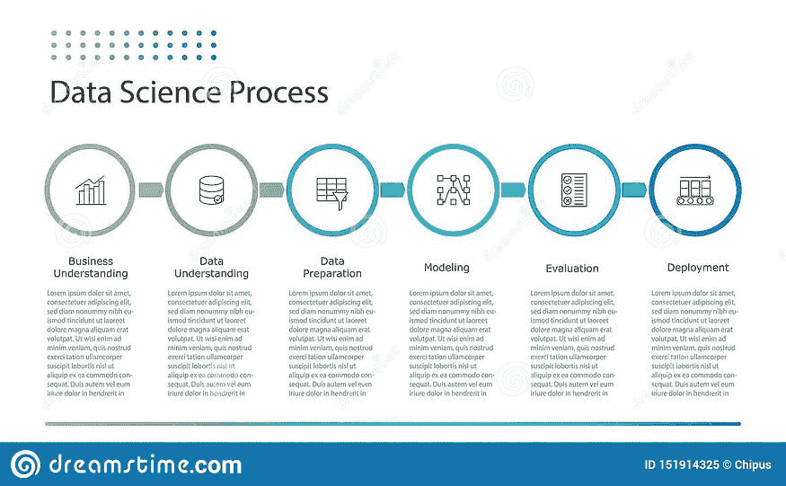
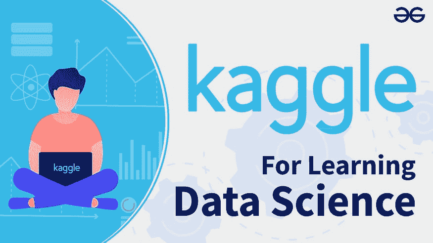
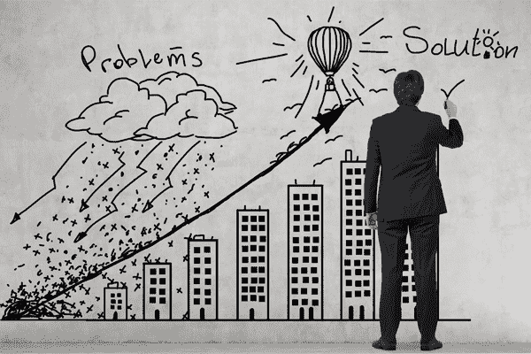
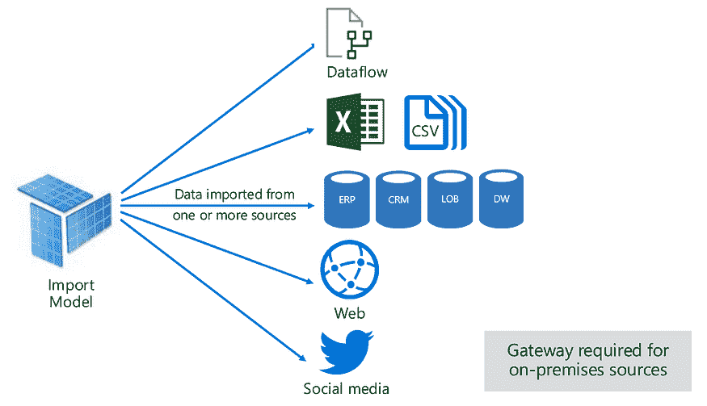
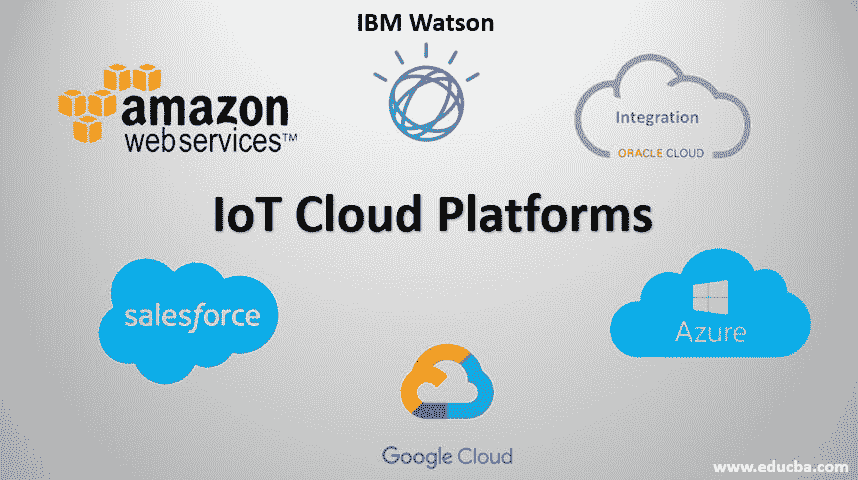

# 两年自学数据科学让我学到了什么

> 原文：[`www.kdnuggets.com/2021/09/2-years-self-teaching-data-science.html`](https://www.kdnuggets.com/2021/09/2-years-self-teaching-data-science.html)

评论

**作者 [Vishnu U](https://www.linkedin.com/in/vishnuu0399/?originalSubdomain=in)，Mindtree 校园实习生 | 探索数据科学**。

* * *

## 我们的前三大课程推荐

 1\. [谷歌网络安全证书](https://www.kdnuggets.com/google-cybersecurity) - 快速进入网络安全职业道路。

 2\. [谷歌数据分析专业证书](https://www.kdnuggets.com/google-data-analytics) - 提升你的数据分析技能

 3\. [谷歌 IT 支持专业证书](https://www.kdnuggets.com/google-itsupport) - 支持你所在组织的 IT

* * *

*([图片来源](https://lifeandthemarket.files.wordpress.com/2018/09/btsimage1-e1536773270924.jpg?w=840))*

数据科学爱好者往往最初是自学的，而不是后来获得硕士学位。但数据科学领域的广阔现实往往在初学者进入这一领域后才会显现出来，真正有价值的时间可能被错误的学习方式浪费。在本文中，我将分享我在两年的数据科学学习过程中学到的一些事实，希望能帮助你更好地学习。

### 数据科学是一个大海

*持续学习 — 这个领域没有尽头！ ([图片来源](https://static01.nyt.com/images/2018/06/03/books/review/03GLASSIE-SUB/03GLASSIE-SUB-superJumbo.jpg)).*

在开始之前，要了解数据科学是一个非常广阔的领域。不要指望在几个月内或通过在线课程完成学习。研究和开发经常发生变化，所以要做好长期学习的准备。此外，要明白实际的数据科学与我们自己做的有很大不同，但要记住你所学的内容。

### 你不必成为爱因斯坦，但一点数学知识是有帮助的

*基础数学是必不可少的 ([图片来源](https://www.wellesley.edu/news/2017/stories/node/120511)).*

这是一个常见的说法，但我觉得一点数学（概率、微积分、统计学和线性代数的基础）是有好处的。你不一定需要深入研究这些学科，但基本的理解在解决数据问题时会是一个很大的优势。数学计算的大部分工作都由库来完成。

### 机器学习留到以后再学

*数据科学过程——注意收集和准备正确的数据是至关重要的* ([Image source](https://www.dreamstime.com/data-science-data-mining-process-flat-infographics-chart-demonstrate-data-science-process-applicable-artificial-image151914325))。

最常见的错误是直接跳入机器学习，从那里开始学习，这样的学习顺序正好相反。机器学习是任何数据科学过程的最后一步。从这里开始学习会让你错过许多更重要的概念——数据加载和管理、探索性分析和数据工程。首先学习 Python，加载数据，处理数据集（pandas），然后生成仪表板和可视化，再转向机器学习和预测建模。这篇[文章](https://medium.com/analytics-vidhya/data-science-process-a-brief-overview-18ad34bd812f?source=your_stories_page-------------------------------------)解释了数据科学的总体过程。

### Kaggle 是最佳的地方，但要记住这一点

*Kaggle 是数据科学爱好者的圣地——但一定要从基础开始* ([Image source](https://i.ytimg.com/vi/u9MIwoFWXVg/maxresdefault.jpg))。

一旦掌握了基础知识，你就可以开始在 Kaggle 上进行项目实践。Kaggle 是一个可以找到数据集的网站——你可以利用这些数据集来提升数据科学技能。但请记住一点：如果你是初学者，先从基础且较小的数据集和简单任务开始，然后再进入竞赛。原因是 Kaggle 是一个公开的平台，你可能会遇到行业专家和研究人员。他们的知识水平与你这个新手会有所不同——所以从基础数据集开始，逐步过渡到复杂建模问题或竞赛。

### 停止比较，开始学习

*比较会带来臭名昭著的冒名顶替综合症——但这只是你心中制造的错觉* ([Image source](https://i.ytimg.com/vi/u9MIwoFWXVg/maxresdefault.jpg))。

新手常犯的一个错误是将自己的工作与他人进行比较。这是一个大错，因为经验和知识水平的差异。相反，反过来想：如果在你理解范围内，试着学习他们做了什么。每一个拥有最佳作品的人曾经也像你一样是个初学者。

### 欢迎掌握“理解业务问题”的技能

*解决问题是一项关键技能* ([Image source](https://egsrii9payi.exactdn.com/wp-content/uploads/consultancy-onpage-1.jpg?strip=all&lossy=1&ssl=1))。

所有数据科学问题都集中在解决实际问题或商业问题上。此外，理解业务问题通常被称为“数据科学的第一规则”。最好的建议是专注于解决实际问题的数据集和项目，而不是单纯地生成可视化和模型。“猫与狗”数据集对于学习和尝试东西是很好的，但不适合作为项目或工作。

### 并不是每次都是 CSV 文件，还有其他格式

*现实世界中的数据存在多种形式 — 了解它们以成为优秀的数据科学家 ([Image source](https://docs.microsoft.com/en-us/power-bi/connect-data/service-dataset-modes-understand))。*

对于初学者，最好从 CSV 文件中的数据开始，但随着你逐渐适应，学习使用其他数据源也是很重要的：使用正则表达式的文本文件、SQL 数据库、带有云接口的数据仓库、非结构化数据（图像和音频文件）、JSON 数据等。随着你对基本数据源的熟悉，你还可以尝试数据抓取。你也可以阅读这篇[文章](https://medium.com/analytics-vidhya/various-data-sources-in-data-science-overview-and-usage-cdbf7e86dbbd?source=your_stories_page-------------------------------------)。

### “全能却无专长” — 这在这里适用

*按需学习构建技能 — 不要期望在短时间内学会所有内容 ([Image source](https://www.quotev.com/quizi/9609120/24/1612888020))。*

数据科学要求你使用各种库、工具和 API，但你不必精通它们（如果你精通那就更好了）。这里的主要思想是了解概念，而不必完全掌握整个库或 API！根据需要学习必要的知识。

### 习惯使用云平台

*云计算是一个不同的领域，但对于许多大规模的数据科学问题非常有用 ([Image source](https://www.educba.com/iot-cloud-platforms/))。*

云计算通常与数据科学问题结合在一起，原因可能是资源需求量大，或解决方案可以直接部署在云上。了解云平台、各种服务及其使用情况。云平台还提供了大数据存储和管理的各种服务，而这些服务是数据科学领域的核心。

[原文](https://medium.com/mlearning-ai/what-2-years-of-self-teaching-data-science-taught-me-4a38ff888fa7)。转载已获许可。

**相关：**

+   [谷歌研究总监关于学习数据科学的建议](https://www.kdnuggets.com/2021/07/google-advice-learning-data-science.html)

+   [7 个理由说明你应该获得正式的数据科学学位](https://www.kdnuggets.com/2021/08/7-reasons-degree-data-science.html)

+   [成为数据科学家的学习路径](https://www.kdnuggets.com/2021/07/learning-path-data-scientist.html)

### 更多相关话题

+   [30 年的数据科学：数据科学从业者的回顾](https://www.kdnuggets.com/30-years-of-data-science-a-review-from-a-data-science-practitioner)

+   [我如何在 14 年内将薪水提高 14 倍，作为数据分析/科学专业人士](https://www.kdnuggets.com/2021/12/14x-salary-in-14-years-data-professional.html)

+   [十年的人工智能回顾](https://www.kdnuggets.com/2023/06/ten-years-ai-review.html)

+   [40%的劳动力将在 3 年内受到人工智能的影响](https://www.kdnuggets.com/40-of-labour-force-will-be-affected-by-ai-in-3-years)

+   [KDnuggets™ 新闻 22:n06, 2 月 9 日：数据科学编程…](https://www.kdnuggets.com/2022/n06.html)

+   [数据科学定义幽默：一系列古怪的名言…](https://www.kdnuggets.com/2022/02/data-science-definition-humor.html)
