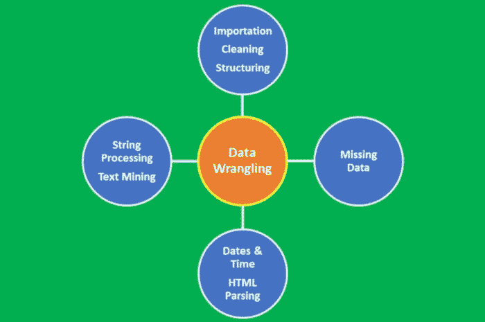
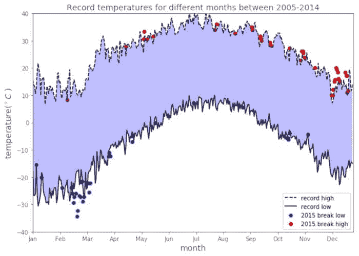
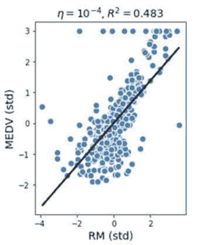
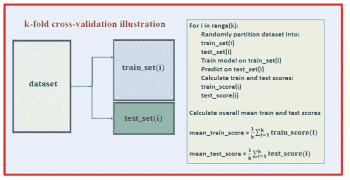
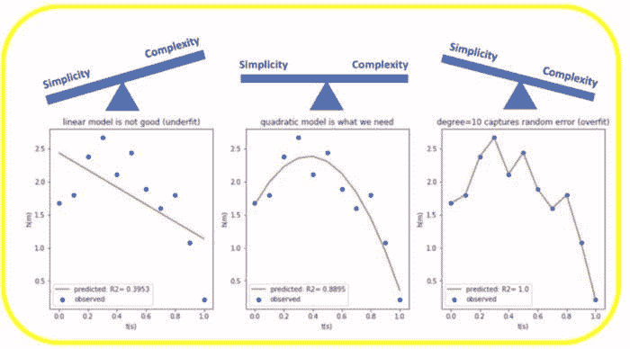
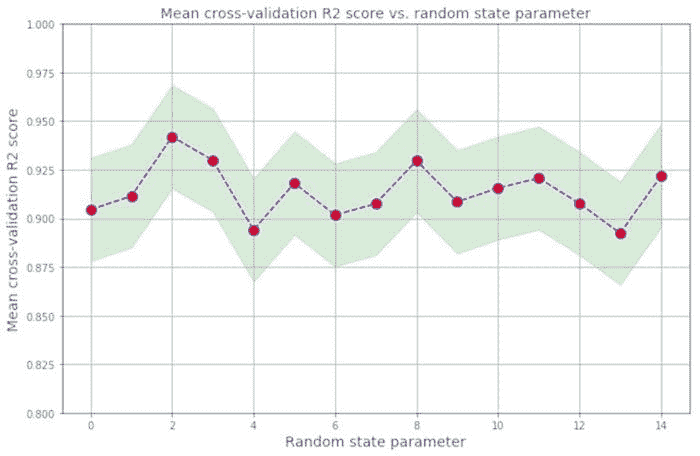

# 20 个核心数据科学概念（初学者）

> 原文：[`www.kdnuggets.com/2020/12/20-core-data-science-concepts-beginners.html`](https://www.kdnuggets.com/2020/12/20-core-data-science-concepts-beginners.html)

评论

### 1\. 数据集

* * *

## 我们的前三大课程推荐

 1\. [谷歌网络安全证书](https://www.kdnuggets.com/google-cybersecurity) - 快速进入网络安全职业的捷径。

 2\. [谷歌数据分析专业证书](https://www.kdnuggets.com/google-data-analytics) - 提升你的数据分析技能

 3\. [谷歌 IT 支持专业证书](https://www.kdnuggets.com/google-itsupport) - 支持你的组织 IT

* * *

正如名字所示，数据科学是将科学方法应用于数据的一个分支，旨在研究不同特征之间的关系，并基于这些关系得出有意义的结论。因此，数据是数据科学的关键组成部分。数据集是用于分析或模型构建的特定数据实例。数据集有不同的类型，如数值数据、分类数据、文本数据、图像数据、语音数据和视频数据。数据集可以是静态的（不变的）或动态的（随时间变化，例如股票价格）。此外，数据集也可能依赖于空间。例如，美国的温度数据与非洲的温度数据会显著不同。对于初学者的数据科学项目，最受欢迎的数据集类型是包含数值数据的数据集，通常以逗号分隔值（CSV）文件格式存储。

### 2\. 数据整理

数据整理是将数据从原始形式转换为适合分析的整洁形式的过程。数据整理是数据预处理中的重要步骤，包括数据导入、数据清洗、数据结构化、字符串处理、HTML 解析、处理日期和时间、处理缺失数据以及文本挖掘等多个过程。



***图 1****: 数据整理过程。图片由 Benjamin O. Tayo 提供*

数据整理过程是任何数据科学家关键的一步。在数据科学项目中，数据很少是直接可用的。数据更可能存储在文件、数据库中，或从网页、推文、PDF 等文档中提取。了解如何整理和清洗数据将使你能够从数据中获取本来会被隐藏的重要见解。

使用大学城数据集进行数据整理的示例可以在此处找到：[数据整理教程](https://medium.com/towards-artificial-intelligence/tutorial-on-data-wrangling-college-towns-dataset-a0e8f8dfb6ae)

### 3\. 数据可视化

数据可视化是数据科学中最重要的分支之一。它是分析和研究不同变量之间关系的主要工具之一。数据可视化（例如，散点图、折线图、柱状图、直方图、qq 图、平滑密度图、箱线图、配对图、热图等）可以用于描述性分析。数据可视化还用于机器学习中的数据预处理和分析、特征选择、模型构建、模型测试和模型评估。在准备数据可视化时，请记住，数据可视化更像是**艺术**而非**科学**。要产生好的可视化效果，你需要将几段代码结合在一起，以获得优秀的最终结果。有关数据可视化的教程，请参见这里：[使用天气数据集的数据可视化教程](https://medium.com/towards-artificial-intelligence/tutorial-on-data-visualization-weather-data-52efa1bef183)



***图 2****: 天气数据可视化示例。图片由**本杰明·O·泰约**提供*

### 4\. 异常值

异常值是指与数据集其他部分非常不同的数据点。异常值通常只是坏数据，例如，由于传感器故障、实验污染或记录数据时的人为错误。有时，异常值可能表明某些真实情况，例如系统中的故障。异常值非常常见，并且在大型数据集中是预期的。检测数据集中异常值的一种常见方法是使用箱线图。**图 3** 显示了一个包含大量异常值的数据集的简单回归模型。异常值可能会显著降低机器学习模型的预测能力。处理异常值的一种常见方法是简单地省略这些数据点。然而，去除真实数据中的异常值可能过于乐观，从而导致不现实的模型。处理异常值的高级方法包括 RANSAC 方法。



***图 3****: 使用包含异常值的数据集的简单回归模型。图片由**本杰明·O·泰约**提供*

### 5\. 数据插补

大多数数据集包含缺失值。处理缺失数据的最简单方法是直接丢弃数据点。然而，删除样本或整个特征列是不切实际的，因为这可能会丢失太多有价值的数据。在这种情况下，我们可以使用不同的插值技术来估计数据集中其他训练样本中的缺失值。其中一种最常见的插值技术是**均值填补**，即用整个特征列的均值替换缺失值。其他填补缺失值的方法包括**中位数**或最**频繁值（众数）**，后者用最频繁的值来替换缺失值。无论你在模型中使用哪种填补方法，都必须记住填补仅仅是一种近似方法，因此可能会在最终模型中产生误差。如果提供的数据已经过预处理，你需要了解缺失值是如何处理的。原始数据中丢弃了多少百分比？使用了什么填补方法来估计缺失值？

### 6\. 数据缩放

缩放特征有助于提高模型的质量和预测能力。例如，假设你想建立一个模型来预测目标变量*信用评分*，基于预测变量如*收入*和*信用评分*。由于信用评分的范围从 0 到 850，而年收入可能在$25,000 到$500,000 之间，如果不对特征进行缩放，模型将会对*收入*特征产生偏倚。这意味着与*收入*参数相关的权重因子将非常小，这会导致预测模型仅基于*收入*参数来预测*信用评分*。

为了将特征缩放到相同的尺度，我们可以选择使用特征的归一化或标准化。通常情况下，我们假设数据是正态分布的，并默认使用标准化，但这并不总是适用。在决定使用标准化还是归一化之前，首先需要查看特征的统计分布情况。如果特征趋向于均匀分布，则可以使用归一化（*MinMaxScaler*）。如果特征大致符合高斯分布，则可以使用标准化（*StandardScaler*）。再次提醒，无论你使用归一化还是标准化，这些方法都是近似的，并且会影响模型的总体误差。

### 7\. 主成分分析（PCA）

拥有数百或数千个特征的大型数据集通常会导致冗余，特别是当特征之间存在相关性时。在具有过多特征的高维数据集上训练模型有时会导致过拟合（模型捕捉了真实和随机效应）。此外，特征过多的过于复杂的模型可能很难解释。解决冗余问题的一种方法是通过特征选择和降维技术，例如 PCA。主成分分析（PCA）是一种用于特征提取的统计方法。PCA 用于高维和相关数据。PCA 的基本思想是将原始特征空间转换为主成分空间。PCA 变换实现了以下目标：

**a)** 通过仅关注数据集中方差占多数的成分，减少最终模型中要使用的特征数量。

**b)** 消除特征之间的相关性。

PCA 的实现可以在以下链接找到：[使用 Iris 数据集的 PCA](https://github.com/bot13956/principal_component_analysis_iris_dataset)

### 8\. 线性判别分析（LDA）

PCA 和 LDA 是两种数据预处理线性变换技术，通常用于降维，以选择可用于最终机器学习算法的相关特征。PCA 是一种无监督算法，用于高维和相关数据中的特征提取。PCA 通过将特征转换为数据集中最大方差的正交成分轴来实现降维。LDA 的目标是找到优化类别可分性的特征子空间并减少维度（见下图）。因此，LDA 是一种有监督算法。关于 PCA 和 LDA 的详细描述可以在这本书中找到：Sebastian Raschka 的《Python 机器学习》，第五章。

LDA 的实现可以在以下链接找到：[使用 Iris 数据集的 LDA](https://github.com/bot13956/linear-discriminant-analysis-iris-dataset)

### 9\. 数据划分

在机器学习中，数据集通常被划分为训练集和测试集。模型在训练数据集上进行训练，然后在测试数据集上进行测试。因此，测试数据集充当未见数据集，可用于估计泛化误差（即模型部署后应用于真实数据集时的预期误差）。在 scikit-learn 中，可以使用 train/test split 估计器将数据集划分如下：

```py
X_train, X_test, y_train, y_test = train_test_split(X, y, test_size = 0.3)

```

在这里，X 是特征矩阵，y 是目标变量。在这种情况下，测试数据集设置为 30%。

### 10\. 有监督学习

这些是通过研究特征变量与已知目标变量之间的关系来执行学习的机器学习算法。有监督学习有两个子类别：

**a) 连续目标变量**

预测连续目标变量的算法包括线性回归、K 最近邻回归（KNR）和支持向量回归（SVR）。

关于线性回归和 K 最近邻回归的教程可以在这里找到：[线性回归和 KNN 回归教程](https://medium.com/towards-artificial-intelligence/a-comparative-study-of-linear-and-knn-regression-a31955e6263d)

**b) 离散目标变量**

预测离散目标变量的算法包括：

+   感知机分类器

+   逻辑回归分类器

+   支持向量机（SVM）

+   决策树分类器

+   K 最近邻分类器

+   朴素贝叶斯分类器

### 11\. 无监督学习

在无监督学习中，我们处理的是未标记的数据或结构未知的数据。使用无监督学习技术，我们能够探索数据的结构，从而在没有已知结果变量或奖励函数指导的情况下提取有意义的信息。K 均值聚类是无监督学习算法的一个例子。

### 12\. 强化学习

在强化学习中，目标是开发一个基于与环境互动来提升性能的系统（代理）。由于当前环境状态的信息通常还包括所谓的奖励信号，我们可以将强化学习视为与监督学习相关的领域。然而，在强化学习中，这种反馈不是正确的真实标签或值，而是由奖励函数衡量行动效果的一个指标。通过与环境的互动，代理可以利用强化学习来学习一系列最大化奖励的动作。

### 13\. 模型参数和超参数

在机器学习模型中，有两种类型的参数：

**a) 模型参数：** 这些是在模型中必须通过训练数据集确定的参数。这些是拟合参数。例如，假设我们有一个模型如*房价* = *a + b*(年龄) + c*(面积)*，以根据房屋的年龄和面积（平方英尺）来估计房屋的成本，那么*a*、*b*和*c*将是我们的模型或拟合参数。

**b) 超参数：** 这些是需要调整的参数，以获得具有最佳性能的模型。以下是一个超参数的例子：

```py
KNeighborsClassifier(n_neighbors = 5, p = 2, metric = 'minkowski')

```

在训练过程中，超参数的调整对于获得最佳性能（即最优拟合参数）的模型非常重要。

关于模型参数和超参数的教程可以在这里找到：[机器学习中的模型参数和超参数教程](https://towardsdatascience.com/model-parameters-and-hyperparameters-in-machine-learning-what-is-the-difference-702d30970f6)

### 14\. 交叉验证

交叉验证是一种评估机器学习模型在数据集随机样本上的表现的方法。这可以确保捕捉数据集中的任何偏差。交叉验证可以帮助我们获得模型泛化误差的可靠估计，即模型在未见数据上的表现。

在 k-折交叉验证中，数据集被随机划分为训练集和测试集。模型在训练集上训练，并在测试集上评估。这个过程重复进行 k 次。然后通过在 k 折上取平均来计算平均训练和测试分数。

这里是 k-折交叉验证的伪代码：



***图 4***。k-折交叉验证伪代码。图片由 Benjamin O. Tayo 提供。

交叉验证的实现可以在这里找到：[实践中的交叉验证教程](https://medium.com/towards-artificial-intelligence/hands-on-k-fold-cross-validation-for-machine-learning-model-evaluation-cruise-ship-dataset-27390d58776d)

### 15\. 偏差-方差权衡

在统计学和机器学习中，偏差-方差权衡是预测模型集的一个特性，其中参数估计偏差较低的模型在样本之间的参数估计方差较高，反之亦然。偏差-方差困境或问题是在尝试同时最小化这两种误差来源时的冲突，这阻碍了监督学习算法在训练集之外的泛化：

+   *偏差*是由于学习算法中的错误假设造成的误差。高偏差（**过于简单**）可能导致算法错过特征与目标输出之间的相关关系（**欠拟合**）。

+   *方差*是由于对训练集中的小波动的敏感性所引起的误差。高方差（**过于复杂**）可能导致算法对训练数据中的随机噪声建模，而不是预期的输出（**过拟合**）。

找到模型简单性和复杂性之间的正确平衡是很重要的。关于偏差-方差权衡的教程可以在这里找到：[偏差-方差权衡教程](https://towardsdatascience.com/simplicity-vs-complexity-in-machine-learning-finding-the-right-balance-c9000d1726fb)



***图 5***。偏差-方差权衡的示意图。图片由 Benjamin O. Tayo 提供。

### 16\. 评估指标

在机器学习（预测分析）中，有几种指标可用于模型评估。例如，可以使用 R2 分数、均方误差（MSE）或平均绝对误差（MAE）来评估监督学习（连续目标）模型。此外，也称为分类模型的监督学习（离散目标）模型，可以使用准确率、精确率、召回率、F1 分数以及 ROC 曲线下面积（AUC）等指标进行评估。

### 17\. 不确定性量化

建立能够产生无偏估计的机器学习模型非常重要。由于数据集和模型中固有的随机性，评估参数如 R2 分数是随机变量，因此估计模型的不确定性程度很重要。有关不确定性量化的示例，请参阅此文章：[机器学习中的随机误差量化](https://medium.com/towards-artificial-intelligence/random-error-quantification-in-machine-learning-846f6e78e519)



***图 6****. R2 分数波动的示意图。图片来源：Benjamin O. Tayo*

### 18\. 数学概念

***a) 基础微积分：*** 大多数机器学习模型是基于具有多个特征或预测变量的数据集构建的。因此，熟悉多变量微积分对于构建机器学习模型极为重要。以下是你需要熟悉的主题：

> *多变量函数；导数和梯度；阶跃函数、Sigmoid 函数、Logit 函数、ReLU（整流线性单元）函数；成本函数；函数绘图；函数的最小值和最大值*

***b) 基础线性代数：*** 线性代数是机器学习中最重要的数学技能。数据集被表示为矩阵。线性代数用于数据预处理、数据转换、降维和模型评估。以下是你需要熟悉的主题：

> *向量；向量的范数；矩阵；矩阵的转置；矩阵的逆；矩阵的行列式；矩阵的迹；点积；特征值；特征向量*

***c) 优化方法：*** 大多数机器学习算法通过最小化目标函数来执行预测建模，从而学习应用于测试数据以获得预测标签的权重。以下是你需要熟悉的主题：

> *成本函数/目标函数；似然函数；误差函数；梯度下降算法及其变体（如随机梯度下降算法）*

### 19\. 统计学和概率概念

统计学和概率用于特征的可视化、数据预处理、特征转换、数据填补、降维、特征工程、模型评估等。以下是你需要熟悉的主题：

> *均值、中位数、众数、标准差/方差、相关系数和协方差矩阵、概率分布（伯努利分布、泊松分布、正态分布）、p 值、贝叶斯定理（精准度、召回率、正预测值、负预测值、混淆矩阵、ROC 曲线）、中心极限定理、R_2 分数、均方误差（MSE）、A/B 测试、蒙特卡洛模拟*

以下是关于中心极限定理和贝叶斯定理的一些教育资源：

[使用蒙特卡洛模拟说明中心极限定理](https://towardsdatascience.com/proof-of-central-limit-theorem-using-monte-carlo-simulation-34925a7bc64a)

[使用身高数据集解释贝叶斯定理](https://medium.com/towards-artificial-intelligence/bayes-theorem-explained-66ebf8285fcc)

### 20\. 生产力工具

一个典型的数据分析项目可能涉及多个部分，每个部分包括多个数据文件和不同的代码脚本。保持这些内容的组织性可能会很有挑战性。生产力工具可以帮助你保持项目的有序，并记录你完成的项目。一些对数据科学家来说至关重要的生产力工具包括 Unix/Linux、git 和 GitHub、RStudio 和 Jupyter Notebook 等。了解更多关于生产力工具的信息，请访问：[机器学习中的生产力工具](https://medium.com/towards-artificial-intelligence/productivity-tools-for-large-scale-data-science-projects-64810dfbb971)

**相关：**

+   [15 个令人兴奋的初学者 AI 项目创意](https://www.kdnuggets.com/2020/11/greatlearning-ai-project-ideas-beginners.html)

+   [AI 简介，更新版](https://www.kdnuggets.com/2020/10/introduction-ai-updated.html)

+   [数据科学统计入门](https://www.kdnuggets.com/2020/08/introduction-statistics-data-science.html)

### 更多相关话题

+   [建立一个稳固的数据团队](https://www.kdnuggets.com/2021/12/build-solid-data-team.html)

+   [使用管道编写清晰的 Python 代码](https://www.kdnuggets.com/2021/12/write-clean-python-code-pipes.html)

+   [停止学习数据科学，寻找目的，然后再…](https://www.kdnuggets.com/2021/12/stop-learning-data-science-find-purpose.html)

+   [学习数据科学统计的顶级资源](https://www.kdnuggets.com/2021/12/springboard-top-resources-learn-data-science-statistics.html)

+   [成功数据科学家的 5 个特征](https://www.kdnuggets.com/2021/12/5-characteristics-successful-data-scientist.html)

+   [成为一名出色数据科学家所需的 5 项关键技能](https://www.kdnuggets.com/2021/12/5-key-skills-needed-become-great-data-scientist.html)
