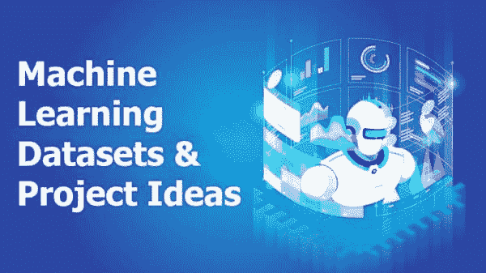

# 21 个机器学习项目 - 包含数据集

> 原文：[`www.kdnuggets.com/2020/03/20-machine-learning-datasets-project-ideas.html`](https://www.kdnuggets.com/2020/03/20-machine-learning-datasets-project-ideas.html)

评论

**由 [Shivashish Thakur](https://www.linkedin.com/in/shivashish-thakur-55153313b/)，数字营销，DataFlair**。

要构建一个完美的模型，你需要大量的数据。但找到适合你机器学习项目的正确数据集可能是一项挑战。幸运的是，许多组织、研究人员和个人分享了他们的机器学习项目和数据集，我们可以利用这些资源来构建自己的 ML 项目想法。

* * *

## 我们的前三大课程推荐

 1\. [Google 网络安全证书](https://www.kdnuggets.com/google-cybersecurity) - 快速进入网络安全职业生涯。

 2\. [Google 数据分析专业证书](https://www.kdnuggets.com/google-data-analytics) - 提升你的数据分析技能

 3\. [Google IT 支持专业证书](https://www.kdnuggets.com/google-itsupport) - 支持你所在组织的 IT

* * *

向下滚动查看 20 多个机器学习和数据科学数据集以及项目想法，以便你可以用来练习和提升技能。

## 机器学习项目：

### 1\. Enron 邮件数据集

Enron 数据集在自然语言处理领域非常受欢迎。它包含了超过 150 位用户的 50 万封邮件。数据大小约为 432Mb。在这 150 位用户中，大多数是 Enron 的高级管理人员。

**数据链接**：[Enron 邮件数据集](https://www.cs.cmu.edu/~enron/)

**机器学习项目想法**：使用 k-means 聚类，你可以构建一个检测欺诈活动的模型。k-means 聚类是一种无监督的机器学习算法。它根据数据中的相似模式将观察结果分成 k 个簇。

### 2\. 聊天机器人意图数据集

聊天机器人的数据集是一个 JSON 文件，包含了如告别、问候、药品搜索、医院搜索等不同的标签。每个标签下都有用户可能提出的问题模式，聊天机器人将根据这些模式作出回应。该数据集非常适合理解聊天机器人数据的工作方式。

**数据链接**：[意图 JSON 数据集](https://github.com/katanaml/katana-assistant/blob/master/mlbackend/intents.json)

**机器学习项目想法**：你可以通过扭曲和扩展数据，并结合自己的观察来构建一个聊天机器人或理解聊天机器人的工作原理。要构建自己的聊天机器人，你需要对自然语言处理概念有良好的理解。

**源代码**：[Python 聊天机器人项目](https://dzone.com/articles/python-chatbot-project-build-your-first-python-pro)

### 3\. Flickr 30k 数据集

Flickr 30k 数据集包含超过 30,000 张图像，每张图像都有不同的描述。该数据集用于构建图像描述生成器，并且这是 Flickr 8k 数据集的升级版，用于构建更准确的模型。

**数据链接**: [Flickr 图像数据集](https://www.kaggle.com/hsankesara/flickr-image-dataset)

**机器学习项目构想**: 你可以构建一个 CNN 模型，用于分析和提取图像特征，并生成描述图像的英文句子，称为 Caption。

### 4\. 帕金森数据集

帕金森病是一种神经系统疾病，会影响运动。帕金森数据集包含生物医学测量，195 条记录具有 23 个不同属性。该数据用于区分健康人群和帕金森病患者。

**数据链接**: [帕金森数据集](https://archive.ics.uci.edu/ml/datasets/parkinsons)

**机器学习项目构想**: 你可以构建一个模型，用于区分健康人群和帕金森病患者。对这个目的有用的算法是 XGboost，即极端梯度提升，它基于决策树。

**源代码**: [检测帕金森病的 ML 项目](https://bit.ly/37mVYIU)

### 5\. 鸢尾花数据集

鸢尾花数据集是一个适合初学者的数据集，包含了关于花瓣和花萼尺寸的信息。该数据集有 3 个类别，每个类别 50 个实例，总共有 150 行和 4 列。

**数据链接**: [鸢尾花数据集](https://archive.ics.uci.edu/ml/datasets/Iris)

**机器学习项目构想**: 分类任务是将项目分到对应的类别中。你可以在数据集上实现机器学习分类或回归模型。

### 6\. ImageNet 数据集

ImageNet 是一个大型图像数据库，按照 WordNet 层级组织。它拥有超过 100,000 个短语，每个短语平均有 1000 张图像，总大小超过 150 GB。它适用于图像识别、人脸识别、物体检测等。它还举办了一个名为 ILSVRC 的挑战性比赛，鼓励人们构建越来越准确的模型。

**数据链接**: [Imagenet 数据集](http://www.image-net.org/)

**机器学习项目构想**: 在这个庞大的数据库上实施图像分类并识别对象。CNN 模型（卷积神经网络）对于获得准确结果是必要的。

### 7. 商场顾客数据集

商场顾客数据集包含了访问商场的人的详细信息。数据集包括年龄、顾客 ID、性别、年收入和消费评分。它从数据中获取洞察，并根据顾客的行为将其分成不同的群体。

**数据集链接**: [商场顾客数据集](https://www.kaggle.com/shwetabh123/mall-customers)

**机器学习项目创意：** 基于性别、年龄、兴趣对客户进行细分。这在定制化营销中非常有用。客户细分是一种重要的实践，基于类似的个体群体对客户进行划分。

**源代码：** [机器学习客户细分](https://bit.ly/2w9aBT9)

### 8. 谷歌趋势数据门户

谷歌趋势数据可用于以视觉方式检查和分析数据。你也可以通过简单点击将数据集下载为 CSV 文件。我们可以发现当前的趋势和人们在搜索什么。

**数据链接：** [谷歌趋势数据集](https://trends.google.com/trends/)

### 9. 波士顿住房数据集

这是一个在模式识别中常用的数据集。它包含了有关波士顿不同房屋的信息，如犯罪率、税收、房间数量等。它有 506 行和 14 个不同的变量列。你可以使用该数据集来预测房价。

**数据链接：** [波士顿数据集](https://www.cs.toronto.edu/~delve/data/boston/bostonDetail.html)

**机器学习项目创意：** 使用线性回归预测新房的房价。线性回归用于预测数据中的未知输入值，当数据具有输入和输出变量之间的线性关系时。

### 10. Uber 接送数据集

该数据集包含了从 2014 年 4 月到 2014 年 9 月的 450 万次 Uber 接送记录，以及从 2015 年 1 月到 2015 年 6 月的 1400 万次记录。用户可以进行数据分析并从数据中获得见解。

**数据链接：** [Uber 接送数据集](https://www.kaggle.com/fivethirtyeight/uber-pickups-in-new-york-city)

**机器学习项目创意：** 分析客户骑行数据，并可视化数据以寻找有助于改善业务的见解。数据分析和可视化是数据科学的重要组成部分。它们用于从数据中获取见解，通过可视化，你可以从数据中快速获取信息。

### 11. 推荐系统数据集

这是一个到丰富数据集的门户，这些数据集曾用于 UCSD 的实验室研究项目。它包含了来自流行网站的各种数据集，如 Goodreads 书评、亚马逊产品评论、调酒数据、社交媒体数据等，这些数据用于构建推荐系统。

**数据链接：** [推荐系统数据集](https://cseweb.ucsd.edu/~jmcauley/datasets.html)

**机器学习项目创意：** 构建类似亚马逊的产品推荐系统。推荐系统可以根据你的兴趣和以前使用过的东西建议产品、电影等。

**源代码：** [电影推荐系统项目](https://bit.ly/37iBDEp)

### 12. UCI 垃圾邮件数据集

将电子邮件分类为垃圾邮件或非垃圾邮件是非常常见和有用的任务。该数据集包含 4601 封电子邮件及其 57 条元信息。你可以构建模型来过滤垃圾邮件。

**数据链接**: [UCI 垃圾邮件数据集](https://archive.ics.uci.edu/ml/datasets/Spambase)

**机器学习项目构思**: 你可以构建一个模型，用于识别你的邮件是否为垃圾邮件。

### 13\. GTSRB（德国交通标志识别基准）数据集

GTSRB 数据集包含约 50,000 张交通标志图像，属于 43 个不同的类别，并包含每个标志的边界框信息。该数据集用于多类别分类。

**数据链接**: [GTSRB 数据集](http://benchmark.ini.rub.de/?section=gtsrb&subsection=dataset)

**机器学习项目构思**: 使用深度学习框架构建一个模型，用于分类交通标志并识别标志的边界框。交通标志分类在自动驾驶车辆中也很有用，用于识别标志并采取适当的行动。

**源代码**: [交通标志识别 Python 项目](https://bit.ly/39taSyH)

### 14\. Cityscapes 数据集

这是一个用于计算机视觉项目的开源数据集。它包含在 50 条不同城市街道拍摄的视频序列的高质量像素级注释。该数据集在语义分割和训练深度神经网络以理解城市场景方面非常有用。

**数据** **链接**: [Cityscapes 数据集](https://www.cityscapes-dataset.com/)

**机器学习项目** **构思**: 执行图像分割并检测视频中的不同物体。图像分割是将图像数字化划分为不同类别的过程，如汽车、公交车、行人、树木、道路等。

### 15. Kinetics 数据集

Kinetics 有三个不同的数据集：Kinetics 400、Kinetics 600 和 Kinetics 700 数据集。这是一个大规模的数据集，包含一个大约 650 万个高质量视频的 URL 链接。

**数据链接**: [Kinetics 数据集](https://deepmind.com/research/open-source/kinetics)

**机器学习项目构思**: 构建一个人类动作识别模型，检测人类的动作。人类动作识别通过一系列观察来完成。

### 16\. IMDB-Wiki 数据集

IMDB-Wiki 数据集是最大的开源面部图像数据集之一，带有标记的性别和年龄。这些图像来自 IMDB 和维基百科，包含超过 500 万张标记的图像。

**数据链接**: [IMDB wiki 数据集](https://data.vision.ee.ethz.ch/cvl/rrothe/imdb-wiki/)

**机器学习项目构思**: 创建一个模型，检测面孔并预测其性别和年龄。你可以设置不同的年龄范围类别，如 0-10、10-20、30-40、50-60 等。

### 17\. 颜色检测数据集

数据集包含一个 CSV 文件，其中有 865 个颜色名称及其对应的 RGB（红色、绿色和蓝色）值。还包含颜色的十六进制值。

**数据链接**: [颜色检测数据集](https://github.com/codebrainz/color-names/blob/master/output/colors.csv)

**机器学习项目创意**：可以使用颜色数据集制作一个颜色检测应用，其中可以从图像中选择颜色，应用程序将显示颜色的名称。

**源代码**： [颜色检测 Python 项目](https://bit.ly/2SeHqqi)

### 18\. 城市声音 8K 数据集

城市声音数据集包含来自 10 个类别的 8732 种城市声音，如空调、狗吠、钻孔声、警报声、街头音乐等。该数据集在城市声音分类问题中非常受欢迎。

**数据链接**： [城市声音 8K 数据集](https://urbansounddataset.weebly.com/urbansound8k.html)

**机器学习项目创意**：我们可以建立一个声音分类系统，以检测背景中播放的城市声音类型。这将帮助你入门音频数据，并理解如何处理非结构化数据。

### 19\. Librispeech 数据集

该数据集包含大量来自 LibriVox 项目的英文演讲。它包含 1000 小时的各种口音的英文朗读。它用于语音识别项目。

**数据链接**： [Librispeech 数据集](http://www.openslr.org/12)

**机器学习项目创意**：建立一个语音识别模型，以检测说了什么并将其转换为文本。语音识别的目标是自动识别音频中的内容。

### 20\. 乳腺组织病理图像数据集

该数据集包含从 162 张乳腺癌标本的切片图像中提取的 277,524 张 50×50 大小的图像。包括 198,738 个阴性测试和 78,786 个带有 IDC 的阳性测试。

**数据链接**： [乳腺组织病理数据集](https://www.kaggle.com/paultimothymooney/breast-histopathology-images)

**机器学习项目创意**：建立一个可以分类乳腺癌的模型。你可以使用卷积神经网络构建图像分类模型。

**源代码**： [乳腺癌分类 Python 项目](https://bit.ly/2vkI8cw)

### 21\. Youtube 8M 数据集

Youtube 8M 数据集是一个大规模标注的视频数据集，包含 610 万个 Youtube 视频 ID，35 万小时的视频，26 亿个音频/视觉特征，3862 个类别，以及每个视频平均 3 个标签。它用于视频分类目的。

**数据链接**： [Youtube 8M](https://research.google.com/youtube8m/)

**机器学习项目创意**：可以使用该数据集进行视频分类，模型可以描述视频的内容。视频需要一系列输入来分类视频属于哪个类别。

### 参考文献

在这篇文章中，我们看到超过 20 个机器学习数据集，你可以用来练习机器学习或数据科学。创建自己的数据集很昂贵，所以我们可以使用其他人的数据集来完成工作。但我们应该仔细阅读数据集的文档，因为有些数据集是免费的，而有些数据集则需要根据其要求给予所有者信用。

**简介：** [Shivashish Thaku](https://www.linkedin.com/in/shivashish-thakur-55153313b/) 是一位分析师和技术内容作家。他是一位技术爱好者，喜欢撰写有关最新前沿技术的文章，这些技术正在改变世界。他也是一位体育迷，喜欢踢足球和观看足球比赛。

**相关：**

+   [大而坏的 NLP 数据库：访问近 300 个数据集](https://www.kdnuggets.com/2020/02/big-bad-nlp-database.html)

+   [Google 数据集搜索提供访问 2500 万个数据集的功能](https://www.kdnuggets.com/2020/01/google-dataset-search.html)

+   [数据源 101](https://www.kdnuggets.com/2019/10/data-sources-101.html)

### 更多相关主题

+   [管理深度学习数据集的新方法](https://www.kdnuggets.com/2022/03/new-way-managing-deep-learning-datasets.html)

+   [假装成功：生成真实的合成客户数据集](https://www.kdnuggets.com/2022/01/fake-realistic-synthetic-customer-datasets-projects.html)

+   [如何识别时间序列数据集中的缺失数据](https://www.kdnuggets.com/how-to-identify-missing-data-in-timeseries-datasets)

+   [如何使用 Pandas 对大型数据集执行内存高效的操作](https://www.kdnuggets.com/how-to-perform-memory-efficient-operations-on-large-datasets-with-pandas)

+   [如何使用 Hugging Face 的数据集库进行高效的数据加载](https://www.kdnuggets.com/how-to-use-hugging-faces-datasets-library-for-efficient-data-loading)

+   [为什么越来越多的开发者在他们的机器学习项目中使用 Python？](https://www.kdnuggets.com/2022/01/developers-python-machine-learning-projects.html)
