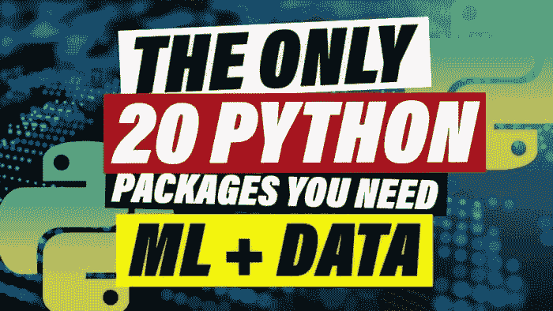
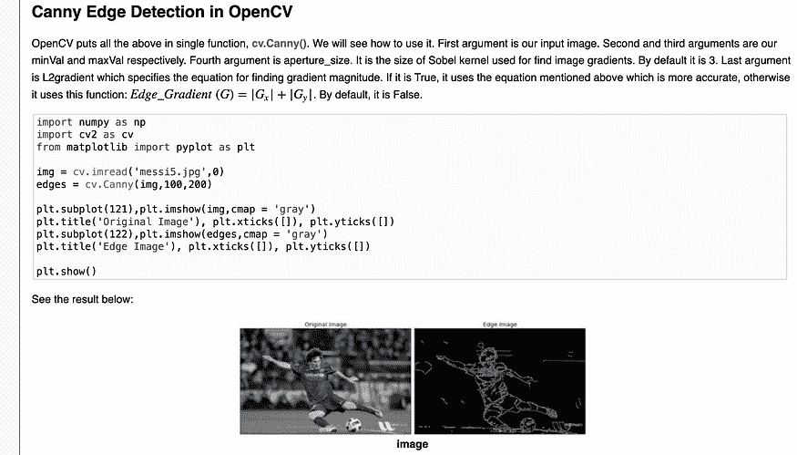
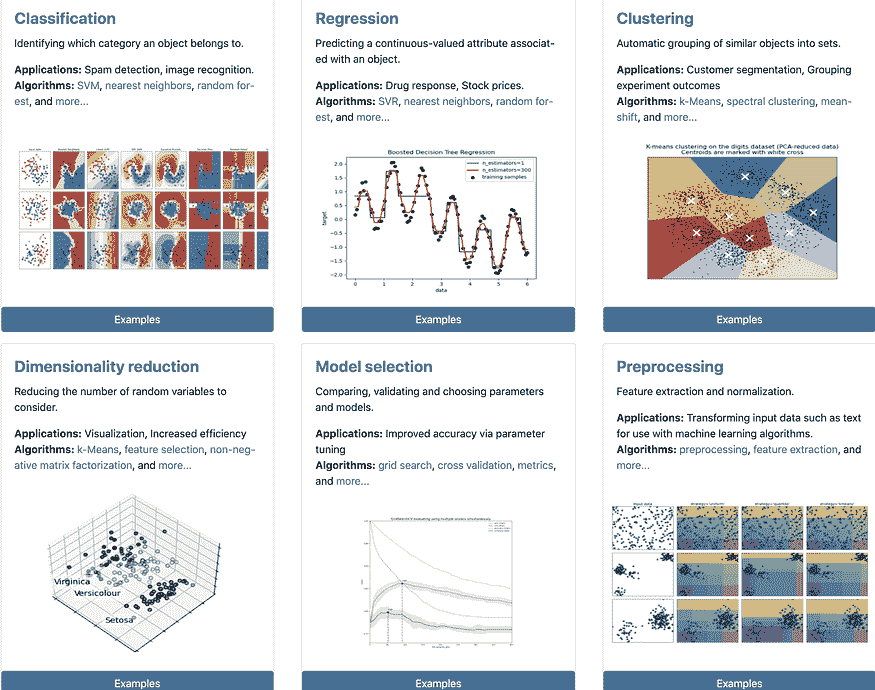
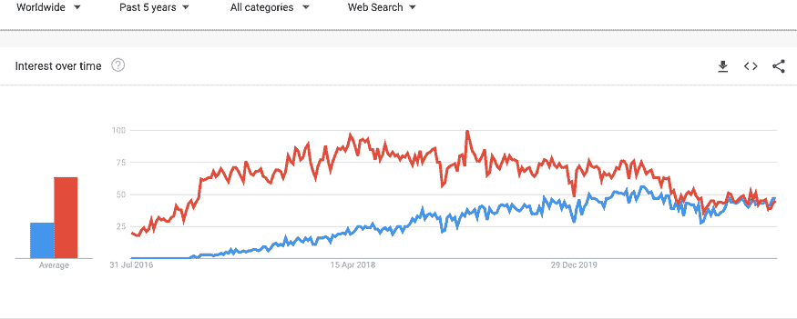
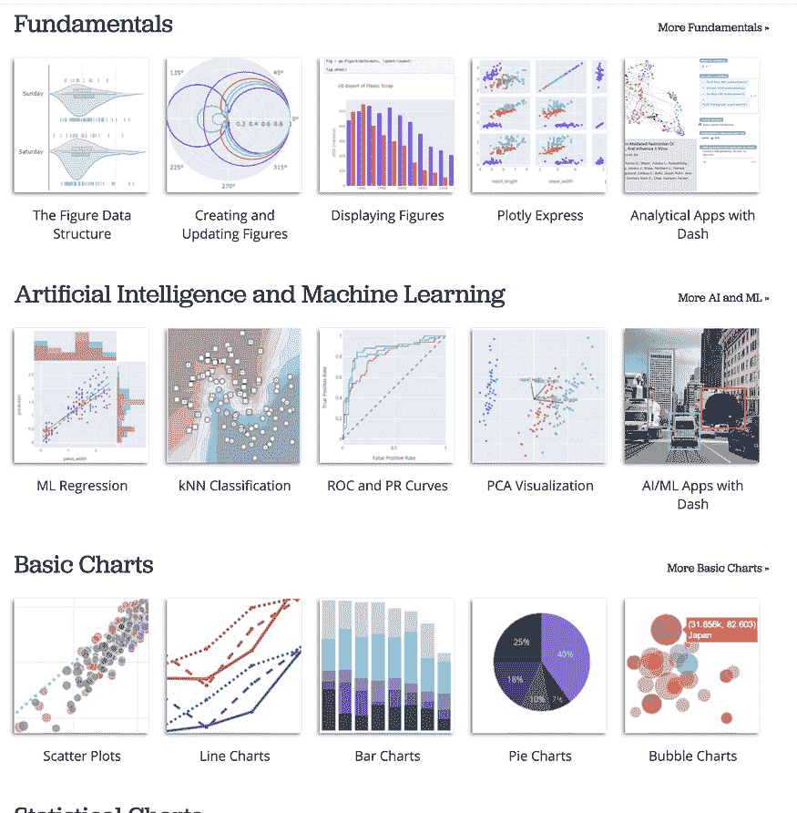
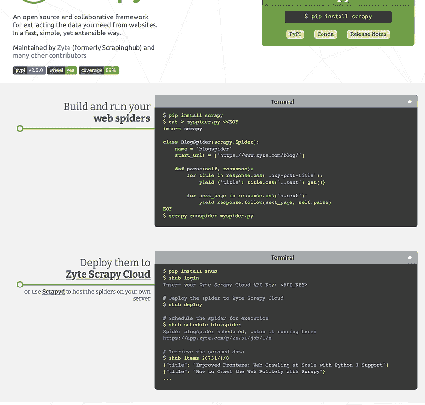
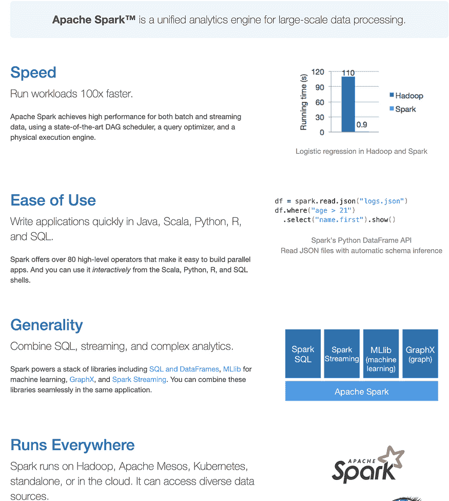

# 你需要的 20 个 Python 包用于机器学习和数据科学

> 原文：[`www.kdnuggets.com/2021/10/20-python-packages.html`](https://www.kdnuggets.com/2021/10/20-python-packages.html)

评论

**由[沙德罗·卢克](https://www.linkedin.com/in/sandro-luck-b9293a181/)，Digitec Galaxus AG 的机器学习工程师**。

* * *

## 我们的前 3 名课程推荐

 1\. [谷歌网络安全证书](https://www.kdnuggets.com/google-cybersecurity) - 快速进入网络安全职业生涯。

 2\. [谷歌数据分析专业证书](https://www.kdnuggets.com/google-data-analytics) - 提升你的数据分析能力

 3\. [谷歌 IT 支持专业证书](https://www.kdnuggets.com/google-itsupport) - 支持你的组织 IT

* * *

*图像由作者创建。背景许可由[Envato-Elements](https://elements.envato.com/blue-futuristic-stream-data-communication-flying-i-JX8FY62)持有，由作者提供。*

我们将查看你在所有数据科学、数据工程和机器学习项目中应了解的 20 个 Python 包。这些是我在作为机器学习工程师和 Python 程序员的职业生涯中发现最有用的包。虽然这样的列表永远无法完整，但它确实为每种用例提供了一些工具。

*如果我遗漏了你最喜欢的内容，请务必将其添加到其他人的知识中，并在下面的评论中告诉他们。*

### 1\. Open CV

开源计算机视觉库 Open-CV 是你处理图像和视频时的最佳伙伴。它提供了高效的解决方案来处理常见的图像问题，如人脸检测和物体检测。或者，正如我们下面所看到的，边缘检测，即检测图像中的各种线条。如果你计划在数据科学中处理图像，这个库是必不可少的。Open CV 在 GitHub 上获得了 56,000 个星标，使我在处理图像数据时快了几倍，也变得更容易。

*来自[OpenCV](https://docs.opencv.org/3.4/da/d22/tutorial_py_canny.html)的截图。*

### 2\. Matplotlib

数据可视化是你与非数据专家沟通的主要方式。如果你想一想，即使是应用程序也只是可视化幕后各种数据交互的方式。Matplotlib 是 Python 中图像可视化的基础。从可视化你的边缘检测算法到查看数据中的分布，Matplotlib 是你可靠的伙伴。在 GitHub 上拥有 14,000 个星标，绝对是一个值得开始贡献的好库。例如，我在最近的视频中使用 seaborn 和 matplotlib 制作了这个动画折线图。

*[显示编程语言流行度随时间变化的 GIF](https://youtu.be/YBu8D-iQF44)。*

### 3\. pip

鉴于我们正在讨论 Python 包，我们必须花一点时间谈谈它们的主角 pip。没有它，你不能安装其他任何包。它的唯一目的就是从[Python 包索引](https://pypi.org/)或类似 GitHub 的地方安装包。但你也可以用它来安装你自己定制的包。7,400 颗星只是没有反映它对 Python 社区的重要性。

### 4\. Numpy

没有 Numpy，Python 不会成为最流行的编程语言。它是所有数据科学和机器学习包的基础，是进行所有数学密集型计算时必不可少的包。你在大学里学到的那些复杂的线性代数和高级数学基本上都由 Numpy 高效处理。它的语法风格可以在许多重要的数据库中看到。GitHub 上的 18,100 颗星展示了它在 Python 生态系统中的关键基础作用。

### 5\. Pandas

基于 Numpy 构建，它是你在 Python 中进行所有数据科学工作的核心。“import pandas as pd”是我早晨输入的第一行代码，它远不止是加强版的 Excel。它的明确目标是成为任何语言中最强大的开源数据工具，我认为他们已经完成了一半的目标。虽然它通常不是最快的工具，但有许多子工具可以加快速度，如 Dask、swifter、koalas 等，它们基于其语法和易用性，使其也适用于大数据项目。GitHub 上的 30,900 颗星，真正是任何有志数据专家的起点。

### 6. Python-dateutil

如果你曾在 Python 中处理过日期，你会知道没有 dateutil 处理起来非常麻烦。它可以计算给定日期的下一个月，或计算日期之间的秒数。最重要的是，它为你处理时区问题，如果你曾试图在没有库的情况下处理这些问题，可能会遇到*极大的*麻烦。GitHub 上的 1,600 颗星表明幸运的是，只有少数人需要经历处理时区的挫折过程。

### 7\. Scikit-Learn

如果你对机器学习充满热情，那么 Scikit-Learn 项目将满足你的需求。最好的起点也是查找你可能需要用于预测的任何算法的首选之地。它还提供了大量实用的评估方法和训练辅助工具，如网格搜索。无论你在尝试从数据中获得什么样的预测，sklearn（如它通常被称呼的）都将帮助你更高效地完成。GitHub 上的 47,000 颗星告诉你为什么 Python 是机器学习者的首选语言。

*来自 [Scikit-learn](https://scikit-learn.org/stable/index.html) 的截图。*

### 8\. Scipy

这有点令人困惑，但有一个 [Scipy *库*](https://www.scipy.org/scipylib/index.html)，还有一个 Scipy *栈*。本文中提到的大多数库和包都是 Python 科学计算的 Scipy *栈* 的一部分。这包括 Numpy、Matplotlib、IPython 和 Pandas。就像 Numpy 一样，你很可能不会直接使用 Scipy，但上述提到的 Scikit-Learn 库 heavily relies on it。Scipy 提供了进行复杂机器学习过程的核心数学方法。再次有些奇怪，它在 GitHub 上只有大约 8,500 个星标。

### 9\. TQDM

如果你想知道我最喜欢的 Python 包是什么，别再找了。就是这个叫做 TQDM 的小应用程序。它的功能其实就是给你一个处理进度条，你可以把它放到 **任何 for 循环** 中，它会给你一个进度条，告诉你每次迭代的平均时间，最重要的是，它会告诉你需要多久，这样你就知道在必须回到工作之前，你可以看多久的 YouTube 视频。我最喜欢的包获得了 19,300 个星标，它在过去几年里给了我比其他任何包都更多的平静。

*GIF 来自 [TQDM-Github](https://github.com/tqdm/tqdm)。*

### 10\. TensorFlow

最受欢迎的深度学习框架，真正使得 Python 如今的样子。TensorFlow 是一个完整的端到端开源机器学习平台，包含了许多其他包和工具，如 tensorboard、collab 和 What-If 工具。被许多世界领先公司选择用于深度学习需求的 TensorFlow，在 GitHub 上拥有令人震惊的 159,000 个星标，是有史以来最受欢迎的 Python 包。它被包括可口可乐、Twitter、Intel 以及其创始人 Google 在内的公司用于各种深度学习应用场景。

如果你对最有用的工具、开发环境和 AutoML 工具的更深入细节感兴趣，务必查看我的视频。

### 11\. KERAS

一个为人类打造的深度学习框架，正如他们的口号所说。它让快速开发新的神经网络成为现实。我记得在 Keras 之前，即使是写一个简单的顺序模型也是相当麻烦的。它基于 TensorFlow 之上，确实是开发者在首次尝试新架构时的起点。它降低了编程神经网络的门槛，使得大多数高中生现在都能做到。Keras 是另一个极受欢迎的 Python 包，约有 52,000 个星标。

### 12\. PyTorch

TensorFlow 在深度学习领域的主要竞争对手。它已成为开发神经网络的绝佳替代品，也是我个人最喜欢的工具。我认为它的社区在自然语言处理领域稍强，而 TensorFlow 更倾向于图像和视频方面。与 Keras 一样，它也有自己简化的库——Pytorch Lightning，我制作了一个[完整教程，以确保你不会再为精通深度学习而努力。](https://towardsdatascience.com/pytorch-lightning-machine-learning-zero-to-hero-in-75-lines-of-code-7892f3ba83c0) 在 GitHub 上的 50,000 颗星虽然相比 Tensorflow 显得少，但从长远来看，它确实在快速赶上。

*来自 Google Trends 的截图，蓝色：PyTorch 红色：Tensorflow*

### 13\. Statsmodels

与时下流行的机器学习世界相比，Statsmodel 是你通向经典统计学世界的门径。它包含了许多有用的统计评估和测试。相较而言，这些工具往往更加稳定，任何数据科学家都应该不时使用。6,600 颗星可能更多地反映了深度学习与经典统计学的酷炫程度对比。

### 14\. Plotly

Matplolib 的主要替代品是 Plotly，从客观上来说更美观，更适合交互式数据可视化。与 Matplolib 的主要区别在于它是基于浏览器的，起步略微困难，但一旦掌握基础知识，它确实是一个令人惊叹的工具。它与 Jupyter 的强大集成让我相信它将变得越来越标准，并使人们远离 Matplolib 的集成。在 GitHub 上获得 10,000 颗星，并逐渐追赶 Matplolib。

*来自 [Plotly 画廊](https://plotly.com/python/)的截图。*

### 15\. NLTK

自然语言工具包（Natural Language Toolkit，简称 NLTK）是你在尝试理解任何文本时的最佳助手。它包含了各种语法变换的广泛算法，例如词干提取，以及你可能希望在处理模型中的文本之前移除的符号，如句点和停用词的惊人列表。它还会检测哪些最有可能是句子，哪些不是，从而纠正数据集中“作者”所犯的语法错误。总之，如果你在处理文本，试试它吧。再次给它 10,000 颗星，这对像这样的利基包来说实在是太疯狂了。

### 16\. Scrapy

如果你曾经尝试在没有数据的情况下进行数据科学，我想你意识到这相当于徒劳无功。幸运的是，互联网包含了几乎所有事物的信息。但有时，这些信息并没有以友好的 CSV 格式存储，你必须首先去采集它。这正是 scrapy 可以帮助你的地方，它使你能够通过几行代码轻松爬取全球的网站。下次你有一个没有人预先收集数据集的想法时，务必查看这个 41,000 星的项目。

*来自 [Scrapy](https://scrapy.org/) 的截图。*

### 17\. Beautiful Soup

一个非常相似的用例是，许多网页开发人员将他们的数据存储在一种较差的数据结构中，称为 HTML。为了利用这种嵌套的混乱，创建了 beautiful soup。它帮助你提取 HTML 的各种方面，如标题和标签，并允许你像操作普通字典一样对其进行迭代。它在几个小项目中帮助了我，这些项目中我对没有开放 API 的网站上的用户评论感兴趣。

### 18\. XGBoost

一旦我们的数据集大小超过一定的 TB 阈值，使用常见的基础机器学习算法实现可能会很困难。XGBoost 可以救你于等待几周才能完成计算的困境。它是一个高度可扩展的分布式梯度提升库，确保你的计算尽可能高效地运行。几乎所有常见的数据科学语言和堆栈中都有提供。

### 19\. PySpark

数据工程是每个数据科学工作流程的一部分，如果你曾尝试处理数十亿的数据点，你会知道你常规的 for 循环只能做到这一步。PySpark 是非常流行的 Apache Spark 数据处理引擎的 Python 实现。它类似于 pandas，但从一开始就考虑了分布式计算。如果你有感觉到处理数据的速度跟不上进度，这肯定是你需要的东西。他们还开始关注大规模并行机器学习，用于非常大的数据用例。GitHub 上的 30,000 个星标使它成为最受欢迎的数据处理工具之一。

*来自 [Spark](https://spark.apache.org/) 的截图。*

### 20\. Urllib3

Urllib3 是一个功能强大的、*用户友好的* Python HTTP 客户端。如果你在 Python 中试图进行任何与互联网相关的操作，那么这个库或基于它的其他库都是必不可少的。包括 API 爬虫和与各种外部数据源的连接。GitHub 上 2,800 个星标不会撒谎。

### 结论

这些是我在担任机器学习工程师和 Python 程序员的职业生涯中使用过的 20 个最重要的包。我相信它们在你寻找解决方案的表格时也会对你有所帮助。请务必在下方评论你最喜欢的包，让其他人也能从你的知识中受益。

[原文](https://pub.towardsai.net/the-last-20-python-packages-you-will-ever-need-a4bc0a0d1214)。转载许可。

**相关：**

+   [通向全栈数据科学之路](https://www.kdnuggets.com/2021/09/path-full-stack-data-science.html)

+   [作为机器学习工程师，你需要 Python 技能的原因](https://www.kdnuggets.com/2021/10/bootcamp-python-skills-machine-learning-engineer.html)

+   [AutoML：使用 Auto-Sklearn 和 Auto-PyTorch 的介绍](https://www.kdnuggets.com/2021/10/automl-introduction-auto-sklearn-auto-pytorch.html)

### 更多相关主题

+   [使用管道编写干净的 Python 代码](https://www.kdnuggets.com/2021/12/write-clean-python-code-pipes.html)

+   [成为优秀数据科学家所需的 5 项关键技能](https://www.kdnuggets.com/2021/12/5-key-skills-needed-become-great-data-scientist.html)

+   [每个初学者数据科学家都应该掌握的 6 种预测模型](https://www.kdnuggets.com/2021/12/6-predictive-models-every-beginner-data-scientist-master.html)

+   [2021 年最佳 ETL 工具](https://www.kdnuggets.com/2021/12/mozart-best-etl-tools-2021.html)

+   [建立一个扎实的数据团队](https://www.kdnuggets.com/2021/12/build-solid-data-team.html)

+   [每个数据科学家都应该知道的三个 R 库（即使你使用 Python）](https://www.kdnuggets.com/2021/12/three-r-libraries-every-data-scientist-know-even-python.html)
