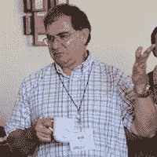
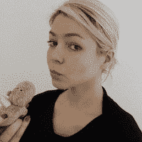

# 识别虚假的数据科学家的 20 个问题

> 原文：[`www.kdnuggets.com/2016/01/20-questions-to-detect-fake-data-scientists.html`](https://www.kdnuggets.com/2016/01/20-questions-to-detect-fake-data-scientists.html)

**作者：Andrew Fogg，Import.io**

> *查看 KDnuggets 编辑对这些问题（以及一个额外问题）的回答：
> 
> *

现在[数据科学家被正式称为 21 世纪最性感的职业](http://enterprise.import.io/post/why-data-scientist-is-being-called-the-sexiest-job-of-the-21st-century/)，每个人都想分一杯羹。

这意味着市场上确实存在一些数据伪装者。那些自称为数据科学家但实际上没有正确技能组合的人。

这并不总是出于欺骗的目的。数据科学的创新性和缺乏广泛理解的职位描述意味着许多人可能会认为自己是数据科学家，仅仅因为他们处理数据。

> “虚假的数据科学家通常在某一特定领域非常精通，并坚信他们的领域才是真正的数据科学。这样的信念忽视了数据科学是指将科学工具和技术（数学、计算、可视化、分析、统计、实验、问题定义、模型建立和验证等）全面应用于从数据中提取发现、洞察和价值。”
> 
> - 克 irk Borne， [Booz Allen Hamilton](http://www.boozallen.com/)的首席数据科学家和[RocketDataScience.org](http://rocketdatascience.org/)的创始人

识别虚假的数据科学家的第一步是了解你应该寻找的技能组合。了解[数据科学家、数据分析师与数据工程师](http://blog.import.io/post/data-scientists-vs-data-analysts-why-the-distinction-matters)之间的区别非常重要，特别是如果你打算[聘用这些稀有人才](http://blog.import.io/post/the-art-of-hiring-data-scientists)。

为了帮助你分辨真正的数据科学家和虚假的（或误导的）数据科学家，我们编制了一份 20 个面试问题的清单，你可以在面试数据科学家时使用。

1.  解释什么是正则化以及它的作用。

1.  你最欣赏哪些数据科学家？哪些初创公司？

1.  你会如何验证你创建的模型，通过多重回归生成的定量结果变量的预测模型？

1.  解释什么是精确度和召回率。它们与 ROC 曲线有什么关系？

1.  你如何证明你对一个算法所做的改进确实优于什么都不做？

1.  什么是根本原因分析？

1.  你是否熟悉定价优化、价格弹性、库存管理和竞争情报？请举例说明。

1.  什么是统计功效？

1.  解释什么是重采样方法，它们为何有用，并解释它们的局限性。

1.  是有太多假阳性好，还是有太多假阴性好？请解释一下。

1.  什么是选择偏差，它为何重要，如何避免它？

1.  请举例说明你如何使用实验设计来回答关于用户行为的问题。

1.  "长格式"和"宽格式"数据有什么区别？

1.  你使用什么方法来确定文章（例如报纸）中发布的统计数据是否错误，或是否为支持作者观点而非提供特定主题的正确、全面的事实信息？

1.  解释爱德华·塔夫特（Edward Tufte）提出的“图表垃圾”概念。

1.  你如何筛选异常值，如果发现异常值应该怎么办？

1.  你如何使用极值理论、蒙特卡洛模拟或数学统计（或其他任何方法）来正确估计非常罕见事件的发生几率？

1.  什么是推荐引擎？它是如何工作的？

1.  解释什么是假阳性和假阴性。为什么区分这两者很重要？

1.  你使用什么工具进行可视化？你对 Tableau、R、SAS 有什么看法？如何在图表（或视频）中有效地表示五个维度？

> “一个‘真正的’数据科学家知道如何应用数学、统计学，如何使用适当的实验设计构建和验证模型。拥有 IT 技能而没有统计技能，就像知道如何制作手术刀而不成为外科医生一样。”
> 
> ~ Lisa Winter, [Towers Watson](https://www.towerswatson.com/) 的高级分析师

**你如何量化一个真正的数据科学家？

作者简介：

Andrew Fogg** 是 [import.io](http://import.io/) 的创始人兼首席数据官。他将对结构化网络的热情和信念带到了 import.io。他坚信帮助数据用户和数据提供者更高效地交易。作为数据和结构化网络方面的专家，在共同创办 import.io 之前，Andrew 曾在微软研究、巴克莱资本、剑桥大学和威康信托工作，然后加入 RBS 成为技术创新组的一员。他最近将自己的第一家创业公司 Kusiri 出售给了 PwC。

[原帖](http://blog.import.io/post/20-questions-to-detect-fake-data-scientists)

**相关：**

+   实际学习数据科学的 5 个步骤

+   Quora 关于‘如何学习机器学习’的最佳建议

+   60+ 本关于大数据、数据科学、数据挖掘、机器学习、Python、R 等的免费书籍

* * *

## 我们的前三大课程推荐

 1\. [谷歌网络安全证书](https://www.kdnuggets.com/google-cybersecurity) - 快速进入网络安全职业生涯。

 2\. [谷歌数据分析专业证书](https://www.kdnuggets.com/google-data-analytics) - 提升你的数据分析能力

 3\. [谷歌 IT 支持专业证书](https://www.kdnuggets.com/google-itsupport) - 支持你所在组织的 IT

* * *

### 更多相关主题

+   [识别虚假数据科学家（含答案）的 20 个问题：ChatGPT…](https://www.kdnuggets.com/2023/01/20-questions-detect-fake-data-scientists-chatgpt-1.html)

+   [识别虚假数据科学家（含答案）的 20 个问题：ChatGPT…](https://www.kdnuggets.com/2023/02/20-questions-detect-fake-data-scientists-chatgpt-2.html)

+   [建立一个坚实的数据团队](https://www.kdnuggets.com/2021/12/build-solid-data-team.html)

+   [使用管道编写干净的 Python 代码](https://www.kdnuggets.com/2021/12/write-clean-python-code-pipes.html)

+   [停止学习数据科学以寻找目标，并寻找目标来…](https://www.kdnuggets.com/2021/12/stop-learning-data-science-find-purpose.html)

+   [成为优秀数据科学家所需的 5 项关键技能](https://www.kdnuggets.com/2021/12/5-key-skills-needed-become-great-data-scientist.html)
