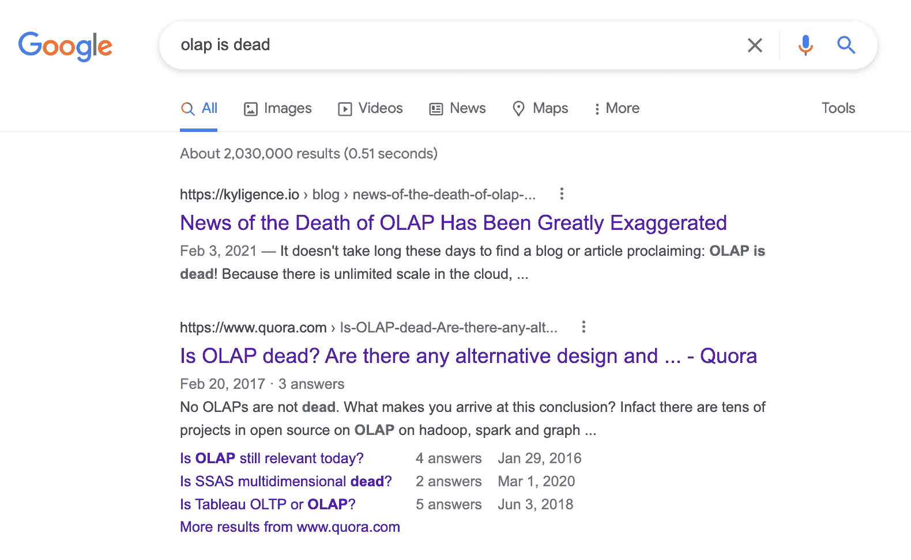
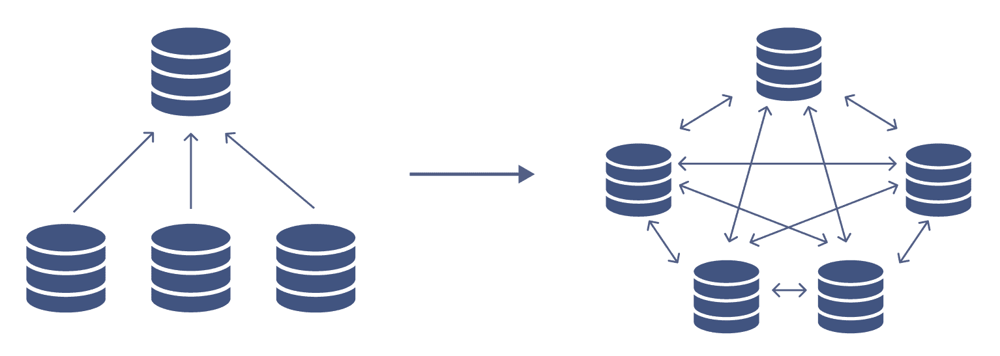
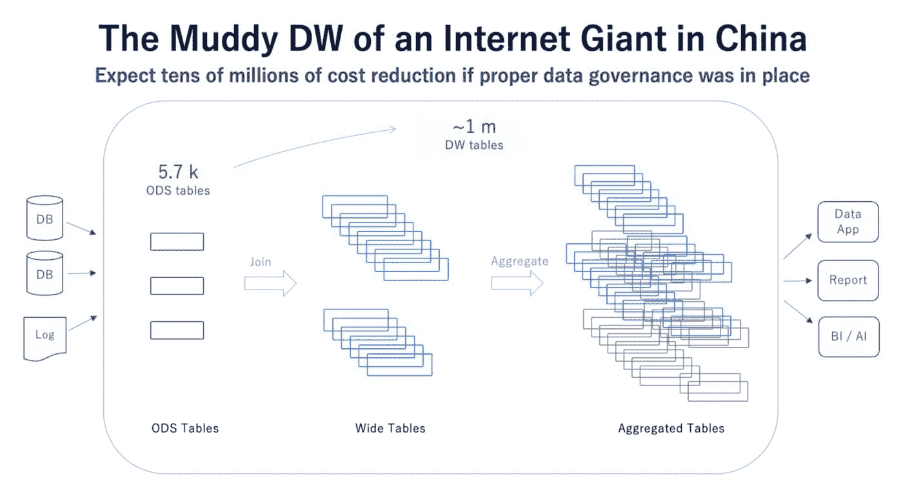
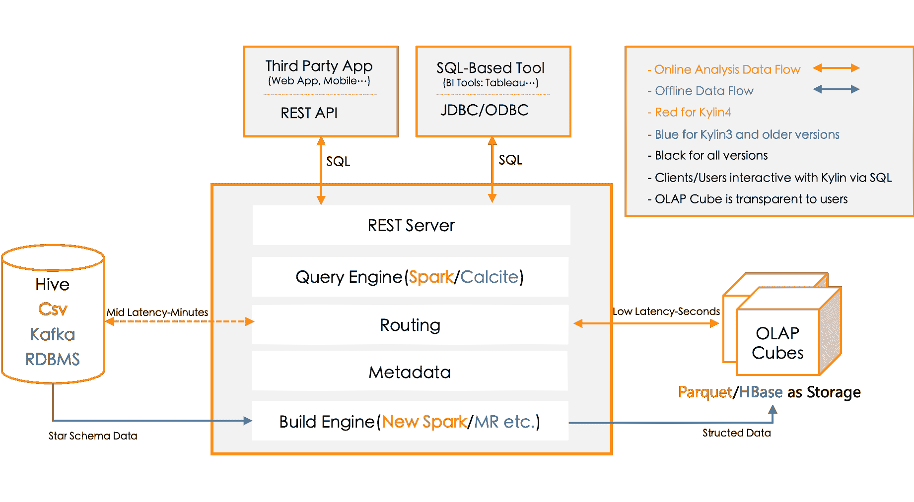

# OLAP 是否已经过时？

> 原文：[`www.kdnuggets.com/2022/10/olap-dead.html`](https://www.kdnuggets.com/2022/10/olap-dead.html)

在谷歌上，很容易找到关于 OLAP（在线分析处理）及其相关概念的信息，如多维分析和 OLAP 立方体。这是因为 OLAP 是一个知名且成熟的概念；但在这个高效分析的时代，它是否成了“过时的技术”甚至是过时的？这一问题似乎在许多人脑海中萦绕，因为搜索“OLAP is dead”会返回超过 200 万条结果（见图 1）。

图 1 搜索“OLAP is dead”在谷歌上

* * *

## 我们的前三大课程推荐

 1\. [谷歌网络安全证书](https://www.kdnuggets.com/google-cybersecurity) - 快速开启网络安全职业生涯。

 2\. [谷歌数据分析专业证书](https://www.kdnuggets.com/google-data-analytics) - 提升你的数据分析技能

 3\. [谷歌 IT 支持专业证书](https://www.kdnuggets.com/google-itsupport) - 支持你的组织的 IT

* * *

# OLAP 是否真的过时了？

在云时代之前，当企业数据仓库（EDW）广泛采用时，OLAP 数据库是数据集市层中的强制组件，如 Oracle Essbase 和 Microsoft SSAS（SQL Server 分析服务）。但随着数据仓库迁移到云端，数据湖的崛起，OLAP 变得过时和不受欢迎；许多人甚至认为 OLAP 以及其他遗留方法，如提取、转换和加载（ETL）和数据建模，已经过时了。

新的、以云为中心的技术和方法将改变分析方式。没有采用新方法的企业将被淘汰。是时候适应创新的方法，例如：

+   **多云架构**：随着许多企业全球化，并在不同的云平台和不同地区构建产品和服务，数据被存储在许多地方，而不是集中在单一的数据库或数据仓库中。数据管理理念侧重于连接，而非收集。（见图 2）

+   **云原生架构**：为了适应云计算的采用，软件行业专注于构建云原生产品，以使软件用户能够充分利用云的无限资源，灵活和弹性地管理这些资源，并在 IT 基础设施上享受较低的总体拥有成本（TCO）。

+   **现代数据栈**：随着现代数据栈的兴起，企业在数据管理和分析方面有了更多选择。许多即插即用的云数据湖或数据仓库服务在云中提供，帮助各种组织最大化其数据的价值，以实现多种目的。

图 2 从收集到连接的数据

鉴于这些趋势和技术的炒作及其发展的速度，用户可能会认为数据分析平台上只需一个数据仓库和数据湖即可。他们也可能会认为 OLAP 是完全可选的。但这是真的吗？让我们仔细看看。

# 公民分析越来越普遍

直到不久前，数据消费者主要集中在管理层。然而，如今，像店长或市场营销人员这样的第一线办公室工作人员在日常工作中严重依赖数据。他们是公民分析师，随处可见。例如，在疫情期间，许多保险公司发布了基于从 COVID-19 数据集中得出的见解和分析的安全和便利产品。如果没有这些数据，产品经理可能会急于推出不必要或设计不佳的新产品，导致损失。

随着许多组织采用数字化转型，每个业务现在都是数据消费者，寻求利用数据获得新见解、做出更好的决策，并更具竞争力地运营。

满足公民分析师的需求意味着提供能够实现公民分析所需的使用和性能期望，包括：

+   **更快的数据洞察时间**：时间是关键。业务用户需要快速周转，以确保从新见解中获得最大价值，并通过利用数据工程团队提供的数据洞察市场趋势来获得竞争优势。

+   **易于使用的自助服务界面**：SQL 是使用数据的最佳语言之一，但由于其以表格和列的形式呈现，仍然不够用户友好。公民分析师希望能够使用简单的工具来使用数据，而无需工程学位。

+   **单一真实来源**：公民分析师的一个主要痛点是经常很难找到正确的数据。销售指标可能存在于 CRM 仪表板*和*财务应用中，且数据可能以不同格式存在。公民分析师需要一个单一的真实来源，一个充满可信数据的指标存储使得这一点变得简单。

# 从**内部分析到互联网服务**

据说，在数字时代，每个产品都是数据产品。这是因为 B2B 公司不仅销售其技术，还基于这些产品生成和收集的数据构建新产品和服务。这些数据不仅用于内部分析，还用于互联网服务。基于数据湖或数据仓库构建数据产品和数据服务是最大化数据价值并为业务创造新收入来源的一步。

例如，[AppZen](https://www.appzen.com/company/?hsLang=en)公司通过使用人工智能和自动化来简化诸如费用审批、发票处理、欺诈检测等常见流程，支持企业财务团队。但该公司还有一款名为[Mastermind Analytics](https://www.appzen.com/newsroom/appzen-launches-mastermind-analytics-to-deliver-ai-powered-on-demand-finance-benchmarking)的数据产品，提供见解以帮助财务审计员减少开支、遵守政策并简化流程。

Mastermind Analytics 在其旗舰产品生成的数据上运作。AppZen 和 Mastermind Analytics 之间的协同展示了一个产品生成的数据如何成为数据即服务（Data-as-a-Service），并为创新和全新产品提供基础。

# 技术负债持续增长

通过认识到数据是如何生成、分析和被企业消费的，并了解提供新见解和创新的紧迫性，可以很容易看出技术负债的问题可能会继续增长。当产品开发的速度被优先于编写优质代码时，开发周期可能会超出完成必要修订的能力。避免这种情况是我们主张 OLAP 不仅没有死，而且应成为任何数据平台的重要组成部分。

## 平面表格和 ETL 作业的负债

构建数据分析数据管道的最常见方式是生成平面表格。然而，过度使用这种方法会导致平面表格的激增。例如，中国的一家互联网公司在其数据湖中拥有超过 5,700 个源表，但经过长时间的数据分析使用后，这个数字膨胀到近一百万个平面表格和汇总表，迫使数据团队积极管理和治理这些过剩的表格。他们不仅面临数据质量和一致性的管理挑战，还要控制由于数据激增而产生的不断增长的运营成本。更糟糕的是，每个平面表格至少由一个 ETL 作业生成，脚本需要额外的维护工作，并且需要额外的计算资源来运行。

图 3 平面表格爆炸

每个源表需要投入多少计算和存储资源？每个平面表格需要多少使用？这些很难确定，因此成本不仅高而且不可预测。一旦生成了平面表格，其他人很难重复使用它，因为处理逻辑不容易理解。问题因生命周期管理不善而加剧。因此，平面表格和 ETL 作业成为了技术负债。

## 商业智能仪表板的负债

商业智能（BI）仪表盘被视为数据工程师和分析师向业务用户交付的必要成果。即使在较小的组织中，也常常可以看到许多 BI 仪表盘和报告。数据的核心价值在于仪表盘生成的指标，但过多的仪表盘可能会导致混淆和成本增加。使用较少的仪表盘来维持一致的用户体验、更低的成本，同时为组织中的用户提供必要的工具，更为高效。

一家中国金融服务公司构建了一个指标存储库，以维护近 10,000 个指标，同时减少数据工程师和分析师策划和生成的仪表盘数量。这不仅节省了成本，并使用户和数据团队更容易处理，但 BI 仪表盘的激增将导致数据孤岛和业务不一致，对流程和结果产生不利影响。再次强调，这种影响会导致更多的技术债务。

# 解决方案？将 OLAP 带入云端

这就是 OLAP 可以支持更高的流程效率并驱动更一致结果的原因。这是因为 OLAP 是一种处理涉及多个维度的分析查询的方法。利用多维数据建模（MDM）的核心概念，OLAP 使得从不同角度“切片和切块”数据成为可能，从而提供流畅的查询体验。

以 Apache Kylin 为例，它作为云原生架构演变而来，并被定位为数据湖上的 OLAP。一旦数据存储在云中，如 Amazon S3 或 Azure Data Lake Storage，它就支持业务用户的自助分析。

图 4 Apache Kylin 架构

下面是 Apache Kylin 的一些关键特性，使得在云端进行更高效的自助数据分析成为可能：

+   **多维数据建模**：这是 Apache Kylin 的核心概念。它通过将表连接到星型或雪花模式中，并定义数据模型的维度和度量来设计。这为用户提供了一个更易于访问和分析数据的界面，并以业务用户更容易理解的格式提供数据。

+   **预计算**：通过将源数据预计算为数据立方体，可以在多种场景下优化查询性能和并发性。尤其是在云计算时代，存储比计算和网络资源便宜得多。因此，预计算有助于使流程更高效，节省成本。

+   **查询下推**：通过查询下推，Apache Kylin 可以将一些查询路由到数据源或其他 SQL 引擎。因此，即使源数据位于不同的位置，MDM（多维数据模型）也可以在一个地方创建，并以统一的视图连接源数据。

+   **云原生架构**：使用 Apache Spark 进行计算，Apache Kylin 可以轻松部署在云中并与云数据湖集成。弹性扩展意味着集群可以根据工作负载要求按需扩展。

随着 OLAP 在云环境中的演变，其他常见挑战也可以得到解决，包括：

## 使用治理的数据集市来减少平面表

一旦创建了多维数据模型并完成预计算，端到端的数据管道就完成了，业务用户可以开始将数据投入实际应用。无需创建和管理 ETL 或平面表进行数据聚合。预计算结果将使用更少的存储资源，是平面表的更好替代方案，并且将在数据模型的管理下进行治理。预计算结果可以根据查询模式灵活管理，从而减少通常由平面表产生的技术债务。

## 作为公民分析的指标存储

所有业务指标存储在 MDM 中，用户可以轻松在数据模型中找到指标，而无需在不同的仪表板中搜索指标；业务用户可以使用他们喜欢的任何工具来访问这些指标。例如，财务团队或运营团队可以使用 Excel 访问数据模型中定义的指标，因此他们无需学习任何新技术。这减少了由过多 BI 仪表板产生的技术债务。

## 启用数据即服务

通过统一的查询接口和底层引擎，OLAP 使数据即服务（DaaS）能够让企业通过标准 API 公开处理过的多源数据服务。OLAP 作为服务层，同时提供标准功能，如数据访问控制、加密和混淆。最重要的是，高性能和高并发是实现这一目标的关键。最后，OLAP 可以扩展以适应未来的发展，并部署在私有、公有和混合云上，以适应各种企业 IT 架构。

# 总结

OLAP 远未过时。即使在云时代，它仍然具有相关性，以多维结构存储数据，提供语义定义，并在数据湖的分析和管理中发挥重要作用。此外，OLAP 使普通分析师能够快速、高效且经济地发现新的商业洞察，缩短了时间价值。

## 参考资料

1.  每个产品都将成为数据产品：[`medium.com/kyligence/every-product-will-be-a-data-product-19e648f0333`](https://medium.com/kyligence/every-product-will-be-a-data-product-19e648f0333)

1.  AppZen: [`www.appzen.com/company/?hsLang=en`](https://www.appzen.com/company/?hsLang=en)

1.  AppZen 推出 Mastermind Analytics，提供 AI 驱动的按需财务基准：[`www.appzen.com/newsroom/appzen-launches-mastermind-analytics-to-deliver-ai-powered-on-demand-finance-benchmarking`](https://www.appzen.com/newsroom/appzen-launches-mastermind-analytics-to-deliver-ai-powered-on-demand-finance-benchmarking)

1.  BI 仪表板正在创造技术债务黑洞：[`medium.com/@LoriLu/bi-dashboards-are-creating-a-technical-debt-black-hole-31be41ee96f`](https://medium.com/@LoriLu/bi-dashboards-are-creating-a-technical-debt-black-hole-31be41ee96f)

1.  **OLAP 死亡的消息被极大夸大了**: https://kyligence.io/blog/news-of-the-death-of-olap-has-been-greatly-exaggerated/

**[董立](https://www.databricks.com/speaker/dong-li)** 是 Kyligence 的创始成员和增长副总裁，Apache Kylin 核心开发者（Committer）及项目管理委员会（PMC）成员，他专注于大数据技术开发。此前，他曾在 eBay 全球分析基础设施部门担任高级工程师，担任微软云计算和企业产品的软件开发工程师，并是微软业务产品动态亚洲太平洋团队的核心成员，参与了新一代云端 ERP 解决方案的开发。

### 更多相关话题

+   [OLAP 与 OLTP：数据处理系统的比较分析](https://www.kdnuggets.com/2023/08/olap-oltp-comparative-analysis-data-processing-systems.html)
