# 2019 年目标检测指南

> 原文：[`www.kdnuggets.com/2019/08/2019-guide-object-detection.html`](https://www.kdnuggets.com/2019/08/2019-guide-object-detection.html)

 评论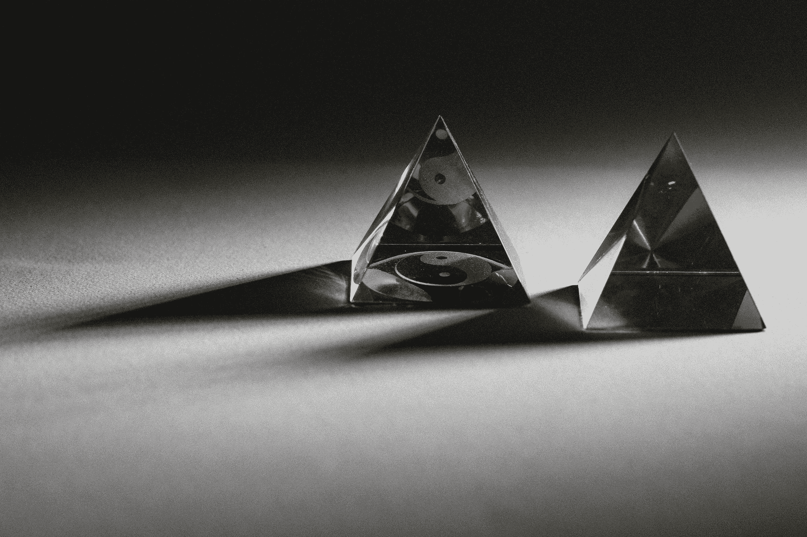

由 [Fernando @cferdo](https://unsplash.com/@dearferdo?utm_source=unsplash&utm_medium=referral&utm_content=creditCopyText) 提供的照片，来源于 [Unsplash](https://unsplash.com/search/photos/objects?utm_source=unsplash&utm_medium=referral&utm_content=creditCopyText)

* * *

## 我们的三大课程推荐

 1\. [谷歌网络安全证书](https://www.kdnuggets.com/google-cybersecurity) - 快速开启网络安全职业生涯。

 2\. [谷歌数据分析专业证书](https://www.kdnuggets.com/google-data-analytics) - 提升你的数据分析技能

 3\. [谷歌 IT 支持专业证书](https://www.kdnuggets.com/google-itsupport) - 支持你的组织的 IT 需求

* * *

目标检测是一种 [计算机视觉](https://heartbeat.fritz.ai/the-5-computer-vision-techniques-that-will-change-how-you-see-the-world-1ee19334354b) 技术，其目标是检测如汽车、建筑物和人类等对象，仅举几例。这些对象通常可以从 [图片或视频流](https://heartbeat.fritz.ai/detecting-objects-in-videos-and-camera-feeds-using-keras-opencv-and-imageai-c869fe1ebcdb)中识别出来。

[目标检测](https://www.fritz.ai/features/object-detection.html) 已广泛应用于视频监控、自动驾驶汽车以及对象/[人群追踪](https://heartbeat.fritz.ai/real-time-person-tracking-on-the-edge-with-a-raspberry-pi-93ae636af9fa)。在这篇文章中，我们将探讨目标检测的基础知识，并回顾一些常用的算法以及一些全新的方法。

### 目标检测如何工作

目标检测定位图像中的对象，并围绕该对象绘制边界框。这通常包括两个过程：首先分类对象的类型，然后围绕对象绘制一个框。我们之前已经 [介绍过图像分类](https://heartbeat.fritz.ai/a-beginners-guide-to-convolutional-neural-networks-cnn-cf26c5ee17ed)，现在让我们回顾一些用于目标检测的常见模型架构：

+   [R-CNN](https://heartbeat.fritz.ai/a-2019-guide-to-object-detection-9509987954c3#5401)

+   [Fast R-CNN](https://heartbeat.fritz.ai/a-2019-guide-to-object-detection-9509987954c3#62df)

+   [Faster R-CNN](https://heartbeat.fritz.ai/a-2019-guide-to-object-detection-9509987954c3#6c29)

+   [Mask R-CNN](https://heartbeat.fritz.ai/a-2019-guide-to-object-detection-9509987954c3#8300)

+   [SSD（单次多框检测器）](https://heartbeat.fritz.ai/a-2019-guide-to-object-detection-9509987954c3#b49b)

+   [YOLO（你只看一次）](https://heartbeat.fritz.ai/a-2019-guide-to-object-detection-9509987954c3#3837)

+   [将对象视为点](https://heartbeat.fritz.ai/a-2019-guide-to-object-detection-9509987954c3#047e)

+   [用于目标检测的数据增强策略](https://heartbeat.fritz.ai/a-2019-guide-to-object-detection-9509987954c3#2836)

### R-CNN 模型

该技术结合了两种主要方法：对自底向上的区域提议应用高容量卷积神经网络以定位和分割对象；以及对辅助任务的监督预训练。

**[用于准确目标检测和语义分割的丰富特征层次结构](https://arxiv.org/abs/1311.2524?source=post_page---------------------------)**

在经典的 PASCAL VOC 数据集上测量的目标检测性能在过去几年已趋于平稳。...

接着进行领域特定的微调，以获得显著的性能提升。本文作者将算法命名为 R-CNN（具有 CNN 特征的区域），因为它将区域提议与[卷积神经网络](https://heartbeat.fritz.ai/a-beginners-guide-to-convolutional-neural-networks-cnn-cf26c5ee17ed)结合起来。

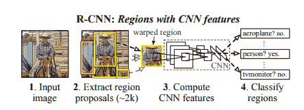

[来源](https://arxiv.org/pdf/1311.2524.pdf)

这个模型接收一张图像，并提取大约 2000 个自底向上的区域提议。然后，它使用大型 CNN 计算每个提议的特征。之后，它使用特定类别的线性支持向量机（SVMs）对每个区域进行分类。这个模型在[PASCAL VOC 2010](http://host.robots.ox.ac.uk/pascal/VOC/voc2010/index.html)上实现了 53.7%的平均精度。

该模型的目标检测系统有三个模块。第一个模块负责生成类别无关的区域提议，定义模型检测器可用的候选检测器集合。第二个模块是一个大型卷积神经网络，负责从每个区域提取固定长度的特征向量。第三个模块由一类支持向量机组成。

[来源](https://arxiv.org/pdf/1311.2524.pdf)

该模型使用选择性搜索生成区域类别。选择性搜索根据颜色、纹理、形状和大小对相似的区域进行分组。对于特征提取，模型通过在每个区域提议上应用 Caffe CNN 实现，使用 4096 维特征向量。通过五个卷积层和两个全连接层前向传播一个 227 × 227 的 RGB 图像来计算特征。本文中解释的模型在 PASCAL VOC 2012 上的相对改进达到 30%。

R-CNN 的一些缺点包括：

+   **训练是一个多阶段管道。** 调整卷积神经网络以适应目标提议，将 SVMs 拟合到 ConvNet 特征，最后学习边界框回归器。

+   **训练在空间和时间上都很昂贵**，因为像 VGG16 这样的深度网络占用大量空间。

+   **目标检测很慢**，因为它对每个对象提议执行一次 ConvNet 前向传递。

### Fast R-CNN

本文提出了一种用于目标检测的快速区域卷积网络方法（Fast R-CNN）。

**[Fast R-CNN](https://arxiv.org/abs/1504.08083?source=post_page---------------------------)**

本文提出了一种用于目标检测的快速区域卷积网络方法（Fast R-CNN）。Fast R-CNN...

它用 [Python 和 C++ 的 Caffe 实现](https://github.com/rbgirshick/fast-rcnn)。该模型在 PASCAL VOC 2012 上的平均精度为 66%，而 R-CNN 为 62%。

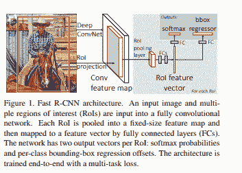

[`arxiv.org/pdf/1504.08083.pdf`](https://arxiv.org/pdf/1504.08083.pdf)

与 R-CNN 相比，Fast R-CNN 具有更高的平均精度、单阶段训练、更新所有网络层的训练，并且不需要磁盘存储来进行特征缓存。

在其架构中，Fast R-CNN 以图像以及一组对象提议作为输入。然后，它通过卷积和最大池化层处理图像，以生成卷积特征图。然后，通过每个区域提议的兴趣区域池化层从每个特征图中提取固定层特征向量。

特征向量随后被输入到全连接层。这些层分支成两个输出层。其中一个层产生对多个对象类别的 softmax 概率估计，而另一个层为每个对象类别生成四个实值数字。这四个数字表示每个对象的边界框位置。

### Faster R-CNN

**[Faster R-CNN: Towards Real-Time Object Detection with Region Proposal Networks](https://arxiv.org/abs/1506.01497?source=post_page---------------------------)**

先进的目标检测网络依赖区域提议算法来假设对象位置...

本文提出了一种训练机制，该机制交替进行区域提议任务的微调和目标检测的微调。

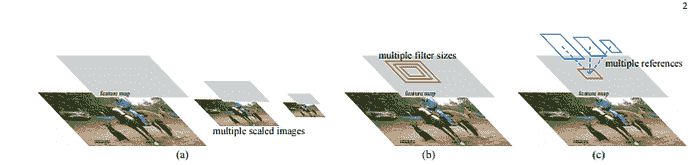

[来源](https://arxiv.org/pdf/1506.01497.pdf)

Faster R-CNN 模型由两个模块组成：一个负责提议区域的深度卷积网络和一个使用这些区域的 Fast R-CNN 检测器。区域提议网络以图像作为输入，并生成矩形对象提议的输出。每个矩形都有一个对象性得分。

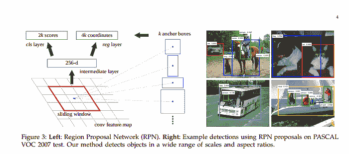

[来源](https://arxiv.org/pdf/1506.01497.pdf)

### Mask R-CNN

**[Mask R-CNN](https://arxiv.org/abs/1703.06870?source=post_page---------------------------)**

我们提出了一个概念上简单、灵活且通用的对象实例分割框架。我们的方法...

本文提出的模型是上述 Faster R-CNN 架构的扩展。它还允许估计人体姿态。

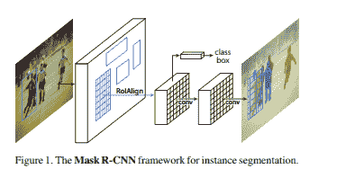

[来源](https://arxiv.org/pdf/1703.06870.pdf)

在这个模型中，物体通过边界框和语义分割进行分类和定位，语义分割将每个像素分类到一组类别中。该模型通过在每个兴趣区域上添加分割掩码的预测来扩展 Faster R-CNN。Mask R-CNN 产生两个输出：类别标签和边界框。

### SSD：单次多框检测器

**[SSD：单次多框检测器](https://arxiv.org/abs/1512.02325?source=post_page---------------------------)**

我们提出了一种使用单个深度神经网络检测图像中物体的方法。我们的方法称为 SSD...

本文提出了一种使用单个深度神经网络预测图像中物体的模型。该网络通过对特征图应用小卷积滤波器来生成每个物体类别的存在评分。

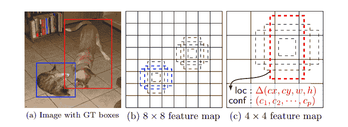

[来源](https://arxiv.org/pdf/1512.02325.pdf)

该方法使用前馈卷积神经网络，生成一组边界框和特定物体的存在评分。增加了卷积特征层，以支持多尺度特征检测。在这个模型中，每个特征图单元链接到一组默认的边界框。下图展示了 SSD512 在动物、车辆和家具上的表现。

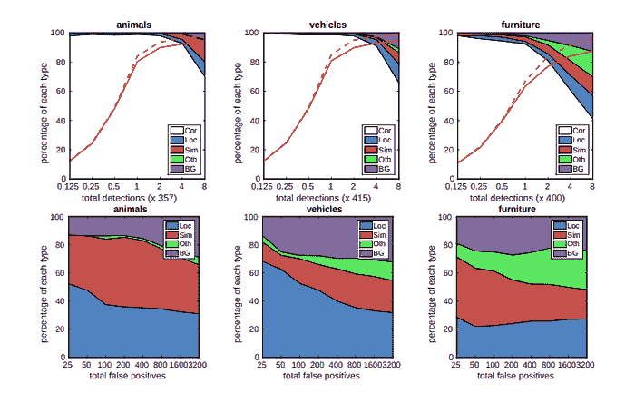

[来源](https://arxiv.org/pdf/1512.02325.pdf)

### **你只看一次 (YOLO)**

本文提出了一种单一神经网络，在单次评估中从图像中预测边界框和类别概率。

[**你只看一次：统一的实时目标检测**](https://arxiv.org/abs/1506.02640?source=post_page---------------------------)

我们提出了 YOLO，这是一种新的目标检测方法。以往的目标检测工作重新利用分类器进行...

YOLO 模型以每秒 45 帧的速度实时处理图像。YOLO 将图像检测视为回归问题，这使得其管道非常简单。正因如此，它非常快速。

它可以以低于 25 秒的延迟实时处理流媒体视频。在训练过程中，YOLO 查看整个图像，因此能够在目标检测中包含上下文信息。

[来源](https://arxiv.org/pdf/1506.02640.pdf)

在 YOLO 中，每个边界框由整个图像的特征预测。每个边界框有 5 个预测值：x、y、w、h 和置信度。(x, y) 表示相对于网格单元边界的边界框中心。*w* 和 *h* 是对整个图像的预测宽度和高度。

该模型实现为卷积神经网络，并在 PASCAL VOC 检测数据集上进行评估。网络的卷积层负责提取特征，而全连接层则预测坐标并输出概率。

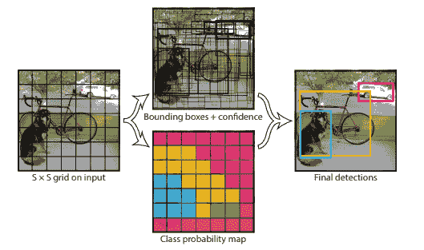

该模型的网络架构灵感来源于 [GoogLeNet](https://ai.google/research/pubs/pub43022) 图像分类模型。网络有 24 层卷积层和 2 层全连接层。该模型的主要挑战是它只能预测一个类别，并且在小物体如鸟类上的表现不佳。

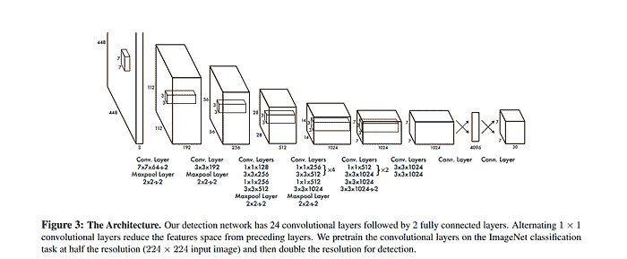

[source](https://arxiv.org/pdf/1506.02640.pdf)

该模型实现了 52.7% 的平均精度，但可以达到 63.4%。

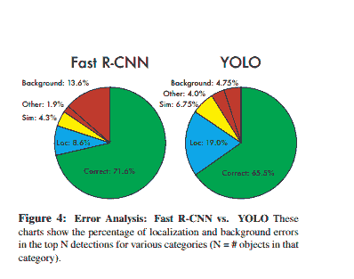

### 将对象视为点

本文提出将对象建模为一个单一的点。它使用关键点估计来找到中心点，并对所有其他对象属性进行回归。

[**将对象视为点**](https://arxiv.org/abs/1904.07850v2?source=post_page---------------------------)

检测将图像中的对象识别为轴对齐的框。大多数成功的目标检测器枚举了几乎...

这些属性包括 3D 位置、姿态方向和大小。它使用 CenterNet，这是一种基于中心点的方法，比其他边界框检测器更快、更准确。

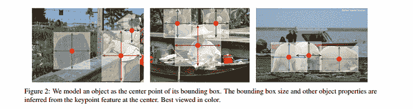

属性如对象大小和姿态是从图像中心位置的特征中回归得到的。在此模型中，图像被输入到卷积神经网络中，该网络生成热图。这些热图中的最大值代表图像中对象的中心。为了估计人体姿势，该模型检查 2D 关节位置，并在中心点位置进行回归。

该模型在每秒 1.4 帧的速度下实现了 45.1% 的 COCO 平均精度。下图显示了与其他研究论文中获得的结果的比较。

### **学习数据增强策略用于目标检测**

数据增强涉及通过操控原始图像（例如旋转和缩放）来创建新的图像数据。

[**学习数据增强策略用于目标检测**](https://arxiv.org/abs/1906.11172v1?source=post_page---------------------------)

数据增强是训练深度学习模型的关键组成部分。虽然数据增强已经被证明...

虽然这本身不是一个模型架构，但本文提出了创建可以应用于目标检测数据集的变换，这些变换可以转移到其他目标检测数据集中。这些变换通常在训练时应用。

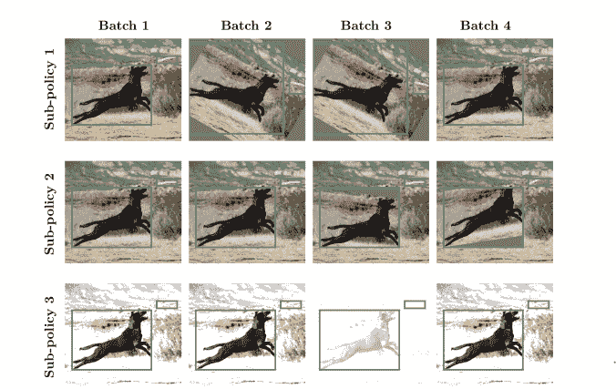

在这个模型中，增强策略被定义为在训练过程中随机选择的 n 个策略的集合。在此模型中应用的一些操作包括扭曲颜色通道、几何扭曲图像，以及仅扭曲边界框注释中的像素内容。

对 COCO 数据集的实验表明，优化数据增强策略可以将检测准确率提高超过 +2.3 平均精度。这使得单个推理模型可以达到 50.7 的平均精度。

### **结论**

我们现在应该对一些最常见的——以及几种最近的——对象检测技术有了了解。

上述提到和链接的论文/摘要也包含了它们的代码实现链接。我们很乐意看到你在测试后获得的结果。

> 不要局限于此。对象检测也可以存在于你的智能手机中。[了解如何](https://fritz.ai/?utm_campaign=feature2&utm_source=heartbeat) Fritz 可以教会移动应用程序看、听、感知和思考。

**简介: [德里克·穆伊提](https://derrickmwiti.com/)** 是一位数据分析师、作家和导师。他致力于在每项任务中取得出色成果，并且是 Lapid Leaders Africa 的导师。

[原文](https://heartbeat.fritz.ai/a-2019-guide-to-object-detection-9509987954c3)。经许可转载。

**相关:**

+   使用 Luminoth 进行对象检测

+   基于深度学习的人体姿态估计概述

+   大规模图像分类器的演变

### 更多相关话题

+   [SQL 与对象关系映射 (ORM) 有什么区别？](https://www.kdnuggets.com/2022/02/difference-sql-object-relational-mapping-orm.html)

+   [KDnuggets™ 新闻 22:n09, 3 月 2 日: 讲述一个精彩的数据故事: A…](https://www.kdnuggets.com/2022/n09.html)

+   [数据科学中异常检测技术的初学者指南](https://www.kdnuggets.com/2023/05/beginner-guide-anomaly-detection-techniques-data-science.html)

+   [如何使用 Python 执行运动检测](https://www.kdnuggets.com/2022/08/perform-motion-detection-python.html)

+   [使用 Hugging Face Transformers 进行文本情感检测](https://www.kdnuggets.com/using-hugging-face-transformers-for-emotion-detection-in-text)

+   [KDnuggets 新闻，8 月 17 日: 如何执行运动检测](https://www.kdnuggets.com/2022/n33.html)
