# 2019 年语义分割指南

> 原文：[`www.kdnuggets.com/2019/08/2019-guide-semantic-segmentation.html/2`](https://www.kdnuggets.com/2019/08/2019-guide-semantic-segmentation.html/2)

 [评论](https://www.kdnuggets.com/2019/08/2019-guide-semantic-segmentation.html?page=2#comments)

### 多尺度上下文聚合通过空洞卷积（ICLR, 2016）

本文开发了一种卷积网络模块，该模块结合了多尺度上下文信息而不会丢失分辨率。该模块可以插入到现有的任何分辨率架构中。该模块基于 [空洞卷积](https://www.kdd.org/kdd2018/accepted-papers/view/smoothed-dilated-convolutions-for-improved-dense-prediction)。

[**多尺度上下文聚合通过空洞卷积**](https://arxiv.org/abs/1511.07122?source=post_page---------------------------)

*最先进的语义分割模型基于对卷积网络的适配，这些网络曾...*

该模块在 Pascal VOC 2012 数据集上进行了测试。结果证明，向现有的语义分割架构中添加上下文模块可以提高它们的准确性。

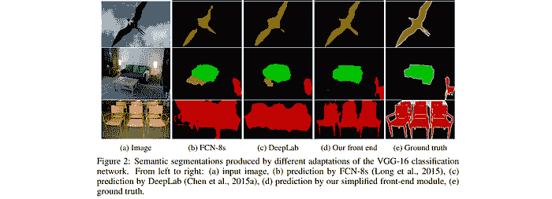

[来源](https://arxiv.org/abs/1511.07122)

在实验中训练的前端模块在 VOC-2012 验证集上达到了 69.8% 的平均 IoU，在测试集上达到了 71.3% 的平均 IoU。该模型在不同物体上的预测准确性如下所示

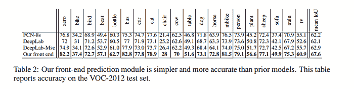

[来源](https://arxiv.org/abs/1511.07122)

### DeepLab：利用深度卷积网络、空洞卷积和全连接 CRFs 的语义图像分割（TPAMI, 2017）

在这篇论文中，作者对深度学习中的语义分割任务做出了以下贡献：

+   用于密集预测任务的上采样卷积

+   采用空洞空间金字塔池化（ASPP）来分割多尺度的物体

+   通过使用深度卷积神经网络（DCNNs）来改善物体边界的定位。

[**DeepLab：利用深度卷积网络、空洞卷积和全连接 CRFs 的语义图像分割**](https://arxiv.org/abs/1606.00915?source=post_page---------------------------)

*在这项工作中，我们处理了使用深度学习的语义图像分割任务，并做出了三个主要贡献...*

论文提出的 DeepLab 系统在 PASCAL VOC-2012 语义图像分割任务中达到了 79.7% 的 mIOU。

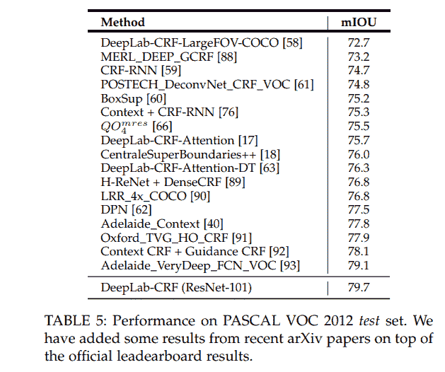

[来源](https://arxiv.org/abs/1606.00915)

论文解决了在语义分割中使用深度卷积神经网络的主要挑战，包括：

+   由于最大池化和下采样的重复组合，导致特征分辨率降低。

+   物体在多个尺度下的存在。

+   由于 DCNN 的不变性导致的定位准确度降低，因为以物体为中心的分类器需要对空间变换具有不变性。

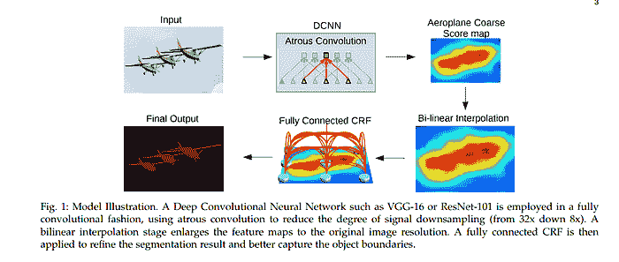

[来源](https://arxiv.org/abs/1606.00915)

Atrous 卷积的应用包括通过插入零进行滤波器的上采样，或稀疏地采样输入特征图。第二种方法涉及将输入特征图按 atrous 卷积率 r 进行子采样，并对其进行解交错以生成 r² 分辨率降低的图像，每个图像对应 r×r 的可能偏移。之后，对立即特征图应用标准卷积，将其与图像的原始分辨率进行交错。

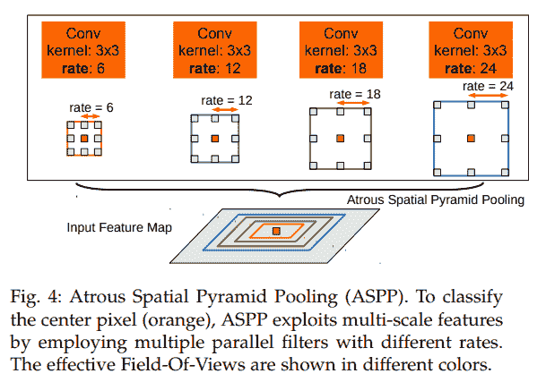

[来源](https://arxiv.org/abs/1606.00915)

### 重新思考 Atrous 卷积在语义图像分割中的应用 (2017)

本文解决了使用 DCNN 进行语义分割时的两个挑战（如前所述）；当应用连续池化操作时特征分辨率降低，以及存在多尺度的对象。

**[重新思考 Atrous 卷积在语义图像分割中的应用](https://arxiv.org/abs/1706.05587?source=post_page---------------------------)**

*在这项工作中，我们重新审视了 atrous 卷积，这是一种强大的工具，可以显式调整滤波器的视野范围以及...*

为了解决第一个问题，论文建议使用 atrous 卷积，也称为扩张卷积。它提出使用 atrous 卷积来解决第二个问题，以扩大视野范围，从而包含多尺度上下文。

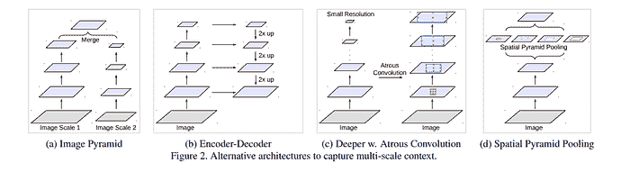

[来源](https://arxiv.org/pdf/1706.05587.pdf)

论文中的“DeepLabv3”在 PASCAL VOC 2012 测试集上取得了 85.7% 的表现，无需 DenseCRF 后处理。

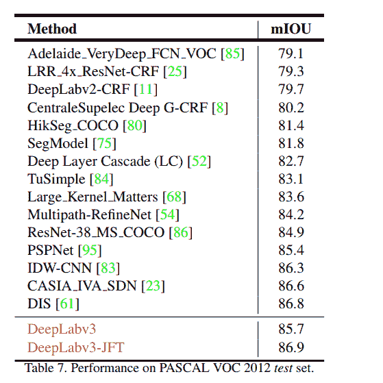

[来源](https://arxiv.org/pdf/1706.05587.pdf)

### Atrous Separable Convolution 用于语义图像分割 (ECCV, 2018)

本文的方法“DeepLabv3+”在 PASCAL VOC 2012 和 Cityscapes 数据集上取得了 89.0% 和 82.1% 的测试集表现，而无需对结果进行后处理。该模型是 DeepLabv3 的扩展，通过添加一个简单的解码器模块来细化分割结果。

[**Papers With Code : Encoder-Decoder with Atrous Separable Convolution for Semantic Image...**](https://paperswithcode.com/paper/encoder-decoder-with-atrous-separable?source=post_page---------------------------)

*???? 在 PASCAL VOC 2012 上的语义分割 SOTA (平均 IoU 评估指标)*

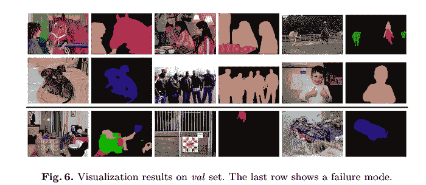

[来源](https://arxiv.org/pdf/1802.02611v3.pdf)

论文实现了两种使用空间金字塔池化模块进行语义分割的神经网络。一种通过在不同分辨率下池化特征来捕捉上下文信息，而另一种则获得清晰的对象边界。

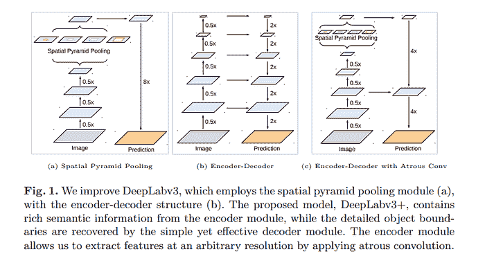

[来源](https://arxiv.org/pdf/1802.02611v3.pdf)

### FastFCN: 重新思考语义分割骨干中的膨胀卷积（2019）

本文提出了一种名为联合金字塔上采样（JPU）的联合上采样模块，以替代耗时和占用大量内存的膨胀卷积。它通过将提取高分辨率图的功能表述为一个联合上采样问题来工作。

[**Papers With Code : FastFCN: 重新思考语义分割骨干中的膨胀卷积**](https://paperswithcode.com/paper/fastfcn-rethinking-dilated-convolution-in-the?source=post_page---------------------------)

*???? PASCAL Context 上的语义分割 SOTA（mIoU 指标）*

该方法在 Pascal Context 数据集上实现了 53.13%的 mIoU 性能，并且运行速度快了 3 倍。

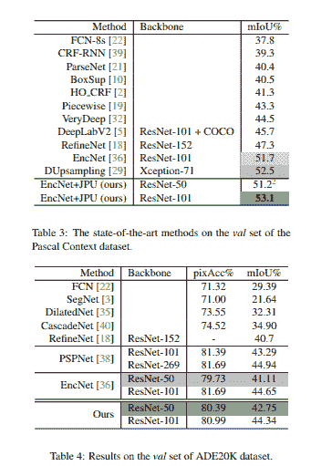

[源文档](https://arxiv.org/pdf/1903.11816v1.pdf)

该方法将全连接网络（FCN）作为骨干，同时应用 JPU 对低分辨率的最终特征图进行上采样，从而生成高分辨率的特征图。用 JPU 替代膨胀卷积不会导致性能损失。

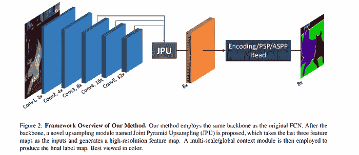

[源文档](https://arxiv.org/pdf/1903.11816v1.pdf)

联合采样使用低分辨率的目标图像和高分辨率的引导图像。然后，通过转移引导图像的结构和细节来生成高分辨率的目标图像。

### 通过视频传播和标签松弛改进语义分割（CVPR, 2019）

本文提出了一种基于视频的方法，通过合成新的训练样本来扩展训练集，旨在提高语义分割网络的准确性。它探索了视频预测模型预测未来帧的能力，以便预测未来标签。

[**Papers With Code : 通过视频传播和标签松弛改进语义分割**](https://paperswithcode.com/paper/improving-semantic-segmentation-via-video?source=post_page---------------------------)

*???? Cityscapes 上的语义分割 SOTA（平均 IoU 指标）*

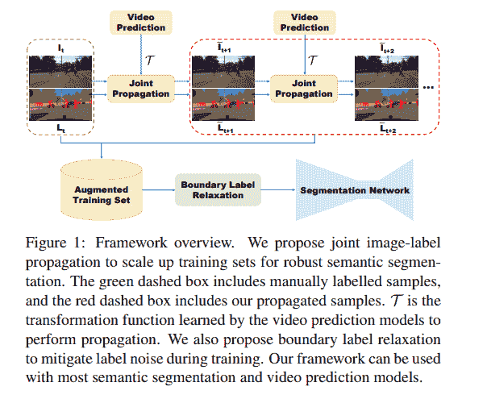

[源文档](https://arxiv.org/pdf/1812.01593v3.pdf)

论文表明，在合成数据集上训练分割网络可以提高预测准确性。本文提出的方法在 [Cityscapes](https://www.cityscapes-dataset.com/) 上实现了 83.5%的 mIoU，在 [CamVid](http://mi.eng.cam.ac.uk/research/projects/VideoRec/CamVid/) 上实现了 82.9%的 mIoU。

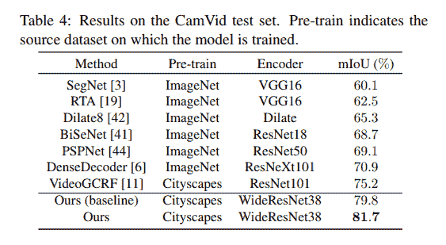

[源文档](https://arxiv.org/pdf/1812.01593v3.pdf)

论文提出了两种预测未来标签的方法：

+   **标签传播 (LP)** 通过将传播的标签与原始未来帧配对来创建新的训练样本

+   **联合图像-标签传播 (JP)** 通过将传播的标签与相应的传播图像配对来创建新的训练样本

论文有三个主要建议：利用视频预测模型将标签传播到相邻帧，引入联合图像-标签传播来解决对齐问题，以及通过最大化边界上类别概率的联合可能性来放宽单热标签训练。

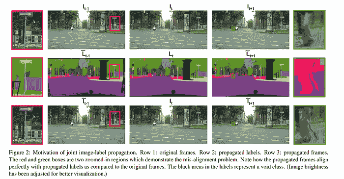

[来源](https://arxiv.org/pdf/1812.01593v3.pdf)

### Gated-SCNN: 用于语义分割的门控形状 CNN（2019）

这篇论文是语义分割领域的新星。作者提出了一种双流 CNN 架构。在这个架构中，形状信息作为一个单独的分支处理。这个形状流只处理与边界相关的信息。这由模型的门控卷积层（GCL）和局部监督来强制执行。

[**Gated-SCNN: 用于语义分割的门控形状 CNN**](https://arxiv.org/abs/1907.05740?source=post_page---------------------------)

*当前最先进的图像分割方法形成了一个密集的图像表示，其中包括颜色、形状等...*

[来源](https://arxiv.org/abs/1907.05740)

该模型在 mIoU 上比 DeepLab-v3+提高了 1.5%，在 F-boundary 分数上提高了 4%。该模型已使用 Cityscapes 基准进行评估。在较小和较薄的物体上，该模型在 IoU 上提高了 7%。

下表展示了 Gated-SCNN 与其他模型的性能比较。

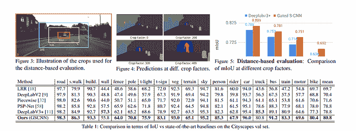

[来源](https://arxiv.org/abs/1907.05740)

### 结论

我们现在应该了解一些最常见的——以及几个非常近期的——语义分割技术在各种环境中的应用。

上述论文/摘要也包含了其代码实现的链接。我们很乐意看到你在测试后获得的结果。

**简介： [德里克·穆伊提](https://derrickmwiti.com/)** 是数据分析师、作家和导师。他致力于在每项任务中取得出色成果，并且是 Lapid Leaders Africa 的导师。

[原文](https://heartbeat.fritz.ai/a-2019-guide-to-semantic-segmentation-ca8242f5a7fc)。已获得许可转载。

**相关：**

+   2019 年目标检测指南

+   使用 Luminoth 进行目标检测

+   Python 中的自动化机器学习

* * *

## 我们的前三大课程推荐

 1\. [谷歌网络安全证书](https://www.kdnuggets.com/google-cybersecurity) - 快速进入网络安全职业生涯。

 2\. [谷歌数据分析专业证书](https://www.kdnuggets.com/google-data-analytics) - 提升你的数据分析技能

 3\. [Google IT 支持专业证书](https://www.kdnuggets.com/google-itsupport) - 支持你的组织进行 IT 事务

* * *

### 更多相关话题

+   [关于语义分割注释的误解](https://www.kdnuggets.com/2022/01/misconceptions-semantic-segmentation-annotation.html)

+   [语义层的力量：数据工程师指南](https://www.kdnuggets.com/2023/10/cube-power-of-a-semantic-layer-a-data-engineers-guide)

+   [语义向量搜索如何改变客户支持互动](https://www.kdnuggets.com/how-semantic-vector-search-transforms-customer-support-interactions)

+   [使用向量数据库进行语义搜索](https://www.kdnuggets.com/semantic-search-with-vector-databases)

+   [语义层：AI 驱动的数据体验的支柱](https://www.kdnuggets.com/2023/10/cube-semantic-layer-backbone-aipowered-data-experiences)

+   [为何通用语义层对你的数据架构有益的 6 个理由](https://www.kdnuggets.com/2024/01/cube-6-reasons-why-a-universal-semantic-layer-is-beneficial)
